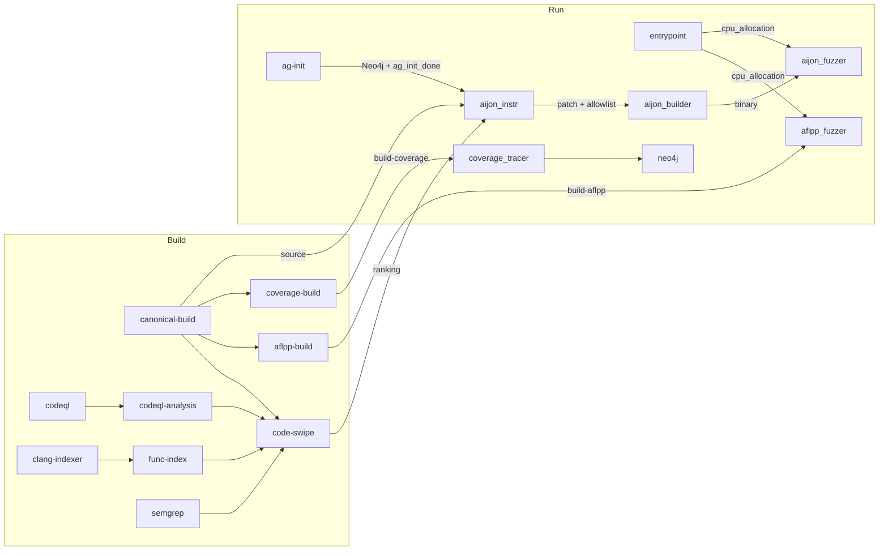

# crs-shellphish-aijon

LLM-driven IJON instrumentation + AFL++ fuzzing.

AIJON uses an LLM to analyze target code and insert IJON feedback annotations (e.g. `IJON_CMP`, `IJON_MAX`) that guide AFL++ toward hard-to-reach code paths.

## Architecture



**Sequential AIJON chain:** ag-init → aijon_instrumentation → aijon_builder → aijon_fuzzer

**Parallel:** aflpp_fuzzer starts immediately (no AIJON dependency).

## Data Flow

### Build Outputs → Run Consumers

| Build Output | Consumers | Content |
|-------------|-----------|---------|
| `build-canonical` | aijon_instrumentation, discoveryguy | Source at `.shellphish_src/`, metadata |
| `build-aflpp` | aflpp_fuzzer | AFL++ harness binaries |
| `build-coverage` | coverage_tracer | Coverage-instrumented binary |
| `code-swipe-ranking` | aijon_instrumentation | POI functions ranked by vulnerability likelihood |
| `func-index` | aijon_instrumentation | Function index JSON |
| `clang-index` | aijon_instrumentation | Function body JSONs |
| `codeql-analysis` | codeql-server | CodeQL DB zip for server |

### Shared Directory (`SHARED_DIR`)

| Path | Writer | Reader | Purpose |
|------|--------|--------|---------|
| `cpu_allocation` | entrypoint | aflpp_fuzzer, aijon_fuzzer | Core assignment |
| `ag_init_done` | ag-init | aijon_instrumentation | Signal: Neo4j ready |
| `aijon_artifacts/aijon_instrumentation.patch` | aijon_instrumentation | aijon_builder | IJON patch |
| `aijon_artifacts/aijon_allowlist.txt` | aijon_instrumentation | aijon_builder | AFL++ allowlist |
| `aijon_artifacts/.done` | aijon_instrumentation | aijon_builder | Signal: patch ready |
| `aijon_build/` | aijon_builder | aijon_fuzzer | Compiled IJON binary |
| `fuzzer_sync/{project}-{harness}-0/` | aflpp_fuzzer, aijon_fuzzer | (external) | Queue + crashes |

### Synchronization

```
entrypoint ──cpu_allocation──→ aflpp_fuzzer (starts immediately)
                           ──→ aijon_fuzzer (waits for build too)

codeql-server ──ready──→ ag-init ──ag_init_done──→ aijon_instrumentation
                                                          │
                                               patch + allowlist + .done
                                                          ↓
                                                    aijon_builder
                                                          │
                                                    compiled binary
                                                          ↓
                                                    aijon_fuzzer
```

## CPU Allocation

`CRS_PIPELINE_MODE=aijon` — AIJON gets half cores, coverage 1, AFL++ rest (min 3 total).

| Component | Cores (6 available) |
|-----------|-------------------|
| AIJON fuzzer | 2,3,4 |
| Coverage tracer | 5 |
| AFL++ | 6,7 |

## Source Path Resolution

`aijon_instrumentation` reads `source_repo_path` from `shellphish_build_metadata.yaml` to find the project directory in `.shellphish_src/`. Example: `source_repo_path: /src/nginx` → uses `.shellphish_src/nginx/` as `--target_source`.

## Configuration

```bash
cp oss-crs/crs-aijon.yaml oss-crs/crs.yaml
cd /project/oss-crs
export AIXCC_LITELLM_HOSTNAME=<litellm-url>
export LITELLM_KEY=<api-key>
uv run oss-crs run --compose-file example/crs-shellphish-aijon/compose.yaml \
  --fuzz-proj-path <target> --target-source-path <source> \
  --target-harness <harness> --timeout 1800
```

## Verification

| Check | Evidence | Expected |
|-------|----------|----------|
| AIJON instrumentation | `🎊 AIJON instrumentation succeeded` | Patch + allowlist generated |
| Source path | `Source subdir from build metadata: {project}` | Matches target project |
| AIJON builder | `Compilation succeeded` | Binary in `aijon_build/` |
| AIJON fuzzer | `afl-fuzz` running with IJON binary | Crashes found on mock |
| AFL++ parallel | `Fuzzing test case` in aflpp log | Running independently |
| ag-init | `PYTHON exiting (analysis graphql v2.0)` | CFGFunction nodes in Neo4j |
| PoVs/seeds | EXCHANGE_DIR | Non-empty |

## Known Limitations

- AIJON generates one patch per run. Retries up to 10× on failure (10-min intervals).
- ag-init timeout: 300s max wait. Large targets (nginx: 14k functions) need several minutes.
- AIJON builder LLM fixer loop: if patched source doesn't compile, retries with LLM. If all fail, only standard AFL++ runs.
