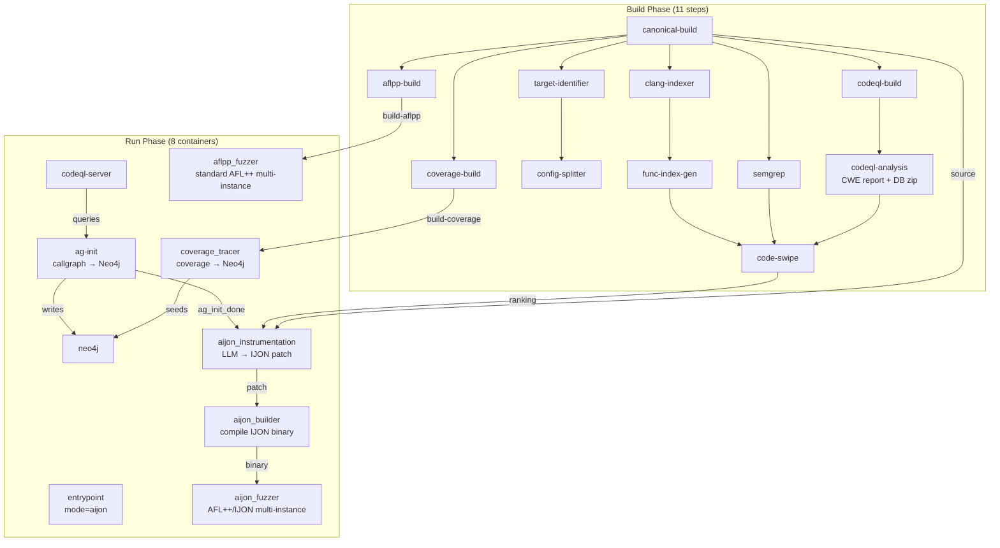

# crs-shellphish-aijon

Shellphish AIJON: LLM-driven IJON instrumentation + AFL++ fuzzing pipeline.

AIJON uses an LLM to analyze target code and insert IJON feedback annotations (e.g. `IJON_CMP`, `IJON_MAX`) that guide AFL++ toward hard-to-reach code paths. It runs alongside standard AFL++ and a coverage tracer.

## Architecture



## Components

### Build Phase

| Step | Dockerfile | Output | Description |
|------|-----------|--------|-------------|
| canonical-build | `shellphish_libfuzzer/Dockerfile.builder` | `build-canonical` | Compile target, preserve source |
| codeql-build | `codeql/Dockerfile.builder` | `codeql-db` | Create CodeQL database |
| aflpp-build | `aflpp/Dockerfile.builder` | `build-aflpp` | AFL++ compiled harnesses |
| coverage-build | `coverage_fast/Dockerfile.builder.c` | `build-coverage` | Coverage-instrumented build |
| clang-indexer-build | `clang_indexer/Dockerfile.builder` | `clang-index` | Function JSON extraction |
| target-identifier | `target-identifier/Dockerfile` | `augmented-metadata` | Project metadata |
| config-splitter | `configuration-splitter/Dockerfile` | `split-metadata` | Build config splitting |
| func-index-gen | `function-index-generator/Dockerfile` | `func-index` | Function index |
| semgrep-analysis | `semgrep/Dockerfile` | `semgrep-report` | Static analysis |
| codeql-analysis | `components/codeql/Dockerfile` | `codeql-analysis` | CWE report (CLI) + DB zip |
| code-swipe | `code-swipe/Dockerfile` | `code-swipe-ranking` | Function vulnerability ranking |

### Run Phase

| Module | Dockerfile | Entry Point | Description |
|--------|-----------|-------------|-------------|
| entrypoint | `oss-crs-entrypoint/Dockerfile` | `run_entrypoint.sh` | CPU allocation (mode=aijon: AIJON N cores, coverage 1, AFL++ rest, min 3) |
| neo4j | `neo4j/Dockerfile` | neo4j default | Graph database |
| codeql-server | `services/codeql_server/Dockerfile` | `run_codeql_server` | CodeQL HTTP server |
| ag-init | `components/codeql/Dockerfile.ag-init-run` | `run_ag_init` | analysis_query.py → Neo4j callgraph data |
| aijon_instrumentation | `components/aijon/Dockerfile` | `run_aijon_instrumentation` | LLM generates IJON patch from code-swipe POIs |
| aijon_builder | `oss-crs/Dockerfile.aijon-builder` | `run_aijon_builder` | Applies patch, compiles with AFL++/IJON, LLM fixer loop on failure |
| aijon_fuzzer | `oss-crs/Dockerfile.aijon-fuzzer` | `run_aijon_fuzzer` | Multi-instance AFL++/IJON fuzzing (afl-fuzz++4.30c-ijon) |
| aflpp_fuzzer | `aflpp/Dockerfile.runner` | `run_aflpp.sh` | Standard AFL++ multi-instance fuzzing (runs immediately, no AIJON dependency) |
| coverage_tracer | `coverage_fast/Dockerfile.runner.c` | coverage script | Monitors seeds, runs coverage, writes HarnessInputNode to Neo4j |

## CRS Configuration

- **CRS name:** `crs-shellphish-aijon`
- **Config:** `oss-crs/crs-aijon.yaml`
- **Example compose:** `oss-crs/example/crs-shellphish-aijon/compose.yaml`

### Deployment

```bash
# In shellphish-oss-crs:
cp oss-crs/crs-aijon.yaml oss-crs/crs.yaml

# In oss-crs:
export AIXCC_LITELLM_HOSTNAME=<litellm-url>
export LITELLM_KEY=<api-key>
uv run oss-crs prepare --compose-file example/crs-shellphish-aijon/compose.yaml
uv run oss-crs build-target --compose-file example/crs-shellphish-aijon/compose.yaml \
  --fuzz-proj-path <target> --target-source-path <source>
uv run oss-crs run --compose-file example/crs-shellphish-aijon/compose.yaml \
  --fuzz-proj-path <target> --target-source-path <source> \
  --target-harness <harness> --timeout 1800
```

## Run Phase Flow

### Startup (parallel)

All containers start simultaneously. Dependencies resolved by waiting:

1. **entrypoint** writes `cpu_allocation` → aflpp_fuzzer and aijon_fuzzer wait for this
2. **codeql-server** starts, uploads DB → ag-init queries it (CodeQLClient retries)
3. **ag-init** writes Neo4j + `ag_init_done` signal → aijon_instrumentation waits for this
4. **aflpp_fuzzer** starts immediately after cpu_allocation (no AIJON dependency)

### AIJON Chain (sequential)

```
ag-init completes → ag_init_done signal
    ↓
aijon_instrumentation: downloads build outputs, locates source,
    reads code-swipe ranking, runs AIJON main.py with LLM
    → generates IJON patch (e.g. IJON_CMP, IJON_MAX annotations)
    → writes patch + allowlist to SHARED_DIR/aijon_artifacts/.done
    ↓
aijon_builder: waits for .done, reads patch, applies to /src/,
    compiles with AFL++/IJON compiler. If compile fails, runs
    LLM fixer loop. Outputs binary to SHARED_DIR/aijon_build/
    ↓
aijon_fuzzer: waits for build output + cpu_allocation,
    launches N instances of afl-fuzz++4.30c-ijon (main + secondaries)
```

### Synchronization

| Signal | Writer | Waiter | Mechanism |
|--------|--------|--------|-----------|
| `cpu_allocation` | entrypoint | aflpp_fuzzer, aijon_fuzzer | File in SHARED_DIR |
| `ag_init_done` | ag-init | aijon_instrumentation | File in SHARED_DIR (max 300s wait) |
| `aijon_artifacts/.done` | aijon_instrumentation | aijon_builder | File in SHARED_DIR |
| `aijon_build/` contents | aijon_builder | aijon_fuzzer | Directory polling |
| CodeQL server ready | codeql-server | ag-init | CodeQLClient exponential backoff |

## CPU Core Allocation

`CRS_PIPELINE_MODE=aijon`: AIJON gets half the cores, coverage tracer gets 1, AFL++ gets the rest. Minimum 3 cores total.

Example with 6 cores (2-7):
- AIJON: cores 2,3,4 (3 cores)
- Coverage: core 5 (1 core)
- AFL++: cores 6,7 (2 cores)

## IJON Patch Example (mock-c)

LLM-generated IJON annotations for `process_input_header`:

```diff
 void process_input_header(const uint8_t *data, size_t size) {
   char buf[0x40];
+IJON_CMP((unsigned long long)data[0], (unsigned long long)'A');
   if (size > 0 && data[0] == 'A')
       memcpy(buf, data, size);
+IJON_MAX((unsigned long long)size);
 }
```

- `IJON_CMP`: guides fuzzer to discover that `data[0]` must equal `'A'`
- `IJON_MAX`: guides fuzzer to maximize `size` to trigger the buffer overflow

## Verification Checklist

### Build Phase
1. **All 11 build steps succeed** — check oss-crs build-target output
2. **aflpp-build** — harness binary exists in build-aflpp output
3. **codeql-analysis** — `codeql-cwe-report.json` + `sss-codeql-database.zip`
4. **code-swipe ranking** — `ranking.yaml` has functions with weights

### Run Phase
5. **Entrypoint** — `mode=aijon`, CPU split shown
6. **Neo4j** — `Started`
7. **CodeQL server** — `CodeQL server ready` + `Database uploaded successfully`
8. **AG init** — `Query returned N functions` + `PYTHON exiting`
9. **AIJON instrumentation** — `AG init done` + `Running AIJON instrumentation`
10. **AIJON builder** — `Patch found` + compilation output
11. **AIJON fuzzer** — `afl-fuzz++4.30c-ijon` running with allocated cores
12. **AFL++ fuzzer** — Standard AFL++ running in parallel
13. **Coverage tracer** — `Seed feeder started`

## Known Limitations

- **AG init timing**: For large projects (e.g. nginx, 14240 functions), CodeQL queries take several minutes. AIJON instrumentation waits up to 300s. If AG init doesn't complete, AIJON proceeds without callgraph data (degraded).
- **AIJON builder compile failures**: If the IJON-patched source doesn't compile, the LLM fixer loop retries. If all retries fail, AIJON fuzzer never starts (standard AFL++ still runs).
- **Single IJON pass**: AIJON instrumentation runs once and exits. No iterative refinement based on coverage feedback (unlike the original system's continuous loop).
