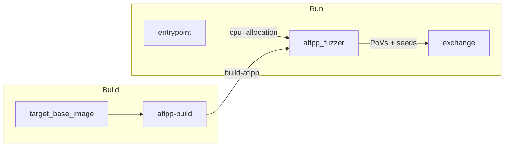

# crs-shellphish-c-fuzzers-aflpp

AFL++ multi-instance fuzzing for C/C++ targets.

## Architecture



## Data Flow

### Build Outputs

| Build Step | Output Name | Content |
|-----------|-------------|---------|
| aflpp-build | `build-aflpp` | Harness binaries (afl-clang-fast), AFL++ tools, Nautilus mutator |

### Shared Directory (`SHARED_DIR`)

| Path | Writer | Reader | Purpose |
|------|--------|--------|---------|
| `cpu_allocation` | entrypoint | aflpp_fuzzer | `AFLPP_CPUS=2,3,4,5,6,7` |
| `fuzzer_sync/{project}-{harness}-0/main/queue/` | AFL++ main | secondary instances | Main corpus |
| `fuzzer_sync/.../secondary_*/queue/` | AFL++ secondaries | main instance | Secondary corpora |

### External I/O (via libCRS)

| Direction | Mechanism | Content |
|-----------|-----------|---------|
| PoV out | `libCRS register-submit-dir pov /tmp/povs/` | Crash inputs → EXCHANGE_DIR/povs/ |
| Seed out | `libCRS submit seed <file>` | `main/queue/id:*` → EXCHANGE_DIR/seeds/ |
| Seed in | `libCRS register-fetch-dir seed` → `foreign_fuzzer/queue/` | From other CRS, AFL++ reads via `-F` |

## CPU Allocation

`CRS_PIPELINE_MODE=aflpp-only` — all available cores go to AFL++.

Launches 1 main + (N-1) secondary instances, each pinned to a core via `taskset`.

| Component | Cores (6 available) |
|-----------|-------------------|
| AFL++ | 2,3,4,5,6,7 (6 instances: 1 main + 5 secondary) |

## Run Phase Details

### AFL++ (`run_aflpp.sh`)

- Shellphish's `run_fuzzer` handles strategy randomization (timeout, cmplog, dict, Nautilus grammar mutator)
- Crash monitor loop (every 5s): copies `fuzzer_sync/*/crashes/id:*` → `/tmp/povs/`
- Seed sharing: submits `main/queue/id:*` via `libCRS submit seed`
- External seed import: `libCRS register-fetch-dir seed` → `/tmp/seeds_from_other_crs/` → copied to `foreign_fuzzer/queue/` (AFL++ `-F` foreign sync)

### Sanitizer Settings

LeakSanitizer disabled (`detect_leaks=0`). Leak detections produce 0-byte artifacts not usable as PoVs.

## Configuration

```bash
cp oss-crs/crs-c-fuzzers-aflpp.yaml oss-crs/crs.yaml
cd /project/oss-crs
uv run oss-crs run --compose-file example/crs-shellphish-c-fuzzers-aflpp/compose.yaml \
  --fuzz-proj-path <target> --target-source-path <source> \
  --target-harness <harness> --timeout 1800
```

### Test Targets

| Target | Source | Harness |
|--------|--------|---------|
| `sanity-mock-c-delta-01` | `sanity-mock-c` | `fuzz_parse_buffer_section` |
| `afc-lcms-full-01` | `afc-lcms` | `cmsIT8_load_fuzzer` |
| `asc-nginx-delta-01` | `asc-nginx` | `pov_harness` |

## Verification

| Check | Evidence | Expected |
|-------|----------|----------|
| Build | `BUILD_OUT_DIR/build-aflpp/` has harness binary | ELF executable + address/symbols |
| CPU allocation | `cpu_allocation`: `AFLPP_CPUS` = all cores | Non-empty |
| Fuzzing | AFL++ log: `Fuzzing test case` | Active, crashes found on mock |
| PoV submission | `EXCHANGE_DIR/povs/` | Non-empty files |
| Seed submission | `EXCHANGE_DIR/seeds/` | Non-empty |
| External seed import | Inject via `docker exec` → `foreign_fuzzer/queue/` | Files appear within 15s |
