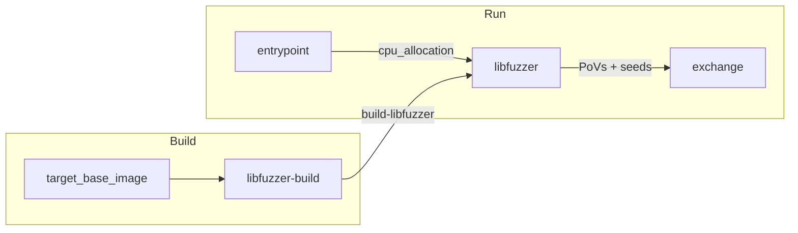

# crs-shellphish-c-fuzzers-libfuzzer

LibFuzzer with Shellphish wrapper.py for C/C++ targets.

## Architecture



## Data Flow

### Build Outputs

| Build Step | Output Name | Content |
|-----------|-------------|---------|
| libfuzzer-build | `build-libfuzzer` | Harness binary (`.instrumented`), `wrapper.py` symlink, harness address/symbols |

### Build Phase: wrapper.py Symlink Setup

1. `compile_shellphish_libfuzzer` compiles the target via oss-fuzz `compile` script
2. Build output contains harness binary (e.g., `fuzz_parse_buffer_section`)
3. Glue renames harness to `harness.instrumented`, symlinks `harness` → `wrapper.py`
4. At run time, wrapper.py receives CLI args and calls `harness.instrumented` with fuzzing config

### Shared Directory (`SHARED_DIR`)

| Path | Writer | Reader | Purpose |
|------|--------|--------|---------|
| `cpu_allocation` | entrypoint | libfuzzer | `LIBFUZZER_CPUS=2,3,4,5,6,7` |
| `fuzzer_sync/{project}-{harness}-0/libfuzzer-minimized/queue/` | wrapper.py merge | (external) | Minimized corpus |

### External I/O (via libCRS)

| Direction | Mechanism | Content |
|-----------|-----------|---------|
| PoV out | `libCRS register-submit-dir pov /tmp/libfuzzer_crashes/` | Crash inputs → EXCHANGE_DIR/povs/ |
| Seed out | `libCRS submit seed <file>` | `libfuzzer-minimized/queue/*` → EXCHANGE_DIR/seeds/ |
| Seed in | `libCRS register-fetch-dir seed` → `sync-oss-crs-external/queue/` | From other CRS, wrapper.py reads via `-reload` |

## CPU Allocation

`CRS_PIPELINE_MODE=libfuzzer-only` — all available cores go to LibFuzzer.

wrapper.py launches fuzzing with `-fork=N` where N = number of allocated cores.

| Component | Cores (6 available) |
|-----------|-------------------|
| LibFuzzer | 2,3,4,5,6,7 (fork=6) |

## Run Phase Details

### LibFuzzer (`run_libfuzzer.sh`)

- wrapper.py calls `harness.instrumented` with `-fork=N`, `-artifact_prefix=/tmp/libfuzzer_crashes/`
- Fork workers run in parallel, each processing different inputs
- Crash files written directly by fork workers to artifact_prefix
- `-reload=200`: picks up external seeds from sync dirs every 200 new inputs
- Seed dirs include: `libfuzzer-minimized/queue/`, `sync-quickseed/queue/`, `sync-corpusguy/queue/`, `sync-oss-crs-external/queue/`, etc.

### Sanitizer Settings

LeakSanitizer disabled (`detect_leaks=0`). Leak detections produce 0-byte artifacts not usable as PoVs.

## Configuration

```bash
cp oss-crs/crs-c-fuzzers-libfuzzer.yaml oss-crs/crs.yaml
cd /project/oss-crs
uv run oss-crs run --compose-file example/crs-shellphish-c-fuzzers-libfuzzer/compose.yaml \
  --fuzz-proj-path <target> --target-source-path <source> \
  --target-harness <harness> --timeout 1800
```

### Test Targets

| Target | Source | Harness |
|--------|--------|---------|
| `sanity-mock-c-delta-01` | `sanity-mock-c` | `fuzz_parse_buffer_section` |
| `afc-lcms-full-01` | `afc-lcms` | `cmsIT8_load_fuzzer` |
| `asc-nginx-delta-01` | `asc-nginx` | `pov_harness` |

## Verification

| Check | Evidence | Expected |
|-------|----------|----------|
| Build | `BUILD_OUT_DIR/build-libfuzzer/` has harness + `wrapper.py` | Binary + symlink |
| CPU allocation | `cpu_allocation`: `LIBFUZZER_CPUS` = all cores | Non-empty |
| Fuzzing | LibFuzzer log: `exec/s`, `cov:`, `corp:` | Active, crashes on mock |
| PoV submission | `EXCHANGE_DIR/povs/` | Non-empty files |
| Seed submission | `EXCHANGE_DIR/seeds/` | Non-empty |
| External seed import | Inject via `docker exec` → `sync-oss-crs-external/queue/` | Files appear within 15s |

## Known Limitations

- LibFuzzer fork mode reports `exec/s: 0` in stats — this is a display quirk, actual throughput visible in job creation rate
- `-reload=200` means external seeds are picked up every ~200 new inputs, not immediately
