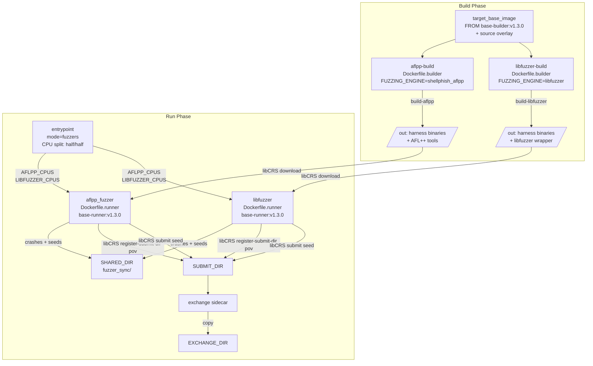
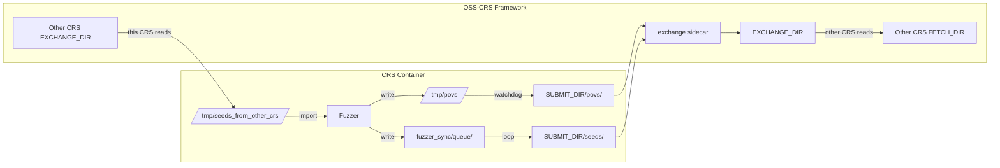

# crs-shellphish-c-fuzzers

Shellphish C/C++ fuzzing pipeline: AFL++ and LibFuzzer in parallel ensemble.

## Architecture



## CRS Configuration

**CRS name:** `crs-shellphish-c-fuzzers`
**File:** `oss-crs/crs-c-fuzzers.yaml`
**Registry:** `oss-crs/registry/crs-shellphish-c-fuzzers.yaml`
**Example compose:** `oss-crs/example/crs-shellphish-c-fuzzers/compose.yaml`

### Deployment

```bash
# In shellphish-oss-crs:
cp oss-crs/crs-c-fuzzers.yaml oss-crs/crs.yaml

# In oss-crs:
uv run oss-crs prepare --compose-file example/crs-shellphish-c-fuzzers/compose.yaml
uv run oss-crs build-target --compose-file example/crs-shellphish-c-fuzzers/compose.yaml \
  --fuzz-proj-path <target> --target-source-path <source>
uv run oss-crs run --compose-file example/crs-shellphish-c-fuzzers/compose.yaml \
  --fuzz-proj-path <target> --target-source-path <source> \
  --target-harness <harness> --timeout 300
```

## CPU Core Allocation

Entrypoint `CRS_PIPELINE_MODE=fuzzers` splits available cores evenly:

| Component | Cores (8-core example) | Mechanism |
|-----------|----------------------|-----------|
| oss_crs_infra | 0-1 | compose.yaml `cpuset` |
| AFL++ | 2,3,4 | `AFLPP_CPUS` from entrypoint, `taskset -c` per instance |
| LibFuzzer | 5,6,7 | `LIBFUZZER_CPUS` from entrypoint, `taskset -c` + `-fork=N` |

Entrypoint reads cgroup cpuset, parses available cores, writes `/OSS_CRS_SHARED_DIR/cpu_allocation`:
```
AFLPP_CPUS=2,3,4
LIBFUZZER_CPUS=5,6,7
```

Both fuzzers wait for this file at startup.

## Build Phase

### aflpp-build

- **Dockerfile:** `instrumentation/aflpp/Dockerfile.builder`
- **Base:** `FROM ${target_base_image}` (target source + deps) + `FROM prebuild` (AFL++ v4.30c)
- **Output:** `build-aflpp` — harness binaries compiled with `afl-clang-fast`, AFL++ tools (`afl-fuzz`, etc.)
- **Entry point:** `compile_aflpp_build` — `compile` → `post_build_commands` → `libCRS submit`

### libfuzzer-build

- **Dockerfile:** `instrumentation/shellphish_libfuzzer/Dockerfile.builder`
- **Base:** `FROM ${target_base_image}` + `FROM prebuild` (modified libfuzzer)
- **Output:** `build-libfuzzer` — harness binaries compiled with libfuzzer instrumentation + `wrapper.py`
- **Entry point:** `compile_canonical_build` or `compile_shellphish_libfuzzer` (dispatched by `BUILD_OUTPUT_NAME`)

## Run Phase

### AFL++ Fuzzer (`run_aflpp.sh`)

**Dockerfile:** `instrumentation/aflpp/Dockerfile.runner`
- `FROM base-runner:v1.3.0`
- Shellphish's `run_fuzzer` script + libCRS + glue entry point

**Ensemble strategy:**
- 1 main instance + (N-1) secondary instances, one per core
- Each pinned via `taskset -c $CORE`
- Main: deterministic mutations, timeout 5000ms
- Secondaries: randomized strategies per Shellphish's `run_fuzzer`:
  - Varying timeouts (500-2000ms)
  - Random cmplog, dictionary, corpus shuffling
  - Nautilus grammar mutator (if available)
- All instances share output dir (`-o fuzzer_sync/{project}-{harness}-0/`)
- AFL++ built-in sync: main imports from secondaries every ~5s (`SHELLPHISH: sync`)

**Crash collection:**
```
fuzzer_sync/main/crashes/id:*      ─┐
fuzzer_sync/secondary_*/crashes/id:* ─┤ collect_crashes_and_seeds() every 5s
                                      ↓
                              /tmp/povs/{hash}
                                      ↓
                    libCRS register-submit-dir pov (watchdog)
                                      ↓
                              SUBMIT_DIR/povs/
```

**Seed sharing (outbound):**
```
fuzzer_sync/main/queue/id:*
        ↓ collect loop, deduplicated via /tmp/.seeds_submitted/
  libCRS submit seed
        ↓
  SUBMIT_DIR/seeds/ → exchange sidecar → EXCHANGE_DIR/seeds/
```

**Seed sharing (inbound):**
```
  Other CRS → FETCH_DIR/seeds/
        ↓ libCRS register-fetch-dir seed (watchdog, polls every 5s)
  /tmp/seeds_from_other_crs/
        ↓ collect loop
  /tmp/foreign_fuzzer/queue/
        ↓ AFL++ -F /tmp/foreign_fuzzer
  AFL++ imports into fuzzing corpus
```

### LibFuzzer (`run_libfuzzer.sh`)

**Dockerfile:** `instrumentation/shellphish_libfuzzer/Dockerfile.runner`
- `FROM base-runner:v1.3.0`
- Shellphish's `wrapper.py` (symlinked as harness) + libCRS + glue entry point

**Ensemble strategy:**
- Single process with `-fork=N` (N = number of allocated cores)
- Pinned to core range via `taskset -c $CORES`
- `wrapper.py` manages corpus, minimization, and reload
- `-reload=200`: re-reads all corpus directories every 200s
- Additional corpus dirs: corpusguy, grammar-guy, grammaroomba, discoguy, sync-oss-crs-external (for future component integration)
- `-use_value_profile=1`: coverage + value profile feedback

**Crash collection:**
```
  wrapper.py -artifact_prefix=/tmp/libfuzzer_crashes/
        ↓ direct write by fork workers
  /tmp/libfuzzer_crashes/{crash_hash}
        ↓ libCRS register-submit-dir pov (watchdog)
  SUBMIT_DIR/povs/
```

**Seed sharing (outbound):**
```
  wrapper.py minimizes corpus →
  fuzzer_sync/.../libfuzzer-minimized/queue/*
        ↓ background loop every 10s, deduplicated
  libCRS submit seed
        ↓
  SUBMIT_DIR/seeds/
```

**Seed sharing (inbound):**
```
  Other CRS → FETCH_DIR/seeds/
        ↓ libCRS register-fetch-dir seed (watchdog)
  /tmp/seeds_from_other_crs/
        ↓ background loop every 10s
  fuzzer_sync/.../sync-oss-crs-external/queue/
        ↓ wrapper.py -reload=200
  LibFuzzer imports into fuzzing corpus
```

## OSS-CRS Framework Integration

### Data Flow: CRS ↔ Framework



### Volume Mounts (per container)

| Container path | Host path | Mode | Purpose |
|---------------|-----------|------|---------|
| `/OSS_CRS_BUILD_OUT_DIR` | `builds/.../BUILD_OUT_DIR` | ro | Build step outputs |
| `/OSS_CRS_SUBMIT_DIR` | `runs/.../SUBMIT_DIR` | rw | PoV/seed submission |
| `/OSS_CRS_SHARED_DIR` | `runs/.../SHARED_DIR` | rw | Inter-container shared data |
| `/OSS_CRS_LOG_DIR` | `runs/.../LOG_DIR` | rw | Logs (unused) |
| `/OSS_CRS_FETCH_DIR` | Other CRS's EXCHANGE_DIR | ro | Inbound seeds from other CRS |

## Output Directory Structure

```
runs/cfuzzers-final-01-{hash}/
├── EXCHANGE_DIR/{target}_{hash}/{harness}/
│   ├── povs/            ← exchange sidecar copies from SUBMIT_DIR
│   └── seeds/           ← exchange sidecar copies from SUBMIT_DIR
├── crs/crs-shellphish-c-fuzzers/{target}_{hash}/
│   ├── SUBMIT_DIR/{harness}/
│   │   ├── povs/        ← libCRS watchdog writes here
│   │   └── seeds/       ← libCRS submit writes here
│   ├── SHARED_DIR/{harness}/
│   │   ├── cpu_allocation          ← entrypoint writes
│   │   └── fuzzer_sync/{project}-{harness}-0/
│   │       ├── main/queue/         ← AFL++ main instance
│   │       ├── main/crashes/       ← AFL++ crashes
│   │       ├── secondary_*/        ← AFL++ secondary instances
│   │       ├── libfuzzer-minimized/queue/  ← LibFuzzer corpus
│   │       └── sync-oss-crs-external/queue/ ← inbound external seeds
│   └── LOG_DIR/         ← unused
└── logs/{target}_{hash}/{harness}/
    ├── crs/crs-shellphish-c-fuzzers/
    │   ├── *_entrypoint.stdout.log
    │   ├── *_aflpp_fuzzer.stdout.log
    │   └── *_libfuzzer.stdout.log
    └── services/
        └── oss-crs-exchange.stdout.log
```

## Verification Checklist

After a run, verify each point with specific evidence:

### 1. Entrypoint CPU allocation
**Log:** `*_entrypoint.stdout.log`
**Check:** `mode=fuzzers`, `AFLPP_CPUS=` and `LIBFUZZER_CPUS=` are non-overlapping and match compose cpuset.

### 2. AFL++ multi-instance
**Log:** `*_aflpp_fuzzer.stdout.log`
**Check:** `Starting AFL++ instance 'main' on core X` + `secondary_N on core Y` for each allocated core.

### 3. AFL++ crash detection
**Log:** `*_aflpp_fuzzer.stdout.log`
**Check:** `N crashes saved` where N > 0 (on mock-c, should find crash within seconds).

### 4. AFL++ inter-instance sync
**Log:** `*_aflpp_fuzzer.stdout.log`
**Check:** `SHELLPHISH: sync` appearing repeatedly (1000+ times in 120s run).

### 5. LibFuzzer fork mode
**Log:** `*_libfuzzer.stdout.log`
**Check:** `fork=N` where N = number of allocated cores. `LIBFUZZER_CPUS=` matches.

### 6. LibFuzzer corpus dirs include external
**Log:** `*_libfuzzer.stdout.log`
**Check:** `Adding additional seed directories` list includes `sync-oss-crs-external/queue`.

### 7. PoV files submitted
**Dir:** `SUBMIT_DIR/{harness}/povs/`
**Check:** Non-empty. Files are crash inputs (binary data).

### 8. Seeds shared outbound
**Dir:** `SUBMIT_DIR/{harness}/seeds/` and `EXCHANGE_DIR/{harness}/seeds/`
**Check:** Both non-empty, same file count. Exchange sidecar copied all.

### 9. Exchange sidecar activity
**Log:** `oss-crs-exchange.stdout.log`
**Check:** `copied povs/{hash}` entries showing PoV transfer.

### 10. Seed import path (requires mock injection)
**Method:** `docker exec <libfuzzer_container> sh -c 'echo TEST > /tmp/seeds_from_other_crs/mock_seed'`, wait 15s.
**Check:** File appears in `fuzzer_sync/.../sync-oss-crs-external/queue/mock_seed`.

### 11. fuzzer_sync shared data
**Dir:** `SHARED_DIR/{harness}/fuzzer_sync/{project}-{harness}-0/` (need sudo)
**Check:** `main/queue/` has AFL++ seeds, `libfuzzer-minimized/queue/` has LibFuzzer seeds.

## Known Limitations

- **No intra-CRS AFL++ ↔ LibFuzzer seed sharing:** They write to the same `fuzzer_sync/` dir but don't read each other's queues directly. Sharing between them requires intermediate components (CorpusGuy, Grammar-Guy) not present in this pipeline.
- **LibFuzzer `-reload=200`:** External seeds are picked up on 200s interval, not immediately.
- **Seed sharing requires multi-CRS deployment:** `register-fetch-dir` only works when another CRS's EXCHANGE_DIR is mounted as FETCH_DIR. Single CRS deployment has no inbound seeds.
