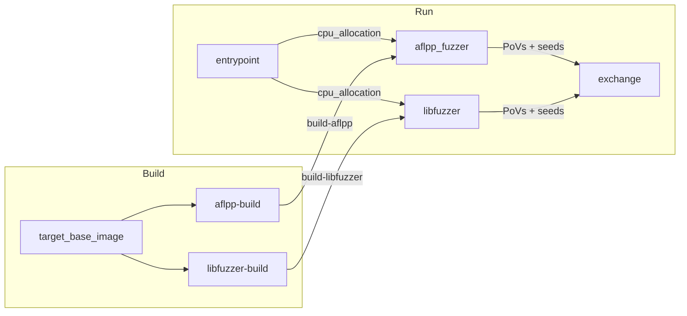

# crs-shellphish-c-fuzzers

AFL++ and LibFuzzer in parallel ensemble.

## Architecture



## Data Flow

### Build Outputs

| Build Step | Output Name | Consumers | Content |
|-----------|-------------|-----------|---------|
| aflpp-build | `build-aflpp` | aflpp_fuzzer | Harness binaries (afl-clang-fast) + AFL++ tools |
| libfuzzer-build | `build-libfuzzer` | libfuzzer | Harness binaries (libfuzzer) + wrapper.py |

### Shared Directory (`SHARED_DIR`)

| Path | Writer | Reader | Purpose |
|------|--------|--------|---------|
| `cpu_allocation` | entrypoint | aflpp_fuzzer, libfuzzer | `AFLPP_CPUS=2,3,4` / `LIBFUZZER_CPUS=5,6,7` |
| `fuzzer_sync/{project}-{harness}-0/` | AFL++ | (external components) | AFL++ queue + crashes |
| `fuzzer_sync/.../libfuzzer-minimized/queue/` | libfuzzer | (external components) | LibFuzzer minimized corpus |

### External I/O (via libCRS)

| Direction | Mechanism | Content |
|-----------|-----------|---------|
| PoV out | `libCRS register-submit-dir pov /tmp/povs/` | Crash inputs → EXCHANGE_DIR/povs/ |
| Seed out | `libCRS submit seed <file>` | Interesting inputs → EXCHANGE_DIR/seeds/ |
| Seed in | `libCRS register-fetch-dir seed /tmp/seeds_from_other_crs/` | From other CRS |

## CPU Allocation

`CRS_PIPELINE_MODE=fuzzers` — even split between AFL++ and LibFuzzer.

| Component | Cores (6 available) |
|-----------|-------------------|
| AFL++ | 2,3,4 (3 instances: main + 2 secondary) |
| LibFuzzer | 5,6,7 (fork=3) |

## Run Phase Details

### AFL++ (`run_aflpp.sh`)

- 1 main + (N-1) secondary instances, each pinned via `taskset`
- Shellphish's `run_fuzzer` handles strategy randomization (timeout, cmplog, dict, Nautilus)
- Crash monitor loop: copies `fuzzer_sync/*/crashes/id:*` → `/tmp/povs/`
- Seed sharing: submits `main/queue/id:*` via libCRS

### LibFuzzer (`run_libfuzzer.sh`)

- Harness is symlinked to `wrapper.py` (set up during build)
- `wrapper.py` calls `harness.instrumented` with `fork=N`, `artifact_prefix=/tmp/libfuzzer_crashes/`
- Crash files written directly by fork workers
- Seed sharing: background loop submits `libfuzzer-minimized/queue/*` via libCRS

### Sanitizer Settings

LeakSanitizer is disabled (`detect_leaks=0`) in all fuzzer containers. Leak detections have no crashing input data and produce 0-byte artifact files that cannot be submitted as PoVs.

## Configuration

```bash
cp oss-crs/crs-c-fuzzers.yaml oss-crs/crs.yaml
cd /project/oss-crs
uv run oss-crs run --compose-file example/crs-shellphish-c-fuzzers/compose.yaml \
  --fuzz-proj-path <target> --target-source-path <source> \
  --target-harness <harness> --timeout 1800
```

## Verification

| Check | Command / Log | Expected |
|-------|--------------|----------|
| CPU allocation | entrypoint log: `AFLPP_CPUS=`, `LIBFUZZER_CPUS=` | Non-overlapping core sets |
| AFL++ instances | aflpp log: `Starting AFL++ instance` | 1 main + N secondary |
| AFL++ crashes | aflpp log: `crashes saved` | > 0 on mock target |
| LibFuzzer fork | libfuzzer log: `fork=N` | N = allocated cores |
| PoVs submitted | `ls EXCHANGE_DIR/povs/` | Non-empty files |
| Seeds shared | `ls EXCHANGE_DIR/seeds/` | Non-empty |

## Known Limitations

- No direct AFL++ ↔ LibFuzzer seed sharing (requires intermediate components like CorpusGuy)
- LibFuzzer `-reload=200`: external seeds picked up every 200s
