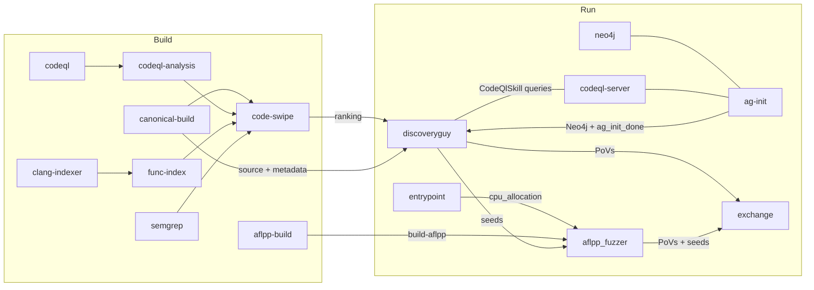

# crs-shellphish-discoveryguy

LLM-driven vulnerability discovery + AFL++ fuzzing.

DiscoveryGuy uses LLMs to analyze target code, generate exploit scripts, verify crashes, and submit PoVs. AFL++ runs in parallel to fuzz with DG-generated seeds.

## Architecture



## Data Flow

### Build Outputs → Run Consumers

| Build Output | Consumers | Content |
|-------------|-----------|---------|
| `build-canonical` | discoveryguy | Source, harness binaries, metadata |
| `build-aflpp` | aflpp_fuzzer | AFL++ harness binaries |
| `code-swipe-ranking` | discoveryguy | POI functions ranked by vulnerability |
| `func-index` | discoveryguy | Function index |
| `clang-index` | discoveryguy | Function body JSONs |
| `augmented-metadata` | discoveryguy | Project metadata |
| `split-metadata` | discoveryguy | Harness metadata |
| `codeql-analysis` | codeql-server, discoveryguy | CWE report + CodeQL DB zip |

### Shared Directory (`SHARED_DIR`)

| Path | Writer | Reader | Purpose |
|------|--------|--------|---------|
| `cpu_allocation` | entrypoint | aflpp_fuzzer | Core assignment |
| `ag_init_done` | ag-init | discoveryguy | Signal: Neo4j ready |
| `fuzzer_sync/{project}-{harness}-{id}/` | DG, AFL++ | each other | Seeds and crashes |

### DiscoveryGuy → AFL++ Seed Flow

```
DG LLM analysis → exploit script → sandbox_runner executes →
    crash verified → seed copied to fuzzer_sync/sync-discoguy-*/queue/
                  → AFL++ picks up via sync
```

## CPU Allocation

`CRS_PIPELINE_MODE=discoveryguy` — most cores to AFL++, 1-2 shared.

| Component | Cores (6 available) |
|-----------|-------------------|
| AFL++ | 2,3,4,5 (4 instances) |
| Shared (DG + infra) | 6,7 (DG is I/O bound, needs no dedicated cores) |

## DiscoveryGuy Run Flow

1. Downloads 7 build outputs
2. Constructs project structure for `OSSFuzzProject` + `built_src` symlink
3. Waits for ag-init (Neo4j callgraph data)
4. For each POI from code-swipe ranking:
   - LLM analyzes code (claude-sonnet-4-6)
   - LLM generates exploit script (o4-mini)
   - `sandbox_runner.py` executes script locally (replaces Docker-in-Docker)
   - `CrashChecker` verifies crash with ASAN
   - If confirmed: submit PoV + distribute seeds to AFL++ queues

### sandbox_runner.py

Replaces Docker-in-Docker with local subprocess. Under `OSSCRS_INTEGRATION_MODE`:
- Replicates base-runner environment (ASAN_OPTIONS with `dedup_token_length=3`)
- Script execution with resource limits, `/work` and `/out` setup
- Harness execution: `cwd=$OUT`, full sanitizer options

## Configuration

```bash
cp oss-crs/crs-discoveryguy.yaml oss-crs/crs.yaml
cd /project/oss-crs
export AIXCC_LITELLM_HOSTNAME=<litellm-url>
export LITELLM_KEY=<api-key>
uv run oss-crs run --compose-file example/crs-shellphish-discoveryguy/compose.yaml \
  --fuzz-proj-path <target> --target-source-path <source> \
  --target-harness <harness> --timeout 1800
```

## Verification

| Check | Evidence | Expected |
|-------|----------|----------|
| 6 containers | `docker ps \| grep discoveryguy` | 6 running |
| ag-init | `PYTHON exiting` + `AG Init complete` | CFGFunction in Neo4j |
| DG LLM analysis | `Starting jimmyPwn` or `Inferencing with` | LLM calls happening |
| DG crash verified | `👹 We crashed the target` | Crash confirmed |
| Seeds to AFL++ | `Copying seed from ... to /shared/fuzzer_sync/` | Seeds in sync dir |
| AFL++ fuzzing | `Fuzzing test case` | Active, crashes on mock |
| PoVs/seeds | EXCHANGE_DIR | Non-empty |

## Known Limitations

- DG vuln reports not fed back to code-swipe (code-swipe runs in build phase, before DG)
- ag-init timing: ~90s for CodeQL startup + queries. DG waits up to 300s.
- No coverage_tracer in this pipeline (DG is LLM-driven, not coverage-guided)
