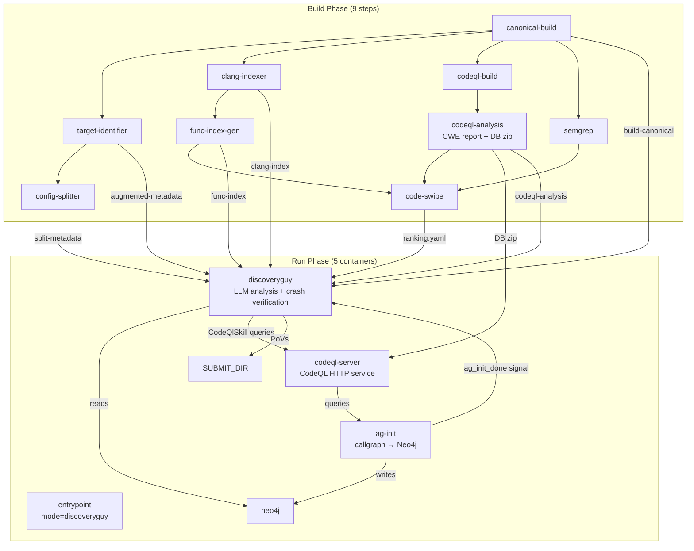

# crs-shellphish-discoveryguy

Shellphish DiscoveryGuy: LLM-driven vulnerability discovery pipeline.

## Architecture



## Components

### Build Phase

| Step | Dockerfile | Output | Description |
|------|-----------|--------|-------------|
| canonical-build | `shellphish_libfuzzer/Dockerfile.builder` | `build-canonical` | Compile target, preserve source |
| codeql-build | `codeql/Dockerfile.builder` | `codeql-db` | Create CodeQL database |
| codeql-analysis | `components/codeql/Dockerfile` | `codeql-analysis` | CWE resolved report (CLI) + DB zip |
| clang-indexer-build | `clang_indexer/Dockerfile.builder` | `clang-index` | Function JSON extraction |
| target-identifier | `target-identifier/Dockerfile` | `augmented-metadata` | Project metadata |
| config-splitter | `configuration-splitter/Dockerfile` | `split-metadata` | Build config splitting |
| func-index-gen | `function-index-generator/Dockerfile` | `func-index` | Function index |
| semgrep-analysis | `semgrep/Dockerfile` | `semgrep-report` | Static analysis |
| code-swipe | `code-swipe/Dockerfile` | `code-swipe-ranking` | Function vulnerability ranking |

### Run Phase

| Module | Dockerfile | Entry Point | Description |
|--------|-----------|-------------|-------------|
| entrypoint | `oss-crs-entrypoint/Dockerfile` | `run_entrypoint.sh` | CPU allocation (mode=discoveryguy, no fuzzer cores) |
| neo4j | `neo4j/Dockerfile` | neo4j default | Graph database for callgraph + dedup |
| codeql-server | `services/codeql_server/Dockerfile` | `run_codeql_server` | CodeQL HTTP server for ag-init + CodeQlSkill |
| ag-init | `components/codeql/Dockerfile.ag-init-run` | `run_ag_init` | Runs analysis_query.py → populates Neo4j with callgraph data |
| discoveryguy | `discoveryguy/Dockerfile` | `run_discoveryguy` | LLM vulnerability analysis + crash verification |

## CRS Configuration

- **CRS name:** `crs-shellphish-discoveryguy`
- **Config:** `oss-crs/crs-discoveryguy.yaml`
- **Example compose:** `oss-crs/example/crs-shellphish-discoveryguy/compose.yaml`

### Deployment

```bash
# In shellphish-oss-crs:
cp oss-crs/crs-discoveryguy.yaml oss-crs/crs.yaml

# In oss-crs (source .env for LLM credentials):
export $(grep -v '^#' /path/to/shellphish-oss-crs/.env | xargs)
envsubst < example/crs-shellphish-discoveryguy/compose.yaml > /tmp/compose.yaml
uv run oss-crs prepare --compose-file /tmp/compose.yaml
uv run oss-crs build-target --compose-file /tmp/compose.yaml \
  --fuzz-proj-path <target> --target-source-path <source>
uv run oss-crs run --compose-file /tmp/compose.yaml \
  --fuzz-proj-path <target> --target-source-path <source> \
  --target-harness <harness> --timeout 600
```

## CodeQL Analysis Build Step

The `codeql-analysis` build step runs CWE queries using CodeQL CLI directly (no server needed). Based on the original `components/codeql/Dockerfile`.

- **CWE queries** (`run_cwe_queries.py`): `codeql database analyze` CLI → raw SARIF → `SarifResolver` → resolved report for code-swipe's `CodeqlCWEFilter`
- **DB zip preserved**: `sss-codeql-database.zip` is passed through to the run phase for the CodeQL server

Callgraph analysis (`analysis_query.py`) is NOT done here — it runs in the `ag-init` run module against a live CodeQL server + Neo4j.

### codeql-analysis Output

| File | Purpose |
|------|---------|
| `codeql-cwe-report.json` | Resolved CWE report (code-swipe reads this) |
| `codeql-cwe-sarif.sarif` | Raw SARIF (reference) |
| `sss-codeql-database.zip` | CodeQL database (for run-phase codeql-server) |

## Run Phase: CodeQL Server + AG Init

### CodeQL Server (`run_codeql_server`)

Downloads `codeql-analysis` build output (DB zip) → starts CodeQL HTTP server → uploads DB. Stays running for:
- `ag-init`: callgraph queries (allFuncs, directCalls, funcPtrAccesses, etc.)
- DiscoveryGuy's `CodeQlSkill`: LLM tool queries (get_function_callers, get_struct_definition, etc.)

### AG Init (`run_ag_init`)

Runs Shellphish's original `analysis_query.py` (unmodified). Queries CodeQL server → writes CFGFunction nodes + DIRECTLY_CALLS edges + function pointer relationships to Neo4j. On completion, writes `$SHARED_DIR/ag_init_done` signal file, then sleeps (required by oss-crs `--abort-on-container-exit`).

### Synchronization

- **codeql-server ↔ ag-init**: `CodeQLClient` has built-in exponential backoff (6 retries, 5-120s delay). No explicit synchronization needed.
- **ag-init → discoveryguy**: `ag_init_done` signal file in SHARED_DIR. DiscoveryGuy waits up to 300s.
- **neo4j → discoveryguy**: Connection check with 10s timeout per attempt, up to 60s total.

## DiscoveryGuy Run Module

### Flow

1. Downloads 7 build outputs (canonical, ranking, func-index, clang-index, augmented-metadata, split-metadata, codeql-analysis)
2. Constructs oss-fuzz project directory structure for `OSSFuzzProject`
3. Creates `built_src` symlink (`out/.shellphish_src` → `artifacts/built_src`)
4. Waits for `ag_init_done` signal (Neo4j callgraph data ready)
5. Waits for Neo4j connection
6. Reads code-swipe ranking → determines POI functions to analyze
7. For each POI:
   - LLM (jimmyPwn, claude-sonnet-4-6) analyzes code, identifies vulnerability
   - LLM (SeedGenerator, o4-mini) generates exploit script
   - `sandbox_runner.py` executes script → produces crash input
   - `CrashChecker` runs harness with crash input → verifies crash
   - If crash confirmed: submits PoV + distributes seed to fuzzer queues
8. Retries with different strategies if crash not found

### Key Design: sandbox_runner.py

Replaces Docker-in-Docker (DinD) with local subprocess execution. When `OSSCRS_INTEGRATION_MODE` is set:
- `project.py:image_run__local()` → `sandbox_runner.image_run_local_osscrs()`
- Replicates base-runner container environment (ASAN_OPTIONS with `dedup_token_length=3`)
- Script execution: resource limits, `/work` and `/out` symlinks
- Harness execution: `cwd=$OUT`, full sanitizer options

## code-swipe Filters

| Filter | Data Source | Status |
|--------|-----------|--------|
| simple_reachability | func-index | ✅ Working |
| skip_tests_filter | built-in | ✅ Working |
| dangerous_functions | built-in | ✅ Working |
| Semgrep | semgrep-report | ✅ Working |
| CodeqlCWE | codeql-analysis resolved report | ✅ Working (0 results on mock-c is expected) |
| dynamic_reachability | Neo4j | ⚠️ No data at build time (needs coverage, same as original first run) |
| CodeQL/DiscoveryGuy | discovery_vuln_reports | ❌ Not connected (DiscoveryGuy runs after code-swipe) |

## CPU Core Allocation

`CRS_PIPELINE_MODE=discoveryguy`: No fuzzer core allocation. DiscoveryGuy is LLM-driven, runs unbound on all available cores. Allocation file written with empty values so other containers don't hang.

## Output Directory Structure

```
runs/{run-id}/
├── EXCHANGE_DIR/{target}_{hash}/{harness}/
│   ├── povs/
│   └── seeds/
├── crs/crs-shellphish-discoveryguy/{target}_{hash}/
│   ├── SUBMIT_DIR/{harness}/
│   │   └── povs/           ← PoVs from crash verification
│   ├── SHARED_DIR/{harness}/
│   │   ├── cpu_allocation
│   │   ├── ag_init_done    ← AG init completion signal
│   │   └── fuzzer_sync/    ← seeds distributed to harness queues
│   └── LOG_DIR/
└── logs/{target}_{hash}/{harness}/
    ├── crs/crs-shellphish-discoveryguy/
    │   ├── *_entrypoint.stdout.log
    │   ├── *_neo4j.stdout.log
    │   ├── *_codeql-server.stdout.log
    │   ├── *_ag-init.stdout.log
    │   └── *_discoveryguy.stdout.log
    └── services/
```

## Verification Checklist

### Build Phase
1. **All 9 build steps succeed** — check oss-crs build-target output
2. **codeql-analysis output** — `codeql-analysis/` has `codeql-cwe-report.json` + `sss-codeql-database.zip`
3. **code-swipe CodeqlCWE filter** — `code-swipe.log` shows `Registering filter pass: CodeqlCWE` + `Running filter: CodeqlCWE`
4. **code-swipe ranking** — `ranking.yaml` has functions with weights

### Run Phase
5. **Entrypoint** — log shows `mode=discoveryguy`
6. **Neo4j** — log shows `Started`
7. **CodeQL server** — `CodeQL server ready` + `Database uploaded successfully`
8. **AG init** — `PYTHON exiting (analysis graphql v2.0)` + `AG Init complete`
9. **DiscoveryGuy sync** — `AG init done.` + `Neo4j connected.`
10. **AG data available** — `🚰👍 N harnesses can reach this sink`
11. **LLM analysis** — `Starting jimmyPwn with claude-sonnet-4-6`
12. **Crash verification** — `💣->💥? Running crashing input`
13. **PoV submission** — `👹 We crashed` + files in SUBMIT_DIR/povs/
14. **Seed distribution** — `🫳🌱 Dropping seed into all the fuzzing queues`

## Known Limitations

- **DiscoveryGuy vuln reports not fed back to code-swipe**: Original system runs code-swipe after DiscoveryGuy. In our pipeline, code-swipe runs first (build phase). This is a single-pass limitation.
- **AG init timing**: ag-init takes ~90s (CodeQL server startup + queries). DiscoveryGuy waits up to 300s for `ag_init_done` signal. If ag-init fails, DiscoveryGuy continues without callgraph data (graceful degradation).
- **LLM budget**: External LiteLLM server has global budget limits. Monitor `💸 discoveryguy current cost` in logs.
