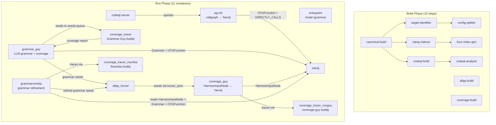

# crs-shellphish-grammar

Shellphish Grammar: LLM-driven grammar fuzzing with AFL++.

Grammar-Guy generates input grammars via LLM, traces coverage, writes Grammar+CFGFunction to Neo4j.
GrammarRoomba refines grammars based on coverage data from Neo4j.
AFL++ fuzzes with grammar-generated seeds via Nautilus.

## Architecture



## Components

### Build Phase

| Step | Dockerfile | Output | Description |
|------|-----------|--------|-------------|
| canonical-build | `shellphish_libfuzzer/Dockerfile.builder` | `build-canonical` | Compile target, preserve source |
| aflpp-build | `aflpp/Dockerfile.builder` | `build-aflpp` | AFL++ compiled harnesses |
| coverage-build | `coverage_fast/Dockerfile.builder.c` | `build-coverage` | Coverage-instrumented harnesses |
| codeql-build | `codeql/Dockerfile.builder` | `codeql-db` | CodeQL database |
| clang-indexer-build | `clang_indexer/Dockerfile.builder` | `clang-index` | Function JSON extraction |
| target-identifier | `target-identifier/Dockerfile` | `augmented-metadata` | Project metadata |
| config-splitter | `configuration-splitter/Dockerfile` | `split-metadata` | Build config splitting |
| func-index-gen | `function-index-generator/Dockerfile` | `func-index` | Function index |
| codeql-analysis | `components/codeql/Dockerfile` | `codeql-analysis` | CWE report + DB zip |

### Run Phase

| Module | Dockerfile | Entry Point | Description |
|--------|-----------|-------------|-------------|
| entrypoint | `oss-crs-entrypoint/Dockerfile` | `run_entrypoint.sh` | CPU allocation (mode=grammar) |
| neo4j | `neo4j/Dockerfile` | neo4j default | Graph database |
| codeql-server | `services/codeql_server/Dockerfile` | `run_codeql_server` | CodeQL HTTP server |
| ag-init | `components/codeql/Dockerfile.ag-init-run` | `run_ag_init` | analysis_query.py → Neo4j callgraph |
| aflpp_fuzzer | `aflpp/Dockerfile.runner` | `run_aflpp.sh` | Multi-instance AFL++ fuzzing |
| coverage_tracer | `coverage_fast/Dockerfile.runner.c` | `run_coverage_tracer` | Grammar-Guy's buddy tracer (processes seeds → coverage) |
| coverage_tracer_roomba | `coverage_fast/Dockerfile.runner.c` | `run_coverage_tracer` | GrammarRoomba's buddy tracer |
| coverage_tracer_covguy | `coverage_fast/Dockerfile.runner.c` | `run_coverage_tracer` | coverage-guy's buddy tracer |
| coverage_guy | `coverage-guy/Dockerfile` | `run_coverage_guy` | Monitors AFL++ seeds → HarnessInputNode to Neo4j |
| grammar_guy | `grammar-guy/Dockerfile` | `run_grammar_guy` | LLM grammar generation + coverage evaluation |
| grammaroomba | `grammaroomba/Dockerfile` | `run_grammaroomba` | Grammar refinement based on Neo4j data |

## Neo4j Data Model

Three node types are involved:

| Node | Written by | Read by |
|------|-----------|---------|
| `CFGFunction` | ag-init (callgraph), Grammar-Guy (coverage) | Grammar-Guy (improvement strategies), GrammarRoomba |
| `Grammar` | Grammar-Guy | GrammarRoomba |
| `HarnessInputNode` | coverage-guy | GrammarRoomba, Grammar-Guy (`get_functions_harness_reachability`) |

Relationships:
- `CFGFunction -[:DIRECTLY_CALLS]-> CFGFunction` — written by ag-init
- `Grammar -[:COVERS]-> CFGFunction` — written by Grammar-Guy
- `HarnessInputNode -[:COVERS]-> CFGFunction` — written by coverage-guy

## Grammar-Guy Flow

1. LLM (o3) generates grammar from harness source code
2. Nautilus generates 20 inputs from grammar
3. `trace_dir()` → seeds to external coverage_tracer → coverage report
4. Parse coverage → `FunctionCoverageMap`
5. `register_grammar_function_coverage()` → write Grammar + CFGFunction to Neo4j
6. Improvement loop (2000 cycles): try strategies → regenerate grammar → trace → compare
7. Grammar seeds written to `fuzzer_sync/` for AFL++ to pick up

### Grammar-Guy ↔ coverage_tracer Interaction

Grammar-Guy's internal `Tracer` uses external `coverage_tracer` container as buddy:
1. `PollingObserver` starts (monitors `raw-results-done-files/`)
2. Clean stale done-files from previous round
3. Copy seeds to `covlib/seeds-queue/`
4. Write `.covlib.done` trigger
5. coverage_tracer's `oss-fuzz-coverage_live` processes seeds in runner environment
6. Writes `raw-results/coverage` + `raw-results-done-files/coverage`
7. PollingObserver detects done-file → Grammar-Guy reads coverage result

Key: observer must start BEFORE seeds are written (OSSCRS-specific fix in `trace.py`).

### Grammar-Guy Improvement Strategies

| Strategy | Neo4j Data Needed | Status |
|----------|------------------|--------|
| `random` | Grammar nodes | ✅ Working |
| `extender` | Grammar nodes | ✅ Working |
| `uncovered_callable_function_pairs` | HarnessInputNode (from coverage-guy) + DIRECTLY_CALLS (from ag-init) | ✅ Working |
| `get_functions_harness_reachability` | HarnessInputNode (from coverage-guy) | ✅ Working |

## GrammarRoomba Flow

1. Wait 180s for Grammar-Guy to populate Neo4j
2. Query Neo4j: `HarnessInputNode -[:COVERS]-> CFGFunction <-[:COVERS]- Grammar`
3. Build `FunctionMetaStack` from results (requires both HarnessInputNode AND Grammar for same CFGFunction)
4. Pop function → LLM refine grammar → trace to verify coverage improvement
5. Write refined grammar to Neo4j + `fuzzer_sync/`

## coverage-guy

Monitors AFL++ seeds → runs each seed through coverage → writes `HarnessInputNode -[:COVERS]-> CFGFunction` to Neo4j.

### Glue Files
- `bin/run_coverage_guy` — downloads build outputs, background seed feeder (AFL++ → PDTRepo format), launches `monitor_fast.py`
- `shellphish-src/components/coverage-guy/Dockerfile` — adapted COPY paths, libCRS, sed patches (num_db_uploaders=4, num_coverage_processors=1)

### Key Adaptations
- AFL++ seeds at `fuzzer_sync/{project}-{harness}-0/main/queue/` copied to PDTRepo-compatible dirs (`covguy-benign-seeds/`)
- `/shared` symlinked to `$OSS_CRS_SHARED_DIR` (coverage-guy hardcodes `/shared/coverageguy/`)
- `LOCAL_RUN=1` for LocalFunctionResolver + sed force `num_db_uploaders=4` (overrides LOCAL_RUN's default of 0)
- `num_coverage_processors=1` (matches single external coverage_tracer_covguy buddy)
- `COVERAGE_AGGREGATE=false` on coverage_tracer_covguy (coverage-guy needs per-seed results)

## Verification Checklist

Container name prefix: `$P = crs_compose_<run_id>-crs-shellphish-grammar`

### Build Phase

| # | Functionality | Validation Command | Expected |
|---|--------------|-------------------|----------|
| B1 | All 10 build steps succeed | oss-crs output shows all build steps `Success` | No `Failed` steps |
| B2 | coverage-build has instrumented binary | Check build log for `compile` + coverage flags | Binary at `artifacts/out/$HARNESS` |
| B3 | codeql-analysis produces CWE report | Check build log for `codeql-cwe-report.json` | Non-empty JSON file |

### Run Phase — Infrastructure (check within 2 min of start)

| # | Functionality | Validation Command | Expected |
|---|--------------|-------------------|----------|
| R1 | All 11 containers running | `docker ps \| grep grammar \| wc -l` | `11` |
| R2 | Entrypoint CPU allocation | `docker logs $P_entrypoint-1 2>&1 \| grep AFLPP_CPUS` | `AFLPP_CPUS=N` (N > 0) |
| R3 | Neo4j started | `docker logs $P_neo4j-1 2>&1 \| grep "Started."` | Line present |
| R4 | CodeQL server ready | `docker logs $P_codeql-server-1 2>&1 \| grep "CodeQL server ready"` | Line present |
| R5 | CodeQL database uploaded | `docker logs $P_codeql-server-1 2>&1 \| grep "Database uploaded"` | Line present |
| R6 | ag-init completed | `docker logs $P_ag-init-1 2>&1 \| grep "PYTHON exiting"` | Line present |
| R7 | ag-init wrote CFGFunction | `docker exec $P_neo4j-1 cypher-shell -u neo4j -p helloworldpdt "MATCH (f:CFGFunction) RETURN count(f)"` | count > 0 |
| R8 | ag-init wrote DIRECTLY_CALLS | `docker exec $P_neo4j-1 cypher-shell -u neo4j -p helloworldpdt "MATCH ()-[r:DIRECTLY_CALLS]->() RETURN count(r)"` | count > 0 |
| R9 | AFL++ fuzzing active | `docker logs $P_aflpp_fuzzer-1 2>&1 \| grep "Fuzzing test case"` | Test cases growing |
| R10 | AFL++ found crashes | `docker logs $P_aflpp_fuzzer-1 2>&1 \| grep "crashes saved"` | crashes > 0 (may take time) |

### Run Phase — Grammar-Guy (check after ~3 min)

| # | Functionality | Validation Command | Expected |
|---|--------------|-------------------|----------|
| G1 | Tracer buddy started | `docker logs $P_coverage_tracer-1 2>&1 \| grep ".oss-fuzz-coverage_live.started"` | File touched |
| G2 | Grammar-Guy started | `docker logs $P_grammar_guy-1 2>&1 \| grep "Grammar-Guy starting"` | Line present |
| G3 | LLM grammar generation | `docker logs $P_grammar_guy-1 2>&1 \| grep "Inferencing with o3"` | At least 1 call |
| G4 | Input generation (Nautilus) | `docker logs $P_grammar_guy-1 2>&1 \| grep "Generated.*inputs"` | 20/20 or similar |
| G5 | Coverage trace completed | `docker logs $P_grammar_guy-1 2>&1 \| grep "Found coverage"` | `Found coverage: N` (N > 0) |
| G6 | Grammar improved | `docker logs $P_grammar_guy-1 2>&1 \| grep "Grammar improved"` | At least 1 line |
| G7 | Grammar written to Neo4j | `docker exec $P_neo4j-1 cypher-shell -u neo4j -p helloworldpdt "MATCH (g:Grammar) RETURN count(g)"` | count > 0 |
| G8 | Multi-cycle progress | `docker logs $P_grammar_guy-1 2>&1 \| grep "Cycle.*finished"` | Cycle N (N > 0) |
| G9 | Seeds synced to AFL++ | `docker logs $P_grammar_guy-1 2>&1 \| grep "Synced.*files to FUZZER"` | TOTAL SEEDS > 0 |
| G10 | Advanced strategy used | `docker logs $P_grammar_guy-1 2>&1 \| grep "uncovered_callable_function_pairs"` | Line present (requires coverage-guy HarnessInputNode) |

### Run Phase — coverage-guy (check after ~5 min)

| # | Functionality | Validation Command | Expected |
|---|--------------|-------------------|----------|
| C1 | coverage-guy started | `docker logs $P_coverage_guy-1 2>&1 \| grep "Coverage-Guy starting"` | Line present |
| C2 | Build outputs downloaded | `docker logs $P_coverage_guy-1 2>&1 \| grep "Build outputs downloaded"` | Line present |
| C3 | coverage_tracer_covguy buddy started | `docker logs $P_coverage_tracer_covguy-1 2>&1 \| grep ".oss-fuzz-coverage_live.started"` | File touched |
| C4 | Seed feeder detecting AFL++ seeds | `docker logs $P_coverage_guy-1 2>&1 \| grep "Seed feeder"` | Feeder started |
| C5 | Seeds traced | `docker logs $P_coverage_guy-1 2>&1 \| grep "SEEDS_ALREADY_TRACED"` | Size > 0 |
| C6 | HarnessInputNode in Neo4j | `docker exec $P_neo4j-1 cypher-shell -u neo4j -p helloworldpdt "MATCH (h:HarnessInputNode) RETURN count(h)"` | count > 0 |
| C7 | HarnessInputNode COVERS CFGFunction | `docker exec $P_neo4j-1 cypher-shell -u neo4j -p helloworldpdt "MATCH (h:HarnessInputNode)-[:COVERS]->(f:CFGFunction) RETURN count(DISTINCT f)"` | count > 0 |

### Run Phase — GrammarRoomba (check after ~8 min; 180s startup delay)

| # | Functionality | Validation Command | Expected |
|---|--------------|-------------------|----------|
| M1 | Roomba started | `docker logs $P_grammaroomba-1 2>&1 \| grep "GrammarRoomba starting"` | Line present |
| M2 | coverage_tracer_roomba buddy started | `docker logs $P_coverage_tracer_roomba-1 2>&1 \| grep ".oss-fuzz-coverage_live.started"` | File touched |
| M3 | FunctionMetaStack populated | `docker logs $P_grammaroomba-1 2>&1 \| grep "FunctionMetaStack.*Now contains"` | contains N > 0 |
| M4 | LLM refinement invoked | `docker logs $P_grammaroomba-1 2>&1 \| grep "Invoking.*check_grammar_coverage"` | At least 1 |
| M5 | Coverage trace via roomba tracer | `docker logs $P_grammaroomba-1 2>&1 \| grep "Coverage Report"` | At least 1 report |
| M6 | Refinement result | `docker logs $P_grammaroomba-1 2>&1 \| grep -E "improved coverage\|fully covered"` | At least 1 |

### Run Phase — Neo4j Final State (comprehensive check)

| # | Functionality | Validation Command | Expected |
|---|--------------|-------------------|----------|
| N1 | All node types present | `docker exec $P_neo4j-1 cypher-shell -u neo4j -p helloworldpdt "MATCH (n) RETURN labels(n), count(n) ORDER BY count(n) DESC"` | CFGFunction, Grammar, HarnessInputNode all > 0 |
| N2 | Grammar COVERS CFGFunction | `docker exec $P_neo4j-1 cypher-shell -u neo4j -p helloworldpdt "MATCH (g:Grammar)-[:COVERS]->(f:CFGFunction) RETURN count(DISTINCT f)"` | count > 0 |
| N3 | HarnessInputNode COVERS same CFGFunction as Grammar | `docker exec $P_neo4j-1 cypher-shell -u neo4j -p helloworldpdt "MATCH (h:HarnessInputNode)-[:COVERS]->(f:CFGFunction)<-[:COVERS]-(g:Grammar) RETURN count(DISTINCT f)"` | count > 0 (overlap needed for Roomba) |

### Quick Validation Script

Full script: [`docs/validate_grammar.sh`](validate_grammar.sh)

```bash
#!/bin/bash
# Usage: docs/validate_grammar.sh <container_prefix>
# Example: docs/validate_grammar.sh crs_compose_1774886529c0-crs-shellphish-grammar
P="$1"
echo "=== Container Count ==="
docker ps --format '{{.Names}}' | grep "${P}" | wc -l

echo "=== Neo4j Nodes ==="
docker exec ${P}_neo4j-1 cypher-shell -u neo4j -p helloworldpdt \
  "MATCH (n) RETURN labels(n) AS type, count(n) AS cnt ORDER BY cnt DESC" 2>/dev/null

echo "=== Neo4j Relationships ==="
docker exec ${P}_neo4j-1 cypher-shell -u neo4j -p helloworldpdt \
  "MATCH (n)-[r]->(m) RETURN type(r), count(*) ORDER BY count(*) DESC" 2>/dev/null

echo "=== Grammar-Guy Cycles ==="
docker logs ${P}_grammar_guy-1 2>&1 | grep "Cycle.*finished" | tail -3

echo "=== Grammar-Guy Strategies ==="
docker logs ${P}_grammar_guy-1 2>&1 | grep -oE "Improving grammar using .* approach" | sort | uniq -c

echo "=== Coverage-Guy Seeds ==="
docker logs ${P}_coverage_guy-1 2>&1 | grep "SEEDS_ALREADY_TRACED" | tail -1

echo "=== GrammarRoomba Stack ==="
docker logs ${P}_grammaroomba-1 2>&1 | grep "FunctionMetaStack" | tail -3

echo "=== GrammarRoomba Result ==="
docker logs ${P}_grammaroomba-1 2>&1 | grep -E "improved coverage|fully covered|GrammarMutator" | tail -3

echo "=== AFL++ Status ==="
docker logs ${P}_aflpp_fuzzer-1 2>&1 | grep "crashes saved" | tail -1

echo "=== Budget Usage ==="
docker logs ${P}_grammar_guy-1 2>&1 | grep "Budget Usage" | tail -1
docker logs ${P}_grammaroomba-1 2>&1 | grep "Budget Usage" | tail -1
```

### Verified Results (clean build after docker system prune, 2026-03-31)

| Target | R1-R10 | G1-G10 | C1-C7 | M1-M6 | N1-N3 | Total |
|--------|--------|--------|-------|-------|-------|-------|
| sanity-mock-c-delta-01 | ✅ 10/10 | ✅ 10/10 | ✅ 7/7 | ✅ 6/6 | ✅ 3/3 | **32/32** |
| afc-lcms-full-01 | ✅ 9/10 (R10 ⚠️) | ✅ 10/10 | ✅ 7/7 | ✅ 6/6 | ✅ 3/3 | **31/32** |
| asc-nginx-delta-01 | ✅ 10/10 | ✅ 10/10 | ✅ 7/7 | ✅ 6/6 | ✅ 3/3 | **32/32** |

R10 on lcms: AFL++ no crashes (full target, no known vulnerability, not a pipeline issue).

### Intermediate Data Verified

| Data | Where | mock | lcms | nginx |
|------|-------|------|------|-------|
| CFGFunction | Neo4j | 7 | 1255 | 2368 |
| DIRECTLY_CALLS | Neo4j | 2 | 2929 | 4539 |
| MAYBE_INDIRECT_CALLS | Neo4j | 0 | 300 | 6588 |
| Grammar | Neo4j | 14 | 6 | 2 |
| Grammar COVERS CFGFunction | Neo4j | 90 | ✅ | ✅ |
| HarnessInputNode | Neo4j | 4 | 209 | 142 |
| HarnessInputNode COVERS CFGFunction | Neo4j | ✅ | ✅ | ✅ |
| HarnessInput∩Grammar overlap (N3) | Neo4j | 5 | >0 | >0 |
| COVERS total | Neo4j | 90 | 8531 | 53841 |
| AFL++ test cases | fuzzer_sync | 4 | growing | growing |
| AFL++ crashes | fuzzer_sync | 1 | 0 | >0 |
| Grammar-Guy seeds to AFL++ | fuzzer_sync | ✅ | ✅ | ✅ |
| coverage-guy seeds traced | monitor_fast.py | 4 | 209 | 142 |
| Roomba FunctionMetaStack | run.py | >0 | >0 | >0 |
| Grammar-Guy budget | LLM | $0.53 | $0.76 | $0.59 |
| Roomba budget | LLM | $0.24 | $0.54 | $0.65 |

## Coverage Tracer Architecture

Three coverage_tracer instances serve different components:

| Tracer | Instance ID | Covlib Workdir | Serves |
|--------|------------|----------------|--------|
| `coverage_tracer` | grammar | `coverage-build-grammar` | Grammar-Guy |
| `coverage_tracer_roomba` | roomba | `coverage-build-roomba` | GrammarRoomba |
| `coverage_tracer_covguy` | covguy | `coverage-build-covguy` | coverage-guy |

Each component sets `OSSCRS_COVLIB_WORKDIR` to match its buddy tracer's workdir. The tracer
monitors `seeds-queue/`, processes seeds via `oss-fuzz-coverage_live`, writes results to `raw-results/`.

## Known Limitations

- **Corpus-Guy blocked**: Needs offline beatty server for seed corpus/dictionaries
- **Grammar-Composer blocked**: Needs offline beatty server for reference format grammars
