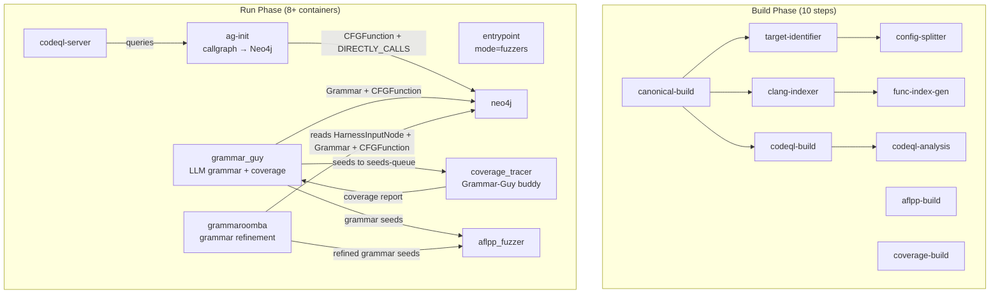

# crs-shellphish-grammar

Shellphish Grammar: LLM-driven grammar fuzzing with AFL++.

Grammar-Guy generates input grammars via LLM, traces coverage, writes Grammar+CFGFunction to Neo4j.
GrammarRoomba refines grammars based on coverage data from Neo4j.
AFL++ fuzzes with grammar-generated seeds via Nautilus.

## Architecture

## Components

### Build Phase

| Step | Dockerfile | Output | Description |
|------|-----------|--------|-------------|
| canonical-build | `shellphish_libfuzzer/Dockerfile.builder` | `build-canonical` | Compile target, preserve source |
| aflpp-build | `aflpp/Dockerfile.builder` | `build-aflpp` | AFL++ compiled harnesses |
| coverage-build | `coverage_fast/Dockerfile.builder.c` | `build-coverage` | Coverage-instrumented harnesses |
| codeql-build | `codeql/Dockerfile.builder` | `codeql-db` | CodeQL database |
| clang-indexer-build | `clang_indexer/Dockerfile.builder` | `clang-index` | Function JSON extraction |
| target-identifier | `target-identifier/Dockerfile` | `augmented-metadata` | Project metadata |
| config-splitter | `configuration-splitter/Dockerfile` | `split-metadata` | Build config splitting |
| func-index-gen | `function-index-generator/Dockerfile` | `func-index` | Function index |
| codeql-analysis | `components/codeql/Dockerfile` | `codeql-analysis` | CWE report + DB zip |

### Run Phase

| Module | Dockerfile | Entry Point | Description |
|--------|-----------|-------------|-------------|
| entrypoint | `oss-crs-entrypoint/Dockerfile` | `run_entrypoint.sh` | CPU allocation (mode=fuzzers) |
| neo4j | `neo4j/Dockerfile` | neo4j default | Graph database |
| codeql-server | `services/codeql_server/Dockerfile` | `run_codeql_server` | CodeQL HTTP server |
| ag-init | `components/codeql/Dockerfile.ag-init-run` | `run_ag_init` | analysis_query.py → Neo4j callgraph |
| aflpp_fuzzer | `aflpp/Dockerfile.runner` | `run_aflpp.sh` | Multi-instance AFL++ fuzzing |
| coverage_tracer | `coverage_fast/Dockerfile.runner.c` | `run_coverage_tracer` | Grammar-Guy's buddy tracer (processes seeds → coverage) |
| grammar_guy | `grammar-guy/Dockerfile` | `run_grammar_guy` | LLM grammar generation + coverage evaluation |
| grammaroomba | `grammaroomba/Dockerfile` | `run_grammaroomba` | Grammar refinement based on Neo4j data |

## Neo4j Data Model

Three node types are involved:

| Node | Written by | Read by |
|------|-----------|---------|
| `CFGFunction` | ag-init (callgraph), Grammar-Guy (coverage) | Grammar-Guy (improvement strategies), GrammarRoomba |
| `Grammar` | Grammar-Guy | GrammarRoomba |
| `HarnessInputNode` | **coverage-guy (NOT YET INTEGRATED)** | GrammarRoomba, Grammar-Guy (`get_functions_harness_reachability`) |

Relationships:
- `CFGFunction -[:DIRECTLY_CALLS]-> CFGFunction` — written by ag-init
- `Grammar -[:COVERS]-> CFGFunction` — written by Grammar-Guy
- `HarnessInputNode -[:COVERS]-> CFGFunction` — written by coverage-guy

## Grammar-Guy Flow

1. LLM (o3) generates grammar from harness source code
2. Nautilus generates 20 inputs from grammar
3. `trace_dir()` → seeds to external coverage_tracer → coverage report
4. Parse coverage → `FunctionCoverageMap`
5. `register_grammar_function_coverage()` → write Grammar + CFGFunction to Neo4j
6. Improvement loop (2000 cycles): try strategies → regenerate grammar → trace → compare
7. Grammar seeds written to `fuzzer_sync/` for AFL++ to pick up

### Grammar-Guy ↔ coverage_tracer Interaction

Grammar-Guy's internal `Tracer` uses external `coverage_tracer` container as buddy:
1. `PollingObserver` starts (monitors `raw-results-done-files/`)
2. Clean stale done-files from previous round
3. Copy seeds to `covlib/seeds-queue/`
4. Write `.covlib.done` trigger
5. coverage_tracer's `oss-fuzz-coverage_live` processes seeds in runner environment
6. Writes `raw-results/coverage` + `raw-results-done-files/coverage`
7. PollingObserver detects done-file → Grammar-Guy reads coverage result

Key: observer must start BEFORE seeds are written (OSSCRS-specific fix in `trace.py`).

### Grammar-Guy Improvement Strategies

| Strategy | Neo4j Data Needed | Status |
|----------|------------------|--------|
| `random` | Grammar nodes | ✅ Working |
| `extender` | Grammar nodes | ✅ Working |
| `uncovered_callable_function_pairs` | HarnessInputNode (from coverage-guy) + DIRECTLY_CALLS (from ag-init) | ⚠️ Returns empty without coverage-guy |
| `get_functions_harness_reachability` | HarnessInputNode (from coverage-guy) | ⚠️ Returns empty without coverage-guy |

## GrammarRoomba Flow

1. Wait 180s for Grammar-Guy to populate Neo4j
2. Query Neo4j: `HarnessInputNode -[:COVERS]-> CFGFunction <-[:COVERS]- Grammar`
3. Build `FunctionMetaStack` from results
4. Pop function → LLM refine grammar → trace to verify coverage improvement
5. Write refined grammar to Neo4j + `fuzzer_sync/`

### GrammarRoomba Status: NOT FUNCTIONAL

GrammarRoomba requires `HarnessInputNode` nodes in Neo4j. These are written by **coverage-guy** (not yet integrated). Without coverage-guy:
- `FunctionMetaStack.update()` returns empty
- Roomba loops in `while self.function_stack.is_empty(): sleep(900)` forever
- Never reaches refinement logic

## Missing Component: coverage-guy

### What it does
Monitors AFL++ seeds → runs each seed through coverage → writes `HarnessInputNode -[:COVERS]-> CFGFunction` to Neo4j.

### Why it's needed
- GrammarRoomba: completely non-functional without it
- Grammar-Guy: `uncovered_callable_function_pairs` and `get_functions_harness_reachability` strategies return empty

### Dependencies
| Input | Source | Available |
|-------|--------|-----------|
| `build-coverage` | build phase | ✅ |
| `func-index` + `clang-index` | build phase | ✅ |
| `split-metadata` + `augmented-metadata` | build phase | ✅ |
| AFL++ seeds (benign + crashing) | `fuzzer_sync/` | ⚠️ Need PDTRepo path adaptation |
| Tracer buddy (oss-fuzz-coverage_live) | Needs dedicated coverage_tracer instance | ❌ Not yet added |
| Neo4j | neo4j container | ✅ |

### Integration Plan

**New files:**
1. `bin/run_coverage_guy` — glue script: download build outputs, adapt AFL++ seed paths to PDTRepo format, launch `monitor_fast.py`, `sleep infinity`
2. Modify `shellphish-src/components/coverage-guy/Dockerfile` — adapt COPY paths for shellphish-oss-crs build context

**Config changes:**
3. `oss-crs/crs-grammar.yaml` — add `coverage_guy` run module + `coverage_tracer_covguy` instance

**Key adaptation:**
- AFL++ seeds are at `fuzzer_sync/{project}-{harness}-0/main/queue/` and `.../crashes/`
- coverage-guy expects PDTRepo format: `main_dir` + `lock_dir` directories
- Glue script needs to create symlinks or directory structure mapping
- Disable `permanence` (offline server dependency)

## Verification Checklist

### Build Phase
1. All 10 build steps succeed
2. `build-coverage` has coverage-instrumented harness binary
3. `codeql-analysis` has `codeql-cwe-report.json` + `sss-codeql-database.zip`

### Run Phase — Infrastructure
4. **Entrypoint**: `mode=fuzzers`, CPU cores split
5. **Neo4j**: `Started.`
6. **CodeQL server**: `CodeQL server ready` + `Database uploaded successfully`
7. **ag-init**: `PYTHON exiting` + Neo4j has CFGFunction + DIRECTLY_CALLS
8. **AFL++**: multiple instances fuzzing, test cases growing

### Run Phase — Grammar-Guy
9. **Tracer buddy**: `.oss-fuzz-coverage_live.started` created by coverage_tracer
10. **LLM grammar**: `Inferencing with o3` → `Grammar improved`
11. **Input generation**: `Generated 20/20 inputs`
12. **Coverage trace**: `Tracing 20 seeds` → `NOTE: end-to-end time`
13. **Coverage parsing**: `Found coverage: N` (N > 0)
14. **Neo4j write**: Grammar and CFGFunction nodes in Neo4j
15. **Multi-cycle**: `Cycle N finished` (N > 0)
16. **Grammar seeds**: seeds written to `fuzzer_sync/` directory

### Run Phase — coverage-guy (NOT YET INTEGRATED)
17. **Seed monitoring**: picks up AFL++ seeds from fuzzer_sync
18. **Coverage trace**: traces each seed via buddy coverage_tracer
19. **Neo4j write**: `HarnessInputNode` nodes in Neo4j
20. **Verification**: `MATCH (n:HarnessInputNode) RETURN count(n)` > 0

### Run Phase — GrammarRoomba (BLOCKED by coverage-guy)
21. **Stack populated**: `Updated FunctionMetaStack. Now contains N functions` (N > 0)
22. **LLM refinement**: `GrammarMutator successfully improved coverage`
23. **Grammar write**: refined grammar written to Neo4j + `fuzzer_sync/`

### Verified Results (lcms, 7 min run)
- ✅ Items 1-15: All verified
- ⚠️ Item 16: Directory created, actual write not confirmed
- ❌ Items 17-23: Blocked on coverage-guy integration

## Known Limitations

- **coverage-guy not integrated**: GrammarRoomba non-functional, Grammar-Guy improvement strategies degraded
- **Corpus-Guy blocked**: Needs offline beatty server for seed corpus/dictionaries
- **Grammar-Composer blocked**: Needs offline beatty server for reference format grammars
