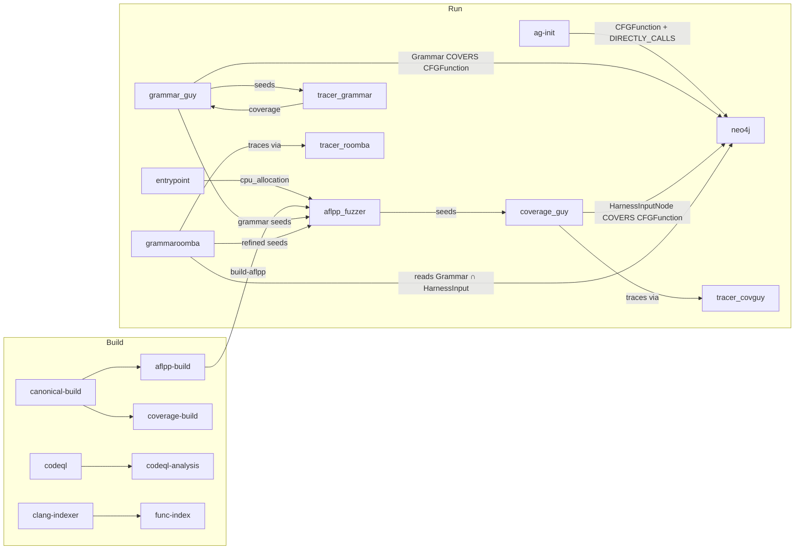

# crs-shellphish-grammar

LLM-driven grammar fuzzing with AFL++.

Grammar-Guy generates input grammars via LLM, GrammarRoomba refines them based on coverage data. AFL++ fuzzes with grammar-generated seeds via Nautilus mutator.

## Architecture



**11 containers**: entrypoint, neo4j, codeql-server, ag-init, aflpp_fuzzer, grammar_guy, grammaroomba, coverage_guy, coverage_tracer ×3.

## Data Flow

### Build Outputs → Run Consumers

| Build Output | Consumers | Content |
|-------------|-----------|---------|
| `build-aflpp` | aflpp_fuzzer | AFL++ harness binaries |
| `build-coverage` | coverage_tracer ×3 | Coverage-instrumented binary |
| `build-canonical` | grammar_guy, grammaroomba, coverage_guy | Source, metadata |
| `func-index` | grammar_guy, grammaroomba, coverage_guy | Function index |
| `clang-index` | grammar_guy, grammaroomba, coverage_guy | Function body JSONs |
| `augmented-metadata` | grammar_guy, grammaroomba, coverage_guy | Project metadata |
| `split-metadata` | grammar_guy, grammaroomba, coverage_guy | Harness metadata |
| `codeql-analysis` | codeql-server | CodeQL DB zip |

### Neo4j Data Model

| Node | Written By | Read By |
|------|-----------|---------|
| `CFGFunction` | ag-init, grammar_guy, coverage_guy | grammar_guy, grammaroomba |
| `Grammar` | grammar_guy | grammaroomba |
| `HarnessInputNode` | coverage_guy | grammaroomba, grammar_guy |

| Relationship | Written By | Purpose |
|-------------|-----------|---------|
| `CFGFunction -[:DIRECTLY_CALLS]→ CFGFunction` | ag-init | Callgraph |
| `Grammar -[:COVERS]→ CFGFunction` | grammar_guy | Grammar coverage |
| `HarnessInputNode -[:COVERS]→ CFGFunction` | coverage_guy | Fuzzer coverage |

### Shared Directory (`SHARED_DIR`)

| Path | Writer | Reader | Purpose |
|------|--------|--------|---------|
| `cpu_allocation` | entrypoint | aflpp_fuzzer | Core assignment |
| `fuzzer_sync/{project}-{harness}-0/` | AFL++, grammar_guy, grammaroomba | coverage_guy, AFL++ | Queue, crashes, grammar seeds |
| `coverage-build-grammar/artifacts/work/covlib/` | coverage_tracer (grammar) | grammar_guy | Coverage trace results |
| `coverage-build-roomba/artifacts/work/covlib/` | coverage_tracer (roomba) | grammaroomba | Coverage trace results |
| `coverage-build-covguy/artifacts/work/covlib/` | coverage_tracer (covguy) | coverage_guy | Coverage trace results |
| `covguy-benign-seeds/` | coverage_guy seed feeder | coverage_guy | AFL++ seeds in PDTRepo format |

### Coverage Tracer Architecture

Three separate tracer instances, each serving one component:

| Tracer Container | Instance ID | Serves | Covlib Workdir |
|-----------------|------------|--------|----------------|
| `coverage_tracer` | grammar | grammar_guy | `coverage-build-grammar` |
| `coverage_tracer_roomba` | roomba | grammaroomba | `coverage-build-roomba` |
| `coverage_tracer_covguy` | covguy | coverage_guy | `coverage-build-covguy` |

Each component writes seeds to its buddy's `covlib/seeds-queue/`, triggers via `.covlib.done`, and reads results from `covlib/raw-results/`.

## Component Interaction

### Grammar-Guy

1. LLM (o3) generates grammar from harness source
2. Nautilus generates 20 inputs → sends to coverage_tracer → gets coverage report
3. `register_grammar_function_coverage()` → Grammar COVERS CFGFunction in Neo4j
4. Improvement loop (2000 cycles): try strategies → regenerate → trace → compare
5. Grammar seeds written to `fuzzer_sync/nonsync-grammar-guy-fuzz/queue/`

### coverage-guy

1. Background seed feeder: copies AFL++ seeds from `fuzzer_sync/main/queue/` to PDTRepo format
2. `monitor_fast.py`: picks up seeds → traces via coverage_tracer_covguy
3. `register_harness_input_function_coverage()` → HarnessInputNode COVERS CFGFunction in Neo4j

### GrammarRoomba

1. Waits 180s for Grammar-Guy to populate Neo4j
2. Queries Neo4j: `HarnessInputNode -[:COVERS]→ CFGFunction ←[:COVERS]- Grammar` (overlap)
3. Builds `FunctionMetaStack` from overlapping functions
4. LLM refines grammar → traces → writes improved grammar to Neo4j + `fuzzer_sync/`

### Critical Fix: `first_or_none()`

Concurrent Neo4j writers (ag-init, coverage-guy, grammar-guy) may create duplicate CFGFunction nodes. Under `OSSCRS_INTEGRATION_MODE`, `dynamic_coverage.py` uses `first_or_none()` instead of `get_or_none()` to avoid `MultipleNodesReturned` exceptions.

## CPU Allocation

`CRS_PIPELINE_MODE=grammar` — most cores to AFL++, 1-2 shared.

| Component | Cores (6 available) |
|-----------|-------------------|
| AFL++ | 2,3,4,5 |
| Shared (Grammar-Guy, Roomba, coverage-guy, tracers) | 6,7 |

## Configuration

```bash
cp oss-crs/crs-grammar.yaml oss-crs/crs.yaml
cd /project/oss-crs
export AIXCC_LITELLM_HOSTNAME=<litellm-url>
export LITELLM_KEY=<api-key>
uv run oss-crs run --compose-file example/crs-shellphish-grammar/compose.yaml \
  --fuzz-proj-path <target> --target-source-path <source> \
  --target-harness <harness> --timeout 1800
```

## Verification

Automated: `docs/validate_grammar.sh <container_prefix>` (32 checks).

### Key Checks

| Check | Evidence | Expected |
|-------|----------|----------|
| 11 containers | `docker ps \| grep grammar \| wc -l` | 11 |
| Neo4j nodes | Cypher: `MATCH (n) RETURN labels(n), count(n)` | CFGFunction, Grammar, HarnessInputNode all > 0 |
| Grammar COVERS | Cypher: `MATCH (g:Grammar)-[:COVERS]->(f) RETURN count(*)` | > 0 |
| HarnessInput∩Grammar overlap | Cypher: `MATCH (h:HarnessInputNode)-[:COVERS]->(f)<-[:COVERS]-(g:Grammar) RETURN count(DISTINCT f)` | > 0 (required for Roomba) |
| Grammar-Guy cycles | Log: `Cycle N finished` | N > 0 |
| Grammar-Guy LLM | Log: `Inferencing with o3` | LLM calls happening |
| coverage-guy seeds | Log: `SEEDS_ALREADY_TRACED: N` | N > 0 |
| Roomba stack | Log: `FunctionMetaStack.*Now contains N` | N > 0 |
| AFL++ crashes | Log: `crashes saved` | > 0 on mock |
| Budget | Log: `Budget Usage: $X / $10.0` | X < 10 |

### Verified Results (2026-03-31)

| Target | Checks | Key Neo4j Metrics |
|--------|--------|-------------------|
| mock | 32/32 | 7 CFGFunc, 15 COVERS, 3 Grammar, 4 HarnessInput |
| lcms | 31/32 | 192 COVERS, AFL++ no crash (real target, expected) |
| nginx | 32/32 | 2560 COVERS, 4 Grammar, 2058 CFGFunc, 44 AFL++ crashes |

## Known Limitations

- Corpus-Guy and Grammar-Composer blocked (need offline beatty server)
- GrammarRoomba needs both HarnessInputNode AND Grammar covering the same CFGFunction to work — requires ~5 min for coverage-guy to populate enough data
