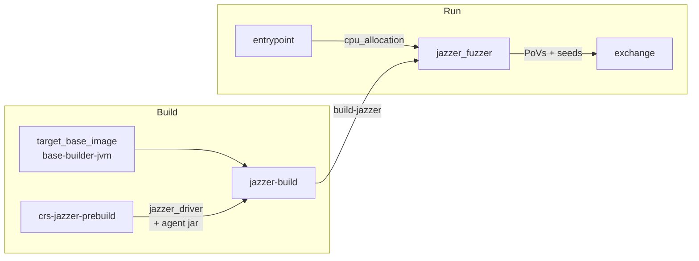

# crs-shellphish-jvm-fuzzers

Jazzer-based Java/JVM fuzzing pipeline.

Jazzer wraps libFuzzer for JVM targets, using a native driver (`jazzer_driver`) plus a Java agent (`jazzer_agent_deploy.jar`) for bytecode instrumentation. Shellphish's custom Jazzer fork (jazzer-aixcc) adds LOSAN sanitizers for Java-specific vulnerabilities (SQL injection, deserialization, path traversal, etc.).

## Architecture



## Data Flow

### Build Outputs

| Build Step | Output Name | Content |
|-----------|-------------|---------|
| jazzer-build | `build-jazzer` | Harness scripts, project JARs, jazzer_driver (→ wrapper.py), agent jar, Nautilus |

### Shared Directory (`SHARED_DIR`)

| Path | Writer | Reader | Purpose |
|------|--------|--------|---------|
| `cpu_allocation` | entrypoint | jazzer_fuzzer | `LIBFUZZER_CPUS=5,6,7` |
| `fuzzer_sync/{project}-{harness}-0/` | Jazzer | (external) | Corpus + crashes |

### External I/O (via libCRS)

| Direction | Mechanism | Content |
|-----------|-----------|---------|
| PoV out | `libCRS register-submit-dir pov /tmp/jazzer_crashes/` | Crash inputs → EXCHANGE_DIR/povs/ |
| Seed out | background loop submits `jazzer-minimized/queue/*` | → EXCHANGE_DIR/seeds/ |
| Seed in | `libCRS register-fetch-dir seed` | From other CRS → `sync-oss-crs-external/queue/` |

## How Jazzer Fuzzing Works

### Build Phase: wrapper.py Symlink Setup

1. `compile_shellphish_jazzer` compiles the Java target via oss-fuzz `compile` script
2. Build output contains harness **bash scripts** (e.g., `OssFuzz1`) that invoke `jazzer_driver --target_class=OssFuzz1 --cp=... --agent_path=...`
3. Glue replaces `jazzer_driver` with symlink to `wrapper.py`, saves original as `jazzer_driver.orig`
4. Original jazzer_driver copied to `$OUT/shellphish/jazzer-aixcc/jazzer-build/jazzer_driver` (wrapper.py reads via `LOSAN_JAZZER_DRIVER`)
5. **Harness scripts are NOT replaced** (unlike C/libfuzzer where harness binaries are replaced)

### Run Phase: Call Chain

```
run_jazzer.sh
  → exec $OUT/OssFuzz1 -fork=N           (harness bash script)
    → $OUT/jazzer_driver --target_class=OssFuzz1 --cp=... --agent_path=... -fork=N
      → wrapper.py (symlinked as jazzer_driver)
        → builds fuzz args (crash dir, dict, corpus dirs, etc.)
        → calls real jazzer_driver at $OUT/shellphish/.../jazzer_driver
          → JVM fuzzing with Jazzer agent instrumentation
```

### Key Difference from C/LibFuzzer

| Aspect | C/LibFuzzer | Java/Jazzer |
|--------|------------|-------------|
| Harness | Binary (replaced by wrapper.py) | Bash script (NOT replaced) |
| wrapper.py receives | CLI args from run script | `--target_class`, `--cp`, `--agent_path` from harness script |
| Real fuzzer binary | `harness.instrumented` | `$OUT/shellphish/.../jazzer_driver` |
| Env var prefix | `ARTIPHISHELL_LIBFUZZER_*` | `ARTIPHISHELL_JAZZER_*` |

## CPU Allocation

`CRS_PIPELINE_MODE=jvm-fuzzers` — all available cores go to Jazzer (LibFuzzer) with `fork=N`. No AFL++ in Java pipeline.

| Component | Cores (6 available) |
|-----------|-------------------|
| Jazzer | 2,3,4,5,6,7 (fork=6) |

## Prebuild

`crs-jazzer-prebuild` is built via `docker-bake.hcl`. Contains:
- `jazzer_driver` (C++ native driver, built with Bazel from jazzer-aixcc + patched libfuzzer)
- `jazzer_agent_deploy.jar` (Java bytecode instrumentation agent)
- `librevolver_mutator.so` + `watchtower` (Nautilus grammar mutator)

Build takes ~30 min (Bazel + Rust compilation). Target-independent — built once, shared across all Java targets.

## Configuration

```bash
cp oss-crs/crs-jvm-fuzzers.yaml oss-crs/crs.yaml
cd /project/oss-crs
uv run oss-crs run --compose-file example/crs-shellphish-jvm-fuzzers/compose.yaml \
  --fuzz-proj-path /project/oss-fuzz/projects/aixcc/jvm/<target> \
  --target-source-path /project/testing-targets/<source> \
  --target-harness <harness_name> --timeout 1800
```

### Test Targets

| Target | Source | Harness |
|--------|--------|---------|
| `sanity-mock-java-delta-01` | `sanity-mock-java` | `OssFuzz1` |
| `atlanta-imaging-delta-01` | `atlanta-imaging` | `ImagingOne` |
| `atlanta-activemq-delta-01` | `atlanta-activemq` | `ActivemqOne` |

## Verification

| Check | Evidence | Expected |
|-------|----------|----------|
| Containers | `docker ps \| grep jvm-fuzzers` | 2 (entrypoint + jazzer_fuzzer) + exchange |
| CPU allocation | entrypoint: `LIBFUZZER_CPUS=` | 3 cores for Jazzer |
| Jazzer fuzzing | log: `exec/s:` + `job:` | Jobs incrementing, exec/s > 0 |
| target_class | log: `--target_class=OssFuzz1` | Correct class name |
| agent_path | log: `--agent_path=` | Points to jazzer_agent_deploy.jar |
| Crash files | `/tmp/jazzer_crashes/` | Non-empty files with content |
| PoVs submitted | EXCHANGE_DIR/povs/ | Non-empty on mock target |
| Seed sharing | `jazzer-minimized/queue/` | Present (may be empty for short runs) |

### Verified Results (2026-04-01)

| Target | Containers | Fuzzing | Crashes | PoVs | exec/s |
|--------|-----------|---------|---------|------|--------|
| sanity-mock-java | 2+1 | ✅ fork=3 | 3 (9-10 bytes) | 3 | ~18k |
| atlanta-imaging | 2+1 | ✅ fork=3 | 1 | 1 | ~13k |
| atlanta-activemq | 2+1 | ✅ fork=3 | 238 | 195 | ~5k |
| sanity-mock-java (post-QuickSeed) | 2+1 | ✅ fork=6 | — | — | — (jvm-fuzzers mode, 300s timeout) |

## Sanitizer Settings

LeakSanitizer disabled (`detect_leaks=0`), same as C pipelines.

## Known Limitations

- `cov: 0 ft: 0` in fork mode stats — Java coverage is tracked by Jazzer agent internally, not reflected in libFuzzer's native coverage counters
- `jvm-fuzzers` mode gives all cores to Jazzer; `AFLPP_CPUS` is empty
- Seed sharing requires `jazzer-minimized/queue/` to be populated by wrapper.py's merge process
