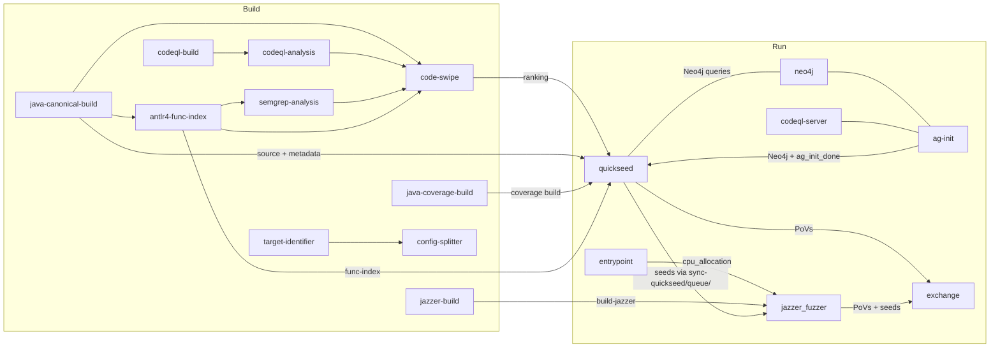

# crs-shellphish-quickseed

LLM-driven seed generation for Java/JVM targets + Jazzer fuzzing.

QuickSeed analyzes code paths via static analysis (CodeQL sinks, code-swipe rankings, ANTLR4 function index), builds call graphs from harness entry points to vulnerability sinks, then uses LLM agents to generate seeds that traverse those paths. Seeds are delivered to Jazzer via `sync-quickseed/queue/` and crashes are submitted directly as PoVs.

## Architecture



## Data Flow

### Build Outputs → Run Consumers

| Build Output | Consumers | Content |
|-------------|-----------|---------|
| `build-canonical` | quickseed, code-swipe | Java source (.shellphish_src), harness scripts, metadata |
| `build-coverage` | quickseed | JaCoCo-instrumented Java build |
| `build-jazzer` | jazzer_fuzzer | Jazzer harness scripts + driver |
| `func-index` | quickseed, code-swipe, semgrep | ANTLR4 function JSONs (METHOD/) + indices.json |
| `code-swipe-ranking` | quickseed | POI functions ranked by vulnerability |
| `codeql-analysis` | codeql-server, quickseed | CWE report + CodeQL DB zip |
| `augmented-metadata` | quickseed | Project metadata |
| `split-metadata` | quickseed | Harness metadata |

### Shared Directory (`SHARED_DIR`)

| Path | Writer | Reader | Purpose |
|------|--------|--------|---------|
| `cpu_allocation` | entrypoint | jazzer_fuzzer | `LIBFUZZER_CPUS=...` |
| `ag_init_done` | ag-init | quickseed | Signal: Neo4j callgraph ready |
| `fuzzer_sync/{project}-{harness}-0/sync-quickseed/queue/` | quickseed | jazzer_fuzzer | LLM-generated seeds |

### QuickSeed → Jazzer Seed Flow

```
QuickSeed LLM analysis → call graph path selection → seed generation →
    PostProcessor validates seed against coverage build →
    valid seed → /shared/fuzzer_sync/{name}/sync-quickseed/queue/
              → Jazzer wrapper.py picks up via -reload
    crash found → CRASH_DIR → libCRS register-submit-dir pov
```

## CPU Allocation

`CRS_PIPELINE_MODE=quickseed` — most cores to Jazzer, 1-2 shared (QuickSeed + neo4j + codeql-server are I/O/LLM bound).

| Component | Cores (6 available) |
|-----------|-------------------|
| Jazzer | 2,3,4,5 (fork=4) |
| Shared (QuickSeed + infra) | 6,7 |

## Build Phase Details

### Java Canonical Build (`java-canonical-build`)

Reuses Jazzer `Dockerfile.builder` with `compile_jazzer_dispatch` → `compile_canonical_build_java`:
- Compiles Java target with Jazzer
- Preserves source: `cp -r /src /out/.shellphish_src`
- Generates `shellphish_build_metadata.yaml` (harnesses, project info)
- Packages as canonical layout: `artifacts/out/`, `project.yaml`, `Dockerfile`, `build.sh`

### Java Coverage Build (`java-coverage-build`)

Uses `coverage_fast/Dockerfile.builder.jvm`:
- Compiles with `compile-java` script (delegates to `compile.old`)
- Coverage instrumentation via JaCoCo (Jazzer's native Java coverage)
- Output: coverage-instrumented harnesses for QuickSeed's PostProcessor

### ANTLR4 Function Index (`antlr4-func-index`)

Replaces C pipeline's clang-indexer + func-index-gen:
- `run-java-bottom-up.py --mode full` parses Java source via ANTLR4 AST
- Extracts methods with signatures, annotations, class hierarchy
- Output: `METHOD/*.json` (one JSON per method, keyed by SHA256 hash)
- Then runs `indexer.py` to produce `indices.json` (function index)

### Language-Aware Shared Steps

Semgrep, CodeQL analysis, and code-swipe detect `FUZZING_LANGUAGE=jvm` and switch data sources:

| Step | C/C++ Source | Java Source |
|------|-------------|-------------|
| semgrep | `clang-index/src` | `build-canonical/.shellphish_src` |
| codeql-analysis | `clang-index/full` (func JSONs) | `func-index` (antlr4 JSONs) |
| code-swipe | `clang-index/full` (--index-dir-json) | `func-index` (antlr4 JSONs) |

## QuickSeed Run Flow

1. Downloads 8 build outputs (canonical, coverage, func-index, code-swipe, codeql, metadata)
2. Constructs OSSFuzzProject layout for debug/coverage builds
3. Creates `/shared` symlink to `$OSS_CRS_SHARED_DIR`
4. Prepares aggregated harness info from split metadata
5. Waits for ag-init (Neo4j callgraph data, up to 300s)
6. Launches `run_quickseed.sh` which:
   - Queries Neo4j for call paths from harness to CodeSwipe-ranked sinks
   - PreProcessor: LLM (gpt-4.1) analyzes call graphs, selects top paths
   - Initializer: submits seed generation tasks to Scheduler
   - PostProcessor: validates seeds against coverage build, distributes to fuzzer_sync
7. Crash seeds → `/tmp/quickseed-crashes/` → `libCRS register-submit-dir pov`
8. `exec sleep infinity` (oss-crs abort-on-container-exit)

### LLM Model Mapping

Shellphish code uses internal model names. Mapped in Dockerfile via `find ... -exec sed`:
- `claude-4-sonnet` → `claude-sonnet-4-6`
- `gpt-o4-mini` → `o4-mini`, `gpt-o3-mini` → `o3-mini`
- `oai-` prefix stripped globally (agentlib adds `oai-` at runtime when `USE_LLM_API=1`, but external litellm doesn't recognize it)
- `gpt-4.1` used for warmup (PreProcessor) — kept as-is, litellm routes it
- `QUICKSEED_LLM_MODEL` env var overrides available models for main generation

## Configuration

```bash
cp oss-crs/crs-quickseed.yaml oss-crs/crs.yaml
cd /project/oss-crs
export AIXCC_LITELLM_HOSTNAME=<litellm-url>
export LITELLM_KEY=<api-key>
uv run oss-crs run --compose-file example/crs-shellphish-quickseed/compose.yaml \
  --fuzz-proj-path /project/oss-fuzz/projects/aixcc/jvm/<target> \
  --target-source-path /project/testing-targets/<source> \
  --target-harness <harness> --timeout 1800
```

### Test Targets

| Target | Source | Harness |
|--------|--------|---------|
| `sanity-mock-java-delta-01` | `sanity-mock-java` | `OssFuzz1` |
| `atlanta-imaging-delta-01` | `atlanta-imaging` | `ImagingOne` |
| `atlanta-activemq-delta-01` | `atlanta-activemq` | `ActivemqOne` |

## Verification

### Build Phase Checks

| Check | Evidence | Expected |
|-------|----------|----------|
| Canonical build | `build-canonical` output | `artifacts/out/`, `shellphish_build_metadata.yaml`, `.shellphish_src/` |
| Coverage build | `build-coverage` output | JaCoCo-instrumented harnesses |
| ANTLR4 indexing | `func-index` output | `METHOD/` dir with JSON files, `indices.json` |
| CodeQL analysis | `codeql-analysis` output | `codeql-cwe-report.json`, DB zip |
| Semgrep (Java) | `semgrep-report` output | `vulnerable_functions.json` |
| Code-swipe | `code-swipe-ranking` output | `ranking.yaml` with ranked functions |

### Run Phase Checks

| Check | Evidence | Expected |
|-------|----------|----------|
| Containers | `docker ps \| grep quickseed` | 6+ (entrypoint, jazzer, quickseed, neo4j, codeql-server, ag-init) + exchange |
| CPU allocation | entrypoint: `Mode: quickseed` | Most cores to Jazzer, 1-2 shared |
| AG init | `ag_init_done` in SHARED_DIR | File exists |
| Neo4j | quickseed log: `Neo4j connected` | Connection successful |
| QuickSeed LLM | log: `Inferencing` or model names | LLM calls happening |
| Seeds generated | `sync-quickseed/queue/` in fuzzer_sync | Non-empty files |
| Jazzer picks up seeds | wrapper.py log: `sync-quickseed` | Seeds added to reload list |
| Crashes/PoVs | EXCHANGE_DIR/povs/ | Non-empty on vulnerable targets |
| Jazzer fuzzing | Jazzer log: `exec/s:` | Active, exec/s > 0 |

### Verified Results (2026-04-01, sanity-mock-java-delta-01)

| Phase | Result | Details |
|-------|--------|---------|
| Build: 12 steps | ✅ All pass | canonical, coverage, jazzer, codeql, antlr4, semgrep, codeql-analysis, code-swipe |
| Run: 6 containers | ✅ All stable | entrypoint, jazzer, quickseed, neo4j, codeql-server, ag-init (all running until timeout) |
| Jazzer fuzzing | ✅ ~9-11k exec/s | fork=4, correct target_class=OssFuzz1 |
| QuickSeed LLM | ✅ gpt-4.1 + claude-sonnet-4-6 | Harness analysis → seed script generation → 10 seeds produced |
| Seeds to Jazzer | ✅ 10 seeds | `sync-quickseed/queue/` populated, Jazzer reads via `-reload` |
| PoVs submitted | ✅ 6 PoVs | Crash inputs in `SUBMIT_DIR/povs/` |
| JVM fuzzers regression | ✅ | `compile_jazzer_dispatch` backward-compatible, `jvm-fuzzers` mode gives all 6 cores to Jazzer (fork=6) |

### Real-world Results (2026-04-02)

| Target | Build | Containers | Jazzer | Seeds | PoVs | exec/s |
|--------|-------|-----------|--------|-------|------|--------|
| atlanta-imaging | ✅ 12/12 | ✅ 6 stable | ✅ fork=4 | 20 | 13 | ~5k |
| atlanta-activemq | ✅ 12/12 | ✅ 6 stable | ✅ fork=4 | 28 | 1716 | ~1.8k |

## Known Limitations

- Coverage validation uses JaCoCo, not LLVM profdata — different from C pipeline
- `AFLPP_CPUS` empty (no AFL++ in Java pipeline)
- ANTLR4 function index may miss generated code (build-time codegen) — only parses static `.java` files
- QuickSeed's PostProcessor seed validation requires the coverage build to be functional
- `/shared/quickseed/` temp directory grows during long runs
- CodeQL analysis produces generic CWE report, not Jazzer-specific sink analysis — QuickSeed may get fewer call graph paths
- activemq build phase takes ~25 min (12 steps); use `--timeout 3600` for large targets
- oss-crs empty BUILD_OUT_DIR bug (pitfall #22): if run phase fails with rsync errors, delete empty build dirs and retry
