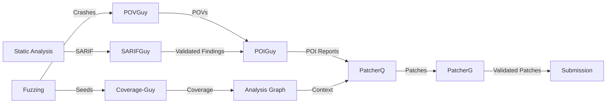

# Shellphish AIxCC CRS Documentation

This is comprehensive technical documentation for the **Shellphish team's CRS (Cybersecurity Reasoning System)** implementation for the DARPA AIxCC (Artificial Intelligence Cyber Challenge).

## Overview

The CRS is a fully automated system that combines static analysis, dynamic fuzzing, LLM-based reasoning, and automated patch generation to discover and fix security vulnerabilities in real-world software projects.

## System Architecture

The CRS consists of three main layers:

### 1. Bug Finding Pipeline

The bug finding pipeline discovers potential vulnerabilities through multiple complementary techniques:

- **Static Analysis**: CodeQL, Semgrep, CodeChecker analyze source code for common vulnerability patterns
- **Fuzzing**: AFL++, libFuzzer, Jazzer, Snapchange generate test inputs to trigger crashes
- **Grammar-Based Input Generation**: Grammar-Guy, ANTLR4-Guy construct domain-specific inputs
- **Coverage Monitoring**: Coverage-Guy tracks which functions are reached by fuzzer inputs
- **Crash Analysis**: Crash-Tracer, DyVA, AIJON analyze crashes to determine exploitability
- **POV Generation**: POIGuy and POVGuy generate proof-of-vulnerability exploits

### 2. Patch Generation Pipeline

Once vulnerabilities are confirmed, the patch generation pipeline creates and validates fixes:

- **PatcherQ**: Claude-based multi-mode patching with context from Analysis Graph
- **PatcherG**: Scores patches and submits to competition infrastructure
- **PatcherY**: Regression testing to prevent broken patches
- **PatcherX**: Alternative patch generation strategies
- **Patch Validation**: Ensures patches fix the vulnerability without breaking functionality

### 3. Infrastructure Layer

The infrastructure provides orchestration, storage, and coordination:

- **PyDataTask**: Task orchestration framework managing distributed job scheduling
- **Analysis Graph**: Neo4j-based knowledge graph tracking coverage, POVs, and patches
- **Repository System**: Abstracted storage (S3, MongoDB, filesystem) for intermediate results
- **Kubernetes Scheduling**: Distributed execution with resource quotas and priority-based scheduling

## Data Flow

## Key Technologies

- **LLM Integration**: Claude 3.5 Sonnet, Claude 4 Opus for vulnerability analysis and patch generation
- **Fuzzing Engines**: AFL++, libFuzzer, Jazzer, Snapchange for input generation
- **Static Analysis**: CodeQL, Semgrep, CodeChecker for vulnerability detection
- **Orchestration**: PyDataTask with Kubernetes for distributed execution
- **Knowledge Graph**: Neo4j Analysis Graph for relationship tracking
- **Storage**: S3, MongoDB, filesystem for intermediate results

## Documentation Structure

This documentation is organized into the following sections:

1. **[Architecture Overview](./arch.md)** - High-level system design and component relationships
2. **[Bug Finding](./bug-finding.md)** - Vulnerability discovery pipeline
3. **[Patch Generation](./patch-generation.md)** - Automated patch creation and validation
4. **[SARIF Processing](./sarif-processing.md)** - Static analysis triage with SARIFGuy
5. **[Infrastructure](./infrastructure.md)** - Orchestration and data management

## Documentation Conventions

- **Component Files**: Each component has detailed implementation documentation
- **Code References**: Full GitHub URLs with line numbers for traceability
- **Mermaid Diagrams**: Visual representation of architectures and workflows
- **Cross-References**: Links between related components
- **Implementation Details**: Well-known tools focus on CRS integration; in-house components provide full implementation details

## Navigation

Use the sidebar to navigate between sections. Each major category expands to show individual component documentation with detailed implementation notes, code examples, and integration patterns.
