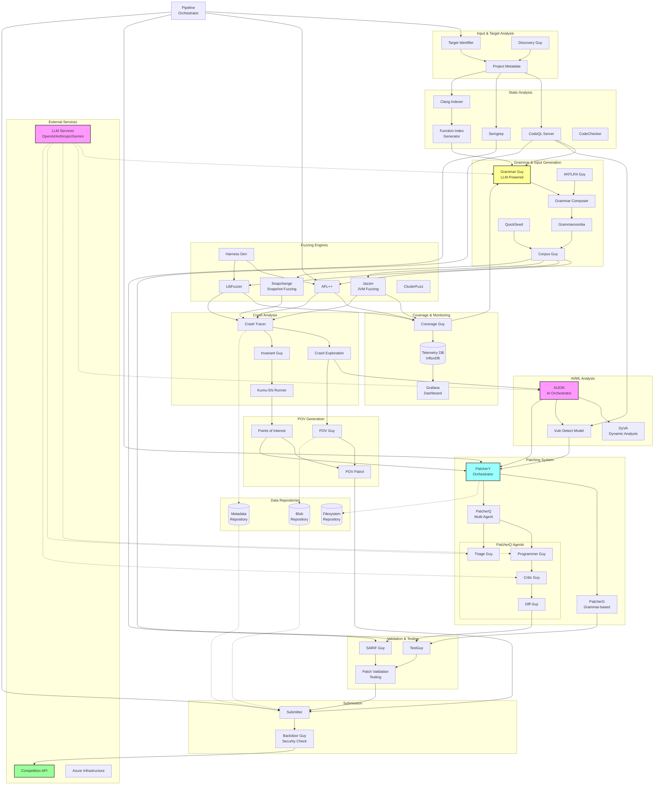

# ARTIPHISHELL CRS Architecture Diagram

## Architecture Overview

### Data Flow Description

1. **Target Analysis Phase**
   - Target Identifier and Discovery Guy analyze the target application
   - Project metadata is generated and stored
   - Static analysis tools (CodeQL, Semgrep, Clang) create code intelligence

2. **Grammar Generation Phase**
   - Grammar Guy uses LLMs and coverage feedback to generate input grammars
   - Grammar Composer combines multiple grammar sources
   - Corpus Guy manages seed inputs for fuzzing

3. **Fuzzing Phase**
   - Multiple fuzzing engines (AFL++, LibFuzzer, Jazzer, Snapchange) run in parallel
   - Coverage Guy tracks code coverage and feeds back to Grammar Guy
   - Telemetry is collected in InfluxDB and visualized in Grafana

4. **Crash Analysis Phase**
   - Crash Tracer analyzes execution paths leading to crashes
   - Invariant Guy extracts program invariants
   - Kumu-Shi Runner performs root cause analysis

5. **AI Analysis Phase**
   - AIJON orchestrates AI-based analysis
   - DyVA performs dynamic vulnerability analysis
   - Vulnerability detection models classify and prioritize findings

6. **POV Generation Phase**
   - POV Guy generates proof-of-vulnerability exploits
   - Points of Interest are identified for patching
   - POV Patrol validates and manages submissions

7. **Patching Phase**
   - PatcherY orchestrates multiple patching strategies
   - PatcherQ uses multi-agent LLM approach (Programmer, Triage, Critic, Diff agents)
   - PatcherG applies grammar-based transformations

8. **Validation Phase**
   - TestGuy runs comprehensive tests on patches
   - SARIF Guy processes static analysis results
   - Patch validation ensures functionality preservation

9. **Submission Phase**
   - Submitter handles API interactions
   - Backdoor Guy performs security checks
   - Validated patches and POVs are submitted to Competition API

### Key Interactions

- **LLM Integration**: Dotted lines show LLM API calls for intelligent decision-making
- **Coverage Feedback Loop**: Coverage data flows back to Grammar Guy for refinement
- **Repository Layer**: All components interact with centralized data repositories
- **Pipeline Orchestration**: Central pipeline controller manages task scheduling and dependencies

### Component Categories

- **Pink**: AI/LLM-powered components
- **Yellow**: Grammar and input generation
- **Cyan**: Patching and remediation
- **Green**: External APIs and submission
- **White**: Traditional analysis and fuzzing tools
