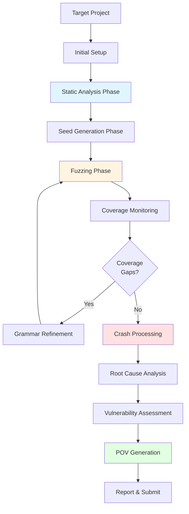

# Bug Finding

The Shellphish AIxCC CRS employs a comprehensive, multi-layered approach to bug finding that combines static analysis, dynamic testing, AI-powered detection, and automated exploit generation. This coordinated pipeline maximizes vulnerability discovery through complementary techniques.

## Bug Finding Workflow

The bug finding process follows a structured workflow that builds upon each phase:

### Phase 1: Initial Setup

**Components**: Clang Indexer, Function Index Generator

The pipeline begins by building comprehensive metadata about the target codebase:
- Parse and index all functions, their signatures, locations, and AST structure
- Generate compile commands and link commands for reproducible builds
- Create searchable indices for fast function lookup
- Support delta mode to identify changed functions between commits

**Output**: Function metadata, compile_commands.json, function indices

### Phase 2: Static Analysis

**Components**: CodeQL, Semgrep, CodeChecker, Scanguy

Multiple static analysis tools scan the codebase to identify potential vulnerabilities before any dynamic testing:
- **CodeQL**: Semantic analysis using dataflow/control flow queries, CWE detection
- **Semgrep**: Fast pattern-based scanning for common vulnerability patterns
- **CodeChecker**: Clang Static Analyzer integration for memory safety issues
- **Scanguy**: LLM-powered analysis for intelligent vulnerability detection

Static analysis identifies:
- Locations of interest (suspicious code areas)
- Functions of interest (potentially vulnerable functions)
- Known vulnerability patterns (CWEs)
- AI-predicted vulnerabilities

**Output**: SARIF reports, locations/functions of interest, vulnerability candidates

### Phase 3: Seed Generation

**Components**: Corpus-Guy, Quickseed, Grammar-Guy, Grammar-Composer

Using insights from static analysis, the system generates intelligent seeds and grammars:
- Infer input file formats using trace analysis and LLMs
- Extract fuzzing dictionaries from CodeQL analysis
- Generate seeds using taint analysis to reach specific code paths
- Create initial grammars for structured input generation
- Compose grammars from multiple sources

**Output**: Seed corpus, fuzzing dictionaries, initial grammars

### Phase 4: Fuzzing

**Components**: AFL++, libFuzzer, Jazzer, Snapchange, AFLRun, ClusterFuzz

Multiple fuzzing engines run in parallel with different strategies:
- **AFL++**: Coverage-guided mutation fuzzing with grammar support (Nautilus)
- **libFuzzer**: In-process fuzzing for C/C++ with high performance
- **Jazzer**: Coverage-guided fuzzing for Java applications
- **Snapchange**: Snapshot-based fuzzing using KVM hypervisor
- **AFLRun**: Targeted fuzzing focused on locations of interest
- **ClusterFuzz**: Long-running distributed fuzzing campaigns

Fuzzing features:
- Grammar-guided mutation for structured inputs
- CMPLOG mode for comparison-guided fuzzing
- Cross-node corpus synchronization
- Multiple fuzzer replicas per target
- Continuous corpus minimization and merging

**Output**: Crashing inputs, expanded corpus, coverage data

### Phase 5: Coverage Monitoring

**Components**: Coverage-Guy, Peek-a-Boo

Real-time monitoring tracks fuzzing effectiveness:
- Monitor which code paths have been exercised
- Identify coverage gaps and unreached code areas
- Track coverage growth over time
- Provide feedback for grammar refinement

**Output**: Coverage reports, reachability information

### Phase 6: Grammar Refinement

**Components**: Grammar-Guy, Grammaroomba

Using coverage feedback, grammars are refined to reach uncovered code:
- Coverage-guided grammar generation targeting specific functions
- Grammar optimization to remove low-value rules
- Multiple modes: general, targeted-agent, targeted-explorer, targeted-reproducer
- Support for both Nautilus and Grammarinator formats

This creates a feedback loop: Fuzzing → Coverage Monitoring → Grammar Refinement → Fuzzing

**Output**: Refined grammars, optimized grammars

### Phase 7: Crash Processing

**Components**: Crash-Tracer, Crash Exploration

When crashes are discovered, they're immediately processed:
- Parse AddressSanitizer (ASAN) crash reports
- Extract crash type, stack traces, memory information
- Explore crash neighborhoods using AFL++ crash exploration mode
- Find crash variants and related bugs
- Deduplicate crashes by root cause

**Output**: Parsed crash reports, crash variants, representative crashes

### Phase 8: Root Cause Analysis

**Components**: Kumu-Shi-Runner, Invariant-Guy, DyVA

Deep analysis determines the root cause of each crash:
- Use CodeQL databases for semantic understanding
- Extract program invariants and detect violations
- Perform dynamic vulnerability analysis
- Identify specific code locations responsible for crashes
- Generate Point of Interest (POI) reports

**Output**: POI reports with crash locations and context, invariant violations

### Phase 9: Vulnerability Assessment

**Components**: Vuln Detect Model, AIJON, ANTLR4-Guy

AI-powered analysis prioritizes and assesses vulnerabilities:
- ML models classify vulnerable code patterns
- LLM-based vulnerability assessment
- Diff-based ranking comparing with known vulnerability patches
- Exploitability assessment
- Priority scoring for patching

**Output**: Vulnerability classifications, priority rankings, exploitability scores

### Phase 10: POV Generation

**Components**: POIGuy, POVGuy, POV-Patrol

Generate proof-of-vulnerability exploits to demonstrate impact:
- Identify exact vulnerable code locations (POIs)
- Attempt to create working exploits from crashing inputs
- Build debug versions for deeper analysis
- Validate POVs actually work
- Verify patches don't break POV reproduction

**Output**: POV scripts/inputs, POI reports, validation results

### Phase 11: Report Aggregation

**Components**: Sarifguy

All findings are consolidated into standardized reports:
- Process and enrich SARIF reports from all analysis tools
- Add function metadata and source locations
- Create comprehensive vulnerability reports
- Track analysis status and retries

**Output**: Enriched SARIF reports, consolidated findings

## Key Design Principles

### Multi-Layered Defense
The system uses multiple complementary techniques rather than relying on a single approach. Static analysis finds patterns, fuzzing discovers runtime bugs, and AI provides intelligent guidance.

### Feedback Loops
Coverage data flows back to grammar generation, creating adaptive fuzzing that targets uncovered code. Crash analysis informs targeted fuzzing campaigns.

### Parallelization
Multiple fuzzing engines, multiple replicas, cross-node synchronization, and distributed analysis maximize throughput.

### AI Integration
LLMs and ML models are strategically integrated for:
- Input format inference
- Grammar generation
- Vulnerability detection
- Code annotation (IJON)
- Exploit generation

### Standardization
Components communicate through standard formats (SARIF, JSON schemas) and shared repositories, enabling composability and replaceability.

## Component Categories

The bug finding components are organized into seven categories:

1. **[Static Analysis](./bug-finding/static-analysis.md)** - Pre-fuzzing vulnerability detection
2. **[Fuzzing Engines](./bug-finding/fuzzing.md)** - Dynamic bug discovery
3. **[Grammar & Input Generation](./bug-finding/grammar.md)** - Intelligent input synthesis
4. **[Coverage & Monitoring](./bug-finding/coverage.md)** - Effectiveness tracking
5. **[Crash Analysis](./bug-finding/crash-analysis.md)** - Crash processing and deduplication
6. **[Vulnerability Detection](./bug-finding/vuln-detection.md)** - AI-powered assessment
7. **[POV Generation](./bug-finding/pov-generation.md)** - Exploit creation and validation

Each category contains multiple specialized components that work together to maximize vulnerability discovery.
