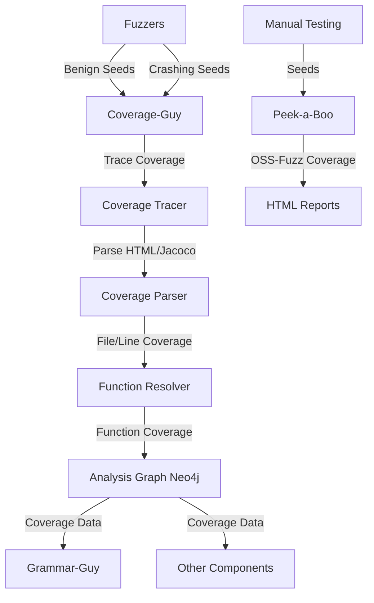

# Coverage & Monitoring

The CRS uses **real-time dynamic coverage tracking** to monitor fuzzing progress, identify new code coverage, and guide both fuzzing and grammar generation. Coverage data is collected for every seed execution and stored in the **analysis graph** (Neo4j) with function-level granularity.

## Purpose

- Real-time coverage tracking for fuzzing campaigns
- Identify newly-covered files and functions
- Store seed-to-coverage mappings in analysis graph
- Enable coverage-guided refinement for grammars
- Monitor fuzzing progress and effectiveness
- Support manual coverage analysis and reporting

## Architecture



## Components

### Coverage-Guy

**In-house real-time coverage monitoring system** that:
- Streams seeds from fuzzer outputs via PDT repositories
- Traces coverage using instrumented binaries
- Resolves file/line coverage to function coverage
- Uploads coverage data to Neo4j analysis graph
- Tracks newly-covered files and functions
- Supports C/C++ (LLVM) and Java (Jacoco) coverage

[Details: Coverage-Guy](./coverage/coverage-guy.md)

### Peek-a-Boo

**Manual coverage analysis tool** that:
- Wraps OSS-Fuzz coverage infrastructure
- Generates HTML coverage reports
- Supports both OSS-Fuzz and Artiphishell corpuses
- Used for manual testing and validation
- Not part of automated pipeline

[Details: Peek-a-Boo](./coverage/peek-a-boo.md)

## Coverage Pipeline

### 1. Seed Generation
- AFL++, AFLRun, libFuzzer, Jazzer generate seeds
- Seeds written to PDT repositories (benign/crashing)
- Lock files ensure atomic writes

### 2. Coverage Tracing (Coverage-Guy)
- Monitors PDT repos for new seeds
- Runs seeds through instrumented harnesses
- Collects LLVM coverage HTML (C/C++) or Jacoco reports (Java)
- Parses coverage to extract file/line information

### 3. Function Resolution
- Maps file:line coverage to function signatures
- Uses LocalFunctionResolver or RemoteFunctionResolver
- Queries function indices from clang-indexer

### 4. Analysis Graph Upload
- Creates HarnessInputNode in Neo4j
- Links to CFGFunction nodes via `COVERS` relationships
- Stores seed bytes (hex) and metadata
- Tracks new coverage incrementally

### 5. Coverage Feedback
- Grammar-Guy queries coverage data
- Identifies under-covered functions
- Refines grammars to target specific code
- Grammar-Guy iterates based on coverage gaps

## Key Features

### Real-Time Monitoring
- Continuous streaming of seeds from fuzzers
- Sub-second latency from seed generation to coverage upload
- Parallel processing (4 tracer + 4 uploader processes)
- Multiprocessing architecture for scalability

### Incremental Coverage Tracking
```python
# Track only new coverage (monitor_fast.py Lines 386-407)
new_hit_files = all_covered_files.difference(set(shared_state.seen_files.keys()))
shared_state.seen_files.update({f: True for f in new_hit_files})

for function_key, lines in function_coverage.items():
    for l in lines:
        if l.count_covered and l.count_covered > 0:
            if function_key not in shared_state.seen_functions:
                shared_state.seen_functions[function_key] = True
                per_seed_new_hit_funcs.add(function_key)
```

### Language-Specific Parsing
- **C/C++**: LLVM coverage HTML (`llvm-cov show -format=html`)
- **Java**: Jacoco XML reports
- Different timeout thresholds (20s for C, 60s for Java)

### Deduplication
- Seeds are MD5-hashed to avoid reprocessing
- Query analysis graph for already-traced seeds
- In-memory tracking of seen seeds (shared dict)

## Integration Points

### Upstream Dependencies

**Fuzzers** ([pipeline_trace.yaml Lines 107-129](https://github.com/sslab-gatech/shellphish-afc-crs/blob/main/components/coverage-guy/pipeline_trace.yaml#L107-L129)):
- Benign inputs: `benign_harness_inputs` PDT repository
- Crashing inputs: `crashing_harness_inputs` PDT repository
- Streaming input via PDTRepoMonitor

**Function Indices** ([Lines 99-106](https://github.com/sslab-gatech/shellphish-afc-crs/blob/main/components/coverage-guy/pipeline_trace.yaml#L99-L106)):
- `full_functions_indices`: Function lookup table
- `full_functions_jsons_dirs`: Function metadata
- From clang-indexer

**Coverage Build Artifacts** ([Lines 69-76](https://github.com/sslab-gatech/shellphish-afc-crs/blob/main/components/coverage-guy/pipeline_trace.yaml#L69-L76)):
- Instrumented binaries with coverage support
- Separate builds from fuzzing binaries
- Per-node caching for performance

### Downstream Consumers

**Grammar-Guy**:
- Queries Neo4j for function coverage
- Identifies under-covered functions
- Refines grammars to increase coverage

**Analysis Graph API**:
- Provides coverage data to all components
- Enables coverage-based prioritization
- Supports coverage-guided POV generation

## Performance Characteristics

### Throughput
- **C/C++**: ~180 seeds/minute per tracer (20s timeout)
- **Java**: ~60 seeds/minute per tracer (60s timeout)
- 4 parallel tracers = ~720 seeds/min (C) or ~240 seeds/min (Java)

### Scalability
- Kubernetes deployment: 50 max concurrent jobs
- Dedicated node pool with taints/tolerations
- Node labels: `support.shellphish.net/allow-coverage: "true"`
- Per-node caching for build artifacts

### Resource Usage
- **CPU**: 4 cores per job
- **Memory**: 12Gi limit (4Gi request)
- **Disk**: `/shared/coverageguy` for temp directories
- **Cache**: `/pdt-per-node-cache` for artifacts

## Related Components

- **[Clang Indexer](../static-analysis/clang-indexer.md)**: Provides function indices
- **[Function Index Generator](../static-analysis/function-index-generator.md)**: Creates function lookup tables
- **[Grammar-Guy](../grammar/grammar-guy.md)**: Uses coverage for refinement
- **[Analysis Graph](../../infrastructure/analysis-graph.md)**: Stores coverage data
