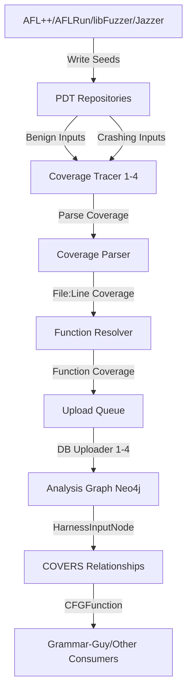

# Coverage-Guy

Coverage-Guy is the **in-house real-time dynamic coverage monitoring system** for the CRS. It continuously streams seeds from fuzzer outputs, traces their coverage using instrumented binaries, resolves file/line coverage to function-level granularity, and uploads the data to the Neo4j analysis graph. This enables coverage-guided refinement for grammar generation and provides visibility into fuzzing effectiveness.

## Purpose

- Real-time coverage tracing for all fuzzer-generated seeds
- Track incremental coverage (new files/functions)
- Store seed-to-function mappings in analysis graph
- Enable coverage-guided grammar refinement
- Support both C/C++ (LLVM) and Java (Jacoco) coverage
- Multiprocessing architecture for high throughput

## Architecture



## Implementation

**Main Files**:
- [`monitor_fast.py`](https://github.com/sslab-gatech/shellphish-afc-crs/blob/main/components/coverage-guy/monitor_fast.py) - Optimized multiprocessing implementation (4 tracers + 4 uploaders)
- [`monitor.py`](https://github.com/sslab-gatech/shellphish-afc-crs/blob/main/components/coverage-guy/monitor.py) - Original threading implementation
- [`pipeline_trace.yaml`](https://github.com/sslab-gatech/shellphish-afc-crs/blob/main/components/coverage-guy/pipeline_trace.yaml) - PDT task configuration

## Multiprocessing Architecture

### SharedState ([Lines 115-137](https://github.com/sslab-gatech/shellphish-afc-crs/blob/main/components/coverage-guy/monitor_fast.py#L115-L137))

**Shared Data Structures** (using `multiprocessing.Manager`):
```python
@dataclass
class SharedState:
    manager: mp.Manager
    project_id: str
    project_name: str
    project_language: LanguageEnum
    harness_info: HarnessInfo
    harness_id: str
    harness_name: str
    function_index: Path
    function_index_json_dir: Path
    config: Config
    benign_inputs_dir: Path
    benign_inputs_dir_lock: Path
    crashing_inputs_dir: Path
    crashing_inputs_dir_lock: Path

    def __post_init__(self):
        self.seen_files = self.manager.dict()          # Track covered files
        self.seen_functions = self.manager.dict()      # Track covered functions
        self.seeds_already_traced = self.manager.dict() # Deduplication
        self.upload_queue = self.manager.Queue()       # Jobs for uploaders
        self.lock = self.manager.Lock()                # Synchronization
        self.stop_event = self.manager.Event()         # Graceful shutdown
```

### Process Pool ([Lines 395-443](https://github.com/sslab-gatech/shellphish-afc-crs/blob/main/components/coverage-guy/monitor_fast.py#L395-L443))

**4 DBUploader Processes**:
```python
for uploader_id in range(shared_state.config.num_db_uploaders):
    uploader = DBUploader(uploader_id, shared_state)
    p = mp.Process(target=uploader.start)
    p.daemon = True
    p.start()
    uploader_processes.append(p)
```

**4 CovguyTracer Processes**:
```python
for covguy_id in range(shared_state.config.num_coverage_processors):
    # Create separate target directory for each tracer
    new_target_dir = Path(
        tempfile.mkdtemp(prefix=f"covguy_tracer_{covguy_id}_", dir="/shared/coverageguy")
    )
    subprocess.run(
        ["rsync", "-a", "--ignore-missing-args", args.target_dir+"/", new_target_dir],
        check=True, capture_output=True, text=True,
    )

    covguy_tracer = CovguyTracer(covguy_id, new_target_dir, shared_state)
    p = mp.Process(target=covguy_tracer.start)
    p.daemon = True
    p.start()
    tracer_processes.append(p)
```

**Total**: 8 parallel processes (4 tracers + 4 uploaders)

## Coverage Tracing Workflow

### 1. Seed Discovery ([Lines 252-279](https://github.com/sslab-gatech/shellphish-afc-crs/blob/main/components/coverage-guy/monitor_fast.py#L252-L279))

**PDT Repository Monitoring**:
```python
def fetch_from_repo(pdt_repo: PDTRepo, tracer: Tracer, shared_state: SharedState):
    # Find seeds that are fully written (not locked)
    ready_seed_names = set(os.listdir(pdt_repo.main_dir)) - set(os.listdir(pdt_repo.lock_dir))

    curr_workdir = list()
    for seed_name in ready_seed_names:
        if len(curr_workdir) >= shared_state.config.max_batch_size:  # 10 seeds
            break

        # Deduplication: skip if already traced
        with shared_state.lock:
            if seed_name in shared_state.seeds_already_traced:
                continue
            shared_state.seeds_already_traced[seed_name] = True

        seed_path = pdt_repo.get_content_paths(seed_name)["main_repo"]
        curr_workdir.append(seed_path)
```

### 2. Coverage Tracing ([Lines 280-291](https://github.com/sslab-gatech/shellphish-afc-crs/blob/main/components/coverage-guy/monitor_fast.py#L280-L291))

**Batch Execution**:
```python
# Trace up to 10 seeds in batch
file_coverage_maps: List[FileCoverageMap] = tracer.trace(*curr_workdir)

# Aggregate all covered files across seeds
all_covered_files = set()
for coverage_map in file_coverage_maps:
    all_covered_files = all_covered_files.union(set(coverage_map.keys()))

# Identify newly covered files
new_hit_files = all_covered_files.difference(set(shared_state.seen_files.keys()))

# Update global state
shared_state.seen_files.update({f: True for f in new_hit_files})
```

**FileCoverageMap Structure**:
```python
# Dict[file_path, List[LineCoverageInfo]]
{
    "/src/project/foo.c": [
        LineCoverageInfo(line=42, count_covered=5),
        LineCoverageInfo(line=43, count_covered=3),
        ...
    ],
    "/src/project/bar.c": [...]
}
```

### 3. Function Resolution ([Lines 293-308](https://github.com/sslab-gatech/shellphish-afc-crs/blob/main/components/coverage-guy/monitor_fast.py#L293-L308))

**Convert Line Coverage to Function Coverage**:
```python
for seed, coverage_map in zip(curr_workdir, file_coverage_maps):
    per_seed_new_hit_funcs = set()

    if shared_state.config.verbose_covguy:
        # Map file:line to function signatures
        function_coverage = self.function_resolver.get_function_coverage(coverage_map)

        for function_key, lines in function_coverage.items():
            for l in lines:
                if l.count_covered and l.count_covered > 0:
                    if function_key not in shared_state.seen_functions:
                        shared_state.seen_functions[function_key] = True
                        per_seed_new_hit_funcs.add(function_key)
                        logger.info(f"New function seen: {function_key}")
                        break  # Count function as covered if any line hit
```

**Function Key Format** (from Function Index Generator):
```
/src/hiredis/hiredis.c:142:5::int redisConnect(const char *ip, int port)
```

### 4. Upload Queue ([Lines 310-318](https://github.com/sslab-gatech/shellphish-afc-crs/blob/main/components/coverage-guy/monitor_fast.py#L310-L318))

**Enqueue Upload Job**:
```python
upload_job = UploadJob(
    seed_path=seed,
    is_crashing=is_crashing,
    coverage_map=coverage_map,
    new_functions_hit=list(per_seed_new_hit_funcs),
    new_file_hit=list(new_hit_files),
)
self.shared_state.upload_queue.put(upload_job)
```

**Queue Size Backpressure** ([Lines 199-204](https://github.com/sslab-gatech/shellphish-afc-crs/blob/main/components/coverage-guy/monitor_fast.py#L199-L204)):
```python
# Prevent OOM by throttling tracer if upload queue grows too large
queue_size = self.shared_state.upload_queue.qsize()
if queue_size > self.shared_state.config.max_upload_queue_size:  # 100
    logger.warning(f"Upload queue too large ({queue_size}), sleeping to prevent OOM")
    time.sleep(30)
    continue
```

### 5. Analysis Graph Upload ([Lines 204-229](https://github.com/sslab-gatech/shellphish-afc-crs/blob/main/components/coverage-guy/monitor_fast.py#L204-L229))

**DBUploader Process**:
```python
def start(self):
    while not self.shared_state.stop_event.is_set():
        time.sleep(1)
        try:
            # Non-blocking get with timeout
            upload_job = self.shared_state.upload_queue.get(timeout=1)
        except:
            continue

        seed_kind = "crashing" if upload_job.is_crashing else "benign"
        logger.info(f'Registering {seed_kind} seed: {upload_job.seed_path}')

        # Read seed bytes just before upload
        with open(upload_job.seed_path, "rb") as f:
            seed_bytes = f.read()

        # Upload to Neo4j
        register_harness_input_file_coverage(
            Path(upload_job.seed_path).name,
            self.shared_state.harness_id,
            self.shared_state.harness_info,
            seed_bytes,
            upload_job.is_crashing,
            function_resolver,
            upload_job.coverage_map,
        )
```

**Neo4j Graph Structure**:
```cypher
(:HarnessInputNode {content_hex: "deadbeef...", is_crashing: false})
  -[:COVERS]-> (:CFGFunction {signature: "/src/foo.c:42:5::int bar()"})
  -[:COVERS]-> (:CFGFunction {signature: "/src/baz.c:100:3::void qux()"})
```

## Configuration

### Language-Specific Settings ([Lines 92-111](https://github.com/sslab-gatech/shellphish-afc-crs/blob/main/components/coverage-guy/monitor_fast.py#L92-L111))

```python
class Config:
    def __init__(self, language: LanguageEnum):
        self.is_local_run: bool = os.getenv("LOCAL_RUN", "False").lower() in ["1", "true", "t", "yes", "y"]
        self.verbose_covguy: bool = False           # Disable in prod (slow)
        self.with_permanence: bool = False          # Libpermanence integration
        self.recover_tracer_crashes: bool = False
        self.max_batch_size: int = 10               # Seeds per trace batch
        self.num_db_uploaders: int = 4 if not self.is_local_run else 0
        self.num_coverage_processors: int = 4
        self.max_upload_queue_size: int = 100       # Backpressure threshold

        # Language-specific parser
        self.parser: dict = {
            LanguageEnum.c: C_LineCoverageParser_LLVMCovHTML,
            LanguageEnum.cpp: C_LineCoverageParser_LLVMCovHTML,
            LanguageEnum.jvm: Java_LineCoverageParser_Jacoco,
        }[language]()

        # Language-specific timeout
        self.timeout: dict = {
            LanguageEnum.c: 20,      # 20 seconds for C/C++
            LanguageEnum.cpp: 20,
            LanguageEnum.jvm: 60,    # 60 seconds for Java
        }[language]
```

### Function Resolver Selection ([Lines 149-159](https://github.com/sslab-gatech/shellphish-afc-crs/blob/main/components/coverage-guy/monitor_fast.py#L149-L159))

```python
def create_function_resolver(
    config: Config, project_name: str, project_id: str,
    function_index: Path, function_index_json_dir: Path
):
    if config.is_local_run:
        # Local testing: use function index files directly
        return LocalFunctionResolver(function_index, function_index_json_dir)
    else:
        # Production: query remote API
        return RemoteFunctionResolver(project_name, project_id)
```

## Deduplication Strategy

### Preload Existing Coverage ([Lines 339-347](https://github.com/sslab-gatech/shellphish-afc-crs/blob/main/components/coverage-guy/monitor_fast.py#L339-L347))

**Query Analysis Graph on Startup**:
```python
# Fetch all seeds that already have coverage in Neo4j
analysis_graph_api = AnalysisGraphAPI()
md5_of_all_seeds_with_coverage = analysis_graph_api.get_all_covered_inputs()

logger.info(f'👀 There are {len(md5_of_all_seeds_with_coverage)} seeds already covered')

# Preload into shared state
for md5_hash in md5_of_all_seeds_with_coverage:
    shared_state.seeds_already_traced[md5_hash] = True
```

**Cypher Query** ([Lines 71-90](https://github.com/sslab-gatech/shellphish-afc-crs/blob/main/components/coverage-guy/monitor_fast.py#L71-L90)):
```python
def get_all_covered_inputs(self):
    query = """
    MATCH (input:HarnessInputNode)-[:COVERS]->(f:CFGFunction)
    RETURN input.content_hex
    """
    all_md5_hashes = []
    results, columns = self.run_cypher_query(query=query, resolve_objects=True)

    for x in results[0]:
        data_bytes = bytes.fromhex(x)
        seed_md5 = hashlib.md5(data_bytes).hexdigest()
        all_md5_hashes.append(seed_md5)

    return all_md5_hashes
```

## Diagnostics and Monitoring

### Stats Logging ([Lines 239-250](https://github.com/sslab-gatech/shellphish-afc-crs/blob/main/components/coverage-guy/monitor_fast.py#L239-L250))

```python
def print_stats(self):
    pid = os.getpid()
    process = psutil.Process(pid)
    memory = process.memory_info().rss / (1024 * 1024)  # MB
    cpu = process.cpu_percent(interval=1)

    logger.info(f"======tracer-{self.tracer_id}======")
    logger.info(f"Memory Usage: {memory:.2f} MB | CPU Usage: {cpu:.2f}%")
    logger.info(f"Size of function resolver: {asizeof.asizeof(self.function_resolver)}")
    logger.info(f"Seeds already traced: {len(self.shared_state.seeds_already_traced)}")
    logger.info(f"Upload queue size: {self.shared_state.upload_queue.qsize()}")
    logger.info(f"==============================")
```

**Logged Every Iteration** (~1 second).

## Integration with PDT Pipeline

### Task Configuration ([pipeline_trace.yaml Lines 20-37](https://github.com/sslab-gatech/shellphish-afc-crs/blob/main/components/coverage-guy/pipeline_trace.yaml#L20-L37))

```yaml
tasks:
  coverage_trace:
    require_success: true
    job_quota:
      cpu: "4"
      mem: "4Gi"
    resource_limits:
      cpu: "4"
      mem: "12Gi"
    long_running: true
    cache_dir: /pdt-per-node-cache

    max_concurrent_jobs: 50

    # Kubernetes node selection
    node_labels:
      support.shellphish.net/allow-coverage: "true"
    node_taints:
      support.shellphish.net/only-coverage: "true"
    node_affinity:
      support.shellphish.net/only-coverage: "true"
```

### Streaming Inputs ([Lines 107-129](https://github.com/sslab-gatech/shellphish-afc-crs/blob/main/components/coverage-guy/pipeline_trace.yaml#L107-L129))

```yaml
links:
  benign_harness_inputs_metadata_filtering_scope:
    repo: benign_harness_inputs_metadatas
    kind: null
  benign_harness_inputs:
    repo: benign_harness_inputs
    kind: StreamingInputFilepath
    key: benign_harness_inputs_metadata_filtering_scope.harness_info_id
  benign_harness_inputs_metadata:
    repo: benign_harness_inputs_metadatas
    kind: StreamingInputFilepath
    key: benign_harness_inputs_metadata_filtering_scope.harness_info_id

  crashing_harness_inputs_metadata_filtering_scope:
    repo: crashing_harness_inputs_metadatas
    kind: null
  crashing_harness_inputs:
    repo: crashing_harness_inputs
    kind: StreamingInputFilepath
    key: crashing_harness_inputs_metadata_filtering_scope.harness_info_id
  crashing_harness_inputs_metadata:
    repo: crashing_harness_inputs_metadatas
    kind: StreamingInputFilepath
    key: crashing_harness_inputs_metadata_filtering_scope.harness_info_id
```

**StreamingInputFilepath**: PDT monitors directories and incrementally processes new files.

## Performance Characteristics

### Throughput
- **C/C++**: ~720 seeds/min (4 tracers × 180 seeds/min each, 20s timeout)
- **Java**: ~240 seeds/min (4 tracers × 60 seeds/min each, 60s timeout)
- **Batch size**: 10 seeds per trace call
- **Parallelism**: 4 independent tracer processes

### Scalability
- Kubernetes: Up to 50 concurrent coverage-guy pods
- Per-node caching of build artifacts
- Dedicated node pool with taints/tolerations
- Graceful degradation if upload queue overflows

### Resource Usage
- **CPU**: 4 cores per job (8 processes sharing cores)
- **Memory**: 12Gi limit, 4Gi request
- **Disk**: `/shared/coverageguy` for temp dirs
- **Cache**: `/pdt-per-node-cache` for artifacts

## Related Components

- **[Function Index Generator](../static-analysis/function-index-generator.md)**: Provides function lookup tables
- **[Clang Indexer](../static-analysis/clang-indexer.md)**: Extracts function metadata
- **[Grammar-Guy](../grammar/grammar-guy.md)**: Consumes coverage for refinement
- **[Analysis Graph](../../infrastructure/analysis-graph.md)**: Stores coverage in Neo4j
- **[AFL++](../fuzzing/aflplusplus.md)**: Seed producer
- **[AFLRun](../fuzzing/aflrun.md)**: Targeted seed producer
