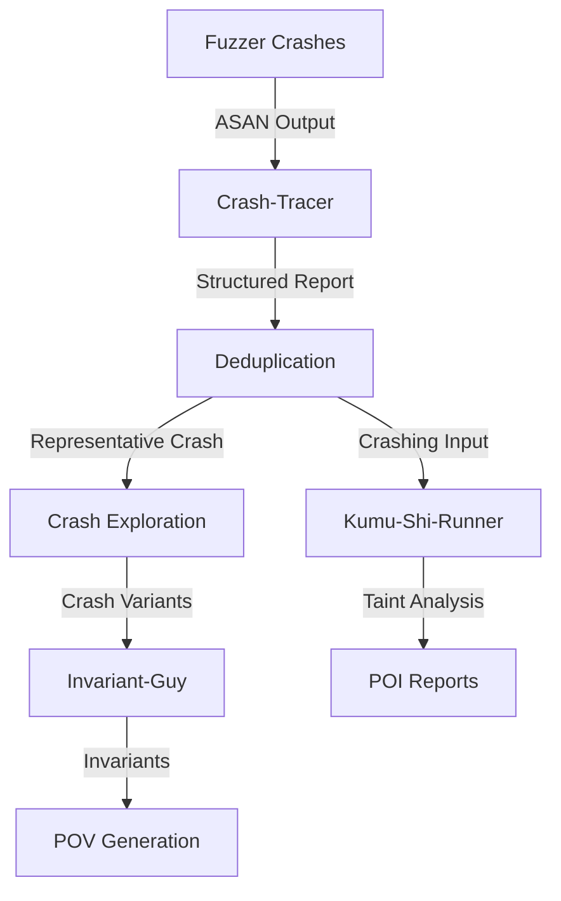

# Crash Analysis

After fuzzers discover crashing inputs, the CRS performs **multi-stage crash analysis** to extract structured information, deduplicate crashes, mine invariants, and generate additional crashing variants. This pipeline transforms raw crashes into actionable intelligence for patch generation and vulnerability detection.

## Purpose

- Parse sanitizer (ASAN/MSAN/UBSAN) outputs into structured reports
- Deduplicate crashes by root cause
- Explore crash neighborhoods to find variants
- Mine program invariants at crash sites
- Support both C/C++, Java, and Linux kernel targets

## Architecture



## Components

### Crash-Tracer

**Purpose**: Parse ASAN/MSAN/UBSAN/libFuzzer crash outputs into structured `ASANReport` format.

**Input**: Raw sanitizer stderr/stdout
**Output**: Structured YAML report with:
- Crash type (heap-buffer-overflow, use-after-free, null-ptr-deref, etc.)
- Sanitizer (AddressSanitizer, MemorySanitizer, etc.)
- Stack traces (main, allocate, free, crashing-address-frame)
- Access type (read/write) and size

[Details: Crash-Tracer](./crash-analysis/crash-tracer.md)

### Crash Exploration

**Purpose**: Mutate representative crashing inputs to find crash variants and explore the neighborhood around a crash.

**Strategy**: Use AFL++ with 4-hour timeout, custom mutator, and cmplog to generate related crashes.

**Input**: Representative crashing input
**Output**: Directory of crash variants

[Details: Crash Exploration](./crash-analysis/crash-exploration.md)

### Invariant-Guy

**Purpose**: Mine program invariants at crash sites using dynamic tracing (perf probes for C/C++, btrace for Java).

**Key Features**:
- Traces variable values at Points of Interest (POI)
- Compares crashing vs benign executions
- Infers invariants (unary and binary predicates)
- Supports C/C++, Java, and Linux kernel targets

[Details: Invariant-Guy](./crash-analysis/invariant-guy.md)

### Kumu-Shi-Runner

**Purpose**: Perform taint analysis and exploit generation for crashes using the Kumu-Shi framework.

**Integration**: Uses CodeQL database and function indices to analyze dataflow from input to crash site.

[Details: Kumu-Shi-Runner](./crash-analysis/kumu-shi-runner.md)

## Crash Analysis Pipeline

### 1. Crash Discovery
- Fuzzers (AFL++, AFLRun, libFuzzer, Jazzer) generate crashing inputs
- Crashes written to PDT `crashing_harness_inputs` repository
- Coverage-Guy traces crashes (separate from benign seeds)

### 2. Crash Parsing ([Crash-Tracer](./crash-analysis/crash-tracer.md))
```yaml
# Input: representative_crash_metadatas
# Output: parsed_asan_reports

asan2report:
  - Parse sanitizer stderr/stdout
  - Extract crash type, sanitizer, stack traces
  - Categorize: memory-leak, heap-buffer-overflow, use-after-free, etc.
  - Structure as ASANReport YAML
```

### 3. Deduplication
- Group crashes by stack trace similarity
- Select representative crash per group
- Store in `dedup_pov_report_representative_crashing_inputs`

### 4. Crash Exploration
```yaml
# Input: representative crashing input
# Output: crashing_harness_inputs_exploration

crash_exploration:
  - Run AFL++ with crashing input as seed
  - 4-hour timeout (FORCED_FUZZER_TIMEOUT=4)
  - Custom mutator enabled
  - Cmplog mode for comparison coverage
  - Generate variants in same crash neighborhood
```

### 5. Invariant Mining ([Invariant-Guy](./crash-analysis/invariant-guy.md))
```yaml
# For C/C++: perf probes
# For Java: btrace instrumentation
# For Linux kernel: kernel probes

invariant_find_{c,java,kernel}:
  - Insert probes at POI from poi_reports
  - Execute representative crash + similar benign inputs
  - Collect variable traces
  - Mine invariants using Carrot algorithm
  - Output: invariant_reports
```

### 6. Taint Analysis ([Kumu-Shi-Runner](./crash-analysis/kumu-shi-runner.md))
- CodeQL-based taint tracking
- Identify input bytes that influence crash
- Generate exploit primitives

## Crash Types Handled

### AddressSanitizer
- `heap-buffer-overflow`, `stack-buffer-overflow`, `global-buffer-overflow`
- `heap-use-after-free`, `stack-use-after-return`, `stack-use-after-scope`
- `use-after-poison`, `container-overflow`
- `double-free`, `bad-free`
- `null-ptr-deref`, `wild-ptr-deref`, `SEGV`
- `stack-overflow`, `out-of-memory`
- `memcpy-param-overlap`, `negative-size-param`

### MemorySanitizer
- `use-of-uninitialized-value`
- `CHECK failed`
- `SEGV`

### UndefinedBehaviorSanitizer
- `undefined-behavior`
- `SEGV`

### LeakSanitizer
- `memory-leak`

### libFuzzer
- `fuzz target overwrites its const input`
- `fuzz target exited`
- `deadly signal`
- `out-of-memory`

## Related Components

- **[Coverage-Guy](../coverage/coverage-guy.md)**: Traces crash coverage
- **[POI-Guy](../pov-generation/poi-guy.md)**: Identifies Points of Interest for invariant mining
- **[POV-Guy](../pov-generation/pov-guy.md)**: Uses crashes and invariants for exploit generation
- **[CodeQL](../static-analysis/codeql.md)**: Provides database for taint analysis
