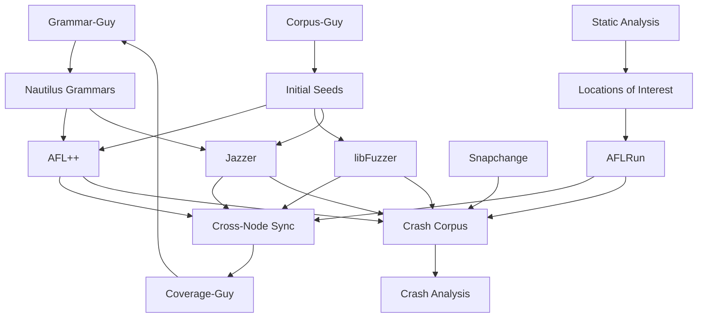

# Fuzzing Engines

Fuzzing is the primary dynamic testing technique in the CRS, using multiple coverage-guided fuzzers running in parallel to discover crashes and bugs. The system employs both well-known fuzzing tools (AFL++, libFuzzer, Jazzer, Snapchange, ClusterFuzz) and custom enhancements, with sophisticated corpus synchronization and grammar-based input generation.

## Overview

The CRS runs multiple fuzzing engines concurrently, each with different strengths:
- **AFL++**: Coverage-guided mutation fuzzing with grammar support
- **AFLRun**: Targeted fuzzing focused on specific code locations
- **libFuzzer**: In-process fuzzing for C/C++ with high performance
- **Jazzer**: Coverage-guided fuzzing for Java/JVM applications
- **Snapchange**: Snapshot-based fuzzing using KVM hypervisor
- **ClusterFuzz**: Integration with Google's OSS-Fuzz infrastructure

## Fuzzing Architecture

## Component Categories

### Coverage-Guided Fuzzers
Standard mutation-based fuzzers that use code coverage feedback:
- **[AFL++](./fuzzing/aflplusplus.md)** - Industry-standard fuzzer with grammar support
- **[libFuzzer](./fuzzing/libfuzzer.md)** - LLVM's in-process fuzzer
- **[Jazzer](./fuzzing/jazzer.md)** - Java/JVM fuzzing with libFuzzer engine

### Specialized Fuzzers
Purpose-built fuzzers for specific scenarios:
- **[AFLRun](./fuzzing/aflrun.md)** - Targeted fuzzing for specific code locations (in-house)
- **[Snapchange](./fuzzing/snapchange.md)** - Snapshot-based kernel fuzzing
- **[ClusterFuzz](./fuzzing/clusterfuzz.md)** - Google OSS-Fuzz integration

## Key Design Features

### Multi-Engine Parallelization

The CRS runs multiple fuzzing engines simultaneously:
- **AFL++**: Up to 3000 concurrent jobs (main replicant + secondaries)
- **libFuzzer**: Up to 20 concurrent jobs (5 CPU cores each)
- **Jazzer**: Up to 3000 concurrent jobs (JVM fuzzing)
- **AFLRun**: Up to 2 concurrent jobs (targeted fuzzing)

Each engine runs with multiple replicas per harness, maximizing throughput.

### Cross-Node Corpus Synchronization

Fuzzers run on multiple Kubernetes nodes and synchronize findings:

**AFL++ Sync** (every 2 minutes):
- SSH-based rsync between nodes
- Three-way sync: outbound, inbound, backsync
- Inter-harness seed sharing
- Crash injection to all replicas

**libFuzzer Sync** (periodic):
- Custom scripts handle synchronization
- Corpus minimization via same-node sync
- Cross-node seed distribution

**Jazzer Sync**:
- Similar to libFuzzer with Java-specific handling
- Separate LOSAN (logic bug) crash tracking

### Grammar-Based Input Generation

Instead of pure mutation, fuzzers use structured grammars:

**Nautilus Grammar Support**:
- AFL++ with Nautilus mutator
- Context-free grammars for structured inputs
- Grammar-Guy creates and refines grammars based on coverage

**Dictionary Support**:
- CodeQL extracts magic values (Corpus-Guy)
- AFL++ auto-dictionary via LLVM instrumentation
- libFuzzer/Jazzer use `-dict=` flag

### Instrumentation Modes

Each fuzzer uses custom instrumentation:

**AFL++**:
- Standard AFL++ edge coverage
- CMPLOG mode for comparison-guided fuzzing
- Dictionary extraction via `AFL_LLVM_DICT2FILE`

**AFLRun**:
- Selective basic-block instrumentation
- Only instruments locations of interest
- Trace-PC mode for targeted coverage

**libFuzzer**:
- Standard libFuzzer edge coverage
- In-process for faster execution

**Jazzer**:
- Java bytecode instrumentation
- Package-level scope control
- LOSAN detection for semantic bugs

### Corpus Management

**Initial Seeding**:
- Corpus-Guy provides format-specific seeds
- Grammar-Guy injects grammar-generated inputs
- Known crashes from previous runs

**Continuous Optimization**:
- AFL++: Built-in corpus minimization
- libFuzzer: Periodic merge tasks
- Jazzer: Same-node sync with minimization

**Persistence**:
- Crashes saved to `crashing_harness_inputs` repository
- Benign corpus saved to `benign_harness_inputs`
- Coverage metadata tracked alongside inputs

## Workflow

### Phase 1: Build Instrumentation

Each fuzzer requires instrumented binaries:

1. **oss-fuzz-build-image** creates Docker images with fuzzer tooling
2. **oss-fuzz-build** executes project build.sh with instrumentation
3. Build artifacts include:
   - Instrumented binaries
   - Fuzzing harnesses
   - Initial corpus
   - Dictionaries/grammars

### Phase 2: Fuzzing Initialization

Before fuzzing starts:

1. **Grammar sync**: Copy Nautilus grammars to shared directories
2. **Corpus kickstart**: Inject seeds from Corpus-Guy
3. **Dictionary generation**: Extract from CodeQL/static analysis
4. **Harness discovery**: Enumerate all fuzzing targets

### Phase 3: Parallel Fuzzing

Multiple fuzzer instances run concurrently:

**AFL++ Strategy**:
- One main replicant (`-M`) per harness
- Multiple secondaries (`-S`) with unique IDs
- Main fuzzer coordinates, secondaries mutate independently
- Auto-restart on crashes with corpus recovery

**libFuzzer Strategy**:
- Multiple replicas per harness
- Each replica has independent corpus directory
- Periodic corpus minimization

**Jazzer Strategy**:
- Similar to libFuzzer for Java targets
- Three Jazzer variants: original, Shellphish-enhanced, CodeQL-guided

**AFLRun Strategy**:
- Directed fuzzing toward locations of interest
- Lower concurrency (max 2 jobs) for focused testing

### Phase 4: Synchronization

Continuous corpus exchange:

**Same-Node Sync**:
- Fuzzers on same node share via `/shared/fuzzer_sync/`
- AFL++ uses built-in sync (`-M`/`-S` mode)
- libFuzzer/Jazzer use custom scripts

**Cross-Node Sync**:
- SSH-based rsync every 2 minutes (AFL++)
- Stale fuzzer eviction (300s timeout)
- Inter-harness seed sharing for related targets

### Phase 5: Coverage Monitoring

Coverage-Guy tracks fuzzing effectiveness:
- Monitor code path coverage in real-time
- Identify uncovered code areas
- Provide feedback to Grammar-Guy for refinement

### Phase 6: Crash Processing

When crashes are found:
- Saved immediately to crash corpus
- Injected to all other fuzzer instances
- Passed to crash analysis pipeline
- Used for targeted fuzzing (AFLRun)

## Resource Management

### CPU/Memory Allocation

| Fuzzer | CPU/Job | Memory/Job | Max Concurrent |
|--------|---------|------------|----------------|
| AFL++ | 1 core | 2Gi | 3000 |
| AFLRun | 1 core | 2Gi | 2 |
| libFuzzer | 5 cores | 8Gi | 20 |
| Jazzer | 1 core | 2Gi | 3000 |
| Snapchange | 2 cores | 4Gi | - |
| ClusterFuzz | 16 cores | 32Gi | - |

### Scaling Strategy

**Horizontal Scaling**:
- AFL++: Scales to 20 replicas/minute
- libFuzzer: Fixed replica count per harness
- Jazzer: Similar to AFL++ scaling

**Resource Limits**:
- Spot instance support for cost efficiency
- Dynamic CPU/memory quotas
- Priority-based scheduling

### Storage

**Shared Directories**:
- `/shared/fuzzer_sync/`: Primary corpus exchange (all fuzzers)
- `/shared/injected-seeds/`: Manual seed injection
- `/pdt-per-node-cache/`: Per-node build caching

**Persistent Storage**:
- `crashing_harness_inputs`: Crash corpus with coverage
- `benign_harness_inputs`: Non-crashing corpus
- `coverage_reports`: Coverage metadata

## Integration Points

### Upstream Dependencies

**Static Analysis**:
- Locations of interest → AFLRun targeting
- CWE findings → Prioritized fuzzing
- Call graphs → Reachability analysis

**Grammar-Guy**:
- Nautilus grammars → AFL++/Jazzer
- Coverage feedback loop → Grammar refinement

**Corpus-Guy**:
- Initial seeds → All fuzzers
- Format inference → Seed generation
- Dictionary extraction → AFL++/libFuzzer/Jazzer

### Downstream Consumers

**Coverage-Guy**:
- Monitors fuzzing effectiveness
- Tracks code coverage growth
- Identifies uncovered functions

**Crash Analysis**:
- Crash-Tracer parses ASAN reports
- Crash Exploration finds variants
- Kumu-Shi-Runner performs root cause analysis

**Patch Generation**:
- Crash locations guide patching
- POV generation uses crashing inputs

## Key Customizations

### Shellphish-Specific Enhancements

1. **AFLRun (In-House)**:
   - Targeted fuzzing for SARIF-derived locations
   - Selective instrumentation for efficiency
   - Integration with static analysis findings

2. **Shellphish Jazzer**:
   - Enhanced with LOSAN detection
   - CodeQL-guided dictionary generation
   - In-scope package filtering

3. **Cross-Node Sync**:
   - Custom SSH-based corpus distribution
   - Kubernetes-aware node discovery
   - Automatic stale fuzzer cleanup

4. **Grammar Integration**:
   - AI-driven grammar refinement (Grammar-Guy)
   - Coverage-guided grammar evolution
   - Nautilus format for structured inputs

5. **Corpus Orchestration**:
   - LLM-based format inference (Corpus-Guy)
   - Automated seed generation
   - Diff-based seed extraction

### Error Handling

**Fuzzer Crashes**:
- Auto-restart with corpus recovery
- Skip corrupted inputs
- Continue fuzzing with valid corpus

**Build Failures**:
- Fallback to non-instrumented builds
- Log errors for manual review
- Skip problematic harnesses

**Resource Exhaustion**:
- Kubernetes pod eviction handling
- Graceful shutdown on OOM
- Resume from last saved state

## Performance Characteristics

### Throughput

**AFL++**:
- 100-10,000 execs/sec depending on target
- CMPLOG mode reduces speed but improves finding rate
- Grammar mode slower but finds deeper bugs

**libFuzzer**:
- 10,000-100,000 execs/sec (in-process advantage)
- Higher memory usage per instance
- Better for fast targets

**Jazzer**:
- 100-1,000 execs/sec (JVM overhead)
- Bytecode instrumentation cost
- Good for complex Java logic

### Coverage Growth

- **Initial phase**: Rapid coverage growth (0-24 hours)
- **Plateau phase**: Slower growth, grammar refinement helps
- **Targeted phase**: AFLRun focuses on remaining gaps

### Bug Discovery Rate

- **Shallow bugs**: Found within hours (buffer overflows, null pointers)
- **Deep bugs**: Days to weeks (logic errors, race conditions)
- **Grammar-assisted**: Finds structured input bugs faster

## Related Components

- **[Grammar & Input Generation](./grammar.md)**: Grammar-Guy, Corpus-Guy
- **[Coverage & Monitoring](./coverage.md)**: Coverage-Guy, Peek-a-Boo
- **[Crash Analysis](./crash-analysis.md)**: Crash processing pipeline
