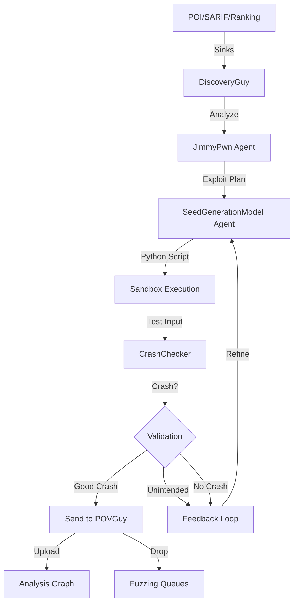

# DiscoveryGuy

DiscoveryGuy is an **LLM-based directed fuzzing system** that generates targeted test inputs to trigger specific vulnerabilities. It uses vulnerability reports from CodeQL, SARIF, or ranked functions to intelligently craft Python exploitation scripts that produce crashing inputs.

## Purpose

- Generate directed test inputs for specific vulnerability sinks
- LLM-driven exploit development for vulnerability validation
- Targeted fuzzing based on static analysis findings (CodeQL, SARIF)
- Patch bypass testing with mutated inputs
- Backdoor detection through suspicious function targeting

## Architecture



## Modes

**Configuration** ([main.py:50](https://github.com/sslab-gatech/shellphish-afc-crs/blob/main/components/discoveryguy/src/discoveryguy/main.py#L50)):

### 1. POIS Mode (POI-Based)

**Purpose**: Directed fuzzing based on ranked functions from CodeSwipe.

**Input**: Function ranking from vulnerability scanners/LLMs.

**Flow** ([main.py:1110-1112](https://github.com/sslab-gatech/shellphish-afc-crs/blob/main/components/discoveryguy/src/discoveryguy/main.py#L1110-L1112)):
```python
elif Config.discoveryguy_mode == DiscoverGuyMode.POIS:
    # These are the ranked functions as per code-swipe
    all_sinks:List[FUNCTION_INDEX_KEY] = self.get_ranked_functions()
```

### 2. SARIF Mode

**Purpose**: Targeted exploit generation from SARIF static analysis reports.

**Input**: SARIF report with precise vulnerability locations.

**Flow** ([main.py:1106-1107](https://github.com/sslab-gatech/shellphish-afc-crs/blob/main/components/discoveryguy/src/discoveryguy/main.py#L1106-L1107)):
```python
if Config.discoveryguy_mode == DiscoverGuyMode.SARIF:
    sarif_tg_summary, all_sinks = self.get_sarif_triage_summary()
```

**Features**:
- SARIF triage with `SarifTriageGuy` agent
- Links generated seeds to SARIF reports in Analysis Graph
- Emits TP/FP assessment after successful exploit

### 3. POISBACKDOOR Mode

**Purpose**: Detect backdoors by targeting suspicious functions.

**Input**: Backdoor detection results (suspicious function list).

**Flow** ([main.py:1108-1109](https://github.com/sslab-gatech/shellphish-afc-crs/blob/main/components/discoveryguy/src/discoveryguy/main.py#L1108-L1109)):
```python
elif Config.discoveryguy_mode == DiscoverGuyMode.POISBACKDOOR:
    all_sinks:List[FUNCTION_INDEX_KEY] = self.get_suspicious_funcs()
```

### 4. DIFFONLY Mode (Delta)

**Purpose**: Regression testing - target only changed functions in patches.

**Input**: Git diff + changed function index.

**Flow** ([main.py:1113-1114](https://github.com/sslab-gatech/shellphish-afc-crs/blob/main/components/discoveryguy/src/discoveryguy/main.py#L1113-L1114)):
```python
elif Config.discoveryguy_mode == DiscoverGuyMode.DIFFONLY:
    all_sinks:List[FUNCTION_INDEX_KEY] = self.get_sinks_from_diff()
```

### 5. BYPASS Mode

**Purpose**: Patch bypass testing - mutate existing POVs against patched builds.

**Input**: Patch metadata + original POV.

**Pipeline** ([pipeline.yaml:717-838](https://github.com/sslab-gatech/shellphish-afc-crs/blob/main/components/discoveryguy/pipeline.yaml#L717-L838)).

## LLM Agents

### 1. JimmyPwn (Analysis Agent)

**Purpose**: Analyze vulnerability sink and plan exploitation strategy.

**Model**: Claude 3.7 Sonnet (with opus fallback for top-N)

**Implementation** ([main.py:1248-1268](https://github.com/sslab-gatech/shellphish-afc-crs/blob/main/components/discoveryguy/src/discoveryguy/main.py#L1248-L1268)):

```python
jimmyPwn = JimmyPwn(
    LANGUAGE_EXPERTISE=self.project_language,
    PROJECT_NAME=self.project_name,
    FUNCTION_INDEX= sink_index_key,
    FUNCTION_NAME=sink_funcname,
    FILE_NAME=str(sink_full_info.target_container_path),
    CODE=self.func_resolver.get_code(sink_index_key)[-1],
    CODE_DIFF = self.peek_diff.get_diff(sink_index_key, bot=False) if self.peek_diff else "",
    WITH_PATH=with_path,
    HARNESSES=list(reached_harnesses.values()),
    NODES_OPTIMIZED=nodes,
    NOTICE=notice,
    FEEDBACK = feedback,
    WITH_DIFF=True if self.peek_diff else False,
    LAST_CHANCE=True if attempt_no > 1 else False,
    DIFF_SUMMARY=summary,
)
```

**Reasoning Loop** ([main.py:619-729](https://github.com/sslab-gatech/shellphish-afc-crs/blob/main/components/discoveryguy/src/discoveryguy/main.py#L619-L729)):

```python
while True:
    try:
        res = jimmyPwn.invoke()
        JimmyPwnAnalysisReport = res.value
        self.how_many_naps = 0
        break
    except LLMApiBudgetExceededError as e:
        if Config.nap_mode and self.how_many_naps < Config.nap_becomes_death_after:
            self.how_many_naps += 1
            self.take_a_nap()
            continue
        else:
            self.exit_and_clean(1)
    except LLMApiRateLimitError as e:
        jimmy_pwn_llm_index += 1
        if jimmy_pwn_llm_index >= len(Config.jimmypwn_llms):
            # All models exhausted, take a nap
            jimmy_pwn_llm_index = 0
            if Config.nap_mode and self.how_many_naps < Config.nap_becomes_death_after:
                self.how_many_naps += 1
                self.take_a_nap()
                continue
            else:
                self.exit_and_clean(1)
        else:
            # Switch to next model
            jimmy_pwn_model = Config.jimmypwn_llms[jimmy_pwn_llm_index]

            # Special handling for opus (expensive!)
            if jimmy_pwn_model == "claude-4-opus":
                if self.how_many_opus >= Config.max_opus_for_jimmypwn:
                    jimmy_pwn_llm_index = 0
                    Config.jimmypwn_llms = Config.jimmypwn_llms_no_opus
                    self.how_many_naps += 1
                    self.take_a_nap()
                    continue
                else:
                    self.how_many_opus += 1

            # Brain surgery for JimmyPwn
            jimmyPwn.__LLM_MODEL__ = Config.jimmypwn_llms[jimmy_pwn_llm_index]
            jimmyPwn.llm = jimmyPwn.get_llm_by_name(jimmy_pwn_model, **jimmyPwn.__LLM_ARGS__)
            continue
```

**Tools Available**:
- `show_file_at`: View source code
- `get_functions_by_file`: List functions in file
- Analysis Graph queries for coverage/path information

### 2. SeedGenerationModel (Exploit Developer)

**Purpose**: Generate Python exploitation script based on JimmyPwn's analysis.

**Model**: Claude 3.7 Sonnet

**Implementation** ([ExploitDeveloper.py:92-110](https://github.com/sslab-gatech/shellphish-afc-crs/blob/main/components/discoveryguy/src/discoveryguy/agents/ExploitDeveloper.py#L92-L110)):

```python
class ExploitDeveloper(AgentWithHistory[dict, str]):
    __LLM_ARGS__ = {"temperature": 0}
    __LLM_MODEL__ = "claude-3.7-sonnet"
    __SYSTEM_PROMPT_TEMPLATE__ = "/src/discoveryguy/prompts/ExploitDeveloper/system.j2"
    __USER_PROMPT_TEMPLATE__ = "/src/discoveryguy/prompts/ExploitDeveloper/user.j2"
    __MAX_TOOL_ITERATIONS__ = 50
```

**Script Generation Loop** ([main.py:782-819](https://github.com/sslab-gatech/shellphish-afc-crs/blob/main/components/discoveryguy/src/discoveryguy/main.py#L782-L819)):

```python
seed_attempt_no = 0
while seed_attempt_no < Config.exploit_dev_max_attempts_regenerate_script:
    if seed_attempt_no > 0:
        seedAgent.FIRST_ATTEMPT = False

    found_good_crash, found_unintended_crash, feedback, sandbox_report, exploit_script, crash_txt = \
        self.run_seed_generation(seedAgent, reached_harnesses, sink_index_key, report_attempt_no, seed_attempt_no)

    if found_good_crash:
        logger.info(f"🔥🏆 We got a crash for {sink_index_key} in attempt {report_attempt_no+1}, seed {seed_attempt_no+1}!")
        return found_good_crash, feedback_for_jimmy_pwn, False
    elif found_unintended_crash:
        logger.info(f"🔥🤷🏻‍♂️ Unintended crash, trying again...")
        feedback_for_jimmy_pwn += feedback
        feedback_for_seed_agent += feedback
        bad_scripts.append(exploit_script)
        return found_good_crash, feedback_for_jimmy_pwn, False
    else:
        logger.info(f"Attempt {report_attempt_no+1}, seed {seed_attempt_no+1} failed, trying again...")
        failed_scripts.append(exploit_script)
        feedback_for_seed_agent += feedback
        seedAgent.FEEDBACK = feedback_for_seed_agent
        seed_attempt_no += 1
```

**Feedback Types**:
- **Good Crash**: Sink function appears in crash trace → Success
- **Unintended Crash**: Different function crashes → Add to `bad_scripts`, feedback loop
- **No Crash**: Script fails to crash → Add to `failed_scripts`, regenerate with feedback

### 3. HoneySelectAgent (Harness Selector)

**Purpose**: Select relevant harnesses that can reach the vulnerability sink.

**Model**: Multi-model with fallback

**Implementation** ([main.py:1004-1012](https://github.com/sslab-gatech/shellphish-afc-crs/blob/main/components/discoveryguy/src/discoveryguy/main.py#L1004-L1012)):

```python
harnessAgent = HoneySelectAgent(
    LANGUAGE_EXPERTISE=self.project_language,
    PROJECT_NAME=self.project_name,
    FUNCTION_INDEX= sink_index_key,
    FUNCTION_NAME=sink_funcname,
    FILE_NAME=str(sink_full_info.target_container_path),
    CODE=self.func_resolver.get_code(sink_index_key)[-1],
    HARNESSES=list(all_harnesses.values()),
)
```

**Fallback Strategy**: If >5 harnesses, use agent to select relevant ones. Otherwise, use all.

### 4. SarifTriageGuy (SARIF Validator)

**Purpose**: Validate SARIF findings and provide exploitation context.

**Usage** ([main.py:297-304](https://github.com/sslab-gatech/shellphish-afc-crs/blob/main/components/discoveryguy/src/discoveryguy/main.py#L297-L304)):

```python
sarif_tg_guy = SarifTriageGuy(
    language=self.project_language,
    project_name=self.project_name,
    rule_id=sarif_result.rule_id,
    sarif_message=sarif_result.message,
    locs_in_scope=sarif_result.locations,
    data_flows=sarif_result.codeflows,
)
```

## Sandbox Execution

**Sandbox Environment** ([main.py:129-136](https://github.com/sslab-gatech/shellphish-afc-crs/blob/main/components/discoveryguy/src/discoveryguy/main.py#L129-L136)):

```python
self.sandbox = InstrumentedOssFuzzProject(
    DiscoveryInstrumentation(),
    oss_fuzz_project_path=self.cps_debug[0].project_path
)
self.sandbox.build_runner_image()
```

**Script Execution** ([main.py:454-479](https://github.com/sslab-gatech/shellphish-afc-crs/blob/main/components/discoveryguy/src/discoveryguy/main.py#L454-L479)):

```python
bash_script = os.getcwd() + "/discoveryguy/run_script.sh"
shutil.copy(bash_script, script_input+"/run_script.sh")

sandbox_report = sandbox.runner_image_run(f"/work/run_script.sh")
std_err = sandbox_report.stderr.decode()

if sandbox_report.run_exit_code == 124:
    feedback = "Your script timed out after 60 seconds. Avoid infinite loops."
    return False, False, feedback, sandbox_report, exploit_script, ""
elif sandbox_report.run_exit_code != 0:
    if 'ModuleNotFoundError' in std_err:
        module = std_err.split("No module named '")[1].split("'")[0]
        feedback = f"Library {module} is not installed. Use only allowed libraries: {AVAILABLE_PYTHON_PACKAGES}"
        return False, False, feedback, sandbox_report, exploit_script, ""
    else:
        feedback = f"Script failed to run. Review the error: {std_err}"
        return False, False, feedback, sandbox_report, exploit_script, ""
else:
    logger.info(f'✅ Successfully executed the generated Python script')
```

## Crash Validation

**CrashChecker** ([main.py:139-144](https://github.com/sslab-gatech/shellphish-afc-crs/blob/main/components/discoveryguy/src/discoveryguy/main.py#L139-L144)):

```python
self.crashChecker = CrashChecker(
    self.cps_debug,
    self.aggregated_harness_info,
    local_run=True
)
```

**Validation Logic** ([main.py:488-519](https://github.com/sslab-gatech/shellphish-afc-crs/blob/main/components/discoveryguy/src/discoveryguy/main.py#L488-L519)):

```python
crashed = False
found_good_crash = False
found_unintended_crash = False
crashing_harness = None

for _, harness in reached_harnesses.items():
    (crashed, crashing_output, harness_info_id, harness_info) = self.crashChecker.check_input(
        self.project_id,
        crash_txt,
        harness.bin_name
    )
    if crashed:
        crashing_harness = harness
        crashing_harness_info_id = harness_info_id
        crashing_harness_info = harness_info
        break

if crashed:
    if function_name in str(crashing_output):
        # Good crash: sink function in trace
        found_good_crash = True
        self.seedDropperManager.send_seed_to_povguy(crashing_harness_info_id, crash_txt)
        feedback = "GREAT! You successfully crashed the target function."
    else:
        # Unintended crash: different function
        found_unintended_crash = True
        self.seedDropperManager.send_seed_to_povguy(crashing_harness_info_id, crash_txt)
        feedback = f"Unintended crash, {function_name} was not in trace. Try different scenario."
else:
    feedback = "Crash failed, review analysis and regenerate script."
```

## Output Management

**SeedDropperManager** ([main.py:176-184](https://github.com/sslab-gatech/shellphish-afc-crs/blob/main/components/discoveryguy/src/discoveryguy/main.py#L176-L184)):

```python
self.seedDropperManager = SeedDropperManager(
    self.dg_id,
    self.project_name,
    self.aggregated_harness_info['harness_infos'],
    self.backup_seeds_vault,
    self.report_dir,
    self.crash_dir_pass_to_pov,
    self.crash_metadata_dir_pass_to_pov
)
```

**Seed Distribution** ([main.py:540-543](https://github.com/sslab-gatech/shellphish-afc-crs/blob/main/components/discoveryguy/src/discoveryguy/main.py#L540-L543)):

```python
logger.info(f"🫳🌱 Dropping seed into all the fuzzing queues...")
for harness in self.harness_resolver.get_all_harnesses():
    self.seedDropperManager.add_seed(harness.info_id, crash_txt)
```

**POVGuy Upload** ([main.py:550-561](https://github.com/sslab-gatech/shellphish-afc-crs/blob/main/components/discoveryguy/src/discoveryguy/main.py#L550-L561)):

```python
if function_name in str(crashing_output):
    found_good_crash = True
    self.seedDropperManager.send_seed_to_povguy(crashing_harness_info_id, crash_txt)
    self.seedDropperManager.backup_seed(crashing_harness.bin_name, function_name, crash_txt,
                                        report_attempt_no, seed_attempt_no, id, "succeeded")
    self.seedDropperManager.backup_crash_report(crashing_harness.bin_name, function_name, sink_index_key,
                                                 seedAgent.REPORT, exploit_script, str(crashing_output.stderr),
                                                 report_attempt_no, seed_attempt_no, id, "succeeded")
```

## Budget Management

**Nap Mode** ([main.py:265-278](https://github.com/sslab-gatech/shellphish-afc-crs/blob/main/components/discoveryguy/src/discoveryguy/main.py#L265-L278)):

```python
def take_a_nap(self):
    logger.info(f'😴 Nap time! I will be back in a bit...')

    # Go to next multiple of Config.nap_duration
    # e.g., if nap_duration is 5 and current minute is 12, wake up at 15
    waking_up_at = datetime.now() + timedelta(
        minutes=Config.nap_duration - (datetime.now().minute % Config.nap_duration)
    )

    while True:
        if datetime.now() >= waking_up_at:
            logger.info(f'🫡 Nap time is over! Back to work...')
            break
        else:
            time.sleep(Config.nap_snoring)
```

**Opus Management** ([main.py:682-698](https://github.com/sslab-gatech/shellphish-afc-crs/blob/main/components/discoveryguy/src/discoveryguy/main.py#L682-L698)):

```python
if jimmy_pwn_model == "claude-4-opus":
    # Conservative with opus (expensive!)
    if self.how_many_opus >= Config.max_opus_for_jimmypwn:
        # Reset to first model
        jimmy_pwn_llm_index = 0
        # Remove opus from list
        Config.jimmypwn_llms = Config.jimmypwn_llms_no_opus
        # Wait since we got rate limited
        self.how_many_naps += 1
        self.take_a_nap()
        continue
    else:
        self.how_many_opus += 1
        logger.info(f'🦸🏻‍♂️🦸🏻‍♂️🦸🏻‍♂️ Jimmypwn UPGRADE! Switching to {jimmy_pwn_model} 🦸🏻‍♂️🦸🏻‍♂️🦸🏻‍♂️')
```

## Performance Characteristics

- **Max POIs per run**: Configurable (default: check top-N)
- **Max attempts per sink**: 3-5 (configurable)
- **Max script regenerations**: 3-5 per sink
- **Sandbox timeout**: 60 seconds
- **LLM models**: Claude 3.7 Sonnet, with opus for top-N
- **Tool iterations**: 50 max per agent
- **Nap duration**: 5 minutes (aligned to budget resets)
- **Max naps**: 3 before giving up

## Configuration

**Key Settings** ([config.py](https://github.com/sslab-gatech/shellphish-afc-crs/blob/main/components/discoveryguy/src/discoveryguy/config.py)):

```python
exploit_dev_max_attempts_per_sink: int = 3
exploit_dev_max_attempts_regenerate_script: int = 3
max_pois_to_check: int = 100
skip_already_pwned: bool = True
nap_mode: bool = True
nap_duration: int = 5  # minutes
nap_becomes_death_after: int = 3
max_opus_for_jimmypwn: int = 5
check_top_n_with_opus: bool = True
```

## Related Components

- **[CodeQL](../static-analysis/codeql.md)**: Provides POI reports for POIS mode
- **[SARIFGuy](../../sarif-processing.md)**: Generates SARIF reports for SARIF mode
- **[POVGuy](../pov-generation/povguy.md)**: Validates crashes from DiscoveryGuy
- **[Analysis Graph](../../infrastructure/analysis-graph.md)**: Provides path analysis, stores seeds
- **[Coverage-Guy](../coverage/coverage-guy.md)**: Provides coverage data for reachability
- **[AFL++](./aflplusplus.md)**: Receives generated seeds in fuzzing queues

## Pipeline Tasks

**Full Mode** ([pipeline.yaml:41-193](https://github.com/sslab-gatech/shellphish-afc-crs/blob/main/components/discoveryguy/pipeline.yaml#L41-L193)):
- `discovery_guy_from_ranking_full`: POI-based with function ranking
- `discovery_guy_from_sarif_full`: SARIF-based exploitation

**Delta Mode** ([pipeline.yaml:196-360](https://github.com/sslab-gatech/shellphish-afc-crs/blob/main/components/discoveryguy/pipeline.yaml#L196-L360)):
- `discovery_guy_from_ranking_delta`: Diff-based with ranking
- `discovery_guy_from_sarif_delta`: SARIF with diff context
- `discovery_guy_from_diff_delta`: Pure diff-based targeting

**Special Modes** ([pipeline.yaml:717-1213](https://github.com/sslab-gatech/shellphish-afc-crs/blob/main/components/discoveryguy/pipeline.yaml#L717-L1213)):
- `discovery_guy_from_bypass_request`: Patch bypass testing
- `discovery_guy_from_backdoorguy`: Backdoor detection
- `discoverry_fuzz`: Long-running fuzzing with generated seeds

## Main File

**Implementation**: [`src/discoveryguy/main.py`](https://github.com/sslab-gatech/shellphish-afc-crs/blob/main/components/discoveryguy/src/discoveryguy/main.py)

**Agents**: [`src/discoveryguy/agents/`](https://github.com/sslab-gatech/shellphish-afc-crs/tree/main/components/discoveryguy/src/discoveryguy/agents)
- `JimmyPwn.py` - Vulnerability analysis
- `ExploitDeveloper.py` - Script generation
- `BugHunter.py` - POI analysis
- `HoneySelectAgent.py` - Harness selection
- `SarifTriageGuy.py` - SARIF validation
