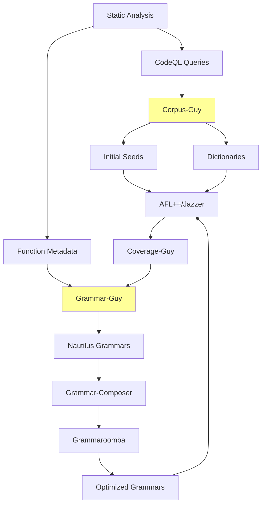

# Grammar & Input Generation

Grammar and input generation components create intelligent, structured inputs for fuzzing instead of relying purely on mutation. The system uses AI-driven grammar generation, coverage-guided refinement, and static analysis to produce high-quality seeds that reach deep code paths and trigger complex bugs.

## Overview

The CRS employs multiple strategies for input generation:
- **Grammar-based**: Context-free grammars for structured inputs (Grammar-Guy, Grammar-Composer, Grammaroomba)
- **Seed-based**: Intelligent initial corpus generation (Corpus-Guy, Quickseed)
- **Dictionary-based**: Magic values and constants extraction (ANTLR4-Guy)
- **AI-driven**: LLM-powered format inference and grammar creation

## Architecture

## Components

### AI-Powered Grammar Generation

**[Grammar-Guy](./grammar/grammar-guy.md)** (In-House):
- Coverage-guided grammar creation and refinement
- AI agent-based exploration for grammar improvement
- Multiple modes: general, targeted-agent, targeted-explorer, targeted-reproducer
- Feedback loop with coverage monitoring

### Grammar Processing

**[Grammar-Composer](./grammar/grammar-composer.md)**:
- Combines grammar fragments from multiple sources
- Creates RON (Rusty Object Notation) format for Nautilus
- Manages grammar fingerprints and rule hashes

**[Grammaroomba](./grammar/grammaroomba.md)**:
- Grammar optimization and cleanup
- Removes redundant or low-value productions
- Improves fuzzing efficiency

### Seed & Dictionary Generation

**[Corpus-Guy](./grammar/corpus-guy.md)** (In-House):
- LLM-based input format inference
- CodeQL-driven dictionary extraction
- Trace-based format detection
- Kickstart mechanism for high-value seeds

**[Quickseed](./grammar/quickseed.md)**:
- Taint analysis for targeted seed generation
- Creates seeds that reach specific sinks
- Uses CodeQL for dataflow tracking

**[ANTLR4-Guy](./grammar/antlr4-guy.md)**:
- Diff-based vulnerability ranking
- Compares function diffs with known CVE patches
- Helps prioritize analysis targets

## Key Design Features

### Coverage-Guided Grammar Refinement

**Feedback Loop**:
1. Grammar-Guy generates initial grammar from functions
2. Fuzzers use grammar to generate inputs
3. Coverage-Guy tracks which code paths are reached
4. Grammar-Guy refines grammar to target uncovered code
5. Repeat until coverage plateaus

**Adaptive Strategy**:
- Early phase: Broad grammar for exploration
- Middle phase: Targeted grammar for specific functions
- Late phase: Exploit-focused grammar for vulnerabilities

### Multi-Source Input Generation

**Three Input Types**:

1. **Grammar-Generated** (structured):
   - Context-free grammars define valid input structure
   - Nautilus mutator creates grammar-conforming inputs
   - Best for: File formats, protocols, DSLs

2. **Seed-Based** (example-driven):
   - Real-world inputs or synthesized examples
   - Mutated by fuzzers to explore nearby space
   - Best for: Complex formats with multiple valid structures

3. **Dictionary-Guided** (constant-driven):
   - Magic numbers, string literals, comparison values
   - AFL++/libFuzzer use dictionaries for targeted mutations
   - Best for: Breaking specific comparisons (e.g., `if (x == 0xDEADBEEF)`)

### AI Integration

**LLM Usage**:
- **Format Inference**: Corpus-Guy uses LLMs to guess input formats from project context
- **Grammar Generation**: Grammar-Guy uses LLMs to create grammars from function code
- **Exploration**: AI agents iteratively improve grammars based on coverage feedback

**Budget Management**:
- $10 limit per component per task
- Event logging for cost tracking
- Budget exceptions halt execution to prevent overrun

### Static Analysis Integration

**CodeQL Queries**:
- **String Extraction**: Find string literals for dictionaries
- **Taint Analysis**: Identify paths from input to sinks (Quickseed)
- **Reachability**: Determine which functions are fuzzable
- **Constant Extraction**: Magic numbers and enum values

**Function Metadata**:
- Grammar-Guy analyzes function code to infer input structure
- Clang-indexer provides function boundaries and call graphs
- Delta mode focuses on changed functions only

## Workflow

### Phase 1: Initial Analysis

**Static Analysis** provides:
- Function code and signatures
- Call graphs and dataflow
- String/constant values
- Known vulnerability patterns

### Phase 2: Format Inference

**Corpus-Guy** infers input formats:
1. **Trace-based**: Run harness with random inputs, observe file operations
2. **LLM-based**: Analyze project/harness code to guess formats
3. **Diff-based**: Extract changes as potential mutation seeds

Output: Initial seed corpus, dictionaries

### Phase 3: Grammar Generation

**Grammar-Guy** creates grammars:
1. Analyze target functions for input parsing logic
2. Generate context-free grammar rules
3. Validate grammar produces parseable inputs
4. Convert to Nautilus RON format

Output: Initial grammars

### Phase 4: Grammar Optimization

**Grammar-Composer** combines fragments:
- Merge grammars from multiple sources
- Resolve conflicts and deduplicate rules
- Generate rule hashes for tracking

**Grammaroomba** optimizes:
- Remove redundant productions
- Prune low-value rules
- Simplify grammar structure

Output: Optimized grammars

### Phase 5: Seed Distribution

**Kickstart Mechanism**:
- Corpus-Guy injects seeds to `/shared/fuzzer_sync/`
- Seeds distributed to all active fuzzer instances
- Language-specific limits (1000 seeds for Java/C/C++)

**Dictionary Distribution**:
- Placed in fuzzer working directories
- AFL++: `-x dict.txt`
- libFuzzer/Jazzer: `-dict=dict.txt`

### Phase 6: Fuzzing with Feedback

**During Fuzzing**:
- Fuzzers use grammars via Nautilus mutator
- Coverage-Guy monitors code coverage
- Grammar-Guy receives coverage reports

**Grammar Refinement**:
- Identify uncovered functions/blocks
- Generate targeted grammars for missing coverage
- Deploy updated grammars to fuzzers
- Repeat until diminishing returns

### Phase 7: Exploit Generation

**Targeted Modes**:
- `targeted-reproducer`: Reproduce specific POVs
- `targeted-sarif`: Target SARIF-identified locations
- `targeted-agent`: AI agent explores specific functions

## Data Flow

### Inputs

**From Static Analysis**:
- Function JSONs (clang-indexer)
- Function indices (function-index-generator)
- CodeQL databases
- SARIF reports

**From Coverage Monitoring**:
- Coverage reports (coverage-guy)
- Reachability information
- Uncovered function lists

### Outputs

**To Fuzzers**:
- Nautilus grammars → AFL++/Jazzer
- Seed corpus → All fuzzers
- Dictionaries → AFL++/libFuzzer/Jazzer

**To Analysis**:
- Grammar evolution logs
- Coverage improvement metrics
- Format inference results

## Integration Points

### Upstream Dependencies

**Static Analysis**:
- Clang Indexer: Function metadata
- CodeQL: Dataflow/taint analysis
- Function Index Generator: Fast function lookup

**Coverage Monitoring**:
- Coverage-Guy: Real-time coverage tracking
- Provides feedback for grammar refinement

### Downstream Consumers

**Fuzzers**:
- AFL++: Nautilus grammar support
- Jazzer: Java-specific grammars
- libFuzzer: Dictionary-guided mutations

**Analysis Components**:
- POV generation uses seeds for exploit creation
- Crash analysis validates grammar-generated inputs

## Performance Characteristics

### Grammar Generation

**Speed**:
- Initial grammar: Minutes to hours (LLM-dependent)
- Refinement iteration: Minutes per cycle
- Budget: $10 per component per task

**Quality**:
- Coverage improvement: 20-50% over pure mutation
- Bug discovery: 2-5x faster for structured inputs
- False positive rate: Low (grammars produce valid inputs)

### Seed Generation

**Corpus-Guy**:
- LLM inference: Minutes
- Trace-based: Seconds to minutes
- Diff extraction: Seconds

**Quickseed**:
- CodeQL query: Minutes
- Seed generation: Seconds to minutes
- Seeds per target: Typically 10-100

### Dictionary Extraction

**ANTLR4-Guy**:
- Diff analysis: Seconds
- Ranking: Milliseconds
- Dictionary size: 100-1000 entries

## Key Customizations

### In-House Components

**Grammar-Guy**:
- AI agent-based exploration (unique approach)
- Coverage-guided refinement loop
- Multiple operational modes
- Delta mode for commit-specific grammars

**Corpus-Guy**:
- LLM-based format inference (novel)
- Multi-strategy seed generation
- Kickstart mechanism for seed injection

### Well-Known Tool Integration

**Nautilus**:
- Grammar format used by AFL++
- Context-free grammar mutator
- RON (Rusty Object Notation) format

**CodeQL**:
- Custom queries for dictionary extraction
- Taint analysis for seed generation
- Reachability analysis for targeting

## Resource Management

### Budget Limits

**LLM Costs**:
- Grammar-Guy: $10 per task
- Corpus-Guy: $10 per task
- Budget exception halts execution

### Compute Resources

**Grammar-Guy**:
- CPU: Variable (LLM API calls)
- Memory: 2-4Gi
- Time: Hours (iterative refinement)

**Corpus-Guy**:
- CPU: 1-2 cores
- Memory: 2Gi
- Time: Minutes to hours

## Error Handling

**LLM Failures**:
- Retry with adjusted prompts (up to 3 attempts)
- Fallback to non-LLM methods
- Budget exceptions logged and reported

**Grammar Validation**:
- Test grammars produce parseable inputs
- Reject invalid grammars
- Log failures for manual review

**Seed Validation**:
- Verify seeds don't crash harness immediately
- Filter out corrupted inputs
- Maintain minimum seed count

## Related Components

- **[Fuzzing Engines](./fuzzing.md)**: Consume grammars and seeds
- **[Coverage & Monitoring](./coverage.md)**: Provide feedback for refinement
- **[Static Analysis](./static-analysis.md)**: Provide input for generation
