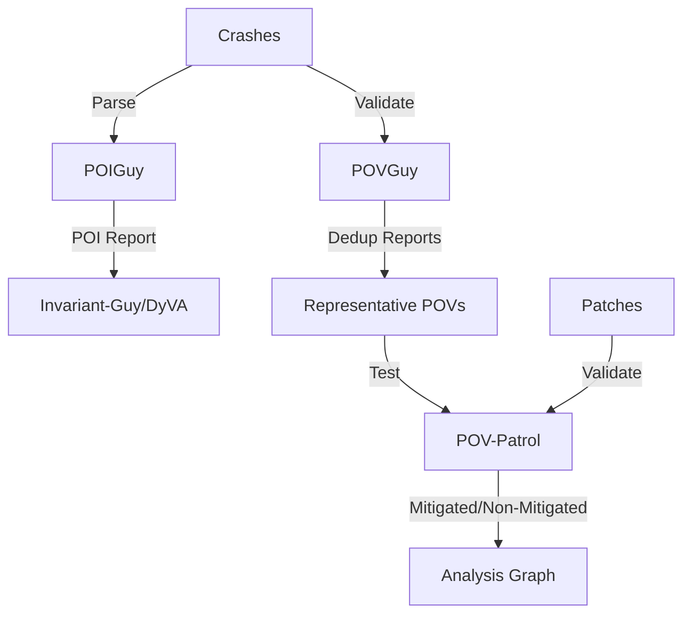

# POV Generation

POV (Proof of Vulnerability) Generation is the **final stage of bug finding** where crashes are validated, Points of Interest are identified, and exploitable proofs are generated. This ensures crashes are reliable and can be used for patch generation and vulnerability submission.

## Purpose

- Identify Points of Interest (POI) from crash reports
- Validate crashes with multiple runs for consistency
- Deduplicate crashes by root cause
- Test patches against POVs to verify fixes
- Generate exploit proofs for vulnerability submissions

## Architecture



## Components

### POIGuy

**Extracts Points of Interest** from crash reports to guide invariant mining and root cause analysis.

**Key Features**:
- Parse ASAN/MSAN stack traces
- Identify crash site and related locations
- Extract function signatures and line numbers
- Generate structured POI reports
- Support both fuzzing and static analysis sources

[Details: POIGuy](./pov-generation/poiguy.md)

### POVGuy

**Validates and deduplicates crashes** by running them multiple times and checking consistency.

**Key Features**:
- Multi-run validation (5 retries)
- Sanitizer consistency checking
- Delta mode: test against base version
- LOSAN (Java) support
- Deduplication by crash signature

[Details: POVGuy](./pov-generation/povguy.md)

### POV-Patrol

**Tests patches against POVs** to verify whether patches mitigate vulnerabilities.

**Key Features**:
- Parallel POV testing (3 workers)
- Patch artifact downloading
- Mitigated/non-mitigated classification
- Analysis graph integration
- 120-second timeout per POV

[Details: POV-Patrol](./pov-generation/pov-patrol.md)

## POV Generation Pipeline

### 1. Crash Discovery
- Fuzzers (AFL++, AFLRun, libFuzzer, Jazzer) generate crashes
- Crashes written to PDT `crashing_harness_inputs`

### 2. POI Extraction ([POIGuy](./pov-generation/poiguy.md))
```yaml
# Parse crash report
# Extract stack traces
# Identify POI:
pois:
  - reason: "crash_site"
    source_location:
      relative_file_path: "src/foo.c"
      function_signature: "int vulnerable_function(char *buf, size_t len)"
      line_number: 42
      line_text: "memcpy(stack_buf, buf, len);"
```

### 3. Crash Validation ([POVGuy](./pov-generation/povguy.md))
```python
# Run crash 5 times
for idx in range(5):
    run_pov_result = cp.run_pov(harness_name, data_file=pov_path, timeout=60)
    triggered_sanitizers = run_pov_result.pov.triggered_sanitizers
    consistently_triggered_sanitizers &= set(triggered_sanitizers)

# Only accept if sanitizers are consistent across runs
if len(consistently_triggered_sanitizers) == 0:
    reject_pov()
```

### 4. Deduplication
- Hash crash reports by stack trace + crash type
- Group similar crashes
- Select representative POV per group

### 5. Patch Validation ([POV-Patrol](./pov-generation/pov-patrol.md))
```python
# For each patch:
#   1. Download patch artifacts
#   2. Copy to temporary OSS-Fuzz project
#   3. Run POV against patched binary
#   4. Check if crash still occurs

if crash_still_occurs:
    patch.non_mitigated_povs.connect(pov_report_node)
else:
    patch.mitigated_povs.connect(pov_report_node)
```

## POI Report Schema

**Structure** (from POIGuy README):
```json
{
  "project_id": "proj-123",
  "scanner": "aflplusplus",
  "detection_strategy": "fuzzing",
  "harness_id": "harness-456",
  "crash_reason": "heap-buffer-overflow",
  "pois": [
    {
      "reason": "crash_site",
      "source_location": {
        "relative_file_path": "src/foo.c",
        "function_signature": "int vulnerable_function(char *buf, size_t len)",
        "line_text": "memcpy(stack_buf, buf, len);",
        "line_number": 42,
        "symbol_offset": 1234,
        "symbol_size": 256,
        "key_index": "src/foo.c:40:5::int vulnerable_function(char *buf, size_t len)"
      }
    }
  ],
  "stack_traces": [
    {
      "reason": "main",
      "call_locations": [
        {
          "trace_line": "#0 0x55d9c0a2b3f4 in vulnerable_function src/foo.c:42:5",
          "relative_file_path": "src/foo.c",
          "function": "vulnerable_function",
          "line_text": "memcpy(stack_buf, buf, len);",
          "line_number": 42,
          "symbol_offset": 1234,
          "symbol_size": 256,
          "key_index": "src/foo.c:40:5::int vulnerable_function(char *buf, size_t len)"
        }
      ]
    }
  ]
}
```

## Integration with Other Components

### Upstream
- **[Crash-Tracer](../crash-analysis/crash-tracer.md)**: Provides structured crash reports
- **[AFL++/AFLRun/libFuzzer/Jazzer](../fuzzing/)**: Generate crashing inputs

### Downstream
- **[Invariant-Guy](../crash-analysis/invariant-guy.md)**: Uses POI reports for tracing
- **[DyVA](../vuln-detection/dyva.md)**: Uses POI reports for root cause analysis
- **[Patch Generation](../../patch-generation/)**: Uses validated POVs for context
- **[Analysis Graph](../../infrastructure/analysis-graph.md)**: Stores POV/patch relationships

## Delta Mode

**Purpose**: Only accept crashes that trigger on patched version but NOT on base version.

**Workflow** ([POVGuy Lines 246-323](https://github.com/sslab-gatech/shellphish-afc-crs/blob/main/components/povguy/povguy.py#L246-L323)):
1. Run POV on patched project (5 times)
2. Run POV on base project (3 times)
3. If crash occurs on base: **Reject** (not a regression)
4. If crash only on patch: **Accept** (valid regression)

**Base Project Check**:
```python
if base_project:
    cp_base = OSSFuzzProject(base_project)
    for base_idx in range(retry_count // 2 + 1):
        base_run_pov_result = cp_base.run_pov(harness_name, data_file=pov_path)
        if base_pov.crash_report:
            logger.critical("POV crashes in the base project")
            exit(0)  # Reject POV
```

## Performance Characteristics

### POVGuy
- **Retries**: 5 runs for consistency
- **Timeout**: 60 seconds per run (configurable)
- **Delta mode**: 3 additional base runs
- **Total time**: ~5-10 minutes per POV

### POV-Patrol
- **Parallelism**: 3 workers
- **Timeout**: 120 seconds per POV-patch pair
- **Retries**: 3 attempts per comparison
- **Total time**: Variable based on patch count

## Related Components

- **[Crash-Tracer](../crash-analysis/crash-tracer.md)**: Provides crash reports
- **[Analysis Graph](../../infrastructure/analysis-graph.md)**: Stores POV/patch relationships
- **[Patch Generation](../../patch-generation/)**: Uses POVs for validation
