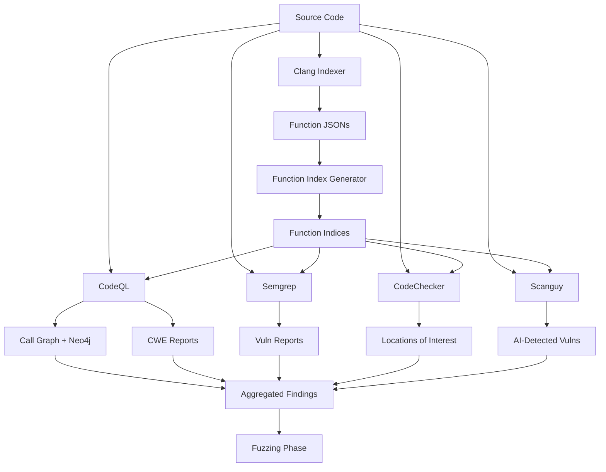

# Static Analysis

Static analysis forms the foundation of the bug-finding pipeline, examining source code without execution to identify potential vulnerabilities, code structure, and security weaknesses. The CRS employs multiple complementary static analysis tools, each with different strengths and approaches.

## Overview

The static analysis phase runs early in the pipeline, immediately after the initial project setup. It provides critical information that guides subsequent dynamic testing phases:

- **Locations of Interest**: Specific code locations flagged as potentially vulnerable
- **Functions of Interest**: Functions that merit targeted fuzzing
- **Vulnerability Candidates**: Known CWE patterns detected in the code
- **Call Graphs**: Function relationships and dataflow paths
- **Code Metadata**: Function boundaries, signatures, and structure

## Components

### Foundation Components

Before vulnerability detection can begin, two components build essential metadata about the codebase:

1. **[Clang Indexer](./static-analysis/clang-indexer.md)** - Parses C/C++ code during compilation to extract comprehensive function metadata including signatures, locations, AST structure, and call relationships.

2. **[Function Index Generator](./static-analysis/function-index-generator.md)** - Creates searchable indices from the extracted metadata, enabling fast O(1) function lookups across the entire codebase.

### Analysis Components

With metadata in place, multiple analysis engines scan for vulnerabilities:

3. **[CodeQL](./static-analysis/codeql.md)** - Semantic code analysis using dataflow and control flow queries to detect CWEs, build call graphs, and perform taint analysis.

4. **[Semgrep](./static-analysis/semgrep.md)** - Fast pattern-based scanning for common vulnerability patterns with low overhead.

5. **[CodeChecker](./static-analysis/codechecker.md)** - Clang Static Analyzer integration focusing on memory safety issues like null pointer dereferences and use-after-free.

6. **[Scanguy](./static-analysis/scanguy.md)** - LLM-powered vulnerability detection using a fine-tuned model to identify CWE patterns with semantic understanding.

## Workflow

### Phase 1: Metadata Extraction

**Clang Indexer** runs during project build, intercepting compilation commands to parse the entire codebase. For each function, it extracts:
- Full source code
- Function signature and name (fully qualified)
- Location (file, line, column, offset)
- Call relationships
- Referenced global variables
- AST information

Output: Thousands of JSON files, one per function, organized by type (FUNCTION/, METHOD/, MACRO/).

**Function Index Generator** processes these JSONs to create:
- **Signature-to-file index**: Fast lookup by function signature
- **File-to-functions index**: All functions in a given source file
- **Commit-based indices**: Delta mode for tracking changes

These indices are served via RemoteFunctionResolver API for distributed access.

### Phase 2: Parallel Analysis

Four analysis engines run concurrently, each bringing unique capabilities:

#### CodeQL - Semantic Deep Analysis
- Builds CodeQL database from source during compilation
- Runs security queries (CWE patterns) from pre-compiled query packs
- Generates complete call graph with direct and indirect call edges
- Uploads relationships to Neo4j for graph querying
- Performs taint analysis for quickseed generation
- **Strengths**: Semantic understanding, dataflow tracking, comprehensive coverage
- **Time**: 30 minutes for CWE queries

#### Semgrep - Fast Pattern Matching
- Scans source files with YAML-defined rules
- Detects specific vulnerability patterns (zip slip, path traversal, deserialization)
- Maps findings to functions using function indices
- Supports both C/C++ and Java
- **Strengths**: Fast execution, low resource usage, easy rule authoring
- **Time**: Minutes

#### CodeChecker - Memory Safety Focus
- Uses Clang Static Analyzer during build
- Focuses on C/C++ memory issues (null pointers, buffer overflows, use-after-free)
- Outputs locations and functions of interest
- **Strengths**: Deep compiler-level analysis, low false positives for memory bugs
- **Time**: Build time + analysis

#### Scanguy - AI-Powered Detection
- Fine-tuned LLM model for vulnerability detection
- Analyzes functions reachable from fuzzing harnesses
- Two-phase scan-and-validate approach
- Provides semantic reasoning about vulnerability likelihood
- **Strengths**: Novel vulnerability detection, semantic context understanding
- **Time**: Variable, GPU-dependent

### Phase 3: Result Aggregation

All findings are consolidated through:
- **SARIF reports**: Standardized format from CodeQL and Semgrep
- **Neo4j graph**: Call relationships and CWE vulnerabilities
- **Locations/Functions of Interest**: Prioritized targets for fuzzing
- **Sarifguy** component enriches reports with function metadata

## Key Design Decisions

### Multi-Tool Strategy
No single static analysis tool catches all bugs. The CRS uses complementary approaches:
- **Syntactic** (Semgrep): Fast, pattern-based, low false negatives for known patterns
- **Semantic** (CodeQL): Deep dataflow, catches complex vulnerabilities
- **Compiler** (CodeChecker): Leverages compiler knowledge for memory safety
- **AI** (Scanguy): Learns from historical vulnerabilities, semantic reasoning

### Function-Centric Organization
Everything revolves around function-level granularity:
- Function indices enable fast lookups
- Analysis reports map to specific functions
- Fuzzing targets specific functions
- Patches apply to functions

This design enables:
- Efficient delta analysis (only changed functions)
- Targeted fuzzing (locations of interest)
- Precise patch validation

### Graph-Based Relationships
Neo4j stores the complete call graph, enabling:
- Reachability analysis (what can reach this sink?)
- Impact analysis (what does this function affect?)
- Path-based reasoning (Scanguy uses paths for context)
- Vulnerability propagation tracking

### Delta Mode Support
Multiple components support delta mode for incremental analysis:
- Clang Indexer: Builds base (HEAD~1) and current (HEAD)
- CodeQL: Runs CWE queries on both versions
- Function Index Generator: Computes changed functions
- Purpose: Focus analysis on code changes, faster feedback

## Integration Points

### Upstream Dependencies
- **OSS-Fuzz**: Build infrastructure for instrumented compilation
- **Task Service**: Project source management and resource allocation

### Downstream Consumers
- **Fuzzing engines**: Use locations/functions of interest for targeting
- **Grammar-Guy**: Uses function metadata and call graphs for grammar generation
- **Patch components**: Use vulnerability locations for patch generation
- **POV generation**: Uses findings for exploit creation

## Performance Characteristics

| Component | CPU | Memory | Time | Parallelism |
|-----------|-----|--------|------|-------------|
| Clang Indexer | 6-10 cores | 26-40 GB | ~Build time | Per-file |
| Function Index Generator | 0.45 cores | 2 GB | Minutes | Multi-process |
| CodeQL | 0 threads | 11 GB RAM | 30 min | Query-level |
| Semgrep | 1 core | 1 GB | <5 min | Per-file |
| CodeChecker | 0.5 cores | 500 MB | ~Build time | Build-time |
| Scanguy | 1 core | 4 GB | 30 min | 100 threads |

## Output Formats

### SARIF (Static Analysis Results Interchange Format)
CodeQL and Semgrep produce SARIF reports containing:
- Rule ID and severity
- Location (file, line, column)
- Message and description
- Code flows (data flow paths)
- Related locations
- CWE tags

### Neo4j Graph
Stores relationships as nodes and edges:
- **Nodes**: CFGFunction, CWEVulnerability, CFGGlobalVariable
- **Edges**: DIRECTLY_CALLS, MAYBE_INDIRECT_CALLS, HAS_CWE_VULNERABILITY

### JSON Reports
Custom JSON formats for component-specific data:
- Function indices (signature → file mappings)
- Vulnerability reports (function → findings)
- Locations of interest (file:line lists)

## Next Steps

After static analysis completes:
1. Findings feed into [Grammar & Input Generation](./grammar.md) for intelligent seed creation
2. Locations of interest guide [Fuzzing Engines](./fuzzing.md) for targeted testing
3. Call graphs inform [Coverage Monitoring](./coverage.md) for reachability analysis
4. CWE findings prioritize [Patch Generation](../patch-generation.md) efforts
