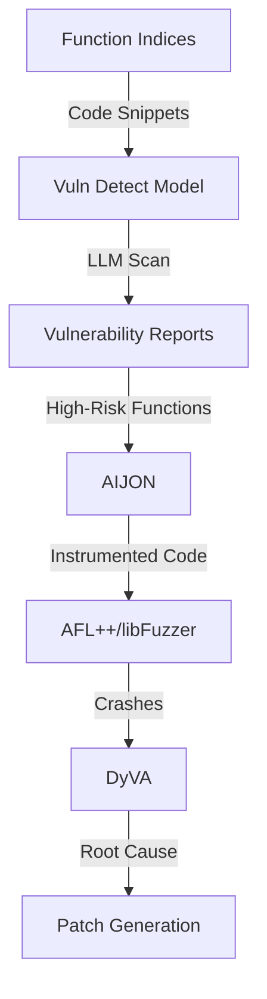

# Vulnerability Detection

The CRS uses **AI-powered vulnerability detection** to identify security issues beyond what fuzzers and static analyzers can find. This includes LLM-based code scanning, dynamic vulnerability analysis, and IJON-instrumented fuzzing to guide fuzzers toward vulnerability-prone code paths.

## Purpose

- LLM-based vulnerability scanning of functions
- Dynamic vulnerability analysis with root cause analysis
- IJON instrumentation for targeted fuzzing
- Detect vulnerabilities before they are triggered by fuzzers
- Prioritize high-risk code for analysis

## Architecture



## Components

### Vuln Detect Model

**AI-powered vulnerability scanner** using fine-tuned LLMs to detect CWE vulnerabilities in function-level code snippets.

**Key Features**:
- Fine-tuned Qwen2.5-7B model for vulnerability detection
- GPU-based inference (40 concurrent jobs)
- Scans all functions from clang-indexer
- Focuses on 7 C/C++ and 8 Java CWE categories

[Details: Vuln Detect Model](./vuln-detection/vuln-detect-model.md)

### DyVA (Dynamic Vulnerability Analyzer)

**Root cause analysis for crashes** using dynamic analysis to identify the precise vulnerability location and type.

**Key Features**:
- Dynamic tracing of crash execution
- Root cause localization
- Variable value analysis at crash sites
- Builds on POI reports

[Details: DyVA](./vuln-detection/dyva.md)

### AIJON

**LLM-based IJON instrumentation** that adds `__AFL_IJON_MAX()` annotations to guide AFL++ toward vulnerability-prone code paths.

**Key Features**:
- LLM-driven source code instrumentation
- Analysis graph integration for coverage-guided targeting
- Parallel instrumentation (20 workers)
- Supports SARIF, CodeSwipe, and patch reports

[Details: AIJON](./vuln-detection/aijon.md)

## Vulnerability Detection Pipeline

### 1. Static Vulnerability Scanning ([Vuln Detect Model](./vuln-detection/vuln-detect-model.md))

**Input**: Function indices from clang-indexer
**Process**:
- Iterate through FUNCTION/, MACRO/, METHOD/ directories
- For each function JSON, extract code snippet
- Query LLM with vulnerability detection prompt
- LLM checks for CWE-specific vulnerabilities
- Output structured report with #judge (yes/no) and #type (CWE-XX)

**CWEs in Scope**:
- **C/C++**: CWE-125, 787, 119, 416, 415, 476, 190
- **Java**: CWE-22, 77, 78, 94, 190, 434, 502, 918

### 2. IJON Instrumentation ([AIJON](./vuln-detection/aijon.md))

**Input**: Vulnerability reports (SARIF, CodeSwipe, or patches)
**Process**:
- Parse vulnerability report to extract POI
- Query Analysis Graph for closest covered caller
- Find call paths from covered functions to vulnerable sinks
- Generate IJON annotations with LLM
- Apply instrumentation to source code
- Create allowlist for AFL++ to focus fuzzing

**Output**:
- Instrumented source code
- Function allowlist
- Seed corpus ZIP for each harness

### 3. Root Cause Analysis ([DyVA](./vuln-detection/dyva.md))

**Input**: Crashes from fuzzers + POI reports
**Process**:
- Replay crash with dynamic tracing
- Track variable values leading to crash
- Identify root cause location
- Extract local variable states

**Output**: DyVA report with root cause and variable analysis

## Integration with Fuzzing

### IJON-Guided Fuzzing

**Workflow**:
1. AIJON instruments code with `__AFL_IJON_MAX()` at vulnerability sites
2. AFL++ compiles instrumented code
3. Fuzzer explores paths toward IJON annotations
4. Higher IJON values = closer to vulnerability
5. AFL++ prioritizes inputs that increase IJON counters

**Example IJON Annotation**:
```c
void vulnerable_function(char *buf, size_t len) {
    __AFL_IJON_MAX(len);  // Guide fuzzer to maximize len

    if (len > MAX_SIZE) {
        // Vulnerability: buffer overflow
        memcpy(global_buffer, buf, len);
    }
}
```

### Allowlist Mechanism

**Purpose**: Focus fuzzing on vulnerability-relevant code paths

**Implementation** ([AIJON main.py Lines 444-448](https://github.com/sslab-gatech/shellphish-afc-crs/blob/main/components/aijon/main.py#L444-L448)):
```python
if len(allow_list_funcs) > 0:
    allowlist_file.write_text("\n".join(allow_list_funcs) + "\n")
    logger.success(
        f"📝 Allowlist file is saved to {allowlist_file} with {len(allow_list_funcs)} functions."
    )
```

**Usage**: AFL++ uses allowlist to preferentially instrument functions in call paths to vulnerabilities.

## Performance Characteristics

### Vuln Detect Model
- **GPU**: Dedicated nodes with `support.shellphish.net/only-gpu: "true"`
- **Throughput**: 180 requests/minute (rate limited)
- **Batch size**: 1000 functions per batch
- **Max tokens**: 8192 per response
- **Temperature**: 0.5 (moderate randomness)

### AIJON
- **Parallelism**: 20 worker processes
- **Cost**: Variable (LLM-based instrumentation)
- **Retries**: Up to 10 attempts with 10-minute backoff

### DyVA
- **Resources**: Dynamic tracing overhead
- **Priority**: Based on harness queue depth
- **Timeout**: 180 minutes

## Related Components

- **[Clang Indexer](../static-analysis/clang-indexer.md)**: Provides function code snippets
- **[CodeQL](../static-analysis/codeql.md)**: Complementary static analysis
- **[AFL++](../fuzzing/aflplusplus.md)**: Consumes IJON instrumentation
- **[POI-Guy](../pov-generation/poi-guy.md)**: Identifies points of interest for DyVA
- **[Analysis Graph](../../infrastructure/analysis-graph.md)**: Coverage data for AIJON targeting
