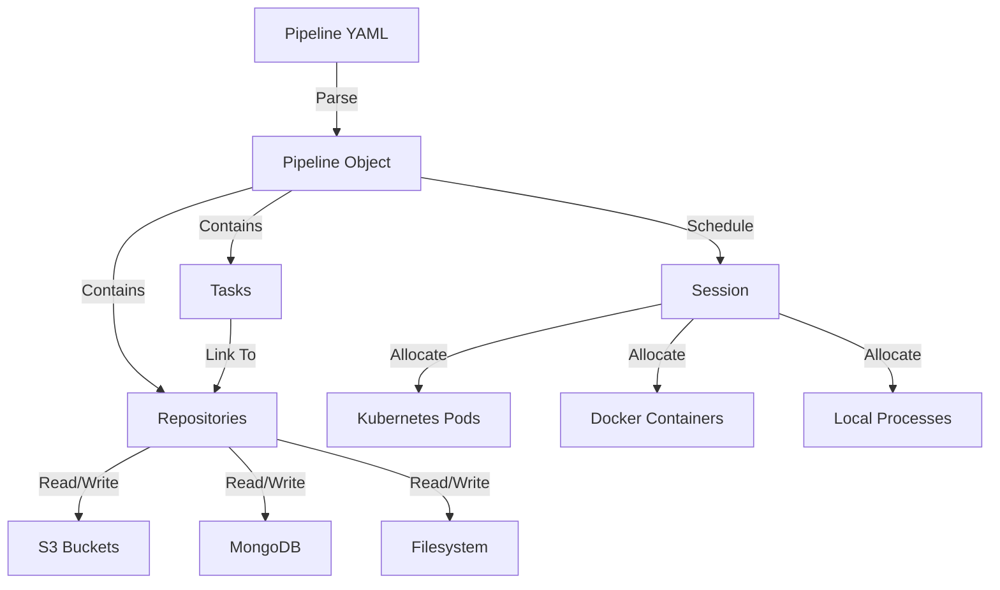

# PyDataTask

PyDataTask is the **task orchestration framework** that drives the entire CRS pipeline. It provides a flexible, declarative system for defining data processing tasks, managing their dependencies through repositories, and executing them across distributed infrastructure.

## Purpose

- Orchestrate multi-step data pipelines across distributed systems
- Manage task dependencies implicitly through shared repositories
- Abstract storage backends (filesystem, S3, MongoDB, Docker)
- Schedule jobs on Kubernetes, Docker, or local execution
- Handle resource quotas, priorities, and rate limiting
- Support streaming data flows for long-running components

## Architecture



## Core Concepts

### 1. Tasks

**Definition** ([task.py:1-8](https://github.com/sslab-gatech/shellphish-afc-crs/blob/main/libs/pydatatask/pydatatask/task.py#L1-L8)):
> A Task is a unit of execution which can act on multiple repositories.
> Tasks are related to Repositories by Links.

**Key Point**: A task is **parameterized** by a **job** - a single instance of work. For example:
- Task: `patcherq_patch_mode`
- Job: `poi-report-12345` (unique ID for one POI report)

**Task Types**:
- **InProcessSyncTask**: Python function executed in-process
- **ExecutorTask**: Python function with concurrent.futures Executor
- **ProcessTask**: Script execution locally or over SSH
- **KubeTask**: Script execution on Kubernetes cluster
- **KubeFunctionTask**: Python function on Kubernetes
- **ContainerTask**: Docker container execution

### 2. Repositories

**Definition** ([README.rst:18-27](https://github.com/sslab-gatech/shellphish-afc-crs/blob/main/libs/pydatatask/README.rst#L18-L27)):
> Repository classes are the core of pydatatask. You can store your data in any way you desire and as long as you can write a repository class to describe it, it can be used to drive a pipeline.

**Types**:
- **MetadataRepository**: Structured objects (JSON, YAML)
- **BlobRepository**: Streaming interface (files, S3)
- **StreamingRepository**: Continuous data flows
- **DockerRepository**: Container images

**Example Repositories** ([README.rst:29-36](https://github.com/sslab-gatech/shellphish-afc-crs/blob/main/libs/pydatatask/README.rst#L29-L36)):
```python
- In-memory dicts
- Files or directories on the local filesystem
- S3 or compatible buckets
- MongoDB collections
- Docker repositories
- Various combinators
```

### 3. Links

**Purpose**: Connect tasks to repositories with metadata about the relationship.

**Link Kinds**:
- **InputFilepath**: Task reads from repository
- **OutputFilepath**: Task writes to repository
- **InputMetadata**: Task reads metadata
- **OutputMetadata**: Task writes metadata
- **StreamingInputFilepath**: Continuous input stream
- **StreamingOutputFilepath**: Continuous output stream

**Example**:
```yaml
links:
  poi_report:
    repo: poi_reports
    kind: InputFilepath
  patch_diff:
    repo: patch_diffs
    kind: OutputFilepath
```

### 4. Pipeline

**Definition** ([pipeline.py:1-4](https://github.com/sslab-gatech/shellphish-afc-crs/blob/main/libs/pydatatask/pydatatask/pipeline.py#L1-L4)):
> A pipeline is just an unordered collection of tasks.
> Relationships between the tasks are implicit, defined by which repositories they share.

**Key Feature**: Dependency inference through shared repositories.

**Example Flow**:
1. Task A writes to `poi_reports` repository
2. Task B reads from `poi_reports` repository
3. PyDataTask infers: B depends on A
4. B only runs after A completes

## Implementation

### Pipeline Object

**Constructor** ([pipeline.py:199-222](https://github.com/sslab-gatech/shellphish-afc-crs/blob/main/libs/pydatatask/pydatatask/pipeline.py#L199-L222)):

```python
class Pipeline:
    def __init__(
        self,
        tasks: Iterable[Task],
        session: Session,
        priority: Optional[Callable[[str, str, int], Awaitable[float]]] = None,
        agent_version: str = "unversioned",
        agent_secret: str = "insecure",
        agent_port: int = 6132,
        agent_hosts: Optional[Dict[Optional[Host], str]] = None,
        source_file: Optional[Path] = None,
        long_running_timeout: Optional[timedelta] = None,
        global_template_env: Optional[Dict[str, str]] = None,
        global_script_env: Optional[Dict[str, str]] = None,
        max_job_quota: Optional[Quota] = None,
    ):
        """
        :param priority: A function which takes a task name, job, and replica, and returns a float priority.
                         The priority *must* be monotonically decreasing as replica increases.
                         Higher numbers = higher priority.
        """
```

**Priority System**: Jobs scheduled by priority (higher = first). No second replicas until all first replicas scheduled.

### Update Loop

**Two-Phase Process** ([pipeline.py:392-407](https://github.com/sslab-gatech/shellphish-afc-crs/blob/main/libs/pydatatask/pydatatask/pipeline.py#L392-L407)):

```python
async def update(self, launch: bool = True) -> bool:
    """Perform one round of pipeline maintenance, running the update phase and then the launch phase."""

    # Phase 1: Update - Check job status
    info = await self._update_only_update()

    # Phase 2: Launch - Schedule new jobs
    result = (await self._update_only_launch(info)) if launch else False

    return any(any(live) or any(reaped) for live, reaped, _ in info.values()) or result
```

**Update Phase**:
1. Query all tasks for live jobs
2. Query all tasks for completed jobs
3. Query all tasks for ready-to-launch jobs

**Launch Phase**:
1. Collect ready jobs from all tasks
2. Sort by priority
3. Check resource quotas
4. Check rate limits
5. Launch jobs that fit within constraints

### Quota System

**Job Quota** ([pipeline.py:623-652](https://github.com/sslab-gatech/shellphish-afc-crs/blob/main/libs/pydatatask/pydatatask/pipeline.yaml#L623-L652)):

```python
# Each task can have a max number of jobs overall
mcj = await self.tasks[task].get_max_concurrent_jobs(job)
if mcj is not None and len(live_jobs[task]) >= mcj:
    l.debug("Too many concurrent jobs (%d) to launch %s:%s ", mcj, task, job)
    continue

# Get available quota pools
avaliable_quota_pools: QuotaPoolSet = await quota_with_used.get_matching_pools(
    self, task, job
)

# Try to reserve resources
(launch_reservation, alloc, excess) = await avaliable_quota_pools.try_reserve(
    task=self.tasks[task],
    job=job,
    replica=0,
    quota=quota_overrides.get((task, job), None)
)

if excess is not None or launch_reservation is None:
    # Not enough quota
    continue

# Launch job with reservation
await self.tasks[task].launch(job, replica, reservation=launch_reservation)
```

**Quota Tracking**:
- CPU cores
- Memory (GB)
- GPU count
- Max concurrent jobs per task

### Rate Limiting

**Spawn Rate Control** ([pipeline.py:668-678](https://github.com/sslab-gatech/shellphish-afc-crs/blob/main/libs/pydatatask/pydatatask/pipeline.py#L668-L678)):

```python
if last_period[task] >= self.tasks[task].max_spawn_jobs:
    l.debug(
        "Rate limit launching %s:%s: %d/%d",
        task, job,
        last_period[task],
        self.tasks[task].max_spawn_jobs,
    )
    if launch_reservation is not None:
        launch_reservation.release()
    continue
```

**Purpose**: Prevent overwhelming infrastructure with too many concurrent starts.

### Replication

**Slow-Start Replication** ([pipeline.py:727-746](https://github.com/sslab-gatech/shellphish-afc-crs/blob/main/libs/pydatatask/pydatatask/pipeline.py#L727-L746)):

```python
instant_start_replicas = self.tasks[next_guy.task.name].starting_replicas or 1
repl_per_min = self.tasks[next_guy.task.name].replicas_per_minute or 5

job_age = get_age_of_job(next_guy.task.name, next_guy.job)
if job_age is None:
    job_age = timedelta(seconds=0)

slow_start_max = instant_start_replicas + math.ceil(job_age.seconds / (60 / repl_per_min))

if next_guy.replica > slow_start_max:
    # Slowly roll out replicas
    heapq.heappop(sched.replica_heap)
    l.debug(f"🐢 Limiting replicas for {next_guy.task.name}:{next_guy.job} due to slow start policy")
    continue
```

**Slow-Start Strategy**:
1. Launch `starting_replicas` immediately (default: 1)
2. Add `replicas_per_minute` every minute (default: 5)
3. Prevents thundering herd on large jobs

## Template System

**Jinja2 Templating** ([task.py:110-149](https://github.com/sslab-gatech/shellphish-afc-crs/blob/main/libs/pydatatask/pydatatask/task.py#L110-L149)):

```python
async def render_template(template, template_env: Dict[str, Any]):
    """Use jinja2 to parameterize the template with the environment."""
    j = jinja2.Environment(
        undefined=jinja2.StrictUndefined,
        enable_async=True,
        keep_trailing_newline=True,
    )

    # Custom filters
    j.filters["shquote"] = shquote  # Shell quote strings
    j.filters["to_yaml"] = yaml.safe_dump  # Convert to YAML
    j.filters["to_json"] = json.dumps  # Convert to JSON
    j.filters["export_env"] = export_env  # Export environment variables
    j.filters["base64_files"] = base64_files  # Decode base64 files
```

**Example Template**:
```yaml
template: |
  export POI_REPORT={{ poi_report | shquote }}
  export PATCH_DIFF={{ patch_diff | shquote }}
  export PROJECT_NAME={{ project_name | shquote }}

  /src/run.sh
```

## CRS Usage Examples

### Example 1: PatcherQ Pipeline

**Configuration** ([patcherq/pipeline.yaml:103-198](https://github.com/sslab-gatech/shellphish-afc-crs/blob/main/components/patcherq/pipeline.yaml#L103-L198)):

```yaml
patcherq_patch_mode:
  job_quota:
    cpu: 4
    mem: "8Gi"
    gpu: 1
  priority: 100000
  max_concurrent_jobs: 50
  max_spawn_jobs: 10
  max_spawn_jobs_period: 60s

  links:
    poi_report:
      repo: poi_reports
      kind: InputFilepath

    patch_diff:
      repo: patch_diffs
      kind: OutputFilepath

    patch_metadata:
      repo: patch_metadatas
      kind: OutputMetadata

  template: |
    export POI_REPORT={{ poi_report | shquote }}
    export PATCH_DIFF={{ patch_diff | shquote }}
    export PATCH_METADATA={{ patch_metadata_path | shquote }}

    /src/run.sh
```

**Flow**:
1. POIGuy uploads POI report to `poi_reports` repository
2. PyDataTask detects new key in `poi_reports`
3. PyDataTask launches PatcherQ job with that POI report
4. PatcherQ generates patch, writes to `patch_diffs`
5. PatcherG detects new patch in `patch_diffs`
6. PatcherG scores and submits patch

### Example 2: Coverage-Guy Streaming

**Configuration** ([coverage-guy/pipeline.yaml:25-65](https://github.com/sslab-gatech/shellphish-afc-crs/blob/main/components/coverage-guy/pipeline.yaml#L25-L65)):

```yaml
covguy:
  long_running: true
  require_success: true

  links:
    fuzzer_seeds_streaming:
      repo: fuzzer_seeds
      kind: StreamingInputFilepath

    coverage_stats_streaming:
      repo: coverage_stats
      kind: StreamingOutputFilepath

  template: |
    python /src/monitor_fast.py \
      --seeds-dir {{ fuzzer_seeds_streaming | shquote }} \
      --stats-output {{ coverage_stats_streaming | shquote }}

    exit 1  # Runs forever
```

**Flow**:
1. Fuzzers continuously write seeds to `fuzzer_seeds` streaming repository
2. Coverage-Guy monitors directory for new files
3. Coverage-Guy traces each seed, uploads to Analysis Graph
4. Coverage-Guy writes stats to `coverage_stats` streaming repository
5. Task never exits (long-running)

### Example 3: Repository Types

**S3 Bucket Repository**:
```python
books_repo = pydatatask.S3BucketRepository(bucket, "books/", '.txt')
```

**MongoDB Metadata Repository**:
```yaml
poi_reports:
  type: mongodb
  collection: poi_reports
  database: crs
```

**Filesystem Blob Repository**:
```python
reports_repo = pydatatask.FileRepository('./reports', '.txt')
```

**YAML Metadata Repository**:
```python
done_repo = pydatatask.YamlMetadataFileRepository('./results/')
```

## Performance Characteristics

- **Update Loop**: Runs continuously, checking for new jobs every ~1 second
- **Scheduling Latency**: <5 seconds from job readiness to launch
- **Parallel Workers**: 15 workers handle launches in parallel
- **Quota Refresh**: Queries Kubernetes API for available resources
- **Cache Flush**: Soft flush every update, hard flush every 30 minutes
- **Priority Scheduling**: O(n log n) with heap-based priority queue

## Configuration

**Pipeline Definition** ([patcherq/pipeline.yaml:1-20](https://github.com/sslab-gatech/shellphish-afc-crs/blob/main/components/patcherq/pipeline.yaml#L1-L20)):

```yaml
session:
  bucket_endpoint: "${BUCKET_ENDPOINT}"
  bucket_username: "${BUCKET_USERNAME}"
  bucket_password: "${BUCKET_PASSWORD}"
  mongodb_url: "${MONGODB_URL}"

repositories:
  poi_reports:
    type: mongodb
    collection: poi_reports

  patch_diffs:
    type: s3
    bucket: patches
    prefix: diffs/

tasks:
  patcherq_patch_mode:
    # Task configuration here
```

## Related Components

All CRS components use PyDataTask:

- **[Bug Finding](../bug-finding.md)**: Orchestrates static analysis, fuzzing, crash analysis
- **[Patch Generation](../patch-generation.md)**: Coordinates PatcherG, PatcherQ, PatcherY
- **[SARIF Processing](../sarif-processing.md)**: Manages SARIF validation workflow
- **[Analysis Graph](./analysis-graph.md)**: Stores metadata for job tracking

## Documentation

**Official Docs**: https://pydatatask.readthedocs.io/en/stable/

**CRS Library**: [`libs/pydatatask/`](https://github.com/sslab-gatech/shellphish-afc-crs/tree/main/libs/pydatatask)
