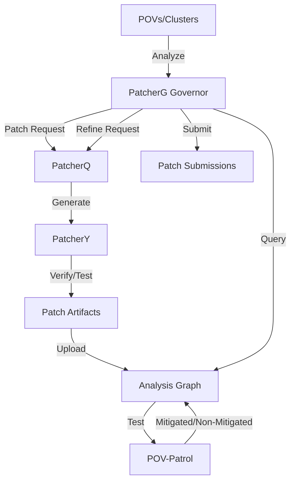

# Patch Generation

Patch Generation is the **final stage of the bug-finding pipeline** where vulnerabilities are automatically fixed by generating, validating, and submitting patches. The system uses a sophisticated multi-tier architecture with an orchestrator (PatcherG), LLM-based generator (PatcherQ), and source-level patcher (PatcherY).

## Purpose

- Orchestrate patch generation across POVs and clusters
- Generate patches with LLM-driven code analysis
- Apply source-level patches with verification
- Score and rank patches by effectiveness
- Strategic submission timing based on deadlines
- Refine patches when bypassed by new POVs

## Architecture



## Three-Tier Architecture

### Tier 1: PatcherG (Governor)

**Orchestrates the entire patch generation process**.

**Key Features**:
- Cluster analysis with POV grouping
- Patch scoring and ranking (Bayesian likelihood)
- Strategic submission timing (timeouts, deadlines)
- Endgame submission strategy
- Refine/Bypass request generation
- Perfect vs imperfect patch classification

**Core Algorithm**:
```python
while True:
    clusters = find_clusters(project_id)  # Group related POVs
    for cluster in clusters:
        analyze_cluster(cluster)
        if perfect_patch_exists and is_old_enough:
            submit_patch()
        elif in_endgame and imperfect_patch_exists:
            submit_best_effort_patch()
        if patch_bypassed:
            issue_refine_request()
        if perfect_patch_exists:
            issue_bypass_request()  # Test against other projects
    sleep(30)
```

[Details: PatcherG](./patch-generation/patcherg.md)

### Tier 2: PatcherQ (Queue)

**LLM-driven patch generation** with context-aware code analysis.

**Three Modes**:
1. **SARIF Mode**: Generate patches from static analysis reports
2. **PATCH Mode**: Generate patches from POI reports (crash sites)
3. **REFINE Mode**: Refine existing patches to fix new bypassing POVs

**Key Features**:
- Multi-POI patching (fix multiple bugs in one patch)
- CodeQL server integration for dataflow analysis
- DyVA report integration for root cause context
- Function-level context with clang-indexer
- Parallel patch generation
- Patch deduplication

[Details: PatcherQ](./patch-generation/patcherq.md)

### Tier 3: PatcherY (Patcher)

**Source-level patch application and verification**.

**Key Features**:
- LLM-based code generation with GPT-4o
- Multi-run verification (compile, test, sanitizer)
- Patch ranking for multiple candidates
- OSS-Fuzz integration
- Continuous verification with 3-5 retries

[Details: PatcherY](./patch-generation/patchery.md)

## Patch Generation Flow

### 1. POV Clustering ([PatcherG Lines 956-978](https://github.com/sslab-gatech/shellphish-afc-crs/blob/main/components/patcherg/patcherg/__main__.py#L956-L978))

```python
clusters = find_clusters(project_id)
for cluster in clusters:
    bucket_key = hashlib.md5("".join(
        sorted([dedup.identifier for dedup in cluster.organizer_dedup_info_nodes])
    ).encode()).hexdigest()
    cluster_map[bucket_key] = cluster
```

**Clustering**: Groups POVs with same root cause into "buckets" (clusters).

### 2. Cluster Analysis ([Lines 340-504](https://github.com/sslab-gatech/shellphish-afc-crs/blob/main/components/patcherg/patcherg/__main__.py#L340-L504))

```python
def analyze_cluster(i, cluster: Cluster):
    perfect_patches = []
    most_recent_best_patch = None
    oldest_best_patch = None

    for patch in cluster.generated_patches:
        mitigated_in_cluster = patch.mitigated_povs.filter(
            key__in=[pov.key for pov in cluster.pov_report_nodes]
        ).all()

        if len(mitigated_in_cluster) == len(cluster.pov_report_nodes):
            perfect_patches.append(patch)  # Mitigates ALL POVs

        if len(mitigated_in_cluster) > most_recent_best_mitigated:
            oldest_best_patch = patch
            most_recent_best_patch = patch
```

**Perfect Patch**: Mitigates all POVs in cluster.

**Best Patch**: Mitigates most POVs (may not be perfect).

### 3. Patch Request Generation ([Lines 777-921](https://github.com/sslab-gatech/shellphish-afc-crs/blob/main/components/patcherg/patcherg/__main__.py#L777-L921))

```python
def process_bucket(project_id, bucket_key, cluster_map, patch_request_meta_path, bucket_analysis, patch_bypass_requests):
    cluster = cluster_map.get(bucket_key)

    # No patches yet? Issue initial patch request
    if len(cluster.generated_patches) == 0:
        latest_discovered_pov = max(cluster.pov_report_nodes, key=lambda pov: pov.first_discovered)
        write_patch_request('patch', poi_report_id=latest_discovered_pov.key, bucket_id=bucket_key)

    # Perfect patch exists? Issue bypass request
    if perfect_patch_exists:
        write_bypass_request(patch_id=perfect_patch.patch_key, ...)

    # Patch bypassed? Issue refine request
    if non_mitigated_povs:
        latest_unmitigated_pov = max(non_mitigated_pov_nodes, key=lambda pov: pov.first_discovered)
        write_patch_request('refine', poi_report_id=latest_unmitigated_pov.key, patch_id=best_patch_id)
```

### 4. LLM Patch Generation (PatcherQ)

**PATCH Mode** ([PatcherQ run.py Lines 79-96](https://github.com/sslab-gatech/shellphish-afc-crs/blob/main/components/patcherq/src/run.py#L79-L96)):
```python
if args.patcherq_mode == "PATCH":
    with open(args.poi_report, 'r') as f:
        poi_report = yaml.load(f)
    sanitizer_to_build_with = poi_report['sanitizer']

    with open(args.patch_request_meta, 'r') as f:
        patch_request_meta = PatchRequestMeta.model_validate(yaml.safe_load(f))

    # Generate patch for this POI
    pq_main(poi_report=poi_report, patch_request_meta=patch_request_meta, ...)
```

**REFINE Mode** ([Lines 107-126](https://github.com/sslab-gatech/shellphish-afc-crs/blob/main/components/patcherq/src/run.py#L107-L126)):
```python
elif args.patcherq_mode == "REFINE":
    with open(args.patch_request_meta, 'r') as f:
        patch_request_meta = PatchRequestMeta.model_validate(yaml.safe_load(f))

    assert patch_request_meta.request_type == "refine"
    assert patch_request_meta.patch_id != None

    # Refine existing patch to fix new POV
    pq_main(failing_patch_id=patch_request_meta.patch_id, ...)
```

### 5. Patch Scoring ([Lines 95-133](https://github.com/sslab-gatech/shellphish-afc-crs/blob/main/components/patcherg/patcherg/__main__.py#L95-L133))

```python
def score_patch(patch: GeneratedPatch, cluster: Cluster) -> float:
    mitigated_in_cluster = len(patch.mitigated_povs.filter(
        key__in=[pov.key for pov in cluster.pov_report_nodes]
    ).all())
    unmitigated_in_cluster = len(patch.non_mitigated_povs.filter(
        key__in=[pov.key for pov in cluster.pov_report_nodes]
    ).all())

    total_povs = mitigated_in_cluster + unmitigated_in_cluster
    return bayesian_likelihood_score(mitigated_in_cluster, total_povs)

def bayesian_likelihood_score(k: int, n: int, alpha: float = 1.0, beta: float = 1.0) -> float:
    """
    Bayesian likelihood-style score using Beta prior.
    E[p | data] = (k + alpha) / (n + alpha + beta)

    Properties (with alpha = beta = 1):
        • 3/3 (0.800)  > 2/3 (0.600)
        • 49/50 (0.962) > 3/3 (0.800)
        • 50/50 (0.981) > 3/3 (0.800)
    """
    if n <= 0:
        return 0
    return (k + alpha) / (n + alpha + beta)
```

**Scoring**: Higher score = better patch. Bayesian approach favors patches with more testing (higher `n`).

### 6. Strategic Submission ([Lines 506-627](https://github.com/sslab-gatech/shellphish-afc-crs/blob/main/components/patcherg/patcherg/__main__.py#L506-L627))

```python
def select_patches_to_submit(cluster_and_analysis_pairs) -> Iterator[tuple[GeneratedPatch, bool, Cluster]]:
    for cluster, analysis in cluster_and_analysis_pairs:
        is_imperfect = False
        time_to_deadline = get_time_to_deadline()
        in_endgame = time_to_deadline < timedelta(minutes=45)  # NON_PERFECT_PATCH_SUBMISSION_TIMEOUT_MINUTES

        # Submit perfect patch if old enough
        if analysis.perfect_patches and analysis.oldest_best_patch:
            if is_patch_older_than_minutes(analysis.oldest_best_patch, good_patch_submission_timeout_minutes):
                yield analysis.oldest_best_patch, is_imperfect, cluster

        # Endgame: submit best imperfect patch
        elif in_endgame and analysis.most_recent_best_patch and not analysis.already_submitted_patches:
            is_imperfect = True
            analysis.oldest_best_patch.imperfect_submission_in_endgame = True
            yield analysis.oldest_best_patch, is_imperfect, cluster
```

**Timeouts**:
- **Full mode** (12-hour): 60-minute wait for perfect patches
- **Delta mode** (6-hour): 30-minute wait for perfect patches
- **Endgame**: 45 minutes before deadline, submit imperfect patches

## Integration with Other Components

### Upstream
- **[POVGuy](./bug-finding/pov-generation/povguy.md)**: Provides validated POVs
- **[POIGuy](./bug-finding/pov-generation/poiguy.md)**: Provides POI reports for patching
- **[DyVA](./bug-finding/vuln-detection/dyva.md)**: Provides root cause context
- **[CodeQL](./bug-finding/static-analysis/codeql.md)**: Provides SARIF reports

### Downstream
- **[POV-Patrol](./bug-finding/pov-generation/pov-patrol.md)**: Tests patches against POVs
- **[Analysis Graph](./infrastructure/analysis-graph.md)**: Stores patch-POV relationships
- **[Submission](./infrastructure/submission.md)**: Submits patches to competition

## Performance Characteristics

### PatcherG
- **Polling interval**: 30 seconds
- **Timeout adjustment**: Logarithmic growth based on cluster count
- **Submission limits**: 3 imperfect patches maximum (full mode)
- **Priority**: Critical node pool (high-priority tasks)

### PatcherQ
- **Modes**: SARIF, PATCH, REFINE
- **CodeQL integration**: Optional dataflow analysis
- **LLM budget**: Custom budget for CI runs
- **Timeout**: 180 minutes for complex patches

### PatcherY
- **Model**: GPT-4o (oai-gpt-4o)
- **Verification**: Compile + test + sanitizer checks
- **Retries**: 3-5 attempts per verification stage
- **Ranking**: Multiple candidates scored by success rate

## Related Components

- **[POV Generation](./bug-finding/pov-generation.md)**: Provides POVs for patching
- **[Analysis Graph](./infrastructure/analysis-graph.md)**: Stores patch-POV relationships
- **[PDT](./infrastructure/pydatatask.md)**: Task orchestration framework
- **[Submission](./infrastructure/submission.md)**: Handles patch submissions
