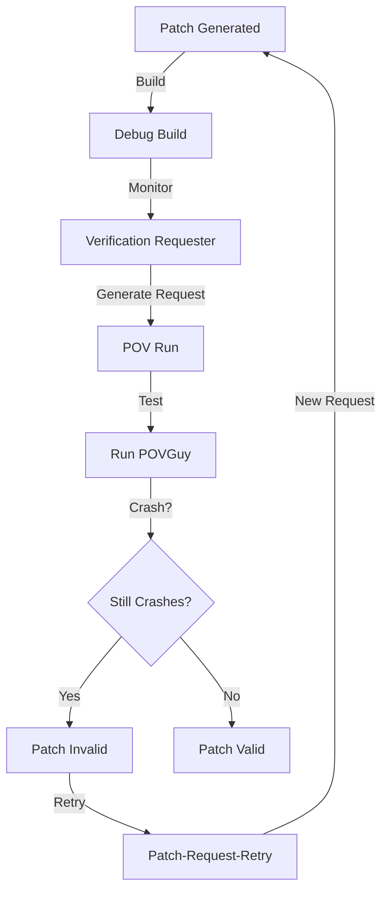

# Patch Validation & Testing

Patch validation components ensure generated patches correctly fix vulnerabilities without introducing regressions. Two related components handle this:

1. **Patch-Request-Retry**: Generates retry requests for failed patches
2. **Patch-Validation-Testing**: Tests patches against representative crashing inputs

## Purpose

- Validate patches fix crashes without regressions
- Generate verification requests for patch testing
- Track patch invalidation results
- Debug build patches for testing
- Long-running verification monitoring

## Components

### Patch-Request-Retry

**Monitors patch failures and generates retry requests**.

**Implementation**: [`requestor.py`](https://github.com/sslab-gatech/shellphish-afc-crs/blob/main/components/patch-request-retry/requestor.py)

**Workflow** ([requestor.py Lines 45-106](https://github.com/sslab-gatech/shellphish-afc-crs/blob/main/components/patch-request-retry/requestor.py#L45-L106)):

```python
def step(args):
    patch_metadata = load_meta(args.patch_metadata)

    # Find crashing commit reports matching patch
    ready_crashing_commit_reports = [
        (file, report) for (file, report) in ready_crashing_commit_reports
        if report.crashing_commit == args.crashing_commit_sha
    ]

    # Find representative crashing inputs
    ready_representative_crashing_inputs_metadata = [
        (file, meta) for (file, meta) in ready_representative_crashing_inputs_metadata
        if (
            file.name in commit_report_ids and
            meta.harness_info_id == patch_metadata['pdt_harness_info_id'] and
            args.sanitizer_id in meta.consistent_sanitizers
        )
    ]

    # Generate verification requests
    for file, meta in ready_representative_crashing_inputs_metadata:
        request = PatchVerificationRequest(
            project_id=meta.project_id,
            harness_id=meta.harness_info_id,
            patch_id=args.patch_id,
            crashing_commit_sha=str(args.crashing_commit_sha).lower(),
            crashing_commit_report_id=file.name,
            crash_report_representative_crashing_input_id=file.name,
            sanitizer_id=args.sanitizer_id,
        )
        with (args.output_verification_requests / f'{args.patch_id}_{file.name}').open('w') as f:
            yaml.safe_dump(request.model_dump(), f)

def main(args):
    while True:
        step(args)
        time.sleep(20)  # Poll every 20 seconds
```

**Polling**: Runs every 20 seconds to generate new verification requests.

### Patch-Validation-Testing

**Tests patches against representative crashing inputs to verify fixes**.

**Pipeline**: [`pipeline.yaml`](https://github.com/sslab-gatech/shellphish-afc-crs/blob/main/components/patch-validation-testing/pipeline.yaml)

**Tasks**:

#### 1. Debug Build ([Lines 33-79](https://github.com/sslab-gatech/shellphish-afc-crs/blob/main/components/patch-validation-testing/pipeline.yaml#L33-L79))

```yaml
debug_build_for_patch_verification:
  job_quota:
    max: 0.2

  links:
    patch_id:
      repo: patch_metadatas
      kind: InputId
    patch_diff:
      repo: patch_diffs
      kind: InputFilepath
    target_with_sources:
      repo: targets_with_sources
      kind: InputFilepath
    debug_built_target_for_patch:
      repo: debug_built_targets_for_patches
      kind: OutputFilepath

  template: |
    TEMPDIR=/shared/debug_build_for_patch/{{patch_id}}
    mkdir -p $TEMPDIR
    rsync -ra --delete {{target_with_sources}}/ $TEMPDIR/
    cd $TEMPDIR
    ./run.sh -x build {{patch_diff|shquote}} {{patch_metadata.cp_source}}
    rsync -ra --delete $TEMPDIR/ {{debug_built_target_for_patch|shquote}}/
```

**Purpose**: Build patched target with debug symbols for verification.

#### 2. Verification Requester ([Lines 80-145](https://github.com/sslab-gatech/shellphish-afc-crs/blob/main/components/patch-validation-testing/pipeline.yaml#L80-L145))

```yaml
patch_verification_rerun_requester:
  long_running: true
  require_success: true

  links:
    vulnerability_submission:
      repo: vulnerability_submissions
      kind: InputMetadata
    crashing_commits_streaming:
      repo: crashing_commits
      kind: StreamingInputFilepath
    crash_reports_representative_inputs_metadatas_streaming:
      repo: pov_report_representative_crashing_input_metadatas
      kind: StreamingInputFilepath
    verification_requests_streaming:
      repo: patch_validation_testing_requests
      kind: StreamingOutputFilepath

  template: |
    sleep 10  # wait for streaming data

    python /shellphish/crs-utils/components/patch_verification/requestor.py \
      --patch-id {{patch_id}} \
      --sanitizer-id {{vulnerability_submission.submission.pou.sanitizer|shquote}} \
      --crashing-commit-sha {{crashing_commit.crashing_commit|shquote}} \
      --patch-metadata {{patch_metadata_path|shquote}} \
      --crashing-commit-reports {{crashing_commits_streaming|shquote}} \
      --crashing-representative-inputs-metadata {{crash_reports_representative_inputs_metadatas_streaming|shquote}} \
      --output-verification-requests {{verification_requests_streaming|shquote}}

    exit 1  # Infinite loop, never exits
```

**Purpose**: Long-running task that continuously generates verification requests.

#### 3. POV Run ([Lines 146-219](https://github.com/sslab-gatech/shellphish-afc-crs/blob/main/components/patch-validation-testing/pipeline.yaml#L146-L219))

```yaml
patch_verification_povguy_run:
  max_concurrent_jobs: 16

  links:
    patch_verification_request:
      repo: patch_validation_testing_requests
      kind: InputMetadata
    crashing_input_path:
      repo: pov_report_representative_crashing_inputs
      kind: InputFilepath
    debug_built_target_for_patch:
      repo: debug_built_targets_for_patches
      kind: InputFilepath
    crash_run_pov_result_metadata_path:
      repo: post_patch_run_pov_result_metadata_path
      kind: OutputFilepath
    patch_invalidation_result_path:
      repo: patch_validation_testing_results
      kind: OutputFilepath

  template: |
    tmpdir=/shared/patch_verification_povguy/{{patch_verification_request_id}}
    mkdir -p $tmpdir
    rsync -ra --delete {{ debug_built_target_for_patch }}/ $tmpdir/

    # Run POVGuy against patched target
    python /shellphish/crs-utils/components/povguy/povguy.py \
      {{crashing_input_metadata_path | shquote}} \
      {{crash_run_pov_result_metadata_path | shquote}} \
      "${DUMPDIR}/pov_report_path" \
      "${DUMPDIR}/representative_crash" \
      "${DUMPDIR}/representative_crash_metadata" \
      "$tmpdir" \
      {{crashing_input_metadata.cp_harness_name | shquote}} \
      {{crashing_input_path | shquote}} \
      {{patch_verification_request.crash_report_representative_crashing_input_id}}

    # Output invalidation results
    python /shellphish/crs-utils/components/patch_verification/output_patch_invalidation_results.py \
      {{patch_verification_request_path | shquote}} \
      {{crash_run_pov_result_metadata_path | shquote}} \
      {{patch_invalidation_result_path | shquote}}

    rm -rf $tmpdir
```

**Purpose**: Run POVGuy against patched target to verify crash is fixed.

## Workflow



## Performance Characteristics

- **Polling interval**: 20 seconds (requester)
- **Max concurrent POV runs**: 16
- **Build quota**: 0.2 (limited to prevent resource exhaustion)
- **Long-running**: Verification requester runs indefinitely

## Integration

### Upstream
- **[PatcherQ](./patcherq.md)**: Generates patches to validate
- **[POVGuy](../bug-finding/pov-generation/povguy.md)**: Validates crash fixes
- **[POV-Patrol](../bug-finding/pov-generation/pov-patrol.md)**: Tests patches against POVs

### Downstream
- **[PatcherG](./patcherg.md)**: Receives validation results for submission decisions
- **[Analysis Graph](../infrastructure/analysis-graph.md)**: Stores validation results

## Related Components

- **[PatcherG](./patcherg.md)**: Orchestrates patch submission based on validation
- **[PatcherQ](./patcherq.md)**: Generates patches to validate
- **[POVGuy](../bug-finding/pov-generation/povguy.md)**: Runs POVs against patched targets
