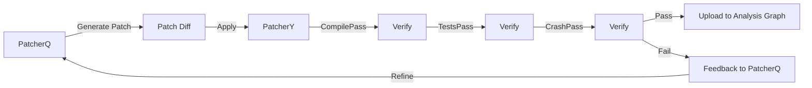

# PatcherY

PatcherY is the **source-level patch application and verification tool**, forked from [angr's Patcherex](https://github.com/angr/patcherex). It applies LLM-generated patches to source code, verifies them through multiple passes, and ranks candidates by success rate.

## Purpose

- Apply source-level patches to buildable projects
- Multi-pass verification (compile, test, sanitizer)
- Patch ranking for multiple candidates
- OSS-Fuzz integration
- AIxCC challenge compatibility
- Continuous verification with retries

## CRS-Specific Usage

PatcherY is **not directly invoked in the CRS pipeline**. Instead, it is used **internally by PatcherQ** as the underlying patch application engine.

**Integration Point**: PatcherQ generates patch diffs and uses PatcherY's verification infrastructure to validate patches before submission.

## Repository

**GitHub**: [angr/patcherex](https://github.com/angr/patcherex) (upstream)

**CRS Fork**: [`components/patchery/`](https://github.com/sslab-gatech/shellphish-afc-crs/tree/main/components/patchery)

**README**: [`patchery/README.md`](https://github.com/sslab-gatech/shellphish-afc-crs/blob/main/components/patchery/README.md)

## Key Features

### 1. Source-Level Patching

**Example** ([README Lines 24-32](https://github.com/sslab-gatech/shellphish-afc-crs/blob/main/components/patchery/README.md#L24-L32)):

```bash
patchery --generate-verified-patch \
  --src-root ./tests/targets/hamlin/challenge/src/ \
  --run-script ./tests/targets/hamlin/challenge/run.sh \
  --lang "C++" \
  --report-file ./tests/reports/hamlin_report.txt \
  --output-path "./output.patch"
```

**Workflow**:
1. Read report file (POI report, SARIF, etc.)
2. Generate patch using LLM (GPT-4o)
3. Apply patch to source tree
4. Verify through multiple passes
5. Output unified diff

### 2. Multi-Pass Verification

**Verification Passes** ([README Lines 79-81](https://github.com/sslab-gatech/shellphish-afc-crs/blob/main/components/patchery/README.md#L79-L81)):

```
INFO | 2024-06-11 04:07:47,793 | patchery.verifier.patch_verifier | 🔬 Running CompileVerificationPass now...
INFO | 2024-06-11 04:08:04,898 | patchery.verifier.patch_verifier | ✅ CompileVerificationPass passed
```

**Passes**:
1. **CompilePass**: Verify patch compiles
2. **TestsPass**: Run project tests
3. **SanitizerPass**: Verify crash is fixed
4. **CriticPass**: LLM review for correctness
5. **FuzzPass**: Short fuzzing campaign

**Retry Mechanism**: Each pass retries 3-5 times on failure with LLM feedback.

### 3. Patch Ranking ([README Lines 84-115](https://github.com/sslab-gatech/shellphish-afc-crs/blob/main/components/patchery/README.md#L84-L115))

```bash
patchery --continuous-ranking \
  --rank-patches /mock_cp/resources/patches/ \
  --rank-output-dir /mock_cp/resources/patches/ \
  --rank-timeout 10 --rank-wait-time 3
```

**Output Format**:
```json
{
  "ranks": [
    "/mock_cp/resources/patches/patch.sdasda",
    "/mock_cp/resources/patches/patch.aaaaaa"
  ],
  "invalidated_patches": [],
  "patch_info": {
    "/mock_cp/resources/patches/patch.sdasda": 7.467698726104354,
    "/mock_cp/resources/patches/patch.aaaaaa": 8.622736323949841
  },
  "timestamp": 1720152415
}
```

**Ranking Criteria**: Success rate across verification passes, with lower scores being better.

### 4. LLM Integration

**Model**: GPT-4o (`oai-gpt-4o`)

**Configuration** ([README Lines 190-192](https://github.com/sslab-gatech/shellphish-afc-crs/blob/main/components/patchery/README.md#L190-L192)):

```python
MODEL=xxx  # default is oai-gpt-4o
```

**Features**:
- Multi-POI patching
- LLM analyzer for root cause analysis
- Continuous patch generation with feedback

### 5. OSS-Fuzz Support ([README Lines 43-82](https://github.com/sslab-gatech/shellphish-afc-crs/blob/main/components/patchery/README.md#L43-L82))

```bash
export ENABLE_LLM_ANALYZER=1
export OSS_FUZZ_TARGET=1
export AGENTLIB_SAVE_FILES=0
pytest tests/test_ossfuzz.py::TestPatcheryOssFuzz::test_ossfuzz_xs_47443 -s -v
```

**Example Output**:
```diff
diff --git a/net/tipc/crypto.c b/net/tipc/crypto.c
index 24b78d9d0..dfbb94d23 100644
--- a/net/tipc/crypto.c
+++ b/net/tipc/crypto.c
@@ -2305,6 +2305,13 @@ static bool tipc_crypto_key_rcv(struct tipc_crypto *rx, struct tipc_msg *hdr)
                goto exit;
        }

+       /* Check key length to avoid buffer overflow */
+       if (unlikely(keylen > size - (TIPC_AEAD_ALG_NAME + sizeof(__be32)))) {
+               pr_err("%s: key length is too large\n", rx->name);
+               kfree(skey); /* Free the allocated memory to prevent memory leak */
+               goto exit;
+       }
+
        /* Copy key from msg data */
        skey->keylen = keylen;
        memcpy(skey->alg_name, data, TIPC_AEAD_ALG_NAME);
```

**OSS-Fuzz Integration**: Full build, instrumentation, and fuzzing infrastructure compatibility.

## Development

### Setup ([README Lines 117-121](https://github.com/sslab-gatech/shellphish-afc-crs/blob/main/components/patchery/README.md#L117-L121))

```bash
./setup.sh
```

**Process**:
1. Downloads test data repo
2. Builds local container (~8GB)
3. Creates symlinks to test data

### Testing ([README Lines 123-129](https://github.com/sslab-gatech/shellphish-afc-crs/blob/main/components/patchery/README.md#L123-L129))

```bash
pytest tests/test_aicc.py::TestPatcheryAICC::test_nginx_exemplar -s
```

**Test Duration**: ~5 minutes for end-to-end verification.

### Debugging ([README Lines 136-158](https://github.com/sslab-gatech/shellphish-afc-crs/blob/main/components/patchery/README.md#L136-L158))

```bash
DEBUG=1 pytest tests/test_aicc.py::TestPatcheryAICC::test_nginx_exemplar -s
```

**Process**:
1. Sets breakpoint in PatcherY code
2. Starts container
3. Prints `docker exec` command for interactive debugging
4. Attach to container for live debugging

## CRS Integration

### PatcherQ → PatcherY Flow



**Note**: PatcherY's verification infrastructure is used internally by PatcherQ, but patches are primarily generated by PatcherQ's LLM agents.

## Performance Characteristics

- **Model**: GPT-4o
- **Verification timeout**: 3-5 retries per pass
- **Container size**: ~8GB
- **Test duration**: 5-10 minutes per patch
- **Continuous ranking**: 10-second timeout with 3-second wait

## Related Components

- **[PatcherQ](./patcherq.md)**: Generates patches using PatcherY infrastructure
- **[PatcherG](./patcherg.md)**: Orchestrates patch submission
- **[POV-Patrol](../bug-finding/pov-generation/pov-patrol.md)**: Tests patches against POVs
- **[Analysis Graph](../infrastructure/analysis-graph.md)**: Stores patch verification results
