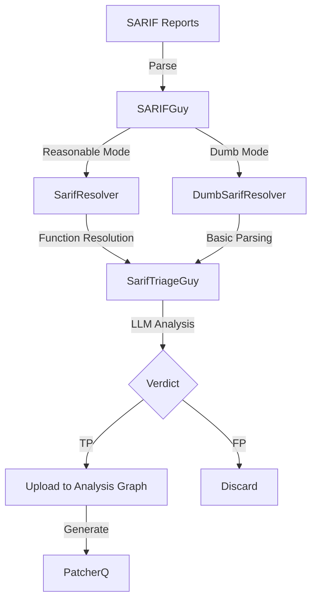
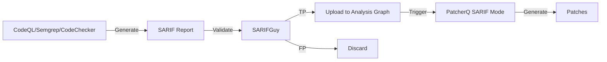

# SARIF Processing

SARIF (Static Analysis Results Interchange Format) Processing is handled by **SARIFGuy**, an LLM-based triage agent that validates static analysis findings to filter false positives before patch generation. It analyzes SARIF reports from CodeQL, Semgrep, and CodeChecker to determine if findings are true or false positives.

## Purpose

- Validate SARIF reports from static analyzers
- LLM-based true/false positive classification
- Function-level location resolution
- Analysis Graph integration
- Budget recovery and rate limit handling
- Nap mode for resource exhaustion

## Architecture



## Implementation

**Main File**: [`sarifguy.py`](https://github.com/sslab-gatech/shellphish-afc-crs/blob/main/components/sarifguy/src/sarifguy/sarifguy.py)

**Agent**: [`sarifTriageGuy.py`](https://github.com/sslab-gatech/shellphish-afc-crs/blob/main/components/sarifguy/src/sarifguy/agents/sarifTriageGuy.py)

**Pipeline**: [`pipeline.yaml`](https://github.com/sslab-gatech/shellphish-afc-crs/blob/main/components/sarifguy/pipeline.yaml)

## Two Modes

### Reasonable Mode ([sarifguy.py Lines 299-450](https://github.com/sslab-gatech/shellphish-afc-crs/blob/main/components/sarifguy/src/sarifguy/sarifguy.py#L299-L450))

**Full function resolution with clang-indexer**.

```python
def reasonable_sarifguy(self):
    log.info(f"🧐 Running reasonable SARIFguy against: {self.sarif_path}")

    # Validate SARIF format
    if not self.sarif_resolver.is_valid():
        self.emit_assesment("FP", "The SARIF report is not in a valid format.")
        return

    # Get results with function resolution
    sarif_results = self.sarif_resolver.get_results()

    if len(sarif_results) == 0:
        # Fallback to dumb mode if function resolution fails
        if len(self.sarif_resolver.dumb_sarif_results) != 0:
            self.mode = "dumb"
            self.dumb_sarifguy()
            return
        else:
            self.emit_assesment("FP", "The SARIF report has no results")
            return

    # Upload to Analysis Graph
    covered_functions_keys = set()
    for sarif_result in sarif_results:
        for loc in sarif_result.locations:
            covered_functions_keys.add(loc.keyindex)
        for codeflow in sarif_result.codeflows:
            for loc in codeflow.locations:
                covered_functions_keys.add(loc.keyindex)

    add_sarif_report(
        sarif_uid=self.sarif_meta.pdt_sarif_id,
        sarif_type="injected",
        sarif_path=self.sarif_path,
        covered_functions_keys=covered_functions_keys
    )

    # Analyze each result with LLM
    for sarif_id, sarif_result in enumerate(sarif_results):
        sarif_tg_guy = SarifTriageGuy(
            sarifguy_mode=self.mode,
            language=self.project_language,
            project_name=self.project_name,
            rule_id=sarif_result.rule_id,
            sarif_message=sarif_result.message,
            locs_in_scope=sarif_result.locations,
            data_flows=sarif_result.codeflows,
        )

        # Reasoning loop with budget recovery
        res = sarif_tg_guy.invoke()

        verdict = res.value['verdict']
        summary = res.value['summary']

        if verdict == "TP":
            logger.info(f"  🧐 ReasonableSarifTriageGuy thinks this is a true positive")
            self.emit_assesment(verdict, summary)
        elif verdict == "FP":
            logger.info(f"  🧐 ReasonableSarifTriageGuy thinks this is a false positive")
            self.emit_assesment(verdict, summary)
```

**Key Features**:
- Full function resolution with keyindex
- Dataflow analysis support
- Upload to Analysis Graph
- High-confidence verdicts

### Dumb Mode ([Lines 177-297](https://github.com/sslab-gatech/shellphish-afc-crs/blob/main/components/sarifguy/src/sarifguy/sarifguy.py#L177-L297))

**Basic parsing without function resolution**.

```python
def dumb_sarifguy(self):
    log.info(f"🤪 Switching to dumb SARIFguy against: {self.sarif_path}")

    # Validate SARIF format
    if not self.sarif_resolver.is_valid():
        self.emit_assesment("FP", "The SARIF report is not in a valid format.")
        return

    # Get dumb results (no function resolution)
    sarif_results = self.sarif_resolver.get_dumb_results()

    if len(sarif_results) == 0:
        self.emit_assesment("FP", "The SARIF report has no results")
        return

    # Analyze each result
    for sarif_id, sarif_result in enumerate(sarif_results):
        sarif_tg_guy = SarifTriageGuy(
            sarifguy_mode=self.mode,
            language=self.project_language,
            project_name=self.project_name,
            rule_id=sarif_result.rule_id,
            sarif_message=sarif_result.message,
            locs_in_scope=sarif_result.locations,
            data_flows=sarif_result.codeflows,
        )

        res = sarif_tg_guy.invoke()

        verdict = res.value['verdict']
        summary = res.value['summary']

        if verdict == "TP":
            self.emit_assesment(verdict, summary)
        elif verdict == "FP":
            self.emit_assesment(verdict, summary)
```

**Key Features**:
- Fallback when function resolution fails
- Line/column-based locations only
- Still LLM-validated
- Lower confidence

## LLM Reasoning Loop ([Lines 224-271](https://github.com/sslab-gatech/shellphish-afc-crs/blob/main/components/sarifguy/src/sarifguy/sarifguy.py#L224-L271))

```python
# 🧠 Reasoning loop
while True:
    try:
        res = sarif_tg_guy.invoke()
        self.how_many_naps = 0
        break  # Success!

    except (LLMApiBudgetExceededError, LLMApiRateLimitError) as e:
        if isinstance(e, LLMApiRateLimitError):
            logger.critical(f' 😭 LLM API rate limit exceeded for {sarif_tg_guy.__LLM_MODEL__}!')
        else:
            logger.critical(f' 😭 LLM API budget exceeded for {sarif_tg_guy.__LLM_MODEL__}!')

        self.curr_llm_index += 1

        if self.curr_llm_index >= len(Config.sarif_tg_guy_llms):
            # No more LLMs to try
            self.curr_llm_index = 0

            if Config.nap_mode and self.how_many_naps < Config.nap_becomes_death_after:
                self.how_many_naps += 1
                logger.info(f'😴 Taking nap number {self.how_many_naps}...')
                self.take_a_nap()  # Sleep until next budget tick
                logger.info(f'🫡 Nap time is over! Back to work...')
                sarif_tg_guy = self.switch_sarif_guy_llm(sarif_tg_guy)
                continue
            else:
                exit(1)  # Give up
        else:
            # Switch to next LLM
            sarif_tg_guy = self.switch_sarif_guy_llm(sarif_tg_guy)
            continue

    except Exception as e:
        logger.critical(f' 😱 Something went wrong with the reasoning: {e}')
        exit(1)
```

**Recovery Strategy**:
1. Try first LLM in list
2. On budget/rate limit error, switch to next LLM
3. If all LLMs exhausted, enter "nap mode"
4. Nap mode: sleep until next budget tick (aligned to 5-minute intervals)
5. Retry up to `nap_becomes_death_after` times (default: 3)
6. Give up if still failing

## Nap Mode ([Lines 121-134](https://github.com/sslab-gatech/shellphish-afc-crs/blob/main/components/sarifguy/src/sarifguy/sarifguy.py#L121-L134))

```python
def take_a_nap(self):
    logger.info(f'😴 Nap time! I will be back in a bit...')

    # Go to the next multiple of Config.nap_duration
    # For example, if Config.nap_duration is 5, and the current minute is 12,
    # we will wake up at 15.
    waking_up_at = datetime.now() + timedelta(
        minutes=Config.nap_duration - (datetime.now().minute % Config.nap_duration)
    )

    while True:
        if datetime.now() >= waking_up_at:
            logger.info(f'🫡 Nap time is over! Back to work...')
            break
        else:
            time.sleep(Config.nap_snoring)
```

**Purpose**: Wait for LLM budget to reset at fixed intervals (e.g., every 5 minutes).

## LLM Model Switching ([Lines 161-176](https://github.com/sslab-gatech/shellphish-afc-crs/blob/main/components/sarifguy/src/sarifguy/sarifguy.py#L161-L176))

```python
def switch_sarif_guy_llm(self, sarif_tg_guy: SarifTriageGuy) -> SarifTriageGuy:
    sarifguy_llm = Config.sarif_tg_guy_llms[self.curr_llm_index]
    logger.info(f'🔄🤖 Switching sarifGuy to model: {sarifguy_llm}')

    sarif_tg_guy.__LLM_MODEL__ = sarifguy_llm
    sarif_tg_guy.llm = sarif_tg_guy.get_llm_by_name(
        sarifguy_llm,
        **sarif_tg_guy.__LLM_ARGS__,
        raise_on_budget_exception=sarif_tg_guy.__RAISE_ON_BUDGET_EXCEPTION__,
        raise_on_rate_limit_exception=sarif_tg_guy.__RAISE_ON_RATE_LIMIT_EXCEPTION__
    )

    # Clean tool call history for fresh start
    self.peek_src.clean_tool_call_history()
    self.peek_src_dumb.clean_tool_call_history()

    return sarif_tg_guy
```

**Multi-Model Strategy**: Maintains list of LLM models to try sequentially when budget/rate limits are hit.

## Assessment Output ([Lines 135-159](https://github.com/sslab-gatech/shellphish-afc-crs/blob/main/components/sarifguy/src/sarifguy/sarifguy.py#L135-L159))

```python
def emit_assesment(self, verdict, summary, fake=False):
    sarif_metadata_output = SARIFMetadata(
        task_id=self.sarif_meta.task_id,
        sarif_id=self.sarif_meta.sarif_id,
        pdt_sarif_id=self.sarif_meta.pdt_sarif_id,
        pdt_task_id=self.sarif_meta.pdt_task_id,
        metadata=self.sarif_meta.metadata,
        assessment=Assessment.AssessmentCorrect if verdict == "TP" else Assessment.AssessmentIncorrect,
        description=summary,
    )

    if verdict == "TP":
        logger.info(f"    - Verdict: {verdict} 👍")
    else:
        logger.info(f"    - Verdict: {verdict} 👎")

    with open(self.sarif_assessment_out_path, 'w') as f:
        f.write(sarif_metadata_output.model_dump_json(indent=2))
```

**Output Format**:
```json
{
  "task_id": "task-123",
  "sarif_id": "sarif-456",
  "pdt_sarif_id": "pdt-sarif-789",
  "pdt_task_id": "project-abc",
  "metadata": {...},
  "assessment": "AssessmentCorrect",
  "description": "True positive: Buffer overflow in memcpy call"
}
```

## Pipeline Configuration ([pipeline.yaml Lines 21-128](https://github.com/sslab-gatech/shellphish-afc-crs/blob/main/components/sarifguy/pipeline.yaml#L21-L128))

```yaml
sarifguy_reasonable:
  job_quota:
    cpu: 1
    mem: "2Gi"
  priority: 10000
  failure_ok: true  # Non-blocking

  links:
    sarif_path:
      repo: sarif_reports
      kind: InputFilepath

    sarif_meta:
      repo: sarif_metadatas
      kind: InputMetadata

    functions_by_file_index_json:
      repo: full_functions_by_file_index_jsons
      kind: InputFilepath

    functions_index:
      repo: full_functions_indices
      kind: InputFilepath

    functions_jsons_dir:
      repo: full_functions_jsons_dirs
      kind: InputFilepath

    sarif_retry_metadata:
      repo: sarif_retry_metadatas
      kind: OutputFilepath

    sarif_heartbeat_path:
      repo: sarif_heartbeat_paths
      kind: OutputFilepath

  template: |
    export SARIF_META={{ sarif_meta_path | shquote }}
    export SARIF_PATH={{ sarif_path | shquote }}
    export SARIFGUYMODE='reasonable'
    export OUT_FILE_PATH={{ sarif_retry_metadata | shquote }}
    export SARIF_HEARTBEAT_PATH={{ sarif_heartbeat_path | shquote }}
    export FUNCTIONS_BY_FILE_INDEX={{ functions_by_file_index_json | shquote }}
    export FUNCTIONS_INDEX={{ functions_index | shquote }}
    export TARGET_FUNCTIONS_JSONS_DIR={{ functions_jsons_dir | shquote }}

    # Emit heartbeat
    echo "Emitting heartbeat to $SARIF_HEARTBEAT_PATH"
    echo -e "sarifguy_heartbeat:\n  timestamp: $(date -Iseconds)\n  project_name: $PROJECT_NAME" > $SARIF_HEARTBEAT_PATH

    /src/run.sh

    sleep 10
```

## Integration Workflow



**Flow**:
1. Static analyzers generate SARIF reports
2. SARIFGuy validates with LLM (TP/FP)
3. True positives uploaded to Analysis Graph
4. PatcherQ generates patches from validated SARIFs
5. False positives discarded

## Performance Characteristics

- **Mode**: Reasonable (default)
- **Priority**: 10000 (high priority)
- **Resources**: 1 CPU, 2GB RAM
- **Failure handling**: `failure_ok: true` (non-blocking)
- **LLM models**: Configurable list (fallback chain)
- **Nap duration**: 5 minutes (configurable)
- **Max naps**: 3 (configurable)

## Configuration

```python
class Config:
    sarif_tg_guy_llms: List[str] = [...]  # List of LLMs to try
    nap_mode: bool = True
    nap_duration: int = 5  # minutes
    nap_snoring: int = 10  # seconds between checks
    nap_becomes_death_after: int = 3  # max naps
```

## Tools Available

**Reasonable Mode**:
- `show_file_at`: View source code at location
- `get_functions_by_file`: List functions in file
- `search_string_in_file`: Search for patterns
- `get_function_or_struct_location`: Resolve definitions

**Dumb Mode**:
- Basic file viewing with line/column coordinates
- No function resolution

## Related Components

- **[CodeQL](./bug-finding/static-analysis/codeql.md)**: Generates SARIF reports
- **[Semgrep](./bug-finding/static-analysis/semgrep.md)**: Generates SARIF reports
- **[CodeChecker](./bug-finding/static-analysis/codechecker.md)**: Generates SARIF reports
- **[PatcherQ](./patch-generation/patcherq.md)**: Consumes validated SARIF reports
- **[Analysis Graph](./infrastructure/analysis-graph.md)**: Stores SARIF metadata
- **[Clang Indexer](./bug-finding/static-analysis/clang-indexer.md)**: Provides function resolution
