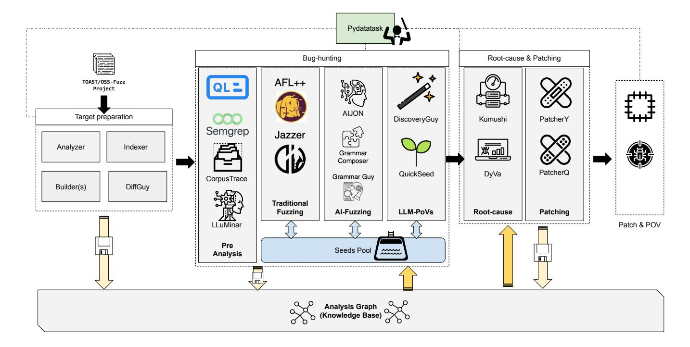

# Artiphishell CRS Implementation Overview

## Architecture

The Artiphishell CRS implements an agent-based architecture where various components (agents) with specific tasks collaborate to discover and patch vulnerabilities. The overall system architecture is illustrated in Figure 1 from the whitepaper (Section 3.2):

*Figure 1: The Artiphishell architecture showing the dataflow pipeline and key components*

## System Pipeline

The system is implemented as a dataflow pipeline where components launch on-demand as soon as their required data becomes available. The pipeline is orchestrated by **PyDataTask**, which handles data storage across various backends (S3, local filesystem, cached layers), dynamic data delivery and retrieval over HTTP, and task scheduling, preemption, and auto-scaling.

## Technical Components

Our implementation study is organized according to the major phases of the CRS pipeline, from preprocessing through submission. Each phase contains specific technical components documented in detail.

## Data Model

The pipeline handles various types of data organized in repositories:

- **FilesystemRepository**: Folder structures (build artifacts)
- **BlobRepository**: Binary files (crashing seeds)
- **MetadataRepository**: YAML/JSON metadata

Key data types:

- Source code repositories
- Build artifacts (canonical, debug, AFL++, Jazzer, coverage builds)
- Static analysis results + rankings
- Code indexing results
- Fuzzing grammars + serialized derivation trees (RONs)
- Seeds and crashes
- Crash reports + triage reports
- Generated patches
- SARIF reports
- Submission artifacts

