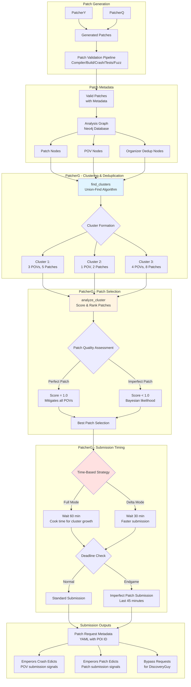

# PatcherG

## Overview

**PatcherG** (Patch Guardian) is the strategic submission orchestrator that manages patch deduplication, quality assessment, and submission timing to maximize competition scoring. Unlike PatcherY and PatcherQ which generate patches, PatcherG operates as the final gatekeeper that decides **which patches** to submit and **when** to submit them based on AIxCC competition rules.

**Role in Pipeline**: Strategic submission manager that prevents duplicate submissions, enforces quality thresholds, and optimizes submission timing based on scoring formulas.

**Key Innovation**: Implements sophisticated clustering-based deduplication using union-find algorithms to group related vulnerabilities and patches, combined with Bayesian scoring to select the highest-quality patch per vulnerability cluster while avoiding scoring penalties from the competition's accuracy multiplier.

**Location**: [components/patcherg/](https://github.com/sslab-gatech/shellphish-afc-crs/tree/main/components/patcherg)

## Position in Patching Workflow



## Core Functionality

### 1. Cluster-Based Deduplication

**Challenge**: The AIxCC competition allows only **one patch per bug** and heavily penalizes duplicate submissions through the accuracy multiplier. Multiple fuzzing campaigns may discover the same bug with different crashing inputs, and multiple patchers may generate different patches for the same vulnerability.

**Solution**: PatcherG uses graph-based clustering to identify which POVs (Proofs of Vulnerability) and patches belong to the same underlying bug ([dedup.py:57-142](https://github.com/sslab-gatech/shellphish-afc-crs/blob/main/libs/analysis-graph/src/analysis_graph/api/dedup.py#L57-L142)).

#### Union-Find Clustering Algorithm

**Implementation**: [`find_clusters()`](https://github.com/sslab-gatech/shellphish-afc-crs/blob/main/libs/analysis-graph/src/analysis_graph/api/dedup.py#L57-L142)

**Graph Structure**: Three node types in the Analysis Graph (Neo4j):
- **PoVReportNode**: Represents a crashing input (key = `pov_<hash>`)
- **OrganizerDedupInfoNode**: Organizer-provided deduplication token (identifier = crash state + instrumentation key)
- **GeneratedPatch**: Patch file (patch_key = `patch_<uuid>`)

**Clustering Relationships**:

1. **Organizer Equivalence** (Lines 67-74): Two OrganizerDedupInfoNodes are linked if the competition organizers consider them duplicates based on crash signatures:
   ```cypher
   MATCH (n:OrganizerDedupInfoNode)-[:ORGANIZER_EQUIVALENT_DEDUP_INFO]->(m:OrganizerDedupInfoNode)
   WHERE n.pdt_project_id = $project_id
   ```

2. **Patch Mitigation** (Lines 78-89): A patch is linked to a POV if it successfully mitigates that crash:
   ```cypher
   MATCH (n:GeneratedPatch)-[:MITIGATED_POV_REPORT]->(m:PoVReportNode)
   WHERE n.finished_patch_patrol AND m.finished_pov_patrol
   ```

3. **POV-to-Dedup Association** (Lines 90-97): A POV is linked to its organizer deduplication token:
   ```cypher
   MATCH (n:PoVReportNode)-[:ORGANIZER_DEDUP_INFO]->(m:OrganizerDedupInfoNode)
   ```

**Union-Find Merging** (Lines 103-109):
```python
uf = unionfind.UnionFind()
for [n, m] in equivalent_edges:
    uf.union(('ORGANIZER_DEDUP_INFO', n), ('ORGANIZER_DEDUP_INFO', m))
for [n, m] in equivalent_due_to_mitigating_patch_edges:
    uf.union(('GENERATED_PATCH', n), ('POV_REPORT', m))
for n, m in equivalent_due_to_pov_token_edges:
    uf.union(('POV_REPORT', n), ('ORGANIZER_DEDUP_INFO', m))
```

**Output**: List of `Cluster` objects ([dedup.py:40-55](https://github.com/sslab-gatech/shellphish-afc-crs/blob/main/libs/analysis-graph/src/analysis_graph/api/dedup.py#L40-L55)), each containing:
```python
@dataclass
class Cluster:
    pov_report_nodes: List[PoVReportNode]      # All POVs in cluster
    organizer_dedup_info_nodes: List[OrganizerDedupInfoNode]  # Dedup tokens
    generated_patches: List[GeneratedPatch]    # All patches in cluster
```

**Example Clustering**:
```
Cluster 1 (Heap Buffer Overflow in xmlParseElement):
  PoVReportNodes: [pov_abc123, pov_def456, pov_ghi789]
  OrganizerDedupInfoNodes: [dedup_1, dedup_2]
  GeneratedPatches: [patch_py_001, patch_q_002, patch_py_003, patch_q_004]

Cluster 2 (Use-After-Free in xmlFreeDoc):
  PoVReportNodes: [pov_jkl012]
  OrganizerDedupInfoNodes: [dedup_3]
  GeneratedPatches: [patch_q_005, patch_py_006]
```

### 2. Patch Quality Scoring

**Objective**: For each cluster, identify the patch most likely to pass organizer validation and maximize competition score.

**Implementation**: [`score_patch()`](https://github.com/sslab-gatech/shellphish-afc-crs/blob/main/components/patcherg/patcherg/__main__.py#L95-L108) and [`bayesian_likelihood_score()`](https://github.com/sslab-gatech/shellphish-afc-crs/blob/main/components/patcherg/patcherg/__main__.py#L110-L128)

#### Bayesian Likelihood Scoring

**Formula** (Lines 110-128):
```python
def bayesian_likelihood_score(k: int, n: int, alpha: float = 1.0, beta: float = 1.0) -> float:
    """
    Bayesian likelihood score using Beta(alpha, beta) prior (Laplace smoothing).
    Returns posterior mean of mitigation probability:
        E[p | data] = (k + alpha) / (n + alpha + beta)

    Properties (with alpha = beta = 1):
        • 3/3 mitigated → 0.800
        • 49/50 mitigated → 0.962
        • 50/50 mitigated → 0.981
    """
    if n <= 0:
        return 0
    return (k + alpha) / (n + alpha + beta)
```

**Rationale**:
- **k**: Number of POVs in the cluster that this patch mitigates
- **n**: Total number of POVs in the cluster
- **Prior (α=1, β=1)**: Uniform prior (Laplace smoothing) prevents extreme confidence from small samples
- **Posterior Mean**: Balances evidence strength with sample size

**Comparison**:
- Patch A: 3/3 POVs mitigated → **0.800** (perfect but small sample)
- Patch B: 49/50 POVs mitigated → **0.962** (nearly perfect, large sample)
- Patch C: 50/50 POVs mitigated → **0.981** (perfect, large sample)

**Why not simple ratio?** Simple k/n would give 3/3 = 1.0, falsely suggesting equal confidence to 50/50 = 1.0. Bayesian scoring correctly penalizes lack of evidence.

#### Patch Metadata Validation

**Critical Check**: Before scoring, verify patch metadata is valid ([__main__.py:196-280](https://github.com/sslab-gatech/shellphish-afc-crs/blob/main/components/patcherg/patcherg/__main__.py#L196-L280))

**Why This Matters**: Patches without valid metadata cannot be submitted to the pipeline, so scoring them is pointless. PatcherG checks:

1. **File Exists**: YAML metadata downloaded from pydatatask agent
2. **Valid YAML**: Parseable YAML structure
3. **Has pdt_project_id**: Required for pipeline launch
4. **Not Empty**: Not `{}` or `null` (indicates incomplete upload)

**Failure Handling** (Lines 318-326):
```python
if not patch_has_valid_metadata:
    _l.warning(f"⚠️ Patch metadata is invalid for {patch.patch_key}")
    # Unconditionally ignore patch - cannot submit
    continue
```

**Caching** (Lines 196-214): Metadata validation results cached to `/tmp/patch-yaml-cache/` to avoid repeated network calls.

### 3. Cluster Analysis

**Implementation**: [`analyze_cluster()`](https://github.com/sslab-gatech/shellphish-afc-crs/blob/main/components/patcherg/patcherg/__main__.py#L302-L530)

**Output**: `ClusterAnalysis` dataclass ([__main__.py:302-320](https://github.com/sslab-gatech/shellphish-afc-crs/blob/main/components/patcherg/patcherg/__main__.py#L302-L320)) containing:
```python
@dataclass
class ClusterAnalysis:
    # Patch tracking
    perfect_patches: List[GeneratedPatch]           # Score = 1.0
    most_recent_best_patch: GeneratedPatch          # Highest scored, newest
    oldest_best_patch: GeneratedPatch               # Highest scored, oldest
    oldest_best_patch_no_py: GeneratedPatch         # Best non-PatcherY

    # Submission tracking
    already_submitted_patches: List[GeneratedPatch]
    already_submitted_perfect_patches: List[GeneratedPatch]

    # POV tracking
    newest_dedup_node: OrganizerDedupInfoNode
    oldest_pov: PoVReportNode

    # Bypass tracking
    first_pov_bypassing_oldest_best_patch: PoVReportNode
```

#### Perfect Patch Detection

**Primary Condition** (Lines 384-393): Patch mitigates **all** POVs in cluster
```python
if num_mitigated == num_povs_in_cluster:
    if not patch_has_valid_metadata:
        _l.warning("Not marking as perfect - invalid metadata")
    else:
        perfect_patches.append(patch)
```

**Secondary Condition** (Lines 416-427): Patch has **no unmitigated POVs** anywhere (beyond cluster)
```python
oldest_best_patch_num_unmitigated = len(oldest_best_patch.non_mitigated_povs.filter(
    key__in=[pov.key for pov in cluster.pov_report_nodes]
))
# If no unmitigated POVs AND finished_patch_patrol, mark perfect
if oldest_best_patch_num_unmitigated == 0 and oldest_best_patch.finished_patch_patrol:
    perfect_patches.append(oldest_best_patch)
```

**Rationale for Secondary**: Handles trickling POV discoveries (e.g., xmlStrndup where new POVs slowly arrive). A patch that initially appears imperfect may become perfect as patrol completes.

#### Patch Ranking Logic

**Most Recent Best** (Lines 348-360): Highest score, prefer newer patches
```python
if num_mitigated > most_recent_best_mitigated:
    oldest_best_patch = patch  # Initialize baseline
    most_recent_best_patch = patch
elif num_mitigated == most_recent_best_mitigated:
    if patch.time_created > most_recent_best_patch.time_created:
        most_recent_best_patch = patch  # Update to newer
```

**Oldest Best** (Lines 374-378): Highest score, prefer older patches for time-based scoring
```python
if num_mitigated == most_recent_best_mitigated:
    if patch.time_created < oldest_best_patch.time_created:
        oldest_best_patch = patch  # Update to older
```

**Oldest Best (Non-PatcherY)** (Lines 363-378): Same logic but excludes PatcherY patches (see Submission Strategy below)

### 4. Submission Strategy

**Implementation**: [`select_patches_to_submit()`](https://github.com/sslab-gatech/shellphish-afc-crs/blob/main/components/patcherg/patcherg/__main__.py#L532-L809)

#### Timing Configuration

**Task-Dependent Settings** ([__main__.py:64-79](https://github.com/sslab-gatech/shellphish-afc-crs/blob/main/components/patcherg/patcherg/__main__.py#L64-L79)):
```python
# Full mode (12 hours)
GOOD_PATCH_SUBMISSION_TIMEOUT_MINS_FULL = 60
BUCKET_SLOW_DOWN_AMT_FULL = 12
MAX_IMPERFECT_PATCHES_TOTAL_FULL = 3

# Delta mode (6 hours)
GOOD_PATCH_SUBMISSION_TIMEOUT_MINS_DELTA = 30
BUCKET_SLOW_DOWN_AMT_DELTA = 6
MAX_IMPERFECT_PATCHES_TOTAL_DELTA = 2
```

**Dynamic Timeout Growth** ([__main__.py:81-93](https://github.com/sslab-gatech/shellphish-afc-crs/blob/main/components/patcherg/patcherg/__main__.py#L81-L93)):
```python
def update_good_patch_submission_timeout(cluster_cnt: int) -> int:
    """
    • cluster_cnt < BUCKET_SLOW_DOWN → baseline timeout
    • cluster_cnt ≥ BUCKET_SLOW_DOWN → baseline × (1.5 + 0.20 · log₂(1 + extra))
    """
    if cluster_cnt < BUCKET_SLOW_DOWN_AMT:
        return GOOD_PATCH_SUBMISSION_TIMEOUT_MINS_BASE

    extra = cluster_cnt - BUCKET_SLOW_DOWN_AMT
    growth = 1.5 + 0.20 * math.log2(1 + extra)
    return int(GOOD_PATCH_SUBMISSION_TIMEOUT_MINS_BASE * growth)
```

**Rationale**: As more vulnerability clusters accumulate, increase patch "cooking time" to allow more POVs and patches to join clusters, improving deduplication accuracy.

#### Perfect Patch Submission

**Standard Path** (Lines 566-599):
```python
if analysis.perfect_patches and analysis.oldest_best_patch:
    if is_patch_older_than_minutes(analysis.oldest_best_patch, timeout_minutes):
        # Submit oldest perfect patch
        yield analysis.oldest_best_patch, is_imperfect=False, cluster
```

**PatcherY Preference Logic** (Lines 571-598): Avoid submitting PatcherY patches if better alternatives exist

**Problem**: PatcherY patches are "dump" patches (conservative, may be overly restrictive)

**Strategy**:
1. If **all** perfect patches are from PatcherY → wait for endgame (Lines 572-575)
2. If **some** perfect patches are non-PatcherY → prioritize oldest non-PatcherY (Lines 576-598)
3. At **endgame** (last 45 minutes) → submit PatcherY if nothing better exists

**Implementation**:
```python
if analysis.oldest_best_patch.patcher_name == "PatcherY":
    if all([patch.patcher_name == "PatcherY" for patch in analysis.perfect_patches]):
        if not in_endgame:
            continue  # Wait for better patches
    else:
        # Find oldest non-PatcherY perfect patch
        oldest_best_patch_no_patchery = analysis.oldest_best_patch_no_py
        if oldest_best_patch_no_patchery and is_old_enough(oldest_best_patch_no_patchery):
            yield oldest_best_patch_no_patchery, is_imperfect=False, cluster
        continue
```

#### Imperfect Patch Submission (Endgame)

**Trigger Condition** (Lines 602-606):
```python
in_endgame = time_to_deadline < timedelta(minutes=45)  # NON_PERFECT_PATCH_SUBMISSION_TIMEOUT_MINUTES

if analysis.perfect_patches and analysis.oldest_best_patch:
    # ... standard perfect patch logic ...
    elif in_endgame:
        is_imperfect = True
        analysis.oldest_best_patch.imperfect_submission_in_endgame = True
        yield analysis.oldest_best_patch, is_imperfect, cluster
```

**Imperfect Patch Budget** (Lines 611-663): Limited quota to avoid accuracy multiplier penalties
```python
MAX_IMPERFECT_PATCHES_TOTAL = 3  # Full mode
global SUBMITTED_IMPERFECT_PATCHES

if analysis.most_recent_best_patch and analysis.most_recent_best_mitigated > 0:
    if SUBMITTED_IMPERFECT_PATCHES < MAX_IMPERFECT_PATCHES_TOTAL:
        if is_patch_older_than_minutes(analysis.oldest_best_patch, 45):
            SUBMITTED_IMPERFECT_PATCHES += 1
            yield analysis.oldest_best_patch, is_imperfect=True, cluster
```

**Rationale**: Some clusters never produce perfect patches (complex multi-file bugs). In endgame, submit highest-scoring imperfect patches to claim partial points rather than zero.

#### Harness Input Submission

**Special Case** (Lines 734-778): Submit POVs for clusters without any patches

**Condition**:
```python
if not analysis.already_submitted_patches and not cluster.generated_patches:
    # No patches exist at all for this cluster
    if newest_pov_age < timedelta(minutes=15):  # NEW_BUCKET_HARNESS_INPUT_SUBMISSION_CUTOFF_MINUTES
        # Submit the POV itself as proof of vulnerability discovery
        yield harness_input_submission_for(analysis.oldest_pov)
```

**Why This Works**: AIxCC scoring awards points for **vulnerability discovery** (VDS) even without patches. Submitting the POV early claims these points before competitors.

### 5. Submission Output Generation

**Implementation**: [`main()`](https://github.com/sslab-gatech/shellphish-afc-crs/blob/main/components/patcherg/patcherg/__main__.py#L811-L1082) main loop

#### Output Channels

**1. Patch Request Metadata** ([__main__.py:936-955](https://github.com/sslab-gatech/shellphish-afc-crs/blob/main/components/patcherg/patcherg/__main__.py#L936-L955)):
```python
patch_request_meta = PatchRequestMeta(
    patch_id=selected_patch.patch_key,
    poi_report_id=poi_report_id,  # Links patch to POV for scoring
    project_id=project_id,
    is_imperfect=is_imperfect,
)
# Write to YAML file for downstream consumption
write_to(patch_request_meta_path, patch_request_meta.model_dump())
```

**Consumed By**: Downstream submission agents that actually post patches to organizer API

**2. Emperors Crash Submission Edicts** ([__main__.py:957-974](https://github.com/sslab-gatech/shellphish-afc-crs/blob/main/components/patcherg/patcherg/__main__.py#L957-L974)):
```python
emperors_crash_submission_edict = {
    'pov_report_id': poi_report_id,
    'patch_id': selected_patch.patch_key,
    'harness_input_id': harness_input_id,
}
# Signal to submission orchestrator: "Submit this POV now"
write_to(emperors_crash_submission_edicts_path, emperors_crash_submission_edict)
```

**Purpose**: Trigger POV submission to claim vulnerability discovery points

**3. Emperors Patch Submission Edicts** ([__main__.py:976-990](https://github.com/sslab-gatech/shellphish-afc-crs/blob/main/components/patcherg/patcherg/__main__.py#L976-L990)):
```python
emperors_patch_submission_edict = {
    'patch_id': selected_patch.patch_key,
    'pov_report_id': poi_report_id,
}
# Signal to submission orchestrator: "Submit this patch now"
write_to(emperors_patch_submission_edicts_path, emperors_patch_submission_edict)
```

**Purpose**: Trigger patch submission to claim program repair points

**4. Patch Bypass Requests** ([__main__.py:1019-1044](https://github.com/sslab-gatech/shellphish-afc-crs/blob/main/components/patcherg/patcherg/__main__.py#L1019-L1044)):
```python
if analysis.first_pov_bypassing_oldest_best_patch:
    patch_bypass_request = PatchBypassRequestMeta(
        patch_id=selected_patch.patch_key,
        poi_report_id=bypassing_pov.key,
        bucket_id=bucket.bucket_key,
    )
    # Tell DiscoveryGuy: "Try to bypass this patch with this POV"
    write_to(patch_bypass_requests_path, patch_bypass_request.model_dump())
```

**Purpose**: When a POV bypasses a submitted patch, trigger patch refinement via PatcherQ REFINE mode

#### Bucket Tracking

**BucketNode Upload** ([__main__.py:1046-1061](https://github.com/sslab-gatech/shellphish-afc-crs/blob/main/components/patcherg/patcherg/__main__.py#L1046-L1061)):
```python
bucket = BucketNode.upload_bucket(
    pdt_project_id=project_id,
    bucket_key=f"bucket_{cluster_index}",
    last_updated_time=datetime.now(pytz.utc),
    best_patch_key=selected_patch.patch_key,
    contain_povs=[pov.key for pov in cluster.pov_report_nodes],
    contain_patches=[patch.patch_key for patch in cluster.generated_patches],
)
```

**Purpose**: Store clustering decisions in Analysis Graph for tracking and debugging

**PatchergSubmissionNode** ([__main__.py:1063-1069](https://github.com/sslab-gatech/shellphish-afc-crs/blob/main/components/patcherg/patcherg/__main__.py#L1063-L1069)):
```python
PatchergSubmissionNode.upload_node(
    pdt_project_id=project_id,
    submitted_imperfect_patches=[
        patch.patch_key for patch in all_submitted_imperfect_patches
    ],
)
```

**Purpose**: Track global imperfect patch quota usage across restarts

## Scoring Optimization

### AIxCC Scoring Formula Alignment

**From Whitepaper** ([Section 9](https://github.com/sslab-gatech/shellphish-afc-crs/blob/main/notes/src/whitepaper/Artiphishell-3.md#9-submission)):

```
CS = AM × (VDS + PRS + SAS + BDL)

where:
  AM = 1 - (1 - r)^4  [Accuracy Multiplier, r = accurate/(accurate + inaccurate)]
  VDS = Σ value_PoV  [Vulnerability Discovery Score]
  PRS = Σ value_patch [Program Repair Score]
```

**PatcherG's Role in Maximizing CS**:

#### 1. Maximize Accuracy Multiplier (AM)

**Problem**: Submitting duplicate POVs or patches counts as "inaccurate," reducing `r` and penalizing **all** scores via AM.

**PatcherG Solution**:
- Union-find clustering prevents submitting multiple POVs/patches for same bug
- Patch quality scoring selects highest-confidence patch per cluster
- Metadata validation prevents submitting broken patches

**Impact**: Keep `r ≈ 1.0`, maintaining `AM ≈ 1.0` (no penalty)

#### 2. Maximize Vulnerability Discovery Score (VDS)

**Formula**: `value_PoV = 2 × (0.5 + RT/(2×CT))`
- **RT**: Remaining time when submitted
- **CT**: Total challenge time

**PatcherG Solution**:
- Harness input submission for clusters without patches (early POV submission)
- Time-based cooking allows cluster growth before submission (prevents duplicates)

**Impact**: Higher VDS from early submissions, no penalties from duplicate POVs

#### 3. Maximize Program Repair Score (PRS)

**Formula**: `value_patch = 6 × (0.5 + RT/(2×CT))`

**PatcherG Solution**:
- **Early submission trade-off**: Submit too early → might submit imperfect patch; Submit too late → lower time multiplier
- **Cooking time strategy**: Wait for cluster to grow (catch all POVs) before submitting patch
- **Dynamic timeout**: Increase cooking time as more clusters accumulate (avoid premature submission)
- **Endgame strategy**: In last 45 minutes, submit imperfect patches (some points > zero points)

**Impact**: Balance between high time multiplier and high patch quality

#### 4. Minimize Patch Invalidation Risk

**Rule**: "For a patch to be evaluated in the scoring process, it has to solve all variant collected PoVs created during the challenge round" ([Section 9](https://github.com/sslab-gatech/shellphish-afc-crs/blob/main/notes/src/whitepaper/Artiphishell-3.md#9-submission))

**Problem**: Submitting patch early → competitors' POVs discovered later might bypass your patch → patch invalidated → counts as inaccurate → AM penalty

**PatcherG Solution**:
- Wait for cluster growth via cooking time (collect more POVs before submission)
- Track `finished_patch_patrol` flag (wait for Patch Patrol to test against all known POVs)
- Perfect patch detection ensures patch mitigates all known cluster POVs

**Impact**: Reduce invalidation risk, protect AM

## Configuration

### Tunable Parameters

**Location**: [patcherg/__main__.py](https://github.com/sslab-gatech/shellphish-afc-crs/blob/main/components/patcherg/patcherg/__main__.py#L30-L62)

#### Full Mode (12 hours)
```python
GOOD_PATCH_SUBMISSION_TIMEOUT_MINS_FULL = 60      # Cook time before submitting perfect patch
BUCKET_SLOW_DOWN_AMT_FULL = 12                    # Cluster count threshold for timeout growth
MAX_IMPERFECT_PATCHES_TOTAL_FULL = 3              # Imperfect patch quota (endgame only)
```

#### Delta Mode (6 hours)
```python
GOOD_PATCH_SUBMISSION_TIMEOUT_MINS_DELTA = 30     # Faster submission for shorter challenges
BUCKET_SLOW_DOWN_AMT_DELTA = 6                    # Lower threshold for faster challenges
MAX_IMPERFECT_PATCHES_TOTAL_DELTA = 2             # Lower quota for shorter challenges
```

#### Global Settings
```python
TOO_MANY_PATCHES_PER_BUCKETS = 3                  # 2× timeout if bucket has ≥3 submissions
NON_PERFECT_PATCH_SUBMISSION_TIMEOUT_MINUTES = 45 # Endgame trigger point
NEW_BUCKET_HARNESS_INPUT_SUBMISSION_CUTOFF_MINUTES = 15  # POV submission window
```

### Pipeline Configuration

**Location**: [components/patcherg/pipeline.yaml](https://github.com/sslab-gatech/shellphish-afc-crs/blob/main/components/patcherg/pipeline.yaml)

**Key Settings**:
```yaml
tasks:
  patcherg:
    require_success: true
    priority: 1000000            # Highest priority task
    long_running: true           # Continuous operation

    job_quota:
      cpu: 1
      mem: "4Gi"

    # Run on critical node pool (guaranteed resources)
    node_labels:
      support.shellphish.net/pool: "critical-task"
    node_taints:
      support.shellphish.net/only-critical: "true"
```

**Inputs** (Lines 34-70):
```yaml
links:
  crs_task: InputFilepath                      # Challenge task metadata
  patch_requests_meta: StreamingOutputFilepath # Patch request YAMLs
  patch_bypass_requests: StreamingOutputFilepath
  emperors_crash_submission_edicts: StreamingOutputFilepath
  emperors_patch_submission_edicts: StreamingOutputFilepath
```

**Why `DANGEROUS_filename_is_key: true`**: Allows writing multiple output files with custom names (one per patch/POV)

### Execution Loop

**Script**: [scripts/run_patcherg.sh](https://github.com/sslab-gatech/shellphish-afc-crs/blob/main/components/patcherg/scripts/run_patcherg.sh#L33-L41)

```bash
while true; do
    patcherg \
        --project-id "$PROJECT_ID" \
        --patch-request-meta "${PATCH_REQUEST_META}" \
        --patch-bypass-requests "${PATCH_BYPASS_REQUESTS}" \
        --crash-submission-edicts "$EMPERORS_CRASH_SUBMISSION_EDICTS" \
        --patch-submission-edicts "$EMPERORS_PATCH_SUBMISSION_EDICTS" \
        --task-type "$CRS_TASK_TYPE"
    sleep 10  # Continuous monitoring with 10-second poll interval
done
```

**Rationale**: PatcherG runs as a **long-lived service** that continuously:
1. Queries Analysis Graph for new clusters
2. Analyzes clusters and selects patches
3. Emits submission edicts when timing conditions met
4. Sleeps 10 seconds, repeats

## Performance Characteristics

### Clustering Performance

**Complexity**: O(N α(N)) where N = total nodes (POVs + Patches + DedupNodes), α(N) is inverse Ackermann (effectively constant)

**Typical Scale**:
- **Small challenge**: 10 POVs, 20 patches, 10 dedup nodes → ~0.5 seconds
- **Large challenge**: 100 POVs, 300 patches, 100 dedup nodes → ~2-3 seconds

**Bottleneck**: Neo4j Cypher queries (Lines 67-97 in dedup.py), not union-find algorithm

### Analysis Performance

**Per Cluster**: O(P × V) where P = patches in cluster, V = POVs in cluster

**Typical Time**:
- 5 patches, 3 POVs → ~100ms (metadata validation + scoring)
- 20 patches, 10 POVs → ~500ms

**Optimization**: Metadata validation caching reduces repeated network calls

### Resource Usage

**CPU**: Single-threaded, ~5-10% utilization during active analysis
**Memory**: ~500MB baseline + ~50MB per 100 clusters
**Network**: ~100-200 metadata downloads per run (cached after first fetch)

## Edge Cases and Failure Modes

### 1. Cluster Growth During Submission

**Problem**: New POV arrives after perfect patch submitted → patch becomes imperfect

**Detection**: Organizer validation fails (patch doesn't mitigate new POV)

**Impact**: Patch invalidated, counts as inaccurate (AM penalty)

**Mitigation**:
- Cooking time delays reduce this risk
- Finished_patch_patrol flag waits for patrol completion
- Imperfect submission in endgame accepts this risk for scoring

### 2. Invalid Metadata False Positives

**Problem**: Metadata validation incorrectly rejects valid patch (e.g., transient network error)

**Impact**: Patch never submitted despite being valid

**Mitigation** ([__main__.py:275-280](https://github.com/sslab-gatech/shellphish-afc-crs/blob/main/components/patcherg/patcherg/__main__.py#L275-L280)):
```python
except Exception as e:
    _l.warning(f"Encountered unexpected error, assuming patch is valid: {e}")
    return True  # Fail open: assume valid on unexpected errors
```

**Rationale**: Better to submit potentially broken patch (might work) than skip valid patch (guaranteed zero points)

### 3. PatcherY Preference Deadlock

**Problem**: All perfect patches are from PatcherY, never submitted (waiting for better patch that never arrives)

**Impact**: Zero points from cluster despite having working patch

**Mitigation**: Endgame submission (last 45 minutes) overrides preference logic

### 4. Imperfect Patch Quota Exhaustion

**Problem**: Used all 3 imperfect patch slots on low-scoring patches, better imperfect patches discovered later

**Impact**: Suboptimal scoring (could have submitted higher-scoring imperfect patches)

**Mitigation**:
- Oldest best patch selection prioritizes patches with longest cooking time (likely highest quality)
- Endgame trigger (45 minutes) provides time for multiple rounds of imperfect submission

### 5. Multiple Clusters for Same Bug

**Problem**: Union-find clustering fails to merge related POVs (e.g., different crash signatures for same bug)

**Impact**: Duplicate patch submissions → accuracy multiplier penalty

**Likelihood**: Low - organizer dedup tokens are designed to catch this

**Detection**: Post-competition analysis of AM penalties

## Integration with Pipeline

### Upstream Dependencies

**1. Patch Generation** (PatcherY, PatcherQ):
- Patches uploaded to Analysis Graph with `GeneratedPatch` nodes
- Metadata includes: `patch_key`, `patcher_name`, `time_created`
- Relationships: `MITIGATED_POV_REPORT`, `NON_MITIGATED_POV_REPORT`

**2. Patch Validation** (Patch Patrol):
- Sets `finished_patch_patrol` flag when all tests complete
- Updates `mitigated_povs` and `non_mitigated_povs` relationships
- Sets `fail_functionality` flag if patch breaks tests

**3. POV Discovery** (POV Guy):
- Creates `PoVReportNode` for each verified crash
- Links to `OrganizerDedupInfoNode` via organizer-provided dedup tokens
- Sets `finished_pov_patrol` flag when verification complete

**4. Organizer Deduplication**:
- Competition infrastructure provides `OrganizerDedupInfoNode` crash states
- PatcherG treats these as ground truth for clustering

### Downstream Consumers

**1. Submission Orchestrator** (not shown in codebase):
- Reads `emperors_crash_submission_edicts` to submit POVs
- Reads `emperors_patch_submission_edicts` to submit patches
- Posts to organizer API endpoints

**2. PatcherQ REFINE Mode**:
- Reads `patch_bypass_requests`
- Generates refined patches for bypassed patches
- Creates new `GeneratedPatch` nodes in Analysis Graph

**3. Monitoring/Observability**:
- `BucketNode` entries provide clustering audit trail
- `PatchergSubmissionNode` tracks imperfect patch quota usage
- Logs provide submission timing and decision rationale

## Key Design Decisions

### Why Union-Find for Clustering?

**Alternatives Considered**:
1. **Graph traversal** (BFS/DFS): O(N + E) but requires multiple passes
2. **Similarity hashing**: Fast but may miss transitive relationships
3. **Manual deduplication**: Requires human intervention

**Why Union-Find**:
- **Efficient**: O(N α(N)) for N elements with path compression
- **Correct**: Transitivity guaranteed (if A~B and B~C, then A~C automatically merged)
- **Simple**: Single pass, no tuning parameters

**Example**:
```
POV_1 → Dedup_A (Organizer says A~B)
POV_2 → Dedup_B
Patch_X → Mitigates POV_1

Union-Find correctly merges: {POV_1, POV_2, Dedup_A, Dedup_B, Patch_X}
```

### Why Bayesian Scoring Instead of Simple Ratio?

**Problem with Simple Ratio**: 1/1 = 100% confidence = 10/10 = 100% confidence

**Reality**: More evidence should increase confidence

**Bayesian Solution**: Incorporates prior belief (uniform prior via Laplace smoothing)
- 1/1 → 66.7% confidence (limited evidence)
- 10/10 → 91.7% confidence (strong evidence)

**Impact**: Prioritizes patches tested against more POVs (lower invalidation risk)

### Why Prefer Non-PatcherY Patches?

**Observation**: PatcherY uses constrained LLM with limited freedom, tends to generate conservative "dump" patches

**PatcherQ Advantage**: Greater LLM autonomy enables more sophisticated root-cause analysis, potentially better patches

**Strategy**:
- Use PatcherY as **fallback** (endgame submission)
- Prefer PatcherQ/other patchers when available
- Accept PatcherY if only perfect patch available

**Trade-off**: Risk missing submission window vs. risk submitting overly restrictive patch

### Why Cook Patches Before Submission?

**Scoring Formula Impact**: `value_patch = 6 × (0.5 + RT/(2×CT))`

**Early Submission** (RT = 11h, CT = 12h):
- Time multiplier: 6 × (0.5 + 11/24) = 5.75
- Risk: Patch might not mitigate future POVs → invalidation

**Late Submission** (RT = 1h, CT = 12h):
- Time multiplier: 6 × (0.5 + 1/24) = 3.25
- Benefit: Cluster has grown, patch tested against more POVs

**Optimal**: Balance via cooking time
- Full mode: 60 minutes cook → submit at ~11h remaining → multiplier ≈ 5.75
- Cluster growth during cooking → higher confidence → lower invalidation risk

## Observability

### Logging

**Key Log Messages** ([__main__.py](https://github.com/sslab-gatech/shellphish-afc-crs/blob/main/components/patcherg/patcherg/__main__.py)):

```python
_l.info(f"Analyzing cluster {i}:")
_l.info(f'    {len(cluster.pov_report_nodes)} PoVs: ' + ', '.join([...]))
_l.info(f"Cluster {i} patch {patch.patch_key} mitigates {num_mitigated}/{num_povs_in_cluster} POVs")
_l.info(f"Found perfect patch for cluster {i}: {patch.patch_key}")
_l.info(f"Submitting perfect patch for cluster {i}: {patch.patch_key} as it is {age} old")
_l.warning(f"⚠️ Patch metadata is invalid for {patch.patch_key}")
```

**Log Volume**: ~50-100 lines per cluster analysis, ~1000-2000 lines per full run

### Analysis Graph State

**BucketNode Tracking** ([crashes.py:385-425](https://github.com/sslab-gatech/shellphish-afc-crs/blob/main/libs/analysis-graph/src/analysis_graph/models/crashes.py#L385-L425)):
```cypher
MATCH (b:BucketNode {pdt_project_id: $project_id})
OPTIONAL MATCH (b)-[:CONTAIN_POV_REPORT]->(pov:PoVReportNode)
OPTIONAL MATCH (b)-[:CONTAIN_PATCH]->(patch:GeneratedPatch)
RETURN b.bucket_key, b.best_patch_key, collect(pov.key), collect(patch.patch_key)
```

**Query Use Cases**:
- Audit clustering decisions post-competition
- Debug submission timing issues
- Analyze patch selection rationale

### Telemetry (via PyDataTask)

**Exported Metrics**:
- Cluster count per run
- Perfect patch count vs. imperfect patch count
- Submission timing distributions
- Metadata validation failure rate

## Related Documentation

- **[PatcherY](patchery.md)** - Constrained LLM patch generator (upstream dependency)
- **[PatcherQ](patcherq.md)** - Agentic LLM patch generator (upstream dependency)
- **[Patch Validation](validation.md)** - Validation pipeline that sets patch quality flags
- **[POV Guy](../vulnerability-identification/pov-guy.md)** - Crash verification and deduplication
- **[Whitepaper Section 8.2](https://github.com/sslab-gatech/shellphish-afc-crs/blob/main/notes/src/whitepaper/Artiphishell-3.md#82-patch-management--deduplication)** - PatcherG overview
- **[Whitepaper Section 9](https://github.com/sslab-gatech/shellphish-afc-crs/blob/main/notes/src/whitepaper/Artiphishell-3.md#9-submission)** - Scoring formulas

## References

**Source Code**:
- [patcherg/__main__.py](https://github.com/sslab-gatech/shellphish-afc-crs/blob/main/components/patcherg/patcherg/__main__.py) - Main submission logic
- [analysis_graph/api/dedup.py](https://github.com/sslab-gatech/shellphish-afc-crs/blob/main/libs/analysis-graph/src/analysis_graph/api/dedup.py) - Clustering algorithm
- [pipeline.yaml](https://github.com/sslab-gatech/shellphish-afc-crs/blob/main/components/patcherg/pipeline.yaml) - Pipeline configuration

**Data Models**:
- [BucketNode](https://github.com/sslab-gatech/shellphish-afc-crs/blob/main/libs/analysis-graph/src/analysis_graph/models/crashes.py#L385-L425) - Cluster storage
- [PatchergSubmissionNode](https://github.com/sslab-gatech/shellphish-afc-crs/blob/main/libs/analysis-graph/src/analysis_graph/models/crashes.py#L427-L455) - Submission tracking
- [Cluster](https://github.com/sslab-gatech/shellphish-afc-crs/blob/main/libs/analysis-graph/src/analysis_graph/api/dedup.py#L40-L55) - Clustering dataclass
- [ClusterAnalysis](https://github.com/sslab-gatech/shellphish-afc-crs/blob/main/components/patcherg/patcherg/__main__.py#L302-L320) - Analysis results

**Whitepaper**:
- [Section 8.2 - Patch Management & Deduplication](https://github.com/sslab-gatech/shellphish-afc-crs/blob/main/notes/src/whitepaper/Artiphishell-3.md#82-patch-management--deduplication)
- [Section 9 - Submission](https://github.com/sslab-gatech/shellphish-afc-crs/blob/main/notes/src/whitepaper/Artiphishell-3.md#9-submission)
