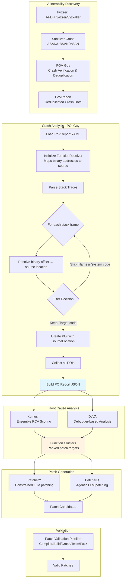

# POI Guy - Crash Location Identification for Patching

## Overview

**POI Guy** transforms fuzzing crash reports into structured Points of Interest (POI) that guide the patching workflow. Unlike CodeSwipe which identifies potential vulnerabilities through static analysis, POI Guy processes actual runtime crashes to extract precise vulnerability locations.

**Role in Patching Pipeline**: Crash report parser that bridges dynamic analysis (fuzzing) and patch generation by translating sanitizer stack traces into actionable patch targets.

**Key Innovation**: Handles the critical "binary-to-source mapping" problem—converting crash addresses from instrumented binaries into the source file paths and line numbers needed for patch application. This includes handling complex build scenarios like SQLite's file concatenation and template expansion.

**Location**: [components/poiguy/](https://github.com/sslab-gatech/shellphish-afc-crs/tree/main/components/poiguy)

## Position in Patching Workflow



## Core Functionality

### Input: PoVReport Structure

**Source**: Generated by [POV Guy](https://github.com/sslab-gatech/shellphish-afc-crs/blob/main/components/pov-patrol/pipeline.yaml) after crash deduplication

**Key Fields for Patching**:
```yaml
# Crash identification
project_id: "proj_abc123"
project_name: "libxml2"
cp_harness_name: "xml_reader_fuzzer"
fuzzer: "jazzer"                    # or "asan", "syzkaller"
sanitizer: "address"                # Primary sanitizer
architecture: "x86_64"

# Sanitizer consensus
consistent_sanitizers:
  - "address"                       # Always triggers
  - "undefined"                     # Always triggers
inconsistent_sanitizers: []         # Sometimes triggers (unreliable)

# Crash details
dedup_crash_report:
  crash_type: "heap-buffer-overflow"
  sanitizer: "address"

  # Stack traces by type
  stack_traces:
    primary:                        # Main crash location
      reason: "heap-buffer-overflow"
      call_locations:
        - trace_line: "#0 0x7f8b9c in xmlParseElement /src/parser.c:1234"
          function: "xmlParseElement"
          relative_file_path: "src/parser.c"
          line_number: 1234
          symbol_offset: 0x7f8b9c

    alloc:                          # For use-after-free: where memory was allocated
      reason: "allocation-site"
      call_locations: [...]

    free:                           # For use-after-free: where memory was freed
      reason: "deallocation-site"
      call_locations: [...]
```

**Stack Trace Types**: Sanitizers generate multiple traces for complex bugs (e.g., use-after-free has `primary`, `alloc`, `free`). POI Guy processes all traces to capture multi-location vulnerabilities.

### Output: POIReport Structure

**Format**: JSON ([POIReport schema](https://github.com/sslab-gatech/shellphish-afc-crs/blob/main/libs/crs-utils/src/shellphish_crs_utils/models/crs_reports.py#L67-L101))

**Key Fields for Patching**:
```json
{
  "project_id": "proj_abc123",
  "harness_info_id": "harness_456",
  "crash_report_id": "crash_def789",

  "crash_reason": "heap-buffer-overflow",
  "fuzzer": "jazzer",
  "detection_strategy": "fuzzing",

  "consistent_sanitizers": ["address", "undefined"],

  "pois": [
    {
      "reason": "heap-buffer-overflow",
      "source_location": {
        // CRITICAL FOR PATCHING:
        "full_file_path": "/workspace/libxml2/src/parser.c",
        "relative_file_path": "src/parser.c",
        "focus_repo_relative_path": "src/parser.c",  // For patch application

        "function_name": "xmlParseElement",
        "function_index_key": "parser.c:xmlParseElement:1200",  // Unique function ID

        "line_number": 1234,
        "line_text": "memcpy(dst, src, size);",

        "symbol_offset": 8331164,
        "symbol_size": 2048
      }
    }
  ],

  "stack_traces": {
    "primary": { /* full trace with all frames */ },
    "alloc": { /* allocation trace if applicable */ },
    "free": { /* deallocation trace if applicable */ }
  },

  "additional_information": {
    "asan_report_data": { /* complete sanitizer output */ },
    "sanitizer": "address"
  }
}
```

**Why Multiple POIs**: A single crash generates multiple POIs (one per stack frame in target code). This gives patchers options—sometimes the crash site isn't the best patch location, and upstream callers are better targets.

## Implementation Details

### 1. Function Resolution - The Critical Step

**Challenge**: Sanitizer stack traces contain binary addresses (`0x7f8b9c`), but patches need source file paths and line numbers.

**Solution**: [RemoteFunctionResolver](https://github.com/sslab-gatech/shellphish-afc-crs/blob/main/libs/crs-utils/src/shellphish_crs_utils/function_resolver.py) ([poiguy.py:53-61](https://github.com/sslab-gatech/shellphish-afc-crs/blob/main/components/poiguy/poiguy.py#L53-L61))

```python
function_resolver = RemoteFunctionResolver(
    cp_name=pov_crash_report.project_name,
    project_id=project_id,
)
```

**How It Works**:
1. Queries the **function index database** (generated by [Indexer](https://github.com/sslab-gatech/shellphish-afc-crs/blob/main/components/indexer/) during preprocessing)
2. Maps `symbol_offset` → `(file_path, function_name, line_number)`
3. Enriches each `CallTraceEntry` with `SourceLocation` metadata
4. Handles missing debug symbols gracefully (returns None, POI skipped)

**Why Remote**: Function index is shared across all fuzzing nodes and patch generation agents. Centralized database ensures consistency.

### 2. Stack Trace Processing

**Implementation**: [poiguy.py:63-87](https://github.com/sslab-gatech/shellphish-afc-crs/blob/main/components/poiguy/poiguy.py#L63-L87)

**Process**:
```python
for stack_trace_name, stack_trace in dedup_crash_report.stack_traces.items():
    for cte in stack_trace.call_locations:
        # Step 1: Enhance with resolver
        cte.enhance_with_function_resolver(function_resolver)

        # Step 2: Filter criteria
        if (cte.source_location and
            cte.source_location.function_index_key and      # Must be indexed
            cte.source_location.full_file_path and          # Must have source
            cte.source_location.full_file_path.stem != harness_name):  # Not harness

            # Step 3: Create POI
            poi = POI(
                reason=dedup_crash_report.crash_type,
                source_location=cte.source_location,
            )
            processed_pois.append(poi)
```

**Filtering Rationale** ([poiguy.py:71-76](https://github.com/sslab-gatech/shellphish-afc-crs/blob/main/components/poiguy/poiguy.py#L71-L76)):

1. **`source_location` exists**: Binary address was successfully mapped to source
2. **`function_index_key` exists**: Function is in the target codebase (not system library like `libc`)
3. **`full_file_path` exists**: Source file is available (not stripped binary)
4. **`stem != harness_name`**: Not harness test code (not a real vulnerability target)

**Example**: For a crash in `xml_reader_fuzzer.cc → libxml2::xmlParseElement()`:
- ✅ Keep: `xmlParseElement()` in `src/parser.c` (target code)
- ❌ Skip: `FuzzTestOneInput()` in `xml_reader_fuzzer.cc` (harness)
- ❌ Skip: `malloc()` in `libc.so` (system library)

### 3. Handling Complex Build Scenarios

**From Whitepaper** ([Section 8](https://github.com/sslab-gatech/shellphish-afc-crs/blob/main/notes/src/whitepaper/Artiphishell-3.md#8-patching)):

> This is not a trivial task: for example sometimes portions of the code get copied to different destinations and the patch has to be put in the original location otherwise it would be correctly propagated during the build process.

**Problem Examples**:

1. **SQLite concatenation**: All `.c` files → single `sqlite3.c` → compiled
   - Crash reports: Offset in `sqlite3.c`
   - Patch target: Original file before concatenation

2. **Template expansion**: `.in` files → preprocessed → `.c` files → compiled
   - Crash reports: Line in generated `.c`
   - Patch target: Original `.in` template

**POI Guy's Role**: The `SourceLocation` object tracks multiple path representations ([symbols.py:185-274](https://github.com/sslab-gatech/shellphish-afc-crs/blob/main/libs/crs-utils/src/shellphish_crs_utils/models/symbols.py#L185-L274)):

```python
class SourceLocation:
    full_file_path: Path          # Absolute path in build system
    relative_file_path: Path      # Relative to project root
    focus_repo_relative_path: Path  # CRITICAL: Original source for patching
    file_name: Path               # Just filename

    function_name: str
    line_number: int
    # ... other fields
```

**`focus_repo_relative_path`**: Points to the **original source file** where patches should be applied, handling build system transformations. This is computed by the Indexer during preprocessing and embedded in the function index.

### 4. Error Handling - Graceful Degradation

**Design Principle**: Never block the patching pipeline on parsing failures. The competition scoring penalizes missing patches more than attempting patches with degraded information.

**Implementation**: Two-tier fallback ([poiguy.py:267-294](https://github.com/sslab-gatech/shellphish-afc-crs/blob/main/components/poiguy/poiguy.py#L267-L294))

**Primary Path**: `produce_poi_report()` ([poiguy.py:34-123](https://github.com/sslab-gatech/shellphish-afc-crs/blob/main/components/poiguy/poiguy.py#L34-L123))
- Full parsing with function resolution
- Filtering and POI extraction
- Complete metadata

**Fallback Path**: `generate_dirty_poi_report()` ([poiguy.py:125-234](https://github.com/sslab-gatech/shellphish-afc-crs/blob/main/components/poiguy/poiguy.py#L125-L234))
- Triggered when primary path throws exception
- Creates minimal POIReport with available data
- Marks fields as "ERROR" to signal degraded quality
- Preserves stack traces even without resolution

**Execution Flow**:
```python
try:
    poi_report = produce_poi_report(...)
except Exception as e:
    if artiphishell_should_fail_on_error():  # Development mode
        raise

    try:
        poi_report = generate_dirty_poi_report(...)  # Fallback
    except Exception:
        exit(1)  # Complete failure
```

**Pipeline Configuration**: `failure_ok: true` in [pipeline_poiguy.yaml:16](https://github.com/sslab-gatech/shellphish-afc-crs/blob/main/components/poiguy/pipeline_poiguy.yaml#L16) ensures downstream components still receive whatever data POI Guy could extract.

## Integration with Patching Components

### Downstream Consumers

#### 1. Kumushi (Primary Consumer)

**Pipeline Link**: [kumu-shi-runner/pipeline.yaml](https://github.com/sslab-gatech/shellphish-afc-crs/blob/main/components/kumu-shi-runner/pipeline.yaml) consumes `poi_reports` metadata repository

**Usage**: POIReport provides input to Kumushi's ensemble root cause analysis:

- **Stack Trace Analysis**: Uses `stack_traces` from POIReport as the primary signal (highest vote weight)
- **POI List**: Treats `pois` field as pre-filtered candidate patch locations
- **Crash Type**: `crash_reason` informs which clustering strategy to use (single-location vs multi-location bugs)

**Data Flow**:
```
POI Guy POIReport
  ├─> Stack Traces → Kumushi Stack Trace Analysis (vote weight: 2)
  ├─> POIs → Initial candidate set
  └─> Crash Reason → Clustering strategy selection

Kumushi Output
  └─> Function Clusters (ranked list of 10-20 patch targets)
      └─> PatcherY/PatcherQ Input
```

#### 2. DyVA (Debugger-based RCA)

**Pipeline Link**: [dyva/pipeline.yaml](https://github.com/sslab-gatech/shellphish-afc-crs/blob/main/components/dyva/pipeline.yaml) references `poi_reports`

**Usage**: DyVA uses POIReport for interactive debugging:
- **Stack Traces**: Sets debugger breakpoints at crash locations
- **Crash Type**: Determines debugging strategy (memory corruption vs logic error)
- **Consistent Sanitizers**: Validates which sanitizer to run under debugger

**Integration**: DyVA report (if successful) feeds back into Kumushi as highest-weight signal (vote weight: 4).

#### 3. Patchery (PatcherY)

**Pipeline Link**: [patchery/pipeline.yaml](https://github.com/sslab-gatech/shellphish-afc-crs/blob/main/components/patchery/pipeline.yaml) depends on `points_of_interest`

**Indirect Usage**: PatcherY receives Kumushi's function clusters, which are derived from POIReport analysis. The POIReport's `additional_information` field (containing full ASAN report) is forwarded to provide LLM context.

#### 4. PatcherQ

**Pipeline Link**: [patcherq/pipeline.yaml](https://github.com/sslab-gatech/shellphish-afc-crs/blob/main/components/patcherq/pipeline.yaml) depends on `points_of_interest`

**Usage**: PatcherQ's root-cause agent uses POIReport data:
- **Source Locations**: Entry points for code exploration
- **Stack Traces**: Execution path to understand crash
- **ASAN Report**: Full sanitizer output for reasoning

### NOT Consumed By

**Components that use CodeSwipe instead**:
- **Discovery Guy**: Uses static POIs from CodeSwipe rankings
- **AIJON**: Uses static POIs for annotation insertion
- **QuickSeed**: Uses static call graph analysis

**Reason**: These components operate **before** crashes are found (proactive fuzzing), while POI Guy operates **after** crashes (reactive patching).

## Data Flow Example

**Scenario**: Heap buffer overflow in libxml2's `xmlParseElement()` function

### Step 1: Fuzzer Discovers Crash
```
AFL++ fuzzing xml_reader_fuzzer
  └─> Input triggers ASAN: heap-buffer-overflow
      └─> Sanitizer output: Stack trace with binary addresses
```

### Step 2: POV Guy Verification
```
POV Guy runs crash 5 times
  ├─> All runs: consistent ASAN crash
  ├─> Deduplication: First instance of this crash signature
  └─> Output: PoVReport YAML
```

### Step 3: POI Guy Parsing
```yaml
# Input: PoVReport
dedup_crash_report:
  crash_type: "heap-buffer-overflow"
  stack_traces:
    primary:
      call_locations:
        - trace_line: "#0 0x55b8f0 in xmlParseElement parser.c:1234"
          symbol_offset: 0x55b8f0
        - trace_line: "#1 0x55b920 in xmlParseContent parser.c:2100"
          symbol_offset: 0x55b920
        - trace_line: "#2 0x4a1c10 in FuzzTestOneInput xml_reader_fuzzer.cc:45"
          symbol_offset: 0x4a1c10
```

**POI Guy Processing**:
```python
# Frame 0: xmlParseElement at parser.c:1234
✅ Resolve 0x55b8f0 → parser.c:xmlParseElement:1234
✅ Not harness (parser.c != xml_reader_fuzzer)
→ CREATE POI #1: parser.c:1234

# Frame 1: xmlParseContent at parser.c:2100
✅ Resolve 0x55b920 → parser.c:xmlParseContent:2100
✅ Not harness
→ CREATE POI #2: parser.c:2100

# Frame 2: FuzzTestOneInput (harness)
✅ Resolve 0x4a1c10 → xml_reader_fuzzer.cc:45
❌ SKIP: Harness code
```

**Output**: POIReport JSON
```json
{
  "crash_reason": "heap-buffer-overflow",
  "pois": [
    {
      "reason": "heap-buffer-overflow",
      "source_location": {
        "focus_repo_relative_path": "src/parser.c",
        "function_name": "xmlParseElement",
        "line_number": 1234,
        "function_index_key": "parser.c:xmlParseElement:1200"
      }
    },
    {
      "reason": "heap-buffer-overflow",
      "source_location": {
        "focus_repo_relative_path": "src/parser.c",
        "function_name": "xmlParseContent",
        "line_number": 2100,
        "function_index_key": "parser.c:xmlParseContent:2050"
      }
    }
  ]
}
```

### Step 4: Kumushi Root Cause Analysis
```
Kumushi ensemble scoring:
  ├─> Stack Trace Analysis: xmlParseElement (frame 0) → vote weight 2
  ├─> Call Trace Analysis: xmlParseContent (frame 1) → vote weight 10
  ├─> Variable Deps: (analyzes both functions)
  └─> Aurora: (fuzzing invariants)

Ranking:
  1. xmlParseElement (highest votes)
  2. xmlParseContent (secondary target)

Output: Function cluster [(xmlParseElement)]
```

### Step 5: Patch Generation
```
PatcherY receives:
  ├─> Function: xmlParseElement at parser.c:1234
  ├─> ASAN report: heap-buffer-overflow
  └─> Stack trace context

LLM generates patch:
  → Add bounds check before memcpy
  → Apply to src/parser.c (using focus_repo_relative_path)
```

### Step 6: Validation
```
Patch validation pipeline:
  ├─> CompilerPass: Patch applies cleanly to src/parser.c ✅
  ├─> BuildPass: libxml2 builds successfully ✅
  ├─> CrashPass: Original crashing input no longer crashes ✅
  ├─> TestsPass: Benign inputs still work ✅
  └─> FuzzPass: 60-second fuzz finds no new crashes ✅

Result: Valid patch submitted
```

## Key Design Decisions

### Why Parse All Stack Traces, Not Just Crash Site?

**Rationale**: The crash location is often a **symptom**, not the **root cause**.

**Example - Use-After-Free**:
```
Stack traces in PoVReport:
  primary:   func_use() at line 100   ← Symptom (access freed memory)
  alloc:     func_alloc() at line 50  ← Setup
  free:      func_free() at line 75   ← Root cause (premature free)

Best patch target: func_free() (prevent premature free)
Not: func_use() (would just add null check, doesn't fix logic)
```

**POI Guy's Role**: Extract POIs from **all** traces (`primary`, `alloc`, `free`), let Kumushi rank them.

### Why Filter Harness Code?

**Problem**: Harness test code isn't part of the target application and won't be included in patches.

**Example**:
```cpp
// xml_reader_fuzzer.cc (harness)
extern "C" int LLVMFuzzerTestOneInput(const uint8_t *data, size_t size) {
    xmlDoc *doc = xmlReadMemory(data, size, "fuzz.xml", NULL, 0);  ← Crash here
    xmlFreeDoc(doc);
}
```

**If we didn't filter**: POI would point to `LLVMFuzzerTestOneInput()`, but:
- Harness code isn't shipped with libxml2
- Can't patch test infrastructure
- Real bug is inside `xmlReadMemory()` (libxml2 code)

**Solution**: Skip POIs where `file_path.stem == harness_name` ([poiguy.py:75](https://github.com/sslab-gatech/shellphish-afc-crs/blob/main/components/poiguy/poiguy.py#L75)).

### Why Graceful Degradation (Dirty Reports)?

**Competition Constraint**: AIxCC scoring heavily penalizes missing patches. A partial POIReport is better than no report.

**Scenarios Handled**:
1. **Function resolver fails** (network issue): Use unresolved stack traces
2. **Malformed PoVReport** (fuzzer bug): Extract whatever fields exist
3. **No indexed functions** (build issue): Pass through sanitizer data

**Downstream Impact**: Kumushi can still use degraded reports:
- Stack trace text parsing (without resolution)
- Crash type for clustering
- ASAN report for LLM analysis

**Alternative Rejected**: Blocking the pipeline would prevent any patching attempt, guaranteeing score loss.

## Performance Characteristics

### Throughput

**Typical Processing Time**: <1 second per crash report

**Bottlenecks**:
1. **FunctionResolver queries**: Network call to function index database (~200-500ms)
2. **YAML parsing**: PoVReport deserialization (~50-100ms)
3. **Stack trace iteration**: O(depth × traces) (~10-50ms)

**Optimization**: RemoteFunctionResolver caches lookups within session, avoiding repeated queries for same addresses.

### Resource Usage

**CPU**: 1 core (configured in [pipeline_poiguy.yaml:18](https://github.com/sslab-gatech/shellphish-afc-crs/blob/main/components/poiguy/pipeline_poiguy.yaml#L18))
**Memory**: 2Gi (configured in [pipeline_poiguy.yaml:19](https://github.com/sslab-gatech/shellphish-afc-crs/blob/main/components/poiguy/pipeline_poiguy.yaml#L19))
**Parallelism**: One POI Guy task per crash report (massive parallelism via pydatatask)

### Error Rates

**Observed Failure Modes**:
1. **Resolution failure** (10-20% of frames): Missing debug symbols → POI skipped
2. **Parsing failure** (<1% of reports): Malformed PoVReport → dirty report fallback
3. **No target POIs** (5-10% of crashes): All frames in harness/system code → empty POI list (still valid report)

**Impact on Patching**:
- Resolution failures reduce POI count but rarely eliminate all POIs
- Parsing failures trigger dirty reports, enabling partial patching
- Empty POI lists signal non-patchable crashes (e.g., crashes in system libraries)

## Configuration

### Pipeline Definition

**Location**: [components/poiguy/pipeline_poiguy.yaml](https://github.com/sslab-gatech/shellphish-afc-crs/blob/main/components/poiguy/pipeline_poiguy.yaml)

**Key Configuration**:
```yaml
inputs:
  dedup_pov_reports: BlobRepository                      # Crash reports from POV Guy
  dedup_pov_reports_representative_metadatas: MetadataRepository
  project_metadatas: MetadataRepository                  # Project metadata
  full_functions_indices: BlobRepository                 # For FunctionResolver

outputs:
  points_of_interest: BlobRepository                     # POIReport JSON files

failure_ok: true                                         # Continue pipeline on errors
priority: 10000                                          # Standard task priority
priority_function: "harness_queue"                       # Prioritize by harness queue depth
```

**Prioritization Strategy**: `harness_queue` prioritizes crashes for harnesses with fewer pending POI Guy tasks, ensuring balanced processing across all fuzzing targets.

### Entrypoint

**Location**: [components/poiguy/run-poiguy.sh](https://github.com/sslab-gatech/shellphish-afc-crs/blob/main/components/poiguy/run-poiguy.sh)

**Execution**:
```bash
python3 /poiguy/poiguy.py \
  --project-id "${PROJECT_ID}" \
  --report-id "${REPORT_ID}" \
  --report "${POV_REPORT_PATH}" \
  --project-metadata "${PROJECT_METADATA_PATH}" \
  --output "${POI_REPORTS_DIR}"
```

**Environment Variables** (from [pipeline_poiguy.yaml:76-86](https://github.com/sslab-gatech/shellphish-afc-crs/blob/main/components/poiguy/pipeline_poiguy.yaml#L76-L86)):
- `PROJECT_ID`: Target project identifier
- `REPORT_ID`: Unique crash report ID
- `POV_REPORT_PATH`: Path to input PoVReport YAML
- `PROJECT_METADATA_PATH`: Path to project metadata
- `POI_REPORTS_DIR`: Output directory for POIReport JSON

## Observability

### Telemetry

**Implementation**: [poiguy.py:26-27](https://github.com/sslab-gatech/shellphish-afc-crs/blob/main/components/poiguy/poiguy.py#L26-L27)

```python
init_otel("poiguy", "static_analysis", "crash_report_parsing")
tracer = get_otel_tracer()
```

**Traced Events**:
- `poiguy.poi_report`: Successful POI extraction with full report data
- Error spans: Function resolver failures, parsing errors

**Metrics**:
- POI count per report
- Resolution success rate
- Processing time per report

### Logging

**Key Log Points**:
```python
log.info("Processed POI: %s", poi)                    # Each POI created
log.error("Error enhancing CTE", exc_info=True)       # Resolution failures
log.error("Error parsing POV report", exc_info=True)  # Parsing failures
log.info("Attempting to generate dirty POI report")   # Fallback triggered
```

## Related Documentation

- **[POI Guy Overview](../points-of-interest/poiguy.md)** - General POI extraction documentation
- **[Kumushi](../root-cause-analysis/kumushi.md)** - Root cause analysis using POI Guy output
- **[DyVA](../root-cause-analysis/dyva.md)** - Debugger-based analysis using POI Guy output
- **[PatcherY](patchery.md)** - Constrained LLM patcher consuming Kumushi output
- **[PatcherQ](patcherq.md)** - Agentic LLM patcher consuming Kumushi/DyVA output
- **[Patch Validation](validation.md)** - Validation pipeline for generated patches
- **[POV Guy](../vulnerability-identification/pov-guy.md)** - Upstream crash verification

## References

**Source Code**:
- [poiguy.py](https://github.com/sslab-gatech/shellphish-afc-crs/blob/main/components/poiguy/poiguy.py) - Main parser implementation
- [pipeline_poiguy.yaml](https://github.com/sslab-gatech/shellphish-afc-crs/blob/main/components/poiguy/pipeline_poiguy.yaml) - Pipeline configuration
- [run-poiguy.sh](https://github.com/sslab-gatech/shellphish-afc-crs/blob/main/components/poiguy/run-poiguy.sh) - Execution wrapper

**Data Models**:
- [POIReport](https://github.com/sslab-gatech/shellphish-afc-crs/blob/main/libs/crs-utils/src/shellphish_crs_utils/models/crs_reports.py#L67-L101) - Output schema
- [PoVReport](https://github.com/sslab-gatech/shellphish-afc-crs/blob/main/libs/crs-utils/src/shellphish_crs_utils/models/crs_reports.py#L313-L320) - Input schema
- [POI](https://github.com/sslab-gatech/shellphish-afc-crs/blob/main/libs/crs-utils/src/shellphish_crs_utils/models/symbols.py#L276-L278) - Point of Interest
- [SourceLocation](https://github.com/sslab-gatech/shellphish-afc-crs/blob/main/libs/crs-utils/src/shellphish_crs_utils/models/symbols.py#L185-L274) - Source location metadata

**Whitepaper**:
- [Section 8 - Patching](https://github.com/sslab-gatech/shellphish-afc-crs/blob/main/notes/src/whitepaper/Artiphishell-3.md#8-patching) - POI Guy's role in patching
