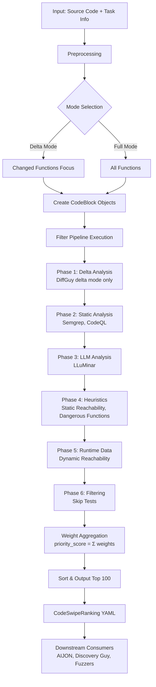

# CodeSwipe - Multi-Stage Filtering & Ranking Framework

## Overview

**CodeSwipe** is the core component of the Points of Interest (POI) subsystem. It implements a **multi-stage filtering and prioritization system** that takes thousands of functions from a large codebase and reduces them to a ranked list of ~100 high-priority functions most likely to contain vulnerabilities.

**Goal**: Enable efficient resource allocation by identifying and prioritizing potentially vulnerable code before expensive analysis (fuzzing, LLM-based PoC generation) is performed.

**Location**: [components/code-swipe/](https://github.com/sslab-gatech/shellphish-afc-crs/tree/main/components/code-swipe)

## Architecture Design

### Core Concept

CodeSwipe uses a **modular filter architecture** where:
1. **Each filter** analyzes code blocks independently and assigns weights based on different heuristics
2. **Filters are additive**: Weights from all filters are summed to create a `priority_score`
3. **Functions are ranked** by their priority score (not eliminated completely)
4. **Top N functions** (default: 100) are output for downstream analysis

### Key Design Principles

From the original design document:

> "The goal is to take a large code base with potentially thousands of functions and reduce it down into a prioritized list of maybe 100 functions... by prioritizing, our systems are going to be looking at those ones first until each component runs out of its individual budget."

**Design Decisions**:
- **Ranking over filtering**: Functions are weighted and sorted, not eliminated (avoiding false negatives)
- **Modular filters**: Easy to add new heuristics without changing core framework
- **Parallelization-ready**: Filters run independently for performance
- **Cost-aware ordering**: Cheap filters run first, expensive filters (LLM) run last on pre-filtered sets

## System Workflow



## Input Layer

### Required Inputs

1. **Target Source Code**
   - Full codebase or diff (delta mode)

2. **Task Information**
   - **Delta Mode**: Git diff + changed function indices
   - **Full Mode**: Complete source code

3. **Component Analysis Results**
   - **Function Indices**: From [Clang Indexer](../preprocessing/indexer.md) (C/C++) or Java indexer
   - **CodeQL Reports**: Vulnerability query results (YAML format)
   - **Semgrep Reports**: Rule violation findings (JSON format)
   - **ScanGuy Results**: LLM predictions (`scan_results.json`)
   - **DiffGuy Report**: Differential analysis (`diffguy_report.json`) - delta mode only

### Input Ingestion

**Implementation**: [main.py L393-401](https://github.com/sslab-gatech/shellphish-afc-crs/blob/main/components/code-swipe/src/main.py#L393-L401)

```python
# Load function indices and create CodeBlock objects
code_blocks = []
for function_index in function_indices:
    code_block = CodeBlock(
        function_key=function_index.key,
        function_info=function_index,
        filter_results={}  # Will be populated by filters
    )
    code_blocks.append(code_block)
```

## CodeBlock Abstraction

### Purpose

**CodeBlock** is the fundamental unit that flows through the filter pipeline. It encapsulates:
- Function metadata (name, location, call graph info)
- Code content
- Filter results (weights + metadata from each filter)
- Final priority score

### Data Model

**Location**: [code_block.py](https://github.com/sslab-gatech/shellphish-afc-crs/blob/main/components/code-swipe/src/models/code_block.py)

```python
class CodeBlock(BaseModel):
    function_key: str                    # "file.c:func_name:123"
    function_info: FunctionIndex         # From preprocessing
    filter_results: Dict[str, FilterResult]  # Per-filter outputs
    priority_score: float = 0.0          # Aggregated weight
```

**FilterResult** stores per-filter output:

```python
class FilterResult(BaseModel):
    weight: float                        # Contribution to priority_score
    metadata: Dict[str, Any]             # Filter-specific findings
```

## Filter Framework

### Base Architecture

**Location**: [filter_framework.py](https://github.com/sslab-gatech/shellphish-afc-crs/blob/main/components/code-swipe/src/framework/filter_framework.py)

The framework orchestrates filter execution and weight aggregation.

**Filter Base Class**: [filter.py](https://github.com/sslab-gatech/shellphish-afc-crs/blob/main/components/code-swipe/src/models/filter.py)

```python
class FilterPass(BaseModel):
    name: str
    enabled: bool
    config: Dict

    def apply(self, code_blocks: List[CodeBlock]) -> List[FilterResult]:
        """
        Apply filter logic to all code blocks.
        Returns a FilterResult for each code block.
        """
        pass
```

### Filter Execution

**Implementation**: [filter_framework.py L82-113](https://github.com/sslab-gatech/shellphish-afc-crs/blob/main/components/code-swipe/src/framework/filter_framework.py#L82-L113)

```python
def run_filters(code_blocks: List[CodeBlock], filters: List[FilterPass]):
    for filter in filters:
        if filter.enabled:
            results = filter.apply(code_blocks)
            # Store results in each CodeBlock
            for block, result in zip(code_blocks, results):
                block.filter_results[filter.name] = result
```

### Weight Aggregation

**Implementation**: [filter_framework.py L132-151](https://github.com/sslab-gatech/shellphish-afc-crs/blob/main/components/code-swipe/src/framework/filter_framework.py#L132-L151)

```python
def calculate_priority_scores(code_blocks: List[CodeBlock]):
    for block in code_blocks:
        total_score = 0.0

        for result in block.filter_results.values():
            # Skip test files
            if result.metadata.get("is_test", False):
                block.priority_score = 0.0
                break
            total_score += result.weight

        block.priority_score = total_score
```

**Key Properties**:
- **Additive**: Simple sum (no normalization)
- **Transparent**: Per-filter contribution visible in output
- **Test filtering**: Test files get priority_score = 0

## Filter Categories

CodeSwipe uses **8 filters** organized by analysis type:

### Static Analysis Filters

#### 1. Semgrep Filter

**Purpose**: Pattern-based vulnerability detection using lightweight rules

**Implementation**: [semgrep.py](https://github.com/sslab-gatech/shellphish-afc-crs/blob/main/components/code-swipe/src/filters/semgrep.py)

**Weight Range**: 2.0 - 23.0

**Details**: See [semgrep-rules.md](semgrep-rules.md)

#### 2. CodeQL Filter

**Purpose**: Deep semantic analysis using dataflow queries

**Implementation**: [codeql.py](https://github.com/sslab-gatech/shellphish-afc-crs/blob/main/components/code-swipe/src/filters/codeql.py)

**Weight Range**: 1.0 - 8.0+

**Details**: See [codeql-queries.md](codeql-queries.md)

### LLM-Based Filters

#### 3. LLuMinar Filter (ScanGuy) ⚠️ DISABLED

**Status**: ⚠️ **DISABLED** - Not enabled in competition pipeline

**Purpose**: LLM-based semantic vulnerability prediction

**Implementation**: [scanguy.py](https://github.com/sslab-gatech/shellphish-afc-crs/blob/main/components/code-swipe/src/filters/scanguy.py)

**Weight Range**: 0 or 10.0 (binary) - if enabled

**Details**: See [lluminar.md](lluminar.md)

### Delta Mode Filters

#### 4. DiffGuy Filter (Delta Mode Only)

**Purpose**: Prioritize changed/newly-reachable functions in delta mode

**Implementation**: [diffguy.py](https://github.com/sslab-gatech/shellphish-afc-crs/blob/main/components/code-swipe/src/filters/diffguy.py)

**Weight Range**: 2.0 - 12.0

**Details**: See [diffguy.md](diffguy.md)

### Heuristic Filters

#### 5. Dangerous Functions Filter

**Purpose**: API call pattern matching for unsafe C/C++ functions

**Implementation**: [dangerous_functions.py](https://github.com/sslab-gatech/shellphish-afc-crs/blob/main/components/code-swipe/src/filters/dangerous_functions.py)

**Weight Range**: 0.1 - 8.0

**Details**: See [dangerous-functions.md](dangerous-functions.md)

### Reachability Filters

#### 6. Static Reachability Filter

**Purpose**: Call graph-based reachability from entry points

**Implementation**: [static_reachability.py](https://github.com/sslab-gatech/shellphish-afc-crs/blob/main/components/code-swipe/src/filters/static_reachability.py)

**Weight Range**: 0 or 1.0

**Details**: See [static-reachability.md](static-reachability.md)

#### 7. Dynamic Reachability Filter

**Purpose**: Runtime coverage-based reachability with harness metadata

**Implementation**: [dynamic_reachability.py](https://github.com/sslab-gatech/shellphish-afc-crs/blob/main/components/code-swipe/src/filters/dynamic_reachability.py)

**Weight Range**: 0 or 1.0

**Details**: See [dynamic-reachability.md](dynamic-reachability.md)

### Utility Filters

#### 8. Skip Tests Filter

**Purpose**: Identify and exclude test files from analysis

**Implementation**: [skip_tests.py](https://github.com/sslab-gatech/shellphish-afc-crs/blob/main/components/code-swipe/src/filters/skip_tests.py)

**Weight**: Always 0.0 (triggers priority_score zeroing via metadata)

**Details**: See [skip-tests.md](skip-tests.md)

## Weight System

CodeSwipe uses a **weight-based scoring system** where each filter assigns weights to functions based on detected patterns, which are then aggregated into a final `priority_score`.

**Core Formula**: `priority_score = Σ (filter.weight)` - simple additive aggregation across all filters.

For comprehensive details on weight values, rationale, and tuning guidelines, see:

**📊 [Weight System Documentation](weights.md)** - Complete weight specifications, calculation examples, and downstream consumption

## Output Format

### CodeSwipeRanking YAML

**Location**: [ranking.py](https://github.com/sslab-gatech/shellphish-afc-crs/blob/main/libs/crs-utils/src/shellphish_crs_utils/models/ranking.py)

```yaml
ranking:
  - function_index_key: "parser.c:parse_request:123"
    function_name: "parse_request"
    filename: "src/parser.c"
    priority_score: 63.0
    weights:
      semgrep: 23.0
      codeql: 8.0
      scanguy: 10.0
      diffguy: 12.0
      dangerous_functions: 8.0
      simple_reachability: 1.0
      dynamic_reachability: 1.0
      skip_tests_filter: 0.0
    metadata:
      semgrep:
        - "semgrep.c.buffer-overflow"
        - "semgrep.java.deserialization"
      codeql:
        - "uaf"
        - "nullptr.gut"
      scanguy:
        predicted_vulnerability_type: "CWE-416"
        output: "The function uses freed memory in line 45..."
      diffguy_category: "overlap"
      potentially_dangerous_functions: ["strcpy"]
      potentially_dangerous_code: ["for "]
      reachable: true
      has_harness_input: true
      harness_name: "fuzz_parser"
      skip_test:
        is_test: false
```

### Sorting and Limiting

**Implementation**: [main.py L180-199](https://github.com/sslab-gatech/shellphish-afc-crs/blob/main/components/code-swipe/src/main.py#L180-L199)

```python
# Sort by priority_score (descending)
ranked_functions = sorted(
    code_blocks,
    key=lambda x: x.priority_score,
    reverse=True
)

# Limit to top N (default: 100)
top_functions = ranked_functions[:output_limit]
```

## Downstream Consumption

**Note**: CodeSwipe rankings are used for **proactive vulnerability analysis** (identifying targets before crashes). For **reactive crash analysis**, see [POI Guy](poiguy.md) which feeds Invariant Guy instead.

CodeSwipe rankings are consumed by multiple CRS components:

### 1. AIJON - Guided Fuzzing Instrumentation

**Integration**: [codeswipe_poi.py L24-29](https://github.com/sslab-gatech/shellphish-afc-crs/blob/main/libs/aijon-lib/aijon_lib/poi_interface/codeswipe_poi.py#L24-L29)

```python
# Sort by priority_score, take top 100
limit = min(100, len(all_pois))
self._pois.extend(
    sorted(all_pois, key=lambda x: x["priority_score"], reverse=True)[:limit]
)
```

**Purpose**: Instrument top-ranked functions for coverage-guided fuzzing

**Pipeline**: [aijon/pipeline.yaml L45-119](https://github.com/sslab-gatech/shellphish-afc-crs/blob/main/components/aijon/pipeline.yaml#L45-L119)

### 2. Discovery Guy - PoC Generation

**Integration**: [main.py L352](https://github.com/sslab-gatech/shellphish-afc-crs/blob/main/components/discoveryguy/src/discoveryguy/main.py#L352)

```python
# Process functions in ranking order
keys = [item['function_index_key'] for item in self.func_ranking['ranking']]
```

**Purpose**: Generate proof-of-concept exploits for high-priority functions first

**Pipeline**: [discoveryguy/pipeline.yaml L114-178](https://github.com/sslab-gatech/shellphish-afc-crs/blob/main/components/discoveryguy/pipeline.yaml#L114-L178)

### 3. Fuzzing Agents - Resource Allocation

- **AFLuzzer**: Prioritize harnesses reaching high-score functions
- **Jazzmine**: Focus sanitizer hooks on top-ranked sinks
- **Grammar Guy**: Generate inputs targeting high-priority parsers

### 4. QuickSeed - Seed Generation

**Purpose**: Use metadata to generate targeted seeds (e.g., SQL injection payloads for high-score database functions)

## Performance Considerations

### Parallelization

From the original design:

> "In general we should probably be parallelized in this quite a bit so that it gets through the code faster... we should keep that possibility of parallelization in mind while we are designing the structure of the code."

**Current Implementation**: Filters run sequentially but can be easily parallelized since they're independent.

**Future Enhancement**: Parallel filter execution using ThreadPoolExecutor

### Filter Ordering

**Cost-Aware Execution**:
1. **Cheap Filters** (fast, run on all functions):
   - Static Reachability
   - Dangerous Functions
   - DiffGuy

2. **Medium Filters** (pre-computed, fast lookup):
   - Semgrep
   - CodeQL

3. **Expensive Filters** (LLM-based, run on filtered subset):
   - LLuMinar (only on reachable functions)

### Caching

**Function Resolution**: [function_resolver.py](https://github.com/sslab-gatech/shellphish-afc-crs/blob/main/libs/crs-utils/src/shellphish_crs_utils/function_resolver.py)
- Caches function index lookups
- Shared across filters via API

## Delta Mode vs. Full Mode

### Delta Mode (Patch Analysis)

**Trigger**: When git diff is provided

**Workflow**:
1. DiffGuy analyzes changes (function_diff, boundary_diff, file_diff)
2. Changed functions receive highest weights (12.0 for overlap)
3. Baseline findings are subtracted (negative filters)
4. Focus resources on newly introduced vulnerabilities

**Use Case**: Quick analysis during patch review or continuous integration

### Full Mode (Complete Codebase)

**Trigger**: No diff provided

**Workflow**:
1. All filters run on entire codebase
2. No DiffGuy filter
3. All functions compete equally for top 100 slots

**Use Case**: Initial vulnerability assessment, comprehensive audit

## Design Rationale

### Why Simple Summation for Weights?

**Current Approach**: `priority_score = Σ(filter.weight)`

**Advantages**:
- Transparent and debuggable
- No hyperparameter tuning required
- Per-filter contribution visible in output
- Easy to understand and modify

**Alternatives Considered**:
- **Weighted sum**: Requires tuning filter-level multipliers
- **Max pooling**: Ignores complementary signals
- **ML-based ranking**: Requires ground truth labels

### Why Ranking Instead of Filtering?

**Rationale**:
- Avoids false negatives (don't eliminate potentially vulnerable code)
- Allows downstream components to decide depth of analysis
- Metadata preserved for all functions, not just "matches"
- Budget-aware: Components stop when time/cost runs out

### Why Modular Filters?

**Benefits**:
- Easy to add new heuristics without changing framework
- Independent development and testing
- Filters can be toggled on/off via configuration
- Supports experimentation and A/B testing

## Configuration

### Main Configuration

**Location**: [main.py L249-390](https://github.com/sslab-gatech/shellphish-afc-crs/blob/main/components/code-swipe/src/main.py#L249-L390)

**Filter Enable Flags**:
```python
enable_static_reachability: bool = True
enable_dangerous_functions: bool = True
enable_semgrep: bool = True
enable_codeql: bool = True
enable_scanguy: bool = False  # Expensive, use selectively
enable_diffguy: bool = False  # Only for delta mode
```

**Weight Parameters**:
- Per-filter configured weights (see [weights.md](weights.md))
- Output limit (default: 100)

## Future Enhancements

From [filter_framework.py L130](https://github.com/sslab-gatech/shellphish-afc-crs/blob/main/components/code-swipe/src/framework/filter_framework.py#L130):

```python
# TODO: Implement more sophisticated scoring
# For now, just sum the weights from each filter
```

**Potential Improvements**:
1. **Cross-filter boosting**: Higher weight when multiple filters agree on same function
2. **Historical feedback**: Adjust weights based on PoC generation success rate
3. **Context-aware weighting**: Use call graph depth, cyclomatic complexity
4. **Diminishing returns**: Sublinear aggregation for multiple findings in same function
5. **Streaming output**: Immediately forward high-priority targets to downstream components

## Related Documentation

### Filter Documentation

- **[Semgrep Rules](semgrep-rules.md)** - Pattern-based vulnerability detection
- **[CodeQL Queries](codeql-queries.md)** - Dataflow-based semantic analysis
- **[LLuMinar](lluminar.md)** - LLM-based vulnerability prediction
- **[DiffGuy](diffguy.md)** - Differential analysis for delta mode
- **[Dangerous Functions](dangerous-functions.md)** - Unsafe API detection
- **[Static Reachability](static-reachability.md)** - Call graph-based reachability
- **[Dynamic Reachability](dynamic-reachability.md)** - Runtime coverage-based reachability
- **[Skip Tests](skip-tests.md)** - Test file exclusion

### System Documentation

- **[Weight System](weights.md)** - Detailed weight values and aggregation logic
- **[Preprocessing](../preprocessing/readme.md)** - Function index generation
- **[Vulnerability Identification](../vulnerability-identification/readme.md)** - POI consumers

## References

- **CodeSwipe Component**: [components/code-swipe/](https://github.com/sslab-gatech/shellphish-afc-crs/tree/main/components/code-swipe)
- **Original Design** (vocal description): Internal documentation
- **Whitepaper Section 5**: [Points of Interests](../whitepaper/Artiphishell-3.md#5-points-of-interests)
