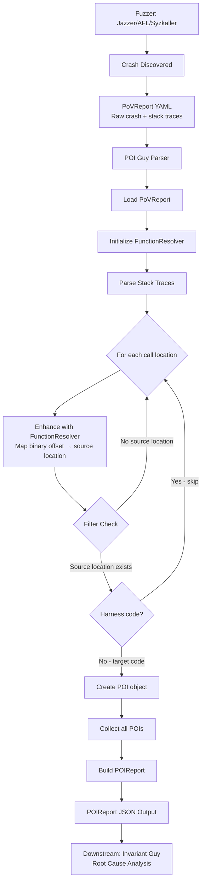

# POI Guy - Fuzzing Crash POI Extraction

## Overview

**POI Guy** is a crash report parser that extracts Points of Interest (POI) from fuzzing-generated crash reports. Unlike CodeSwipe which identifies POIs through static analysis, POI Guy operates on dynamic analysis results—extracting vulnerable function locations from actual crashes discovered during fuzzing.

**Core Purpose**: Transform raw fuzzing crash data (PoVReport) into structured POI information for downstream vulnerability analysis and remediation.

**Location**: [components/poiguy/](https://github.com/sslab-gatech/shellphish-afc-crs/tree/main/components/poiguy)

## Key Concepts

### Input: PoVReport (Proof of Vulnerability Report)

**Source**: Generated by fuzzers (Jazzer for Java, Syzkaller for kernel, AFL++ for C/C++)

**Content**: Raw crash information including:
- Stack traces from sanitizer output (ASAN, UBSAN, etc.)
- Crash type (heap-buffer-overflow, use-after-free, null-pointer-dereference, etc.)
- Harness metadata (binary path, architecture, sanitizer configuration)
- Triggered sanitizers (which sanitizers consistently detected the crash)

**Format**: YAML file with nested crash report structure

### Output: POIReport

**Purpose**: Structured representation of crash locations with enriched metadata

**Content**:
- **pois**: List of POI objects with source locations extracted from stack traces
- **crash_reason**: Type of vulnerability (e.g., "heap-buffer-overflow")
- **stack_traces**: Full call traces showing execution path to crash
- **consistent_sanitizers**: Sanitizers that reliably trigger on this crash
- Harness metadata (project, fuzzer, architecture, build config)

**Format**: JSON file conforming to POIReport schema

## Architecture



## Workflow

### 1. Input Parsing

**Implementation**: [poiguy.py L40-47](https://github.com/sslab-gatech/shellphish-afc-crs/blob/main/components/poiguy/poiguy.py#L40-L47)

```python
with report.open("r") as f:
    data = yaml.safe_load(f)
    pov_crash_report = PoVReport.model_validate(data)
    dedup_crash_report = pov_crash_report.dedup_crash_report
```

**Key Data Extraction**:
- Load PoVReport from YAML
- Extract deduplicated crash report (normalized representation)
- Get harness name for filtering

### 2. Function Resolution Setup

**Implementation**: [poiguy.py L52-61](https://github.com/sslab-gatech/shellphish-afc-crs/blob/main/components/poiguy/poiguy.py#L52-L61)

```python
function_resolver = RemoteFunctionResolver(
    cp_name=pov_crash_report.project_name,
    project_id=project_id,
)
```

**Purpose**: Maps binary addresses/offsets in stack traces to source code locations

**Functionality**:
- Queries function index database
- Resolves symbol names to file paths and line numbers
- Enriches CallTraceEntry with source location metadata

### 3. Stack Trace Processing

**Implementation**: [poiguy.py L63-87](https://github.com/sslab-gatech/shellphish-afc-crs/blob/main/components/poiguy/poiguy.py#L63-L87)

**Process**:

1. **Iterate through stack traces**:
   ```python
   for stack_trace_name, stack_trace in dedup_crash_report.stack_traces.items():
       for cte in stack_trace.call_locations:
   ```

2. **Enhance with function resolver**:
   ```python
   cte.enhance_with_function_resolver(function_resolver)
   ```
   - Maps binary offset to source location
   - Populates `cte.source_location` with file path, function name, line number

3. **Filter and extract POIs**:
   ```python
   if (cte.source_location
       and cte.source_location.function_index_key
       and cte.source_location.full_file_path
       and cte.source_location.full_file_path.stem != harness_name):

       poi = POI(
           reason=dedup_crash_report.crash_type,
           source_location=cte.source_location,
       )
       processed_pois.append(poi)
   ```

**Filtering Logic**:
- **Include**: Functions with valid source locations in target code
- **Exclude**: Harness test code (matches harness_name)
- **Exclude**: System library code without source mapping

### 4. POIReport Generation

**Implementation**: [poiguy.py L94-123](https://github.com/sslab-gatech/shellphish-afc-crs/blob/main/components/poiguy/poiguy.py#L94-L123)

```python
poi = POIReport(
    # Harness metadata
    project_id=pov_crash_report.project_id,
    cp_harness_name=pov_crash_report.cp_harness_name,
    architecture=pov_crash_report.architecture,
    sanitizer=pov_crash_report.sanitizer,

    # Crash information
    crash_reason=dedup_crash_report.crash_type,
    consistent_sanitizers=pov_crash_report.consistent_sanitizers,

    # POI data
    pois=processed_pois,
    stack_traces=dedup_crash_report.stack_traces,

    # Additional context
    additional_information={
        "asan_report_data": json.loads(dedup_crash_report.model_dump_json()),
        "sanitizer": dedup_crash_report.sanitizer,
    },
)
```

## Input Schema

### PoVReport (Input)

**Key Fields**:

```yaml
project_name: "libxml2"
project_id: "proj_123"
cp_harness_name: "xml_reader_fuzzer"
fuzzer: "jazzer"
sanitizer: "address"
architecture: "x86_64"

consistent_sanitizers:
  - "address"
  - "undefined"

dedup_crash_report:
  crash_type: "heap-buffer-overflow"
  sanitizer: "address"

  stack_traces:
    primary:
      reason: "heap-buffer-overflow"
      call_locations:
        - trace_line: "#0 0x7f8b9c in xmlParseElement /src/parser.c:1234"
          function: "xmlParseElement"
          relative_file_path: "src/parser.c"
          line_number: 1234
          symbol_offset: 0x7f8b9c
```

## Output Schema

### POIReport (Output)

**Key Fields**:

```json
{
  "project_id": "proj_123",
  "project_name": "libxml2",
  "harness_info_id": "harness_456",
  "detection_strategy": "fuzzing",
  "fuzzer": "jazzer",
  "crash_reason": "heap-buffer-overflow",

  "consistent_sanitizers": ["address", "undefined"],
  "inconsistent_sanitizers": [],

  "pois": [
    {
      "reason": "heap-buffer-overflow",
      "source_location": {
        "relative_file_path": "src/parser.c",
        "function_signature": "xmlParseElement",
        "line_text": "memcpy(dst, src, size);",
        "line_number": 1234,
        "function_index_key": "parser.c:xmlParseElement:1200",
        "symbol_offset": 8331164,
        "symbol_size": 2048
      }
    }
  ],

  "stack_traces": {
    "primary": {
      "reason": "heap-buffer-overflow",
      "call_locations": [
        {
          "trace_line": "#0 0x7f8b9c in xmlParseElement /src/parser.c:1234",
          "relative_file_path": "src/parser.c",
          "function": "xmlParseElement",
          "line_number": 1234
        }
      ]
    }
  },

  "additional_information": {
    "asan_report_data": { /* full sanitizer output */ },
    "sanitizer": "address"
  }
}
```

## Error Handling

### Graceful Degradation

**Implementation**: [poiguy.py L125-234](https://github.com/sslab-gatech/shellphish-afc-crs/blob/main/components/poiguy/poiguy.py#L125-L234)

POI Guy implements a **fallback mechanism** to ensure pipeline continuity even when parsing fails:

**Primary Path**: `produce_poi_report()`
- Parse PoVReport fully
- Enhance all stack traces
- Filter and extract POIs

**Fallback Path**: `generate_dirty_poi_report()`
- Triggered when primary path fails
- Creates minimal POIReport with available data
- Preserves crash information even if resolution fails
- Marks report as degraded for downstream handling

**Design Rationale**: Ensures the CRS pipeline never blocks on a single crash report parsing failure.

### Error Scenarios Handled

1. **FunctionResolver initialization failure**:
   ```python
   if function_resolver is None:
       # Continue without enhancement
   ```

2. **Stack trace enhancement failure**:
   ```python
   try:
       cte.enhance_with_function_resolver(function_resolver)
   except Exception as e:
       log.error("Error enhancing CTE", exc_info=True)
       # Continue to next entry
   ```

3. **Complete parsing failure**:
   - Generate dirty report with ERROR markers
   - Output minimal valid POIReport to unblock pipeline

## Integration with CRS

### Upstream Dependencies

**Fuzzing Components**:
- **Jazzer** (Java fuzzing): Generates PoVReports for Java crashes
- **AFL++/Syzkaller** (C/C++/kernel fuzzing): Generates PoVReports for native crashes
- **Sanitizers** (ASAN, UBSAN, MSAN): Detect memory safety violations

**Preprocessing**:
- **Function Indexer**: Provides function metadata for FunctionResolver
- **Build System**: Produces instrumented binaries with debug symbols

### Downstream Consumers

**Root Cause Analysis**:
- **Invariant Guy**: Primary consumer of POIReport
  - Uses crash POIs to perform root cause analysis
  - Analyzes invariant violations at crash locations
  - Integrates crash context with static analysis
  - Pipeline: [invariant-guy/pipeline.yaml](https://github.com/sslab-gatech/shellphish-afc-crs/blob/main/components/invariant-guy/pipeline.yaml#L133-L140)

**Note**: POI Guy's output is NOT consumed by AIJON, Discovery Guy, or fuzzing agents. Those components use CodeSwipe's static analysis POIs instead. POI Guy provides reactive crash analysis, while CodeSwipe provides proactive vulnerability prioritization.

## Key Design Decisions

### Why Parse Stack Traces Instead of Just Crash Line?

**Rationale**:
- Crash location may be in system library code (not patchable)
- Stack trace reveals **first target code location** in call chain
- Multiple POIs per crash capture complex execution paths

**Example**:
```
#0 0x7fff in free() [libc.so]           ← System code (skip)
#1 0x1234 in cleanup() [target/util.c]  ← First target POI
#2 0x5678 in process() [target/main.c]  ← Second target POI
```

### Why Filter Out Harness Code?

**Rationale**:
- Harness code is test infrastructure, not vulnerability target
- Crashes in harness don't represent real vulnerabilities
- Focuses downstream analysis on patchable code

**Implementation**:
```python
cte.source_location.full_file_path.stem != harness_name
```

### Why Use FunctionResolver?

**Rationale**:
- Binary addresses from sanitizer output aren't directly usable
- Need source file path and line number for patch generation
- Function index provides call graph context for analysis

**Benefit**: Bridges gap between runtime crash data and static code analysis

## Performance Considerations

### Speed

**Typical Processing Time**: <1 second per crash report

**Bottlenecks**:
- FunctionResolver queries (network call to function index database)
- Stack trace parsing (proportional to trace depth)

**Optimization**: RemoteFunctionResolver caches lookups within session

### Error Rate

**Failure Modes**:
1. **Parsing failure**: Malformed PoVReport (rare)
2. **Resolution failure**: Missing debug symbols (10-20% of traces)
3. **No target POIs**: All stack frames in harness/system code (5-10% of crashes)

**Mitigation**: Dirty report generation ensures pipeline continues

## Configuration

### Main Entrypoint

**Location**: [poiguy.py L249-295](https://github.com/sslab-gatech/shellphish-afc-crs/blob/main/components/poiguy/poiguy.py#L249-L295)

**Command Line Arguments**:
```bash
python poiguy.py \
  --project-id "proj_123" \
  --report-id "crash_abc" \
  --report "input/pov_report.yaml" \
  --project-metadata "input/metadata.yaml" \
  --output "output/poi_report.json"
```

### Pipeline Integration

**Location**: [pipeline_poiguy.yaml](https://github.com/sslab-gatech/shellphish-afc-crs/blob/main/components/poiguy/pipeline_poiguy.yaml)

**pydatatask Configuration**:
```yaml
inputs:
  - dedup_pov_reports
  - project_metadatas
  - full_functions_indices

outputs:
  - points_of_interest

failure_ok: true  # Continue pipeline on parsing errors
```

## Comparison: POI Guy vs CodeSwipe

| Aspect | POI Guy | CodeSwipe |
|--------|---------|-----------|
| **Analysis Type** | Dynamic (fuzzing crashes) | Static (source code) |
| **Input** | PoVReport (crash data) | Function indices + analysis results |
| **Method** | Parse stack traces | Multi-filter ranking |
| **Output** | POIReport (crash locations) | CodeSwipeRanking (top 100 functions) |
| **Precision** | High (actual crashes) | Medium (heuristics) |
| **Coverage** | Low (requires crash) | High (all reachable code) |
| **Cost** | Low (parse only) | High (multiple analyses) |
| **Use Case** | Post-fuzzing analysis | Pre-fuzzing prioritization |

## Related Documentation

- **[CodeSwipe Overview](codeswipe-overview.md)** - Static analysis POI identification
- **[POI System Overview](readme.md)** - Complete POI subsystem architecture
- **[Preprocessing](../preprocessing/readme.md)** - Function index generation
- **[Vulnerability Identification](../vulnerability-identification/readme.md)** - POI consumers

## References

- **POI Guy Component**: [components/poiguy/](https://github.com/sslab-gatech/shellphish-afc-crs/tree/main/components/poiguy)
- **POIReport Schema**: [crs_reports.py L67-105](https://github.com/sslab-gatech/shellphish-afc-crs/blob/main/libs/crs-utils/src/shellphish_crs_utils/models/crs_reports.py#L67-L105)
- **FunctionResolver**: [function_resolver.py](https://github.com/sslab-gatech/shellphish-afc-crs/blob/main/libs/crs-utils/src/shellphish_crs_utils/function_resolver.py)
