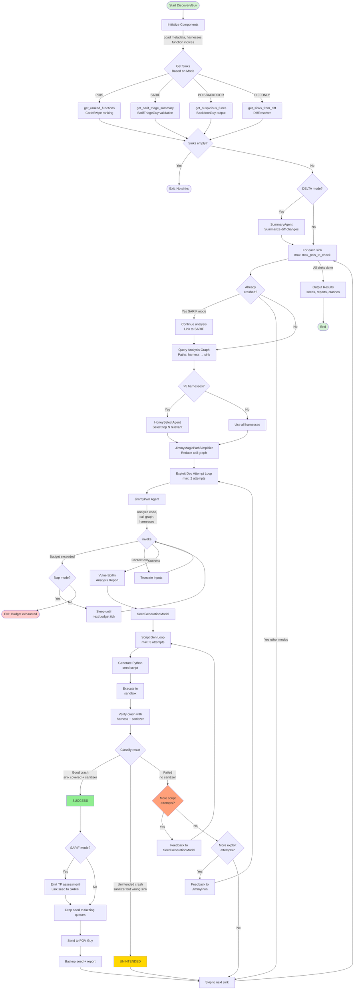
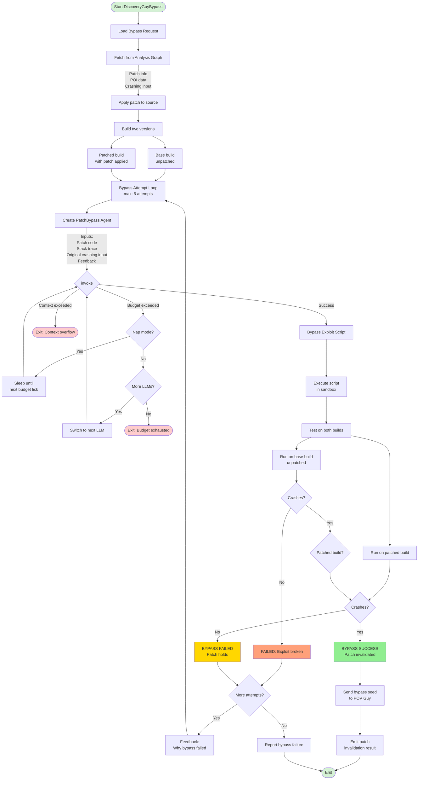

# Discovery Guy

## Overview

Discovery Guy is a vulnerability identification and exploitation component that generates crashing seeds (Proof of Vulnerability) for identified vulnerabilities. It operates in **5 distinct scenarios** with different input sources, employing multi-agent collaboration to analyze code, identify vulnerabilities, and produce working exploits.

**Note**: The whitepaper ([Section 6.4](https://github.com/sslab-gatech/shellphish-afc-crs/blob/main/notes/src/whitepaper/Artiphishell-3.md#64-discovery-guy)) mentions only **3 scenarios** (POIS, SARIF, BYPASS), but the actual implementation includes **2 additional scenarios** (POISBACKDOOR and DIFFONLY) that evolved during development.

From whitepaper:

> The Discovery Guy agent takes as input a sink function, which has been identified as potentially containing a bug, tries to identify the actual vulnerability, and, if successful, creates a Python script that generates the corresponding crashing seed.

**Component Location**: [components/discoveryguy/](https://github.com/sslab-gatech/shellphish-afc-crs/blob/main/components/discoveryguy/)

---

## The 5 Operating Scenarios

Discovery Guy supports 5 distinct operational scenarios, each with different input sources and specialized behaviors:

| Scenario | Input Source | Upstream Component | When Used | Key Difference |
|----------|-------------|-------------------|-----------|----------------|
| **POIS** | CodeSwipe function ranking | CodeSwipe (static analyzer) | Full mode: Analyze ranked functions most likely to contain bugs | Standard workflow, max 300 functions |
| **SARIF** | SARIF static analysis reports | External SARIF tools (Semgrep, CodeQL) | Validate static analysis findings with dynamic exploits | Adds SARIF validation, emits TP/FP assessment |
| **POISBACKDOOR** | Suspicious high-entropy functions | **BackdoorGuy** | Security review: Detect obfuscated/backdoored code | Uses entropy-based detection + LLM validation |
| **DIFFONLY** | Functions changed in diff | DiffResolver (diff parser) | Delta mode: Analyze only changed code | Reduced budget ($20), diff-focused analysis |
| **BYPASS** | Patch + original POI | PatcherY/PatcherQ | Patch validation: Attempt to bypass generated patches | **Different workflow** - uses `PatchBypass` agent |

### Scenario Details

#### 1. POIS Mode (CodeSwipe Ranking)
- **Input**: [get_ranked_functions()](https://github.com/sslab-gatech/shellphish-afc-crs/blob/main/components/discoveryguy/src/discoveryguy/main.py#L351)
- **Source**: CodeSwipe ranking YAML (`ranking` field)
- **Behavior**: Processes top N functions (max 300) sorted by vulnerability likelihood
- **Budget**: $100

#### 2. SARIF Mode (Static Analysis Validation)
- **Input**: [get_sarif_triage_summary()](https://github.com/sslab-gatech/shellphish-afc-crs/blob/main/components/discoveryguy/src/discoveryguy/main.py#L280)
- **Source**: SARIF report + metadata from external tools
- **Special Processing**:
  - Uses `SarifTriageGuy` agent to validate each SARIF result
  - Extracts sink functions from SARIF locations
  - Links successful exploits back to SARIF report via Analysis Graph
  - Emits assessment: True Positive or False Positive
- **Output**: SARIF assessment metadata to `sarif_retry_metadatas`
- **Budget**: $100

#### 3. POISBACKDOOR Mode (Backdoor Detection)

**Upstream Component: BackdoorGuy** ([components/backdoorguy/](https://github.com/sslab-gatech/shellphish-afc-crs/blob/main/components/backdoorguy/))

**Detection Strategy**:

BackdoorGuy implements a two-phase entropy-based backdoor detection system:

**Phase 1: Entropy Analysis** ([main.py:122-141](https://github.com/sslab-gatech/shellphish-afc-crs/blob/main/components/backdoorguy/src/backdoorguy/main.py#L122))
1. Calculate Shannon entropy for every function's source code
2. Identify statistical outliers using Interquartile Range (IQR):
   - Q1 = 25th percentile, Q3 = 75th percentile
   - IQR = Q3 - Q1
   - Upper fence = Q3 + 1.5 × IQR
   - Functions with entropy ≥ upper fence flagged as suspicious
3. Limit to top 10 outliers (configurable: `Config.max_outliers`)

**Rationale**: Obfuscated code, encryption routines, or compressed data embedded in backdoors exhibit unusually high entropy compared to normal source code.

**Phase 2: LLM Validation** ([main.py:153-178](https://github.com/sslab-gatech/shellphish-afc-crs/blob/main/components/backdoorguy/src/backdoorguy/main.py#L153))

For each high-entropy outlier, `DetectorGuy` agent analyzes the code:

**Agent**: [DetectorGuy](https://github.com/sslab-gatech/shellphish-afc-crs/blob/main/components/backdoorguy/src/backdoorguy/agents/Detector.py)
- **LLM**: gpt-4.1-mini (with fallback chain)
- **Prompts**: [system.j2](https://github.com/sslab-gatech/shellphish-afc-crs/blob/main/components/backdoorguy/src/backdoorguy/prompts/Detector/system.j2), [user.j2](https://github.com/sslab-gatech/shellphish-afc-crs/blob/main/components/backdoorguy/src/backdoorguy/prompts/Detector/user.j2)
- **Task**: Detect signs of backdoors:
  1. Obfuscated code patterns
  2. Suspicious commands enabling restricted functionality
  3. Presence of suspicious libraries/functions
  4. Any anomalous behavior
- **Output**: Simple "yes" or "no" verdict

**Data Flow to Discovery Guy**:
```
BackdoorGuy → suspicious_functions (YAML) → Discovery Guy (POISBACKDOOR mode)
```

Pipeline connection: [pipeline.yaml:908-911](https://github.com/sslab-gatech/shellphish-afc-crs/blob/main/components/discoveryguy/pipeline.yaml#L908)

**Discovery Guy Processing**:
- **Input**: [get_suspicious_funcs()](https://github.com/sslab-gatech/shellphish-afc-crs/blob/main/components/discoveryguy/src/discoveryguy/main.py#L358)
- **Source**: `suspicious_functions` YAML (`sus_funcs` field)
- **Behavior**: Attempts to exploit flagged functions using standard workflow
- **Budget**: $100

**Why This Matters**: Backdoors may not trigger traditional vulnerability detection but could still be exploitable. This mode provides security-focused analysis beyond typical bug hunting.

#### 4. DIFFONLY Mode (Delta Code Analysis)
- **Input**: [get_sinks_from_diff()](https://github.com/sslab-gatech/shellphish-afc-crs/blob/main/components/discoveryguy/src/discoveryguy/main.py#L362)
- **Source**: Unified diff file parsed by `DiffResolver`
- **Behavior**: Only analyzes functions modified in the diff
- **Budget**: $20 (reduced for faster iteration)

#### 5. BYPASS Mode (Patch Bypass Validation)
- **Input**: Patch + POI report from Analysis Graph
- **Source**: Bypass request metadata from PatcherY/PatcherQ
- **Behavior**: **Uses separate workflow** (see BYPASS Workflow below)
- **Agent**: `PatchBypass` instead of `JimmyPwn`
- **Goal**: Find alternative exploit paths that bypass the patch

---

## Architecture Overview

### Main Entry Points

1. **[run.py](https://github.com/sslab-gatech/shellphish-afc-crs/blob/main/components/discoveryguy/src/run.py)** - Orchestration script
   - Downloads and extracts debug artifacts
   - Manages multi-processing for parallel execution
   - Sets environment variables for mode selection

2. **[main.py](https://github.com/sslab-gatech/shellphish-afc-crs/blob/main/components/discoveryguy/src/discoveryguy/main.py)** - Core logic (POIS/SARIF/POISBACKDOOR/DIFFONLY)
   - Implements `DiscoveryGuy` class (~1390 lines)
   - Orchestrates shared workflow for 4 scenarios
   - Manages sub-agents: JimmyPwn, SeedGenerationModel, HoneySelect, SummaryAgent

3. **[main_bypass.py](https://github.com/sslab-gatech/shellphish-afc-crs/blob/main/components/discoveryguy/src/discoveryguy/main_bypass.py)** - Bypass mode
   - Implements `DiscoveryGuyBypass` class
   - Uses `PatchBypass` agent for patch circumvention
   - Tests exploits on both patched and unpatched builds

### Configuration

[config.py](https://github.com/sslab-gatech/shellphish-afc-crs/blob/main/components/discoveryguy/src/discoveryguy/config.py) controls:

```python
# Budget limits
discoguy_budget_limit = 100  # POIS, SARIF, POISBACKDOOR
discoguy_from_diff_budget_limit = 20  # DIFFONLY

# Exploit development attempts
exploit_dev_max_attempts_per_sink = 2  # Max JimmyPwn attempts per sink
exploit_dev_max_attempts_regenerate_script = 3  # Max seed script regenerations

# Function/harness limits
max_pois_to_check = 300  # Max sinks to analyze
max_harness_per_poi = 5  # Max harnesses per sink

# LLM models
jimmypwn_llms = ['claude-4-sonnet', 'claude-4-opus']
summary_agent_llms = ['o3', 'claude-4-sonnet']
honey_select_llms = ['claude-4-sonnet', 'o3']

# Nap mode (budget exhaustion handling)
nap_mode = True
nap_duration = 8  # minutes
nap_becomes_death_after = 100  # max naps before giving up
```

---

## Shared Workflow (POIS, SARIF, POISBACKDOOR, DIFFONLY)

Four scenarios share the same core workflow, differing only in sink selection and minor mode-specific additions.



### Workflow Phases Explained

#### Phase 1: Sink Selection ([main.py:1103-1118](https://github.com/sslab-gatech/shellphish-afc-crs/blob/main/components/discoveryguy/src/discoveryguy/main.py#L1103))

Each mode calls a different sink-gathering function:
- **POIS**: Loads `FUNC_RANKING` YAML, extracts top 300 functions
- **SARIF**: Invokes `SarifTriageGuy` for each SARIF result, extracts sink from first location
- **POISBACKDOOR**: Loads `suspicious_functions` YAML from BackdoorGuy
- **DIFFONLY**: Parses diff file, maps changed lines to function boundaries

#### Phase 2: Optional Diff Summary ([main.py:1126-1140](https://github.com/sslab-gatech/shellphish-afc-crs/blob/main/components/discoveryguy/src/discoveryguy/main.py#L1126))

If `DELTA_MODE=True` and diff < 700 lines:
- **SummaryAgent** (O3/Claude-Sonnet) generates natural language summary of changes
- Summary included in JimmyPwn context

#### Phase 3: Per-Sink Processing Loop ([main.py:1146-1324](https://github.com/sslab-gatech/shellphish-afc-crs/blob/main/components/discoveryguy/src/discoveryguy/main.py#L1146))

For each sink (up to `max_pois_to_check`):

**A. Skip Check** ([main.py:1170-1178](https://github.com/sslab-gatech/shellphish-afc-crs/blob/main/components/discoveryguy/src/discoveryguy/main.py#L1170))
- Query Analysis Graph: Has this sink already been crashed?
- If yes and NOT SARIF mode: skip (avoid duplicate work)
- SARIF mode exception: Still process to link crash to SARIF report

**B. Harness Selection** ([main.py:1189-1223](https://github.com/sslab-gatech/shellphish-afc-crs/blob/main/components/discoveryguy/src/discoveryguy/main.py#L1189))
1. Query Analysis Graph for call graph paths: `harness → sink` (max 10 hops)
2. If `>5 harnesses`: Invoke **HoneySelectAgent** to rank by relevance
3. If `≤5 harnesses`: Use all harnesses

**C. Graph Simplification** ([main.py:1226](https://github.com/sslab-gatech/shellphish-afc-crs/blob/main/components/discoveryguy/src/discoveryguy/main.py#L1226))
- **JimmyMagicPathSimplifier** reduces call graph for LLM consumption:
  - Remove cycles (topological sort)
  - Merge single-caller/single-callee chains
  - Create `__connector__` nodes for disconnected subgraphs
  - Include diff hunks if DELTA mode

#### Phase 4: Exploit Development Loop ([main.py:1232-1324](https://github.com/sslab-gatech/shellphish-afc-crs/blob/main/components/discoveryguy/src/discoveryguy/main.py#L1232))

**Outer Loop: JimmyPwn Attempts** (max 2 per sink)

1. **Create JimmyPwn Agent** ([main.py:1248-1272](https://github.com/sslab-gatech/shellphish-afc-crs/blob/main/components/discoveryguy/src/discoveryguy/main.py#L1248))
   - Inputs: Sink code, call graph nodes, harnesses, feedback from previous attempts
   - SARIF mode: Add SARIF summary via `add_sarif_summary()`
   - DELTA mode: Include diff + summary

2. **JimmyPwn Invocation** ([main.py:1283](https://github.com/sslab-gatech/shellphish-afc-crs/blob/main/components/discoveryguy/src/discoveryguy/main.py#L1283))
   - LLM analyzes code using available tools (grep, CodeQL, coverage, debugger)
   - Produces vulnerability analysis report (XML format)
   - Error handling:
     - Budget exceeded → Nap mode (sleep until next budget window)
     - Context exceeded → Truncate inputs and retry
     - Max tool calls (75) → Use truncated report

**Inner Loop: Seed Generation** ([main.py:783-819](https://github.com/sslab-gatech/shellphish-afc-crs/blob/main/components/discoveryguy/src/discoveryguy/main.py#L783))

3. **Create SeedGenerationModel** ([main.py:768-777](https://github.com/sslab-gatech/shellphish-afc-crs/blob/main/components/discoveryguy/src/discoveryguy/main.py#L768))
   - Input: JimmyPwn's vulnerability report
   - LLM: gpt-o4-mini
   - Task: Convert analysis into Python seed generation script

4. **Script Generation Attempts** (max 3)
   - Generate Python script
   - Execute in sandbox ([InstrumentedOssFuzzProject](https://github.com/sslab-gatech/shellphish-afc-crs/blob/main/components/discoveryguy/src/discoveryguy/main.py#L145))
   - Check for execution errors (timeout, missing modules)

5. **Crash Verification** ([crash_checker.py:61-120](https://github.com/sslab-gatech/shellphish-afc-crs/blob/main/components/discoveryguy/src/discoveryguy/crash_checker.py#L61))
   - Run generated seed with each harness in scope
   - Try all build configs (ASAN, UBSAN, etc.) until one crashes
   - Verify sanitizer triggered: `res.pov.triggered_sanitizers != []`
   - Check sink function in backtrace

6. **Result Classification**
   - **Good crash**: Sink covered + sanitizer triggered → **SUCCESS**
   - **Unintended crash**: Sanitizer triggered but sink NOT in backtrace → **BREAK** (don't retry)
   - **Failed**: No sanitizer → Retry with feedback

7. **Feedback Loops**
   - Script failed → Feedback to `SeedGenerationModel` (technical errors)
   - All scripts failed → Feedback to `JimmyPwn` (ask for new analysis)
   - Unintended crash → Feedback to `JimmyPwn` (explain mismatch, request different approach)

#### Phase 5: Success Handling

On good crash:

1. **SARIF Mode Special**: Emit TP assessment, link seed to SARIF report in Analysis Graph
2. **Seed Distribution**:
   - Drop into fuzzing queues: `/shared/fuzzer_sync/{project}-{harness}/sync-discoguy-{id}/queue/`
   - Seed naming: `id:XXXXXX,src:discoveryguy-{dg_id},reason:llm`
3. **Send to POV Guy** for deduplication and submission
4. **Backup**: Store seed + crash report in output directories

---

## BYPASS Workflow (Separate from Shared Workflow)

BYPASS mode uses a fundamentally different workflow to attempt patch circumvention.



### BYPASS Workflow Details

**Implementation**: [main_bypass.py](https://github.com/sslab-gatech/shellphish-afc-crs/blob/main/components/discoveryguy/src/discoveryguy/main_bypass.py)

**Key Differences from Shared Workflow**:

1. **Input**: Patch + POI data (not sink functions)
2. **Agent**: `PatchBypass` instead of `JimmyPwn`
3. **Goal**: Find alternative exploit paths around the patch
4. **Testing**: Validates on BOTH patched and unpatched builds

**Workflow Steps**:

1. **Load Bypass Request** ([main_bypass.py:74-111](https://github.com/sslab-gatech/shellphish-afc-crs/blob/main/components/discoveryguy/src/discoveryguy/main_bypass.py#L74))
   - Fetch patch info from Analysis Graph by `patch_id`
   - Fetch POI crash data by `poi_report_id`
   - Get original crashing input
   - Extract stack trace

2. **Apply Patch** ([main_bypass.py:111](https://github.com/sslab-gatech/shellphish-afc-crs/blob/main/components/discoveryguy/src/discoveryguy/main_bypass.py#L111))
   - Apply patch to source code using `apply_patch_source()`

3. **Build Two Versions** ([main_bypass.py:128-141](https://github.com/sslab-gatech/shellphish-afc-crs/blob/main/components/discoveryguy/src/discoveryguy/main_bypass.py#L128))
   - `cp_debug`: Patched build (with patch applied)
   - `cp_base`: Base build (original, unpatched)

4. **Bypass Attempt Loop** (max 5 attempts) ([main_bypass.py:216-260](https://github.com/sslab-gatech/shellphish-afc-crs/blob/main/components/discoveryguy/src/discoveryguy/main_bypass.py#L216))

   **Create PatchBypass Agent** ([main_bypass.py:218-224](https://github.com/sslab-gatech/shellphish-afc-crs/blob/main/components/discoveryguy/src/discoveryguy/main_bypass.py#L218))
   ```python
   bypassAgent = PatchBypass(
       LANGUAGE_EXPERTISE=self.project_language,
       PATCH_CODE=self.patch,
       SUMMARY=self.summary,  # Patch description
       STACK_TRACE=self.stacktrace,  # Original crash
       FEEDBACK=feedback,  # From previous attempts
       CRASHING_INPUT=self.crashing_input  # Original POV
   )
   ```

   **LLM Strategy**:
   - Attempts 1-4: Use fallback chain (Claude-Sonnet → O3 → ...)
   - Attempt 5 (last chance): Use Claude-Opus

5. **Script Execution and Dual Testing** ([main_bypass.py:244-340](https://github.com/sslab-gatech/shellphish-afc-crs/blob/main/components/discoveryguy/src/discoveryguy/main_bypass.py#L244))
   - Generate bypass exploit script
   - Execute in sandbox
   - Test on **base build** (should crash - sanity check)
   - Test on **patched build** (should NOT crash unless bypass works)

6. **Result Classification**
   - **Bypass SUCCESS**: Crashes on BOTH builds → Patch is bypassable (invalidate patch)
   - **Bypass FAILED**: Only crashes on base, NOT on patched → Patch holds
   - **Exploit Broken**: Doesn't crash on either → Script generation failed

7. **Output**
   - On success: Send bypass seed to POV Guy, emit patch invalidation
   - On failure: Report patch holds (patch is valid)

**Why This Is Different**:

- No sink discovery (sink already known from POI)
- No harness selection (harness already identified in POI)
- No call graph analysis (focuses on finding alternative paths)
- Tests defensive effectiveness rather than vulnerability existence

---

## Sub-Agents

### 1. JimmyPwn Agent

**Location**: [agents/JimmyPwn.py](https://github.com/sslab-gatech/shellphish-afc-crs/blob/main/components/discoveryguy/src/discoveryguy/agents/JimmyPwn.py)

**Purpose**: Deep code analysis to identify vulnerabilities and produce exploitation strategy

**LLM Configuration** ([JimmyPwn.py:210-222](https://github.com/sslab-gatech/shellphish-afc-crs/blob/main/components/discoveryguy/src/discoveryguy/agents/JimmyPwn.py#L210)):
- Primary: `claude-4-sonnet`
- Fallback: `claude-4-opus` (if budget allows, controlled by [config.py:91-95](https://github.com/sslab-gatech/shellphish-afc-crs/blob/main/components/discoveryguy/src/discoveryguy/config.py#L91))
- Max tool calls: 75
- Max retries on validation errors: 8

**Prompts**: [prompts/JimmyPwn/](https://github.com/sslab-gatech/shellphish-afc-crs/blob/main/components/discoveryguy/src/discoveryguy/prompts/JimmyPwn/)
- [system.j2](https://github.com/sslab-gatech/shellphish-afc-crs/blob/main/components/discoveryguy/src/discoveryguy/prompts/JimmyPwn/system.j2) - Main analysis prompt
- [user.j2](https://github.com/sslab-gatech/shellphish-afc-crs/blob/main/components/discoveryguy/src/discoveryguy/prompts/JimmyPwn/user.j2) - Sink-specific context

**Available Tools** ([JimmyPwn.py:306-370](https://github.com/sslab-gatech/shellphish-afc-crs/blob/main/components/discoveryguy/src/discoveryguy/agents/JimmyPwn.py#L306)):

| Tool | Purpose | Implementation |
|------|---------|----------------|
| `lookup_symbol(expression, context)` | Grep-based regex search with symbol mutations | [peek_src.py:85](https://github.com/sslab-gatech/shellphish-afc-crs/blob/main/components/discoveryguy/src/discoveryguy/toolbox/peek_src.py#L85) |
| `show_file_at(file_path, line_start, line_end)` | Display file contents (max 100 lines) | [peek_src.py](https://github.com/sslab-gatech/shellphish-afc-crs/blob/main/components/discoveryguy/src/discoveryguy/toolbox/peek_src.py) |
| `get_functions_by_file(file_path)` | List all functions in file | [peek_src.py](https://github.com/sslab-gatech/shellphish-afc-crs/blob/main/components/discoveryguy/src/discoveryguy/toolbox/peek_src.py) |
| `search_function(function_name)` | Find function definition | [peek_src.py](https://github.com/sslab-gatech/shellphish-afc-crs/blob/main/components/discoveryguy/src/discoveryguy/toolbox/peek_src.py) |
| `check_coverage_for(file, line)` | Query coverage data | [peek_src.py](https://github.com/sslab-gatech/shellphish-afc-crs/blob/main/components/discoveryguy/src/discoveryguy/toolbox/peek_src.py) |
| `check_value_of_variable_at(file, line, var)` | Get runtime variable values | [peek_dbg.py](https://github.com/sslab-gatech/shellphish-afc-crs/blob/main/components/discoveryguy/src/discoveryguy/toolbox/peek_dbg.py) |
| `get_function_callers(function_name)` | CodeQL: Find callers | [code_ql_ops.py](https://github.com/sslab-gatech/shellphish-afc-crs/blob/main/components/discoveryguy/src/discoveryguy/toolbox/code_ql_ops.py) |
| `get_struct_definition(struct_name)` | CodeQL: Get struct definition | [code_ql_ops.py](https://github.com/sslab-gatech/shellphish-afc-crs/blob/main/components/discoveryguy/src/discoveryguy/toolbox/code_ql_ops.py) |

**Output**: XML-formatted vulnerability analysis report containing:
- Vulnerability type and location
- Harness to use
- Call trace from harness to sink
- Path conditions required
- Initial seed generation strategy

### 2. SeedGenerationModel Agent

**Location**: [agents/JimmyPwn.py:151-200](https://github.com/sslab-gatech/shellphish-afc-crs/blob/main/components/discoveryguy/src/discoveryguy/agents/JimmyPwn.py#L151)

**Purpose**: Convert JimmyPwn's analysis into executable Python seed generation script

**LLM Configuration** ([JimmyPwn.py:151-162](https://github.com/sslab-gatech/shellphish-afc-crs/blob/main/components/discoveryguy/src/discoveryguy/agents/JimmyPwn.py#L151)):
- Primary: `gpt-o4-mini`
- Max tool calls: 50
- Max retries on validation errors: 5

**Prompts**:
- [seed.system.j2](https://github.com/sslab-gatech/shellphish-afc-crs/blob/main/components/discoveryguy/src/discoveryguy/prompts/JimmyPwn/seed.system.j2)
- [seed.user.j2](https://github.com/sslab-gatech/shellphish-afc-crs/blob/main/components/discoveryguy/src/discoveryguy/prompts/JimmyPwn/seed.user.j2)

**Available Tools**: None (pure generation agent)

**Inputs**:
- JimmyPwn's vulnerability report
- Feedback from previous script failures
- List of bad scripts (unintended crashes)
- List of failed scripts (no crash)

**Output**: Python script that generates crashing seed when executed

### 3. HoneySelectAgent

**Location**: [agents/JimmyPwn.py:378-416](https://github.com/sslab-gatech/shellphish-afc-crs/blob/main/components/discoveryguy/src/discoveryguy/agents/JimmyPwn.py#L378)

**Purpose**: Select most relevant harnesses when >5 available

**LLM Configuration** ([JimmyPwn.py:378-389](https://github.com/sslab-gatech/shellphish-afc-crs/blob/main/components/discoveryguy/src/discoveryguy/agents/JimmyPwn.py#L378)):
- Primary: `claude-4-sonnet`
- Fallback: `o3` (from [config.py:99](https://github.com/sslab-gatech/shellphish-afc-crs/blob/main/components/discoveryguy/src/discoveryguy/config.py#L99))

**Prompts**:
- [harness.system.j2](https://github.com/sslab-gatech/shellphish-afc-crs/blob/main/components/discoveryguy/src/discoveryguy/prompts/JimmyPwn/harness.system.j2)
- [harness.user.j2](https://github.com/sslab-gatech/shellphish-afc-crs/blob/main/components/discoveryguy/src/discoveryguy/prompts/JimmyPwn/harness.user.j2)

**Available Tools**: None (pure ranking agent)

**Inputs**:
- Sink function code
- List of all available harnesses with their code

**Output**: Ranked list of harness indices (most relevant first)

### 4. SummaryAgent

**Location**: [agents/JimmyPwn.py:429-459](https://github.com/sslab-gatech/shellphish-afc-crs/blob/main/components/discoveryguy/src/discoveryguy/agents/JimmyPwn.py#L429)

**Purpose**: Summarize diff changes for DELTA mode (< 700 lines)

**LLM Configuration** ([JimmyPwn.py:429-435](https://github.com/sslab-gatech/shellphish-afc-crs/blob/main/components/discoveryguy/src/discoveryguy/agents/JimmyPwn.py#L429)):
- Primary: `claude-4-sonnet`
- Fallback: None (note: [config.py:97](https://github.com/sslab-gatech/shellphish-afc-crs/blob/main/components/discoveryguy/src/discoveryguy/config.py#L97) lists `['o3', 'claude-4-sonnet']` but agent defaults to `claude-4-sonnet`)

**Prompts**:
- [summary.system.j2](https://github.com/sslab-gatech/shellphish-afc-crs/blob/main/components/discoveryguy/src/discoveryguy/prompts/JimmyPwn/summary.system.j2)
- [summary.user.j2](https://github.com/sslab-gatech/shellphish-afc-crs/blob/main/components/discoveryguy/src/discoveryguy/prompts/JimmyPwn/summary.user.j2)

**Available Tools**: None (pure summarization agent)

**Input**: Unified diff content

**Output**: Natural language summary of code changes

### 5. SarifTriageGuy

**Location**: [agents/SarifTriageGuy.py](https://github.com/sslab-gatech/shellphish-afc-crs/blob/main/components/discoveryguy/src/discoveryguy/agents/SarifTriageGuy.py)

**Purpose**: Validate SARIF static analysis reports (SARIF mode only)

**LLM Configuration** ([SarifTriageGuy.py:97-109](https://github.com/sslab-gatech/shellphish-afc-crs/blob/main/components/discoveryguy/src/discoveryguy/agents/SarifTriageGuy.py#L97)):
- Primary: `gpt-4o`
- Max tool calls: 30

**Prompts**:
- [system.j2](https://github.com/sslab-gatech/shellphish-afc-crs/blob/main/components/discoveryguy/src/discoveryguy/prompts/SarifTriageGuy/system.j2)
- [user.j2](https://github.com/sslab-gatech/shellphish-afc-crs/blob/main/components/discoveryguy/src/discoveryguy/prompts/SarifTriageGuy/user.j2)

**Available Tools** ([SarifTriageGuy.py:181-184](https://github.com/sslab-gatech/shellphish-afc-crs/blob/main/components/discoveryguy/src/discoveryguy/agents/SarifTriageGuy.py#L181)):

| Tool | Purpose |
|------|---------|
| `get_functions_by_file(file_path)` | List all functions in file |
| `show_file_at(file_path, line_start, line_end)` | Display file contents |

**Inputs**:
- SARIF rule ID
- SARIF message
- Locations (source code positions)
- Code flows (data flow paths, max 5)

**Output**:
- Summary of SARIF finding
- Validation of report accuracy

### 6. PatchBypass Agent

**Location**: [agents/PatchBypass.py](https://github.com/sslab-gatech/shellphish-afc-crs/blob/main/components/discoveryguy/src/discoveryguy/agents/PatchBypass.py)

**Purpose**: Generate exploits that bypass patches (BYPASS mode only)

**LLM Configuration** ([PatchBypass.py:78-91](https://github.com/sslab-gatech/shellphish-afc-crs/blob/main/components/discoveryguy/src/discoveryguy/agents/PatchBypass.py#L78)):
- Primary: `claude-3.7-sonnet`
- Fallback chain: `['claude-4-sonnet', 'o3']` (from [config.py:101](https://github.com/sslab-gatech/shellphish-afc-crs/blob/main/components/discoveryguy/src/discoveryguy/config.py#L101))
- Final attempt (5th): `claude-4-opus` (hardcoded in [main_bypass.py:256](https://github.com/sslab-gatech/shellphish-afc-crs/blob/main/components/discoveryguy/src/discoveryguy/main_bypass.py#L256))
- Max tool calls: 50

**Prompts**:
- [system.j2](https://github.com/sslab-gatech/shellphish-afc-crs/blob/main/components/discoveryguy/src/discoveryguy/prompts/PatchBypass/system.j2)
- [user.j2](https://github.com/sslab-gatech/shellphish-afc-crs/blob/main/components/discoveryguy/src/discoveryguy/prompts/PatchBypass/user.j2)

**Available Tools** ([PatchBypass.py:137-141](https://github.com/sslab-gatech/shellphish-afc-crs/blob/main/components/discoveryguy/src/discoveryguy/agents/PatchBypass.py#L137)):

| Tool | Purpose |
|------|---------|
| `show_file_at_simple(file_path, line_start, line_end)` | Display file contents (simplified version) |
| `lookup_symbol_simple(expression, context)` | Grep-based symbol search (simplified version) |

**Inputs**:
- Patch code
- Patch description/summary
- Original stack trace
- Original crashing input (truncated to 4096 chars if too long)
- Feedback from previous attempts

**Output**: Python script generating bypass exploit

---

## Supporting Components

### Graph Reduction: JimmyMagicPathSimplifier

**Location**: [utils.py:234-387](https://github.com/sslab-gatech/shellphish-afc-crs/blob/main/components/discoveryguy/src/discoveryguy/utils.py#L234)

**Purpose**: Reduce call graph paths to consumable size for LLM context window

**Algorithms**:

1. **Cycle Removal** ([utils.py:772-785](https://github.com/sslab-gatech/shellphish-afc-crs/blob/main/components/discoveryguy/src/discoveryguy/utils.py#L772))
   - Detect cycles using DFS
   - Remove edges to break cycles
   - Topological sort to create DAG

2. **Path Compression** ([utils.py:740-770](https://github.com/sslab-gatech/shellphish-afc-crs/blob/main/components/discoveryguy/src/discoveryguy/utils.py#L740))
   - Find functions with single caller + single callee
   - Replace linear chains with intermediate `__connector__` nodes
   - Preserve only important branch points

3. **DELTA Mode Diff Integration** ([utils.py:242-285](https://github.com/sslab-gatech/shellphish-afc-crs/blob/main/components/discoveryguy/src/discoveryguy/utils.py#L242))
   - Extract diff hunks for each function in path
   - Include context lines and line numbers
   - Filter to relevant hunks within function boundaries

**Node Output Format**:
```python
{
    "key": "function_index_key",
    "code": "source_code_string",
    "name": "function_name",
    "diff": "unified_diff_excerpt"  # DELTA mode only
}
```

### Crash Verification: CrashChecker

**Location**: [crash_checker.py](https://github.com/sslab-gatech/shellphish-afc-crs/blob/main/components/discoveryguy/src/discoveryguy/crash_checker.py)

**Purpose**: Verify generated seeds actually crash the target

**Implementation** ([crash_checker.py:61-120](https://github.com/sslab-gatech/shellphish-afc-crs/blob/main/components/discoveryguy/src/discoveryguy/crash_checker.py#L61)):

```python
class CrashChecker:
    def check_input(project_id, input_path, harness_name):
        # Try each build config (ASAN, UBSAN, etc.)
        for (cp, sanitizer) in build_configs:
            res = cp.run_pov(harness_name, input_path, sanitizer, timeout=60)
            if res.pov.triggered_sanitizers:
                return (True, res.output, harness_info_id, harness_info)
        return (False, ..., ..., ...)
```

**Verification Steps**:
1. Iterate through build configurations
2. Run POV with seed: `cp.run_pov(harness, seed, sanitizer)`
3. Check sanitizer trigger: `res.pov.triggered_sanitizers != []`
4. Stop at first crash
5. Return crash details + harness info

### Seed Distribution: SeedDropperManager

**Location**: [utils.py:389-523](https://github.com/sslab-gatech/shellphish-afc-crs/blob/main/components/discoveryguy/src/discoveryguy/utils.py#L389)

**Purpose**: Distribute generated seeds to fuzzing infrastructure

**Seed Naming Convention**:
```
id:XXXXXX,src:discoveryguy-{dg_id},reason:llm
```

**Distribution Targets**:

1. **Fuzzing Queues** ([utils.py:449-490](https://github.com/sslab-gatech/shellphish-afc-crs/blob/main/components/discoveryguy/src/discoveryguy/utils.py#L449))
   ```
   /shared/fuzzer_sync/{project}-{harness}-{id}/sync-discoguy-{random}/queue/
   ```

2. **POV Guy** ([utils.py:492-508](https://github.com/sslab-gatech/shellphish-afc-crs/blob/main/components/discoveryguy/src/discoveryguy/utils.py#L492))
   - Links seed to POV analysis pipeline
   - Includes harness metadata

3. **Analysis Graph** ([utils.py:510-523](https://github.com/sslab-gatech/shellphish-afc-crs/blob/main/components/discoveryguy/src/discoveryguy/utils.py#L510))
   - Creates `HarnessInputNode`
   - Links to SARIF reports (SARIF mode)

4. **Backup** ([utils.py:453-465](https://github.com/sslab-gatech/shellphish-afc-crs/blob/main/components/discoveryguy/src/discoveryguy/utils.py#L453))
   - Stores in `discovery_guy_output_seeds`
   - Creates crash report YAML with full details

---

## Advanced Features

### Nap Mode (Budget Management)

**Purpose**: Handle LLM budget exhaustion gracefully

**Configuration** ([config.py:44-50](https://github.com/sslab-gatech/shellphish-afc-crs/blob/main/components/discoveryguy/src/discoveryguy/config.py#L44)):
```python
nap_mode = True
nap_duration = 8  # minutes
nap_snoring = 60  # check interval (seconds)
nap_becomes_death_after = 100  # max naps before exit
```

**Implementation** ([main.py:265-278](https://github.com/sslab-gatech/shellphish-afc-crs/blob/main/components/discoveryguy/src/discoveryguy/main.py#L265)):
```python
def take_a_nap():
    # Sleep until next N-minute mark
    waking_up_at = now + timedelta(
        minutes=nap_duration - (now.minute % nap_duration)
    )
    while now < waking_up_at:
        sleep(nap_snoring)
```

**When Triggered**:
- `LLMApiBudgetExceededError` raised during agent invocation
- Alternative: Switch to different LLM model if available

### Opus Management

**Strategy**: Conservative use of expensive Claude-Opus model

**Configuration** ([config.py:83-95](https://github.com/sslab-gatech/shellphish-afc-crs/blob/main/components/discoveryguy/src/discoveryguy/config.py#L83)):
```python
check_top_n_with_opus = False  # Prioritize top sinks with Opus
top_n_with_opus = 3
max_opus_for_jimmypwn = 4  # Max Opus invocations
max_money_spent_with_opus = 5  # Budget limit

# LLM fallback chains
jimmypwn_llms_opus_first = ['claude-4-opus', 'claude-4-sonnet']
jimmypwn_llms_opus_second = ['claude-4-sonnet', 'claude-4-opus']
jimmypwn_llms_no_opus = ['claude-4-sonnet']
```

**Logic** ([main.py:1155-1165](https://github.com/sslab-gatech/shellphish-afc-crs/blob/main/components/discoveryguy/src/discoveryguy/main.py#L1155)):
- If `check_top_n_with_opus` enabled:
  - First N sinks: Use Opus-first chain
  - After exhausting quota: Switch to Opus-second chain
- On rate limit: Fall back to Sonnet-only

---

## Pipeline Integration

**Location**: [pipeline.yaml](https://github.com/sslab-gatech/shellphish-afc-crs/blob/main/components/discoveryguy/pipeline.yaml)

### Task Definitions

| Task | Mode | CRS Mode | Input | Output |
|------|------|----------|-------|--------|
| `discovery_guy_from_ranking_full` | POIS | FULL | CodeSwipe ranking | Seeds, Reports, Crashes |
| `discovery_guy_from_ranking_delta` | POIS | DELTA | Ranking + Diff | Seeds, Reports, Crashes |
| `discovery_guy_from_sarif_full` | SARIF | FULL | SARIF report | Seeds, Reports, Crashes, Assessment |
| `discovery_guy_from_sarif_delta` | SARIF | DELTA | SARIF + Diff | Seeds, Reports, Crashes, Assessment |
| `discovery_guy_from_backdoorguy` | POISBACKDOOR | FULL | suspicious_functions | Seeds, Reports, Crashes |
| `discovery_guy_from_diff_delta` | DIFFONLY | DELTA | Diff file only | Seeds, Reports, Crashes |
| `discovery_guy_from_bypass_request` | BYPASS | — | Patch + POI | Bypass results |

### Environment Variables

**Mode Selection**:
```bash
DISCO_GUY_FROM=POIS|SARIF|POISBACKDOOR|DIFFONLY|BYPASS
DELTA_MODE=True|False
```

**Required Inputs**:
```bash
PROJECT_ID, PROJECT_NAME, TARGET_METADATA
FUNCTIONS_INDEX                    # Function index file
TARGET_FUNCTIONS_JSONS_DIR         # Function JSON directory
AGGREGATED_HARNESS_INFO            # Harness metadata
OSS_FUZZ_REPO_PATH                 # OSS-Fuzz project path
DEBUG_BUILD_ARTIFACT               # Debug build for crash checking
```

**Mode-Specific Inputs**:
```bash
# POIS, POISBACKDOOR modes
FUNC_RANKING                       # Ranking YAML file

# SARIF mode
SARIF_PATH, SARIF_META             # SARIF report + metadata

# DIFFONLY mode
DIFF_FILE                          # Unified diff file

# BYPASS mode
PATCH_BYPASS_META                  # Bypass request metadata
```

**Outputs**:
```bash
BACKUP_SEEDS_VAULT                 # discovery_guy_output_seeds
REPORT_DIR                         # discovery_guy_output_reports
CRASH_DIR_PASS_TO_POV              # crashing_harness_inputs
CRASH_METADATA_DIR_PASS_TO_POV     # crashing_harness_inputs_metadatas
```

### Container Configuration

- **Image**: `aixcc-discovery-guy`
- **Resources**: CPU: 2, Memory: 4Gi
- **Mounts**:
  - `/var/run/docker.sock` (for sandbox execution)
  - `/shared/` (fuzzing sync directories)
- **Priority**: 100

---

## Summary

Discovery Guy is a multi-scenario vulnerability exploitation system with the following characteristics:

**5 Operating Scenarios**:
1. **POIS**: Standard exploitation of CodeSwipe-ranked functions
2. **SARIF**: Validation of static analysis reports with dynamic exploits
3. **POISBACKDOOR**: Security review via entropy-based backdoor detection
4. **DIFFONLY**: Focused analysis of code changes (delta mode)
5. **BYPASS**: Patch validation through bypass attempts

**Unified Workflow** (4/5 scenarios):
- Scenarios 1-4 share the same core workflow: Sink → Harness Selection → JimmyPwn → SeedGen → Verification
- Only BYPASS uses a distinct workflow with `PatchBypass` agent

**Multi-Agent Orchestration**:
- **JimmyPwn**: Deep vulnerability analysis with tool access (grep, CodeQL, debugger)
- **SeedGenerationModel**: Converts analysis to executable Python scripts
- **HoneySelect**: Intelligent harness selection (>5 harnesses)
- **SummaryAgent**: Diff summarization (DELTA mode)
- **SarifTriageGuy**: SARIF validation (SARIF mode)
- **PatchBypass**: Patch circumvention (BYPASS mode)

**Key Innovations**:
- **Entropy-based backdoor detection** (BackdoorGuy → POISBACKDOOR mode)
- **Feedback loops** between analysis and seed generation
- **Budget management** via nap mode and LLM fallback chains
- **Graph reduction** for LLM context optimization
- **Multi-stage verification** (sandbox → crash checker → POV Guy)
- **Dual-build testing** for patch bypass validation

The system achieves high precision through iterative refinement and multi-stage verification while maintaining efficiency through graph reduction, selective harness analysis, and careful LLM budget management.
