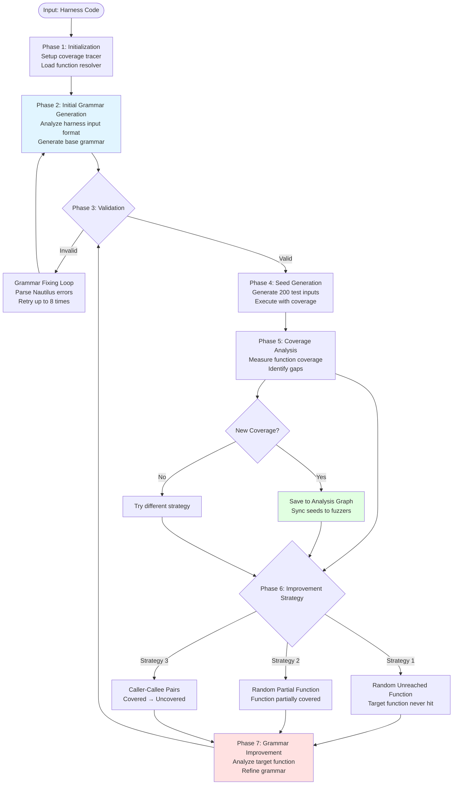
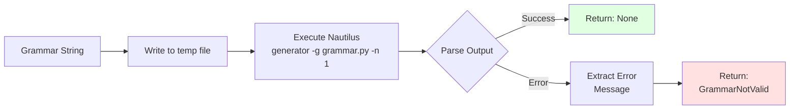
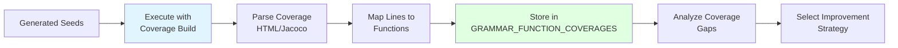
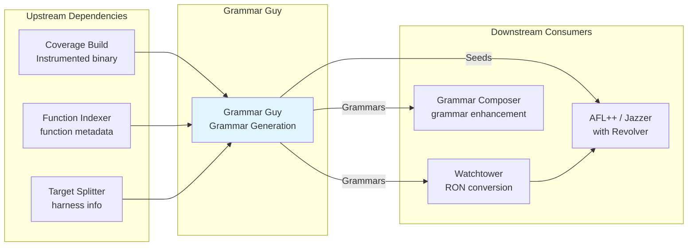

# Grammar Guy

> From whitepaper [Section 6.1.4](https://github.com/sslab-gatech/shellphish-afc-crs/blob/main/notes/src/whitepaper/Artiphishell-3.md#614-grammar-guy):
>
> The goal of Grammar Guy is to analyze the harnesses and generate a Nautilus-compatible Python grammar, which can be used to generate inputs.
>
> This is done by using an LLM-based agent, who is asked to carefully analyze the target source code to understand its structure and behavior, and then to determine the input formats and data structures required by the program under test. The agent is also instructed to gain a deep understanding of how the target application behaves and processes inputs, and recognize potential vulnerabilities and areas of interest by using its existing knowledge about fuzzing.
>
> Finally the agent is asked to generate Python grammars that are compatible with the Nautilus fuzzer and that are modular and reusable, allowing for easy modifications and extensions.
>
> After a first grammar is generated, Grammar Guy goes through a fix/refinement step. The agent passes the grammar to the generator module of Nautilus, and it collects a positive or negative format check. We extended the reporting capabilities of Nautilus to provide extra information so that the error description can be used to fix the grammar. Grammar Guy tries to fix the round a few times (e.g., 8 times), and if it is not able to fix the grammar, it will generate a new grammar from scratch.
>
> Once the grammar is fixed, Grammar Guy generates a predetermined number of seeds (e.g., 200), For each seed, the agent runs the Coverage build of the target and collects the coverage information. The agent then stores the association between the grammar and the code of the functions that were reached from seeds generated by the grammar.
>
> Once a grammar has been successfully derived, the next step is to improve the grammar. Grammar Guy uses three different strategies:
>
> 1. randomly selects a function that either (i) has not been reached or (ii) has been covered partially and tries to modify the grammar to reach that function.
> 2. looks for functions that are already reached by the grammar and tries to call functions that are invoked from there. More precisely, Grammar Guy creates a list of pairs (caller, callee) and randomly selects one. The conditions for reaching the new functions are determined by invoking a specialized agent that looks at the (caller, callee) pair and provides the conditions to reach the callee.
> 3. takes a grammar and uses the LLM to identify key features already encoded in the grammar as well as missing features that are currently not represented in the grammar based on all of the agent's knowledge about the target format.
>
> The new grammar goes through the fixing process described previously, and it is then used to generate more seeds and the corresponding coverage.
>
> If a grammar produces new covered functions (not just new parts of a function), this information is put in the Analysis Graph so that other components can use it. In addition, the corresponding seeds are passed to the SeedSync agent.

## Overview

Effective fuzzing requires inputs that match the target's expected format. Grammar Guy automates this by:

1. Analyzing harness code to understand input format expectations
2. Generating Nautilus Python grammars that produce conforming inputs
3. Measuring coverage achieved by grammar-generated inputs
4. Iteratively refining grammars to reach uncovered code

**Example**:
```
Harness Analysis: parse_json_config() expects JSON with 'type' and 'data' fields

Initial Grammar:
  ctx.rule("JSON_OBJECT", [b'{"type":"', ctx.nt("TYPE"), b'","data":', ctx.nt("DATA"), b'}'])

Coverage: Reached parse_json_config (60%) but not validate_signature (0%)

Refined Grammar: Add 'signature' field
  ctx.rule("JSON_OBJECT", [b'{"type":"', ..., b'","signature":"', ctx.nt("SIG"), b'"}'])

Result: 78% coverage (+18%)
```

## Grammar Format

Grammar Guy generates **Nautilus Python grammars** - context-free grammars with context-sensitive extensions that define the structure of test inputs.

**Reference Grammar**: See [`_orig_grammar_py_example.py`](https://github.com/sslab-gatech/shellphish-afc-crs/blob/main/libs/nautilus/grammars/_orig_grammar_py_example.py) for a complete annotated example showing all grammar constructs.

**Simplified Example**:
```python
def init(ctx):
    # Nonterminal rules
    ctx.rule("START", [ctx.nt("HEADER"), ctx.nt("BODY")])

    # Literal bytes
    ctx.literal("MAGIC", b"\x89PNG\r\n\x1a\n")

    # Regular expressions
    ctx.regex("ALPHANUM", "[a-zA-Z0-9]+")

    # Integer generation
    ctx.int("LENGTH", 32)  # 32-bit integer

    # Random bytes
    ctx.bytes("DATA", 16)  # 16 random bytes

    # Script-based transformation
    ctx.script("ENCODED", ["RAW"], "data = base64.b64encode(args[0])")
```

**Grammar Constructs**:
- **`ctx.rule(name, productions...)`**: Define nonterminal with multiple production choices
- **`ctx.nt(name)`**: Reference to another nonterminal
- **`ctx.literal(name, bytes)`**: Fixed byte sequence
- **`ctx.regex(name, pattern)`**: Regular expression for variable strings
- **`ctx.int(name, bits)`**: Integer generation (8, 16, 32, 64-bit)
- **`ctx.bytes(name, count)`**: Random byte sequences
- **`ctx.script(name, deps, code)`**: Python transformation for encoding/decoding

**RON Format**: Nautilus can serialize derivation trees to Rust Object Notation for fuzzer synchronization (used by Revolver Mutator in AFL++/Jazzer integration).

## System Architecture

### Component Overview

Grammar Guy consists of four major subsystems:

```
┌─────────────────────────────────────────────────────────────────┐
│                         Grammar Guy                             │
├────────────────┬─────────────────┬──────────────┬───────────────┤
│ Agent System   │ Grammar Engine  │ Coverage     │ Improvement   │
│ (LLM Reasoning)│ (Validation)    │ (Feedback)   │ (Strategies)  │
│                │                 │              │               │
│ • Reacher      │ • Nautilus      │ • Tracer     │ • Random      │
│ • Expander     │ • Generator     │ • Parser     │ • Caller-Callee│
│ • Explorer     │ • Checker       │ • Resolver   │ • Feature-based│
│                │                 │              │               │
└────────────────┴─────────────────┴──────────────┴───────────────┘
         ↓                ↓                ↓              ↓
    LLM Agents      Grammar Files    Coverage Maps   Function Targets
```

**Component Roles:**
- **Agent System** ([`agents/`](https://github.com/sslab-gatech/shellphish-afc-crs/blob/main/components/grammar-guy/src/grammar_guy/agentic/agents/)): LLM-based reasoning for grammar generation and improvement
- **Grammar Engine** ([`grammars.py`](https://github.com/sslab-gatech/shellphish-afc-crs/blob/main/components/grammar-guy/src/grammar_guy/agentic/grammars.py)): Nautilus integration for validation and seed generation
- **Coverage System** ([`coveragelib/`](https://github.com/sslab-gatech/shellphish-afc-crs/blob/main/libs/coveragelib/coveragelib/)): Execution tracing and coverage measurement using Tracer with language-specific parsers (LLVM for C/C++, Jacoco for Java)
- **Improvement Strategies** ([`improvement_strategies.py`](https://github.com/sslab-gatech/shellphish-afc-crs/blob/main/components/grammar-guy/src/grammar_guy/common/improvement_strategies.py)): Heuristics for selecting next targets to improve coverage

## End-to-End Workflow

### High-Level Flow



### Workflow Phases Summary

**Phase 1: Initialization** ([`run_agent.py:43-122`](https://github.com/sslab-gatech/shellphish-afc-crs/blob/main/components/grammar-guy/src/grammar_guy/agentic/run_agent.py#L43-L122))
- Load harness metadata from HarnessInfo
- Initialize coverage tracer ([`run_agent.py:87-93`](https://github.com/sslab-gatech/shellphish-afc-crs/blob/main/components/grammar-guy/src/grammar_guy/agentic/run_agent.py#L87-L93)): Select parser based on language (C_LineCoverageParser_LLVMCovHTML for C/C++, Java_LineCoverageParser_Jacoco for Java), create Tracer instance
- Setup function resolver for code lookup ([`run_agent.py:97-100`](https://github.com/sslab-gatech/shellphish-afc-crs/blob/main/components/grammar-guy/src/grammar_guy/agentic/run_agent.py#L97-L100))
- Parse harness source code

**Phase 2: Initial Grammar Generation** ([`grammar_agent_generic.py:53-87`](https://github.com/sslab-gatech/shellphish-afc-crs/blob/main/components/grammar-guy/src/grammar_guy/common/agents/grammar_agent_generic.py#L53-L87))
- Invoke LLM agent with harness code
- Agent analyzes input parsing logic
- Generates Nautilus Python grammar
- Returns grammar via `submit_grammar()` tool

**Phase 3: Grammar Validation** ([`grammars.py:86-92`](https://github.com/sslab-gatech/shellphish-afc-crs/blob/main/components/grammar-guy/src/grammar_guy/agentic/grammars.py#L86-L92))
- Call Nautilus generator to validate syntax: `generator -g grammar.py -n 1`
- Parse error messages from Nautilus (e.g., "Unknown nonterminal 'DATAS' at line 42")
- If invalid: provide error feedback to agent for correction via `fix_grammar()` ([`antique.py:49-96`](https://github.com/sslab-gatech/shellphish-afc-crs/blob/main/components/grammar-guy/src/grammar_guy/gg/antique.py#L49-L96))
- If valid: proceed to seed generation
- Retry limit: 8 attempts before giving up on grammar

**Phase 4: Seed Generation** ([`grammars.py:118-149`](https://github.com/sslab-gatech/shellphish-afc-crs/blob/main/components/grammar-guy/src/grammar_guy/agentic/grammars.py#L118-L149))
- Generate 200 unique inputs from grammar (1.2x overgeneration for collision handling)
- Use Nautilus generator with depth=200 for derivation tree complexity
- Deduplicate by SHA256 hash (e.g., 240 generated → 187 unique)
- Save seeds to temporary directory with names: `id:000001`, `id:000002`, ...

**Phase 5: Coverage Analysis** ([`gg_tools.py:234-254`](https://github.com/sslab-gatech/shellphish-afc-crs/blob/main/components/grammar-guy/src/grammar_guy/agentic/agents/gg_tools.py#L234-L254))
- Execute each seed against coverage-instrumented build via [`Tracer.trace()`](https://github.com/sslab-gatech/shellphish-afc-crs/blob/main/libs/coveragelib/coveragelib/trace.py)
- Parse coverage output:
  - C/C++: LLVM coverage via `C_LineCoverageParser_LLVMCovHTML`
  - Java: Jacoco coverage via `Java_LineCoverageParser_Jacoco`
- Collect line coverage per file → FileCoverageMap (maps file:line → execution count)
- Map to function coverage ([`FunctionResolver.get_function_coverage()`](https://github.com/sslab-gatech/shellphish-afc-crs/blob/main/libs/crs-utils/src/shellphish_crs_utils/function_resolver.py)) → FunctionCoverageMap
  - Example: `{png_read_png: 78% (45/58 lines), png_parse_tRNS: 0% (0/12 lines)}`
- Store in `GRAMMAR_FUNCTION_COVERAGES` global state via `register_grammar_coverage()`

**Phase 6: Improvement Strategy Selection** ([`improvement_strategies.py:12-62`](https://github.com/sslab-gatech/shellphish-afc-crs/blob/main/components/grammar-guy/src/grammar_guy/common/improvement_strategies.py#L12-L62))
- **Strategy 1** (`find_random_unhit_function_to_improve`): Random unreached function - select function with 0% coverage
- **Strategy 2** (`find_random_reachable_function_to_improve`): Random partial function - select function with partial coverage (e.g., 45% covered)
- **Strategy 3** (`find_function_pairs_to_improve`): Caller-callee pairs - find covered function calling uncovered function
- Random selection in corpus generation mode; autonomous selection in exploration mode

**Phase 7: Grammar Improvement**
- Retrieve target function source code via FunctionResolver
- Agent analyzes why current grammar doesn't reach target:
  - Example: "Current grammar only generates 'IHDR' chunk types, but png_parse_tRNS requires 'tRNS' chunk"
- Generate refined grammar incorporating new constraints (e.g., add `ctx.literal("TRNS_TYPE", b'tRNS')`)
- Return to validation phase (Phase 3)
- Repeat until coverage saturates or budget exhausted

**Phase 8: Save and Sync** ([`utils.py:216-303`](https://github.com/sslab-gatech/shellphish-afc-crs/blob/main/components/grammar-guy/src/grammar_guy/common/utils.py#L216-L303))
- If new functions covered:
  - Save grammar + coverage map to Analysis Graph (Neo4J)
  - Upload seeds to permanence client via `save_inputs_and_grammar()`
  - Copy seeds to `/shared/fuzzer_sync/{project}-{harness}/` via `move_files_to_afl_dir()`
  - Sync grammars to `ARTIPHISHELL_GRAMMARS_SYNC_PATH` for Watchtower + Grammar Composer

## LLM Agent System

### Specialized Agents

All Grammar Guy modes use agents defined in [`common/agents/`](https://github.com/sslab-gatech/shellphish-afc-crs/blob/main/components/grammar-guy/src/grammar_guy/common/agents/) with Jinja2 prompt templates in [`common/agents/prompts/nautilus/`](https://github.com/sslab-gatech/shellphish-afc-crs/blob/main/components/grammar-guy/src/grammar_guy/common/agents/prompts/nautilus/).

**Agent Types**:

1. **GrammarAgent** ([`grammar_agent_generic.py`](https://github.com/sslab-gatech/shellphish-afc-crs/blob/main/components/grammar-guy/src/grammar_guy/common/agents/grammar_agent_generic.py))
   - **Purpose**: Generate initial grammar from harness analysis
   - **Mode**: `no_tool` (direct generation)
   - **Used in**: All modes (initial grammar generation)
   - **Prompts**: `initial.system.j2` / `initial.user.j2`

2. **GrammarAgentIncremental** ([`grammar_agent_incremental.py`](https://github.com/sslab-gatech/shellphish-afc-crs/blob/main/components/grammar-guy/src/grammar_guy/common/agents/grammar_agent_incremental.py))
   - **Purpose**: Improve existing grammars via LLM-generated edits
   - **Mode**: `incremental` (edits existing grammars)
   - **Used in**: Corpus generation (improvement cycles)
   - **Prompts**: `random.system.j2`, `callable-pair.system.j2`, etc.

3. **ReportAgent** ([`report_agent.py`](https://github.com/sslab-gatech/shellphish-afc-crs/blob/main/components/grammar-guy/src/grammar_guy/common/agents/report_agent.py))
   - **Purpose**: Analyze code and generate improvement plans
   - **Mode**: Analysis and planning
   - **Used in**: Grammar extension strategy
   - **Prompts**: `extender.system.j2` / `extender.user.j2`

4. **FunctionReacherAgent** ([`agent_reach_function.py`](https://github.com/sslab-gatech/shellphish-afc-crs/blob/main/components/grammar-guy/src/grammar_guy/agentic/agents/agent_reach_function.py))
   - **Purpose**: Modify grammar to reach specific unreached functions
   - **Mode**: `AgentWithHistory` (targets specific functions with 0% coverage)
   - **Used in**: Targeted function reaching mode
   - **Validates**: Grammar must reach target function before acceptance

5. **FunctionCoverageExpansionAgent** ([`agent_expand_function_coverage.py`](https://github.com/sslab-gatech/shellphish-afc-crs/blob/main/components/grammar-guy/src/grammar_guy/agentic/agents/agent_expand_function_coverage.py))
   - **Purpose**: Increase coverage within partially-covered functions
   - **Mode**: `AgentWithHistory` (targets functions with partial coverage)
   - **Used in**: Coverage expansion mode
   - **Focus**: Explore alternative code paths, error branches, edge cases

6. **ExplorerAgent** ([`agent_explorer.py`](https://github.com/sslab-gatech/shellphish-afc-crs/blob/main/components/grammar-guy/src/grammar_guy/agentic/agents/agent_explorer.py))
   - **Purpose**: Autonomous exploration with tool-based decision making
   - **Mode**: `AgentWithHistory` (persistent chat, continuous execution)
   - **Used in**: Exploration modes (`grammar_agent_explore`, `grammar_agent_explore_delta`)
   - **Tools**: `add_goal_function`, `check_grammar_coverage`, `grep_sources`, `find_function`, etc.
   - **Prompts**: `system.explorer.j2` / `user.explorer.j2`

7. **SarifConfirmingAgent** ([`agent_assess_sarif.py`](https://github.com/sslab-gatech/shellphish-afc-crs/blob/main/components/grammar-guy/src/grammar_guy/agentic/agents/agent_assess_sarif.py))
   - **Purpose**: Generate grammars targeting static analysis findings
   - **Mode**: SARIF-guided (targets codeflow locations from CodeQL/Semgrep)
   - **Used in**: SARIF assessment mode
   - **Input**: SARIF reports with vulnerability paths

8. **CrashReproducerAgent** ([`agent_reproduce_losan_crash.py`](https://github.com/sslab-gatech/shellphish-afc-crs/blob/main/components/grammar-guy/src/grammar_guy/agentic/agents/agent_reproduce_losan_crash.py))
   - **Purpose**: Reverse-engineer grammars from sanitizer-detected crashes
   - **Mode**: Crash-guided grammar generation
   - **Used in**: LoSan crash reproduction mode
   - **Special tool**: `eval_python_expr_on_crashing_input` for analyzing crash structure

**Model Selection**: Claude-3.5-Sonnet by default, O3 for specific replicas (configured via `REPLICA_ID` environment variable)

## Key Subsystems

### Grammar Validation System

**Goal**: Ensure generated grammars are syntactically correct for Nautilus



**Implementation**: [`NautilusPythonGrammar.check_grammar()`](https://github.com/sslab-gatech/shellphish-afc-crs/blob/main/components/grammar-guy/src/grammar_guy/agentic/grammars.py#L86-L92)

```python
@classmethod
def check_grammar(cls, grammar: str) -> Optional[GrammarNotValid]:
    exit_code, stdout, stderr = NautilusPythonGrammar(grammar).generator(1)
    if exit_code != 0:
        # Discard lines with RUST_BACKTRACE from stderr
        stderr = b'\n'.join(l for l in stderr.split(b'\n') if b'RUST_BACKTRACE=1' not in l)
        return GrammarNotValid(stderr.decode())
    return None
```

**Validation Process**:
1. Create temporary `NautilusPythonGrammar` instance
2. Write grammar to temp file
3. Execute Nautilus generator: `/path/to/generator -g file.py -n 1 -t 200`
4. Capture stdout/stderr
5. Check exit code:
   - `0`: Grammar is valid ✓
   - `non-zero`: Parse error message, return to agent

**Common Errors Caught**:
```
Error: Unknown nonterminal 'TOKNE' referenced at line 15
→ Agent fixes typo: TOKNE → TOKEN

Error: ctx.rule() called with wrong number of arguments
→ Agent fixes syntax: ctx.rule("X", [b'a'], [b'b']) → valid alternation

Error: Infinite recursion detected in rule 'START'
→ Agent adds base case: epsilon production
```

**Integration with Agent**:
- Called by `submit_grammar()` tool before acceptance
- Error message included in tool response
- Agent can retry with corrections (up to 8 times typically)

### Seed Generation System

**Goal**: Convert grammars into concrete test inputs for fuzzing

**Implementation**: [`produce_input_files()`](https://github.com/sslab-gatech/shellphish-afc-crs/blob/main/components/grammar-guy/src/grammar_guy/agentic/grammars.py#L118-L149)

```python
def produce_input_files(self, count: int, output_dir: Path, max_tries: int=3, unique: bool=False):
    output_dir = Path(output_dir)
    for i in range(max_tries):
        cur_outputs = os.listdir(output_dir)
        if len(cur_outputs) >= count:
            break

        needed = count - len(cur_outputs)
        to_generate = int(max(math.ceil(needed * 1.2), needed + 20))

        corpus_dir = self.output_tmp_dir / 'corpus'
        exit_code, stdout, stderr = self.generator(to_generate, corpus_dir, verbose=False)

        for f in os.listdir(corpus_dir):
            if unique:
                hash = hashlib.sha256(file_contents).hexdigest()
                if hash in cur_outputs:
                    continue  # Skip duplicate
            if len(cur_outputs) < count:
                os.rename(corpus_dir / f, output_dir / out_name)
                yield output_dir / out_name
```

**Process**:
1. Calculate how many seeds needed
2. Generate 1.2x to account for duplicates (if unique=True)
3. Call Nautilus generator:
   ```bash
   /path/to/generator -n 240 -g grammar.py -t 200 -r /tmp/ronald -s
   ```
4. If unique requested: hash each seed, skip duplicates
5. Move seeds to output directory
6. Retry if not enough unique seeds (up to 3 attempts)

**Parameters**:
- `count`: Target number of seeds (typically 200)
- `unique`: SHA256 deduplication (enabled for coverage measurement)
- `max_tries`: Retry limit if generation produces too few seeds
- `depth`: Tree generation depth (default 200)

**Output Format**:
```
output_dir/
├── id:000001
├── id:000002
├── ...
└── id:000200
```

### Coverage Tracking System

**Goal**: Measure which functions are reached by grammar-generated inputs



**Implementation**: Coverage tracing uses [`Tracer`](https://github.com/sslab-gatech/shellphish-afc-crs/blob/main/libs/coveragelib/coveragelib/trace.py) from coveragelib

**Setup** ([`run_agent.py:87-94`](https://github.com/sslab-gatech/shellphish-afc-crs/blob/main/components/grammar-guy/src/grammar_guy/agentic/run_agent.py#L87-L94)):
```python
parser = {
    LanguageEnum.c: C_LineCoverageParser_LLVMCovHTML,
    LanguageEnum.cpp: C_LineCoverageParser_LLVMCovHTML,
    LanguageEnum.jvm: Java_LineCoverageParser_Jacoco,
}[target.project_metadata.language]()

set_coverage_tracer(
    Tracer(coverage_target, harness_name, aggregate=True, parser=parser)
)
```

**Coverage Collection**:
1. Execute seed against instrumented binary via [`Tracer.trace()`](https://github.com/sslab-gatech/shellphish-afc-crs/blob/main/libs/coveragelib/coveragelib/trace.py)
2. Collect coverage report (HTML for LLVM, XML for Jacoco)
3. Parse covered lines per file:
   - C/C++: [`C_LineCoverageParser_LLVMCovHTML`](https://github.com/sslab-gatech/shellphish-afc-crs/blob/main/libs/coveragelib/coveragelib/parsers/line_coverage.py#L21) parses LLVM HTML coverage
   - Java: [`Java_LineCoverageParser_Jacoco`](https://github.com/sslab-gatech/shellphish-afc-crs/blob/main/libs/coveragelib/coveragelib/parsers/line_coverage.py) parses Jacoco XML coverage
4. Map to functions using [`FunctionResolver.get_function_coverage()`](https://github.com/sslab-gatech/shellphish-afc-crs/blob/main/libs/crs-utils/src/shellphish_crs_utils/function_resolver.py)
5. Store: `{function_id: [LineCoverage(...), ...]}` in `GRAMMAR_FUNCTION_COVERAGES`

**LineCoverage Structure**:
```python
class LineCoverage:
    line_number: int
    count_covered: int  # How many times executed
    is_covered: bool    # Whether line was hit
```

**Global State Management**:
```python
# Mapping: grammar → functions it covers
GRAMMAR_FUNCTION_COVERAGES: Dict[str, List[FUNCTION_INDEX_KEY]] = {}

# After each grammar evaluation:
GRAMMAR_FUNCTION_COVERAGES[grammar_id] = [
    func for func, coverage in function_coverage.items()
    if any(line.is_covered for line in coverage)
]
```

**Coverage Analysis**:
- **is_covered_function()**: True if any line in function covered
- **is_improvable_function()**: True if some lines covered, some not (partial)
- **get_covered_uncovered_lines()**: Returns (covered_lines, uncovered_lines)

### Function Resolution System

**Goal**: Retrieve source code for any function in the target

**Implementation**: Uses [`FunctionResolver`](https://github.com/sslab-gatech/shellphish-afc-crs/blob/main/components/grammar-guy/src/grammar_guy/agentic/run_agent.py#L98-L100)

**Setup**:
```python
if ARGS.full_functions_index and ARGS.full_functions_jsons:
    set_function_resolver(LocalFunctionResolver(index_path, jsons_path))
else:
    set_function_resolver(RemoteFunctionResolver(project_name, project_id))
```

**Function Lookup**:
```python
# Get function code
repo_path, container_path, start_line, code = resolver.get_code(function_key)

# Example result:
# repo_path: "src/png/pngread.c"
# container_path: "/src/libpng/src/png/pngread.c"
# start_line: 245
# code: "void png_read_png(...) {\n  ...\n}"
```

**Index Structure**:
```python
FUNCTION_INDEX_KEY = "(project_id, filename, function_name)"

functions_index[key] = {
    'code': str,                    # Function source
    'target_container_path': str,   # Full path in container
    'repo_rel_path': str,           # Relative path in repo
    'start_line': int,              # Line number
}
```

**Used By**:
- Agents: Retrieve target function source code for analysis
- Coverage system: Map covered lines to function definitions
- Improvement strategies: Analyze call relationships

## Operational Modes and Use Cases

Grammar Guy operates in **four distinct modes**, all sharing the same core LLM agent infrastructure but differing in control flow, target selection, and stopping criteria. This unified architecture enables flexible deployment across different fuzzing scenarios while reusing proven components.

### Shared Architecture Across All Modes

All Grammar Guy implementations—whether corpus generation or autonomous exploration—share the **same LLM agent system** located in [`common/agents/`](https://github.com/sslab-gatech/shellphish-afc-crs/blob/main/components/grammar-guy/src/grammar_guy/common/agents/):

**Core Shared Components**:

1. **[`grammar_agent_generic.py`](https://github.com/sslab-gatech/shellphish-afc-crs/blob/main/components/grammar-guy/src/grammar_guy/common/agents/grammar_agent_generic.py)** - Agent factory and base classes
   - `setup_grammar_agent()` (line 52): Creates grammar generation agents with configurable prompts
   - `submit_grammar()` (line 34): Callback for agents to submit generated grammars
   - Supports 3 agent types:
     - `incremental` → `GrammarAgentIncremental` (with edit tools)
     - `no_tool` → `GrammarAgentNoTool` (direct generation)
     - `generic` → `GrammarAgent` (base class)

2. **[`grammar_agent_incremental.py`](https://github.com/sslab-gatech/shellphish-afc-crs/blob/main/components/grammar-guy/src/grammar_guy/common/agents/grammar_agent_incremental.py)** - Edit-based grammar modification
   - `apply_grammar_changes()`: Applies LLM-generated edits to existing grammars
   - Supports partial updates instead of full regeneration

3. **[`report_agent.py`](https://github.com/sslab-gatech/shellphish-afc-crs/blob/main/components/grammar-guy/src/grammar_guy/common/agents/report_agent.py)** - Analysis and planning agents
   - `setup_report_agent()`: Creates agents for analyzing code and generating improvement plans
   - `submit_report()`: Callback for submitting analysis reports

4. **[`improvement_strategies.py`](https://github.com/sslab-gatech/shellphish-afc-crs/blob/main/components/grammar-guy/src/grammar_guy/common/improvement_strategies.py)** - Coverage improvement heuristics
   - `find_random_unhit_function_to_improve()` (line 12): Targets functions never reached
   - `find_random_reachable_function_to_improve()` (line 27): Targets partially covered functions
   - `find_function_pairs_to_improve()` (line 44): Finds caller-callee pairs for targeted improvement

5. **[`utils.py`](https://github.com/sslab-gatech/shellphish-afc-crs/blob/main/components/grammar-guy/src/grammar_guy/common/utils.py)** - Grammar and seed management
   - `save_inputs_and_grammar()` (line 216): Saves grammars and seeds to permanence client
   - `move_files_to_afl_dir()` (line 303): Syncs seeds to `/shared/fuzzer_sync/` for AFL++/Jazzer

**Key Architectural Principle**: The difference between modes is **not** in the LLM agents themselves, but in:
- **Control flow**: Fixed iteration loop vs. autonomous decision-making
- **Target selection**: Strategy-based vs. goal-driven vs. crash-guided
- **Stopping criteria**: Cycle count vs. budget exhaustion vs. success condition

### Mode 1: Initial Corpus Generation

**Pipeline Task**: [`grammar_guy_fuzz`](https://github.com/sslab-gatech/shellphish-afc-crs/blob/main/components/grammar-guy/pipeline.yaml#L31)
**Entry Point**: [`antique.py`](https://github.com/sslab-gatech/shellphish-afc-crs/blob/main/components/grammar-guy/src/grammar_guy/gg/antique.py)
**Trigger**: `crs_tasks` repository
**Purpose**: Generate initial seed corpus for fuzzing campaigns

**Execution Model**:
- Fixed **20 grammar improvement cycles** (`-n 20` parameter)
- Random strategy selection per cycle:
  - `improve_grammar_random()` (line 574): Targets random unhit or reachable functions
  - `improve_grammar_callable_function_pair_selection()` (line 486): Caller-callee pair targeting
  - `extend_grammar()` (line 698): Grammar feature expansion
- Stops after 20 cycles regardless of coverage

**Control Flow** ([`antique.py:748-900`](https://github.com/sslab-gatech/shellphish-afc-crs/blob/main/components/grammar-guy/src/grammar_guy/gg/antique.py#L748-L900)):
```python
def build_grammar_corpus(grammar_cycles: int = 2000):
    initial_grammar = generate_initial_grammar()  # LLM generates first grammar
    grammar_dict = defaultdict(list)
    grammar_coverage = dict()

    for cycle in range(grammar_cycles):
        strategy = select_strategy_random()  # Pick: random, pairs, or extender

        if strategy == "random":
            improved_grammar, new_coverage = improve_grammar_random(...)
        elif strategy == "uncovered_callable_function_pairs":
            improved_grammar, new_coverage = improve_grammar_callable_function_pair_selection(...)
        elif strategy == "extender":
            improved_grammar, new_coverage = extend_grammar(...)

        if new_coverage improved:
            save_inputs_and_grammar(...)  # To permanence + fuzzer_sync
            move_files_to_afl_dir(...)
```

**Output**:
- Grammars → `ARTIPHISHELL_GRAMMARS_SYNC_PATH` (for Composer + Watchtower)
- Seeds → `/shared/fuzzer_sync/{project}-{harness}/` (for AFL++/Jazzer)

**SARIF Mode Variant**:
When triggered with `--sarif_path` flag ([`antique.py:906-910`](https://github.com/sslab-gatech/shellphish-afc-crs/blob/main/components/grammar-guy/src/grammar_guy/gg/antique.py#L906-L910)):
```python
if config.SARIF_MODE:
    func_of_interest = get_sarif_function_of_interest(config.get_sarif_results())
    log.info(f"📝 Running Grammar-guy in SARIF mode for codeflow locations: {func_of_interest}")
    config.set_target_functions(func_of_interest)
    config.adjust_improvement_strategies(new_strategy='codeflow-pairs')
```

- **Purpose**: Target **static analysis findings** (SARIF = Static Analysis Results Interchange Format)
- **Behavior**: Extracts target functions from SARIF codeflow reports, switches to `codeflow-pairs` strategy to prioritize reaching vulnerability paths
- **Use case**: Generate inputs that exercise paths flagged by CodeQL/Semgrep/etc.

### Mode 2: Continuous Exploration

**Pipeline Task**: [`grammar_agent_explore`](https://github.com/sslab-gatech/shellphish-afc-crs/blob/main/components/grammar-guy/pipeline.yaml#L155)
**Entry Point**: [`agent_explorer.py`](https://github.com/sslab-gatech/shellphish-afc-crs/blob/main/components/grammar-guy/src/grammar_guy/agentic/agents/agent_explorer.py)
**Trigger**: `crs_tasks_full` repository (comprehensive analysis)
**Purpose**: Autonomous deep exploration of hard-to-reach functions

**Execution Model**:
- **Continuous** execution until LLM budget exhausted
- **Autonomous** agent decides which functions to target via tools
- **Replicable**: 1-4 concurrent agent instances (pipeline.yaml line 159)
- Clears chat history after 5 rounds without progress (line 276)

**Control Flow** ([`agent_explorer.py:248-289`](https://github.com/sslab-gatech/shellphish-afc-crs/blob/main/components/grammar-guy/src/grammar_guy/agentic/agents/agent_explorer.py#L248-L289)):
```python
class ExplorerAgent(AgentWithHistory):
    def run(self, **kwargs):
        while True:
            res = self.invoke(dict(
                example_grammars=example_grammars,
                goal_report=get_goal_report(),  # Shows current targets
                memories=MEMORIES,              # Learned insights
            ))

            if no_progress_for_5_rounds:
                self.chat_history.clear()  # Reset agent state
```

**Available Tools** ([`agent_explorer.py:291-303`](https://github.com/sslab-gatech/shellphish-afc-crs/blob/main/components/grammar-guy/src/grammar_guy/agentic/agents/agent_explorer.py#L291-L303)):
- `add_goal_function`: Adds target functions for exploration
- `give_up_on_goal`: Abandons unreachable functions
- `find_function`: Searches codebase for function definitions
- `check_grammar_coverage`: Validates grammar and measures coverage
- `remember`: Stores insights for future reference
- `grep_sources`, `get_file_content`, `get_functions_in_file`: Code navigation

**Key Difference from Mode 1**: Agent **autonomously decides** which functions to target and which strategies to use, rather than random selection from fixed strategies.

### Mode 3: Delta Mode Exploration

**Pipeline Task**: [`grammar_agent_explore_delta`](https://github.com/sslab-gatech/shellphish-afc-crs/blob/main/components/grammar-guy/pipeline.yaml#L276)
**Entry Point**: [`agent_explorer.py`](https://github.com/sslab-gatech/shellphish-afc-crs/blob/main/components/grammar-guy/src/grammar_guy/agentic/agents/agent_explorer.py) (same as Mode 2)
**Trigger**: `crs_tasks_delta` repository (commit-specific analysis)
**Purpose**: **Patch/diff fuzzing** - target only functions changed in a specific commit

**Execution Model**:
- Same continuous autonomous agent as Mode 2
- **Restricted target set**: Only functions in commit diff
- Special environment variable: `DELTA_MODE=1` (pipeline.yaml line 405)

**Delta-Specific Inputs** ([`pipeline.yaml:329-337`](https://github.com/sslab-gatech/shellphish-afc-crs/blob/main/components/grammar-guy/pipeline.yaml#L329-L337)):
```yaml
commit_functions_index:
  repo: commit_functions_indices
  kind: InputFilepath
  key: project_harness_metadata.project_id

commit_functions_jsons_dir:
  repo: commit_functions_jsons_dirs
  kind: InputFilepath
  key: project_harness_metadata.project_id
```

**Function Loading** ([`agent_explorer.py:201-234`](https://github.com/sslab-gatech/shellphish-afc-crs/blob/main/components/grammar-guy/src/grammar_guy/agentic/agents/agent_explorer.py#L201-L234)):
```python
if args.commit_functions_index:
    commit_function_resolver = LocalFunctionResolver(
        args.commit_functions_index,
        args.commit_functions_jsons_dir
    )

    for function_key in commit_function_resolver.keys():
        # Map commit functions to full function index
        add_goal_function.get_tool().invoke(function_key)
```

**Use Case**: After a security patch is applied, verify that:
1. The patched code is reachable by fuzzing
2. No new bugs were introduced in the diff
3. Edge cases in the modified code are exercised

### Mode 4: LoSan Crash Reproduction

**Pipeline Task**: [`grammar_agent_reproduce_losan_dedup_pov`](https://github.com/sslab-gatech/shellphish-afc-crs/blob/main/components/grammar-guy/pipeline.yaml#L411)
**Entry Point**: [`agent_reproduce_losan_crash.py`](https://github.com/sslab-gatech/shellphish-afc-crs/blob/main/components/grammar-guy/src/grammar_guy/agentic/agents/agent_reproduce_losan_crash.py)
**Trigger**: `losan_dedup_pov_report_representative_metadatas` repository (from POV Guy)
**Purpose**: Reverse-engineer grammars from LoSan crashes to enable systematic exploit generation

**LoSan Context**:
- **LoSan** = Loosened Sanitizers for Java (Jazzmine component)
- **Problem**: Traditional sanitizers require exact sentinel matches (e.g., "jazzer" for command injection), but inputs often undergo compression/encoding/obfuscation
- **Solution**: LoSan triggers on approximate/transformed inputs and reports both observed bytes and expected sentinel
- **Fuzzer-LLM Collaboration**:
  1. **Jazzmine** (mutation fuzzer) discovers transformed inputs that reach vulnerability sinks
  2. **POV Guy** validates and deduplicates LoSan crashes
  3. **Grammar Guy Mode 4** (this mode) reverse-engineers the transformation
  4. **Jazzmine NautilusFuzz** uses resulting grammars to generate precise exploits

**Execution Model**:
- **Input**: Crashing input from LoSan sanitizer with FOUND/EXPECTED byte comparison
- **Goal**: Reverse-engineer transformation (e.g., base64 → zlib → struct unpacking) and generate grammar
- **Specialized Tool**: `eval_python_expr_on_crashing_input` - allows agent to decode crashing input interactively
- **Output**: Grammar → Jazzmine NautilusFuzz campaign → systematic exploit generation

**Use Case Example**:
```
LoSan Crash Report:
  FOUND: b'\x1f\x8b\x08...'  (gzip-compressed data)
  EXPECTED: b'jazzer'        (command injection sentinel)

Agent Analysis:
  1. eval_python_expr_on_crashing_input("import gzip; print(gzip.decompress(data))")
     → "jazzer" found after decompression
  2. Reverse-engineers transformation: input → gzip → command sink
  3. Generates grammar with gzip encoding:
     ctx.script("COMPRESSED_CMD", ["CMD"], "data = gzip.compress(args[0])")

Grammar Output → Jazzmine → Generates variants → Finds similar command injection bugs
```

**Downstream Consumers**:
- **Jazzmine NautilusFuzz** ([`jazzmine.md`](https://github.com/sslab-gatech/shellphish-afc-crs/blob/main/notes/src/vulnerability-identification/jazzmine.md)): Uses grammars in grammar-based fuzzing campaign
- **Seed Sync**: Distributes grammar-generated seeds across fuzzing instances
- **Analysis Graph**: Tracks grammar → vulnerability associations

### Comparison Summary

| Mode | Entry Point | Trigger | Control | Target Selection | Duration | Primary Goal |
|------|-------------|---------|---------|------------------|----------|--------------|
| **Corpus Gen** | antique.py | `crs_tasks` | Fixed loop | Random strategy | 20 cycles | Initial seed corpus |
| **Corpus Gen (SARIF)** | antique.py | `crs_tasks` + SARIF | Fixed loop | Codeflow-guided | 20 cycles | Target static analysis findings |
| **Exploration** | agent_explorer.py | `crs_tasks_full` | Autonomous | Agent-decided | Until budget exhausted | Deep coverage |
| **Delta** | agent_explorer.py | `crs_tasks_delta` | Autonomous | Commit diff only | Until budget exhausted | Patch fuzzing |
| **Crash Repro** | agent_reproduce_losan_crash.py | LoSan crashes | Crash-guided | Crash structure | Until reproduced | Reproduce + variants |

**Common Output Path**:
All modes produce:
1. **Grammars** → `ARTIPHISHELL_GRAMMARS_SYNC_PATH` → Grammar Composer + Watchtower
2. **Seeds** → `/shared/fuzzer_sync/{project}-{harness}/` → AFL++ / Jazzer
3. **Coverage Maps** → Analysis Graph (Neo4J) → Track grammar → function associations

## Integration with CRS Pipeline

### Pipeline Context



### Input Dependencies

**Build Artifacts**:
- `coverage_build_artifacts`: Instrumented binary for coverage measurement
  - C/C++: LLVM coverage instrumentation
  - Java: Jacoco instrumentation
  - Path: `/out/{harness}_coverage`

**Metadata**:
- `full_functions_indices`: Function index for lookup
  - Format: Pickle file mapping `FUNCTION_INDEX_KEY` → function info
  - Used by: Function resolver for code retrieval
- `full_functions_jsons_dirs`: Function implementation JSONs
  - Format: Directory of JSON files per function
  - Contains: Source code, file paths, line numbers
- `target_split_metadatas`: Harness information
  - Format: YAML with project metadata, harness names
  - Used by: Identifying harness entry points

### Output Artifacts

**Primary Outputs**:
- `grammars`: Directory of generated Nautilus Python grammars
  - Location: `/shared/fuzzer_sync/{project}-{harness}/sync-grammars/nautilus-python/`
  - Format: `grammar_{hash}.py` files
  - Metadata: Includes coverage map, timestamp

- `grammar_seeds`: Initial corpus generated from grammars
  - Location: Streaming output per grammar
  - Format: Binary seed files
  - Count: 200 seeds per grammar
  - Used by: AFL++/Jazzer as initial corpus

- `grammar_coverage_maps`: Coverage achieved by each grammar
  - Format: JSON mapping `grammar_id` → `[function_ids]`
  - Uploaded to: Analysis Graph (Neo4J)
  - Used by: Tracking which grammars cover which functions

### Downstream Consumers

**Watchtower** ([`libs/nautilus/watchtower/`](https://github.com/sslab-gatech/shellphish-afc-crs/blob/main/libs/nautilus/watchtower/)):
- Monitors grammar sync directories
- Converts Python grammars to RON format
- Generates initial seeds for AFL++

**AFL++ with Revolver Mutator**:
- Uses grammar-generated seeds as corpus
- Mutates seeds while preserving grammar structure
- 33% of fuzzing instances use grammar fuzzing

**Grammar Composer** ([`components/grammar-composer/`](https://github.com/sslab-gatech/shellphish-afc-crs/blob/main/components/grammar-composer/)):
- Analyzes Grammar Guy's output
- Detects format patterns (JPEG, Base64, XML)
- Splices reference grammars for nested formats

**Grammaroomba**:
- Iteratively refines Grammar Guy's grammars
- Uses LLM to improve coverage of existing grammars
- Continuous improvement agent

