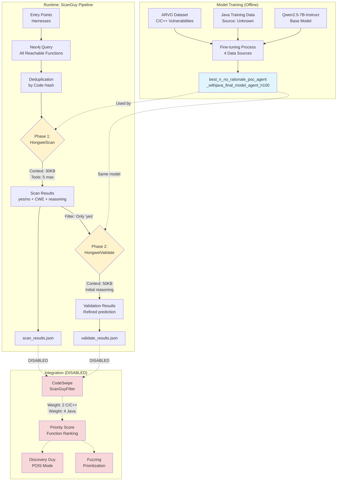
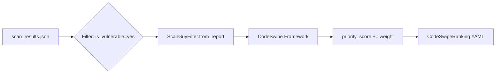
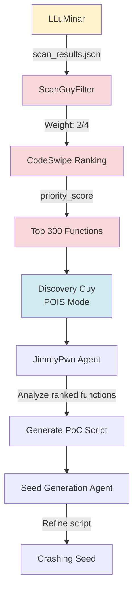

# LLuMinar (ScanGuy) - LLM-Based Vulnerability Scanner ⚠️ DISABLED IN COMPETITION

> **Status**: ⚠️ **DISABLED** - LLuMinar is fully implemented but **not enabled** in the competition pipeline. The integration with CodeSwipe is commented out in [pipelines/preprocessing.yaml#L330](https://github.com/sslab-gatech/shellphish-afc-crs/blob/main/pipelines/preprocessing.yaml#L330).

## Overview

**LLuMinar** (implemented as **ScanGuy**) is a lightweight LLM-based vulnerability scanning agent designed for rapid identification of suspicious functions in large codebases. It uses a fine-tuned [Qwen2.5-7B-Instruct](https://arxiv.org/abs/2407.10671) model (`best_n_no_rationale_poc_agent_withjava_final_model_agent_h100`) to autonomously analyze functions and predict whether they contain security vulnerabilities.

### Design Summary

LLuMinar has **two intended use scenarios**:
1. **POI filter** in CodeSwipe - assign weights to functions predicted as vulnerable
2. **Vulnerability identification** - generate vulnerability predictions for downstream components

**Main workflow**: Two-phase analysis
1. **HongweiScan** - initial scan of all reachable functions
2. **HongweiValidate** - re-analyze functions marked "yes" with larger context window

**Language support**: C/C++ and Java with language-specific CWE patterns

### Why Disabled?

Despite being fully implemented and functional, LLuMinar is disabled in the competition deployment ([preprocessing.yaml#L330](https://github.com/sslab-gatech/shellphish-afc-crs/blob/main/pipelines/preprocessing.yaml#L330)):

```yaml
code_swipe:
  repos:
    #scan_guy_results: scan_guy_results  # ← COMMENTED OUT
```

**Question**: Is the $10 budget limit ([config.py#L31](https://github.com/sslab-gatech/shellphish-afc-crs/blob/main/components/scanguy/src/scanguy/config.py#L31)) related to the "bug" mentioned in the code comments?

---

## System Architecture

### High-Level Workflow



### Component Structure

| Component | Location | Purpose |
|-----------|----------|---------|
| **ScanGuy (Main)** | [components/scanguy/src/scanguy/main.py](https://github.com/sslab-gatech/shellphish-afc-crs/blob/main/components/scanguy/src/scanguy/main.py) | Orchestration logic |
| **HongweiScan** | [agents/HongweiScan.py](https://github.com/sslab-gatech/shellphish-afc-crs/blob/main/components/scanguy/src/scanguy/agents/HongweiScan.py) | Phase 1: Scanning agent |
| **HongweiValidate** | [agents/HongweiValidate.py](https://github.com/sslab-gatech/shellphish-afc-crs/blob/main/components/scanguy/src/scanguy/agents/HongweiValidate.py) | Phase 2: Validation agent |
| **ScanGuyFilter** | [code-swipe/filters/scanguy.py](https://github.com/sslab-gatech/shellphish-afc-crs/blob/main/components/code-swipe/src/filters/scanguy.py) | CodeSwipe integration (disabled) |
| **PeekSrcSkill** | [toolbox/peek_src.py](https://github.com/sslab-gatech/shellphish-afc-crs/blob/main/components/scanguy/src/scanguy/toolbox/peek_src.py) | Tool implementations |

---

## Model Fine-Tuning

### Base Model

**Qwen2.5-7B-Instruct** ([arXiv:2407.10671](https://arxiv.org/abs/2407.10671))
- 7-billion parameter instruction-tuned model
- Strong code understanding capabilities
- Multi-language support (inherent)

**Deployment**:
- Served via vLLM on dedicated GPU nodes
- Endpoint: `http://vllm-server:25002/v1`
- Model path: `/models/best_n_no_rationale_poc_agent_withjava_final_model_agent_h100`
- Serving script: [serve_model.sh](https://github.com/sslab-gatech/shellphish-afc-crs/blob/main/components/scanguy/serve_model.sh)

```bash
CUDA_VISIBLE_DEVICES=4,5,6,7 vllm serve \
  secmlr/best_n_no_rationale_poc_agent_withjava_final_model_agent_h100 \
  --dtype=bfloat16 \
  --tensor-parallel-size=4 \
  --port 25002 \
  --enable-auto-tool-choice \
  --tool-call-parser hermes
```

### Training Data Sources

From whitepaper [Section 6.5.2](https://github.com/sslab-gatech/shellphish-afc-crs/blob/main/notes/src/whitepaper/Artiphishell-3.md#652-model-fine-tuning), the model is fine-tuned on **four data sources** constructed from the [ARVO dataset](https://arxiv.org/abs/2408.02153):

#### 1. Vulnerable/Patched Function Pairs

**Purpose**: Learn subtle differences between vulnerable and secure implementations.

**Composition**:
- Pre-patch (vulnerable) version of functions
- Post-patch (benign) version of same functions
- Stack traces as context
- Reasoning distilled from **o3 model**

**Training Effect**: Model learns exact code patterns distinguishing vulnerable code from fixed versions.

#### 2. Benign Functions

**Purpose**: Prevent false positive bias.

**Composition**:
- Randomly selected inherently safe functions
- Call graph paths as context
- Reasoning from **o3 model**

**Rationale**: Balance the dataset since paired data focuses on functions with security issues.

#### 3. Proof-of-Concept Generation Data

**Purpose**: Enhance concrete execution path reasoning.

**Composition**:
- Stack traces from vulnerabilities
- Ground truth PoC inputs
- Patches
- Reasoning distilled from **Claude-4**

**Key Insight from Whitepaper**:

> We believe that training the model on proof-of-concept (PoC) generation tasks enhances its vulnerability detection performance. The rationale is that PoC generation inherently requires the model to reason concretely about how inputs propagate along execution paths and precisely identify the conditions triggering vulnerabilities.

This forces the model to think in terms of:
- Input-to-crash mappings
- Execution path conditions
- Concrete triggering scenarios

Rather than superficial code smells.

#### 4. Agent-Based Interaction Trajectories

**Purpose**: Improve tool usage and context retrieval decisions.

**Composition**:
- Full agent trajectories (tool calls + responses) collected with **o3**
- Demonstrations of when/what additional context to retrieve
- Examples of effective `get_function_definition` tool usage

**Impact**: Model learns:
- Which functions to inspect given initial context
- When additional context is necessary
- How to progressively build understanding through tool calls

### Training Methodology

**Rejection Sampling**:
- Only retain samples with correct results
- Filters out hallucinations and incorrect predictions

**Best-of-N Strategy**:
- Sample multiple model responses per data point
- Select most concise correct reasoning

**Rationale**: Promotes efficiency by favoring succinct, accurate reasoning.

### Language Support

#### C/C++ CWEs ([main.py#L415-419](https://github.com/sslab-gatech/shellphish-afc-crs/blob/main/components/scanguy/src/scanguy/main.py#L415-L419))

- **CWE-119**: Buffer Boundary Operations
- **CWE-416**: Use After Free
- **CWE-476**: NULL Pointer Dereference

#### Java/JVM CWEs ([main.py#L421-435](https://github.com/sslab-gatech/shellphish-afc-crs/blob/main/components/scanguy/src/scanguy/main.py#L421-L435))

- **CWE-74**: Injection
- **CWE-22**: Path Traversal
- **CWE-918**: SSRF
- **CWE-502**: Deserialization of Untrusted Data
- **CWE-917**: Expression Language Injection
- **CWE-90**: LDAP Injection
- **CWE-154**: Variable Name Delimiters
- **CWE-470**: Unsafe Reflection
- **CWE-777**: Regex without Anchors
- **CWE-89**: SQL Injection
- **CWE-643**: XPath Injection
- **CWE-611**: XXE (XML External Entity)
- **CWE-835**: Infinite Loop

#### Java Training Data Mystery ❓

**Question**: How does LLuMinar support Java if ARVO is C/C++ only?

The model name `best_n_no_rationale_poc_agent_**withjava**_final_model_agent_h100` explicitly indicates Java support was added, but:

1. **ARVO dataset** focuses solely on C/C++ memory vulnerabilities ([research confirms](https://arxiv.org/abs/2408.02153))
2. **Whitepaper** only describes ARVO-based training
3. **No documentation** exists for Java training data sources

**Likely scenario**: Multi-stage fine-tuning:
1. Initial training on ARVO C/C++ data (as documented)
2. Second training phase on Java-specific data (undocumented sources could include):
   - AIxCC competition training data
   - OSS-Fuzz Java/Jazzer findings
   - Manually curated Java CVEs
   - Synthetic data from Java security patterns

**Evidence**: Higher weights for Java ([scanguy.py#L77-79](https://github.com/sslab-gatech/shellphish-afc-crs/blob/main/components/code-swipe/src/filters/scanguy.py#L77-L79)) suggest less training data and lower confidence:

```python
java_vuln_weight = 4   # Less confident, less training data
c_vuln_weight = 2      # More confident, more training data (ARVO)
```

---

## Agent 1: HongweiScan (Scanning Phase)

### Purpose

Rapidly scan all reachable functions to identify potentially vulnerable candidates for validation.

### Configuration

**Source**: [HongweiScan.py#L69-88](https://github.com/sslab-gatech/shellphish-afc-crs/blob/main/components/scanguy/src/scanguy/agents/HongweiScan.py#L69-L88)

```python
class HongweiScan(AgentWithHistory[dict, str]):
    # Active model
    __LLM_MODEL__ = "best_n_no_rationale_poc_agent_withjava_final_model_agent_h100"

    # Commented alternatives (tested during development)
    # __LLM_MODEL__ = "claude-3.7-sonnet"
    # __LLM_MODEL__ = "claude-4-sonnet"
    # __LLM_MODEL__ = "o4-mini"
    # __LLM_MODEL__ = "o3"

    __CONTEXT_WINDOW_EXCEEDED_STRATEGY__ = dict(name='throw_exception')
    __LLM_ARGS__ = {'max_tokens': 2000}
    __MAX_TOOL_ITERATIONS__ = 5
    __RETRIES_ON_TOOL_VALIDATION_ERROR__ = 3
    __OUTPUT_PARSER__ = ScanParser
```

### Input Structure

**Context Building** ([HongweiScan.py#L95-113](https://github.com/sslab-gatech/shellphish-afc-crs/blob/main/components/scanguy/src/scanguy/agents/HongweiScan.py#L95-L113)):

```python
def __init__(self, CODE, NODES, CWE_PROMPT):
    # Context window: 30KB max
    max_len = 30000
    cur_len = len(CODE)

    # Add caller functions in reverse order (most recent first)
    selected_nodes = []
    for node in NODES[::-1]:
        if len(node.get('code', "")) + cur_len < max_len:
            selected_nodes.append(node)
            cur_len += len(node.get('code', ""))
    selected_nodes.reverse()

    # Build structured input
    self.CODE_SNIPPET_TO_SCAN = (
        "<context>\n" +
        "\n".join([node.get('code', "") for node in selected_nodes]) +
        "</context>\n<target_function>\n" +
        CODE +
        "</target_function>"
    )
```

**Input Format**:
```
<context>
[Caller function 1 implementation]
[Caller function 2 implementation]
...
</context>

<target_function>
[Target function to analyze]
</target_function>
```

### System Prompt

**Template**: [prompts/HongweiScan/system.j2](https://github.com/sslab-gatech/shellphish-afc-crs/blob/main/components/scanguy/src/scanguy/prompts/HongweiScan/system.j2)

**Key Instructions**:

1. **Focus**: Only analyze code inside `<target_function>` tags
2. **Context Usage**: Treat `<context>` functions as calling context, not analysis targets
3. **Tool Requirements**: Must call tools 2-3 times to gather missing information
4. **Reasoning Style**:
   - Identify execution path leading to crash
   - Specify input conditions to trigger vulnerability
   - Analyze each provided CWE pattern
   - Mention all CWE patterns even if not applicable
5. **Constraints**:
   - Only detect fuzzer-triggerable vulnerabilities (not system faults)
   - Do not assume null pointers unless inferable from context
   - Use tools to verify critical callee functions

**Excerpt from system prompt**:
```
You are an advanced vulnerability detection model.
Your task is to check if a specific vulnerability exists in a target function.
You need to output whether the code is vulnerable and the type of vulnerability present with cwe id (CWE-xx).

The section enclosed in <context> and </context> contains one or more upstream functions...
You should **only inspect the code inside the section enclosed in <target_function> and </target_function>**...

You should call the tool get_function_definition at least twice to double check the critical function...
You should call the tool get_function_definition at most three times...
```

### User Prompt

**Template**: [prompts/HongweiScan/user.j2](https://github.com/sslab-gatech/shellphish-afc-crs/blob/main/components/scanguy/src/scanguy/prompts/HongweiScan/user.j2)

Contains:
- `{{CODE}}` - The structured code snippet
- `{{CWE_PROMPT}}` - Language-specific CWE patterns to check

### Available Tools

**Primary Tool** ([peek_src.py#L85-94](https://github.com/sslab-gatech/shellphish-afc-crs/blob/main/components/scanguy/src/scanguy/toolbox/peek_src.py#L85-L94)):

```python
@tools.tool
def get_function_definition(func_name: str) -> str:
    """
    Get the definition of a function by its name.
    This tool can be used to retrieve the content of a function in the project.

    :param func_name: The name of the function to search for.
    :return: All matched function definitions (concatenated) or error message.
    """
```

**Implementation Details**:
- Strips class prefix if method name contains `::`
- Handles multiple naming conventions (e.g., `OSS_FUZZ_` prefixes)
- Returns concatenated implementations if multiple matches found
- Includes file path in output

**Tool Call Tracking** ([peek_src.py#L152-159](https://github.com/sslab-gatech/shellphish-afc-crs/blob/main/components/scanguy/src/scanguy/toolbox/peek_src.py#L152-L159)):
```python
# Prevent infinite loops: track last 3 tool calls
self.DUPLICATE_TOOL_CALLS_GUARD_SIZE = 3
self.last_tool_calls_performed = []
```

### Output Format

**Expected Structure** ([HongweiScan.output.txt](https://github.com/sslab-gatech/shellphish-afc-crs/blob/main/components/scanguy/src/scanguy/prompts/HongweiScan/HongweiScan.output.txt)):

```
<reasoning_process>
Detailed analysis of the code, execution paths, conditions...
- Analysis of CWE-119: [whether it applies and why]
- Analysis of CWE-416: [whether it applies and why]
...
</reasoning_process>

<vuln_detect>
## Final Answer
#judge: yes|no
#type: CWE-XXX|N/A
</vuln_detect>
```

**Parser Implementation** ([HongweiScan.py#L31-66](https://github.com/sslab-gatech/shellphish-afc-crs/blob/main/components/scanguy/src/scanguy/agents/HongweiScan.py#L31-L66)):

```python
class ScanParser(BaseParser):
    def parse(self, text: str) -> dict:
        # Extract <reasoning_process> and <vuln_detect> sections
        think_match = re.search(r'(<reasoning_process>[\s\S]*?</reasoning_process>)', text)
        vuln_match = re.search(r'(<vuln_detect>[\s\S]*?</vuln_detect>)', text)

        # Extract #judge and #type fields
        judge_match = re.search(r'#judge:\s*(yes|no)', vuln_match.group(1), re.IGNORECASE)
        type_match = re.search(r'#type:\s*([A-Za-z0-9\-]+)', vuln_match.group(1), re.IGNORECASE)

        return {
            "output": combined_output,
            "predicted_is_vulnerable": "yes"|"no"|"invalid format",
            "predicted_vulnerability_type": "CWE-XXX"|"N/A"
        }
```

### Execution

**Worker Function** ([main.py#L310-333](https://github.com/sslab-gatech/shellphish-afc-crs/blob/main/components/scanguy/src/scanguy/main.py#L310-L333)):

```python
def _scan_worker(self, sink_index_key):
    # 1. Get function metadata
    sink_full_info = self.func_resolver.get(sink_index_key)

    # 2. Retrieve precomputed context (from Neo4j)
    orig_nodes = self.sink_index_key_to_nodes.get(sink_index_key, [])

    # 3. Create HongweiScan agent
    hongweiScan = HongweiScan(
        CODE=self.func_resolver.get_code(sink_index_key)[-1],
        NODES=orig_nodes,
        CWE_PROMPT=self.get_cwe_prompt(self.project_language),
    )

    # 4. Execute with retry logic (3 retries)
    result = self.run_scan(hongweiScan)

    # 5. Enrich with metadata
    result["function"] = sink_funcname
    result["file"] = str(sink_full_info.target_container_path)
    result["function_index_key"] = sink_index_key

    return result
```

**Parallel Processing** ([main.py#L535-563](https://github.com/sslab-gatech/shellphish-afc-crs/blob/main/components/scanguy/src/scanguy/main.py#L535-L563)):
```python
with ThreadPoolExecutor(max_workers=100) as executor:
    futures = {executor.submit(self._scan_worker, sink): sink
               for sink in all_sinks}

    for future in as_completed(futures):
        result = future.result()
        scan_results.append(result)

        # Save every 100 results
        if len(scan_results) % 100 == 0:
            self._save_results(scan_results)
```

---

## Agent 2: HongweiValidate (Validation Phase)

### Purpose

Re-analyze functions marked "yes" in scan phase with higher confidence, larger context, and initial reasoning for refinement.

### Configuration

**Source**: [HongweiValidate.py#L69-88](https://github.com/sslab-gatech/shellphish-afc-crs/blob/main/components/scanguy/src/scanguy/agents/HongweiValidate.py#L69-L88)

```python
class HongweiValidate(AgentWithHistory[dict, str]):
    # Same model as HongweiScan
    __LLM_MODEL__ = "best_n_no_rationale_poc_agent_withjava_final_model_agent_h100"

    # Same commented alternatives
    # __LLM_MODEL__ = "claude-3.7-sonnet"
    # __LLM_MODEL__ = "claude-4-sonnet"
    # __LLM_MODEL__ = "o4-mini"
    # __LLM_MODEL__ = "o3"

    __CONTEXT_WINDOW_EXCEEDED_STRATEGY__ = dict(name='throw_exception')
    __LLM_ARGS__ = {'max_tokens': 2000}
    __MAX_TOOL_ITERATIONS__ = 5
    __RETRIES_ON_TOOL_VALIDATION_ERROR__ = 3
    __OUTPUT_PARSER__ = ScanParser
```

### Key Differences from HongweiScan

| Aspect | HongweiScan | HongweiValidate |
|--------|-------------|-----------------|
| **Model** | ✅ Same: `best_n_no_rationale_poc_agent_withjava_final_model_agent_h100` | ✅ Same model |
| **Context Window** | 30KB | **50KB** (66% larger) |
| **Input** | Function + context | Function + context + **initial reasoning** |
| **System Prompt** | `HongweiScan/system.j2` | `HongweiValidate/system.j2` |
| **User Prompt** | `HongweiScan/user.j2` | `HongweiValidate/user.j2` |
| **Purpose** | Initial scan | Validate predictions marked "yes" |
| **Tool Set** | `get_function_definition` | Same |

### Input Structure

**Context Building** ([HongweiValidate.py#L95-113](https://github.com/sslab-gatech/shellphish-afc-crs/blob/main/components/scanguy/src/scanguy/agents/HongweiValidate.py#L95-L113)):

```python
def __init__(self, CODE, NODES, REASONING, CWE_PROMPT):
    # Context window: 50KB max (larger than scan)
    max_len = 50000

    # Build input with initial reasoning
    self.CODE_SNIPPET_TO_SCAN = (
        "<context>\n" + ... + "</context>\n" +
        "<target_function>\n" + CODE + "</target_function>\n" +
        "<initial_reasoning>\n" + REASONING + "</initial_reasoning>"
    )
```

**Key Addition**: Initial reasoning from scan phase helps model:
- Validate or refute the initial prediction
- Expand on the analysis with more context
- Identify gaps in the original reasoning

### System Prompt

**Template**: [prompts/HongweiValidate/system.j2](https://github.com/sslab-gatech/shellphish-afc-crs/blob/main/components/scanguy/src/scanguy/prompts/HongweiValidate/system.j2)

**Focus**: Validate and expand upon initial reasoning.

**Key Instructions**:
1. **Review**: Check the initial reasoning from scan phase
2. **Identify Assumptions**: Find functions whose implementations are missing
3. **Use Tools**: Retrieve missing function implementations (up to 3 times)
4. **Double-Check**: Verify correctness of initial reasoning with gathered information
5. **Propose New Reasoning**: Expand or refute initial analysis

**Excerpt from system prompt**:
```
Your task is to validate and expand upon an initial reasoning about a given code snippet.
You are provided with:
1. a code snippet (which may only show a partial context),
2. an initial reasoning about vulnerabilities,
3. a tool get_function_definition, which returns the implementation of any function you request by name.

Step-by-step instructions:
1. Identify any assumptions made in the initial reasoning that rely on functions whose implementation not present in the provided snippet.
2. For each such missing function, use the get_function_definition tool to retrieve its implementation...
3. With the additional information retrieved, double-check the correctness of the initial reasoning...
```

### User Prompt

**Template**: [prompts/HongweiValidate/user.j2](https://github.com/sslab-gatech/shellphish-afc-crs/blob/main/components/scanguy/src/scanguy/prompts/HongweiValidate/user.j2)

Contains:
- `{{INITIAL_REASONING}}` - The reasoning from HongweiScan phase
- `{{CODE}}` - The structured code snippet (context + target function)
- `{{CWE_PROMPT}}` - Language-specific CWE patterns to check
- `{{output_format}}` - Expected output structure

**Key difference from HongweiScan**: User prompt includes the initial reasoning and instructs the model to validate/expand it.

### Available Tools

**Same as HongweiScan** ([HongweiValidate.py#L124-127](https://github.com/sslab-gatech/shellphish-afc-crs/blob/main/components/scanguy/src/scanguy/agents/HongweiValidate.py#L124-L127)):

```python
def get_available_tools(self):
    return [get_function_definition]
```

**Tool limit**: Up to 3 calls (same as HongweiScan)

### Execution

**Worker Function** ([main.py#L336-375](https://github.com/sslab-gatech/shellphish-afc-crs/blob/main/components/scanguy/src/scanguy/main.py#L336-L375)):

```python
def _validate_worker(self, sink_index_key, reasoning_process):
    # 1. Get function code
    code = self.func_resolver.get_code(sink_index_key)[-1]

    # 2. Retrieve context
    orig_nodes = self.sink_index_key_to_nodes.get(sink_index_key, [])

    # 3. Create HongweiValidate agent with initial reasoning
    hongweiValidate = HongweiValidate(
        CODE=code,
        NODES=orig_nodes,
        REASONING=reasoning_process,  # From scan phase
        CWE_PROMPT=self.get_cwe_prompt(self.project_language)
    )

    # 4. Execute validation
    result = self.run_validate(hongweiValidate)

    return result
```

**Filtering**: Only functions with `predicted_is_vulnerable == "yes"` from scan phase proceed to validation.

---

## Call Graph Context Retrieval

### Neo4j Query Strategy

**Query** ([analysis_graph_api.py#L289-317](https://github.com/sslab-gatech/shellphish-afc-crs/blob/main/components/scanguy/src/scanguy/analysis_graph_api.py#L289-L317)):

```cypher
MATCH (start:CFGFunction)
WHERE ANY(prefix IN $entry_points WHERE start.identifier CONTAINS prefix)

CALL apoc.path.spanningTree(start, {
    relationshipFilter: 'DIRECTLY_CALLS|MAYBE_INDIRECT_CALLS>',
    maxLevel: 10
}) YIELD path

WITH collect(DISTINCT last(nodes(path))) AS sink_nodes, start
UNWIND sink_nodes AS sink

MATCH p = allShortestPaths(
    (start)-[:DIRECTLY_CALLS|MAYBE_INDIRECT_CALLS*..10]->(sink)
)

RETURN sink.identifier AS sink_funcindex,
       [node IN nodes(p) | node.identifier] AS path
```

**Logic**:
1. Find all harness entry points
2. Build spanning tree of reachable functions (depth ≤ 10)
3. For each reachable sink, extract all shortest paths
4. Return sink identifier + paths as node lists

### Path Processing

**Merging & Cycle Reduction** ([main.py#L99-142](https://github.com/sslab-gatech/shellphish-afc-crs/blob/main/components/scanguy/src/scanguy/main.py#L99-L142)):

```python
def get_orig_nodes(self, paths) -> list:
    # 1. Convert each Neo4j path to NetworkX DiGraph
    sink_graphs = []
    for path in paths:
        G = nx.DiGraph()
        for rel in path.relationships:
            G.add_edge(rel.start_node['identifier'],
                      rel.end_node['identifier'])
        sink_graphs.append(G)

    # 2. Merge all graphs
    G_merged = reduce(nx.compose, sink_graphs)

    # 3. Remove cycles and get topological sort
    new_nodes, G_without_cycle = reduce_cycle(G_merged)

    # 4. Retrieve code for each node
    nodes = []
    for key in new_nodes:
        code = self.func_resolver.get_code(key)[-1]
        name = self.func_resolver.get_funcname(key)
        nodes.append({"key": key, "code": code, "name": name})

    return nodes
```

**Cycle Reduction** ([utils.py#L579-592](https://github.com/sslab-gatech/shellphish-afc-crs/blob/main/components/scanguy/src/scanguy/utils.py#L579-L592)):

```python
def reduce_cycle(G):
    if nx.is_directed_acyclic_graph(G):
        nodes = list(nx.topological_sort(G))
    else:
        # Remove edges until DAG is achieved
        while True:
            try:
                cycle = nx.find_cycle(G)
                G.remove_edge(*cycle[0])  # Break first edge
            except nx.NetworkXNoCycle:
                break
        nodes = list(nx.topological_sort(G))

    return nodes, G
```

**Result**: Topologically sorted list of functions from entry point to target, with cycles broken.

---

## Error Handling & Resilience

### Retry Strategy

**Scan Retry Logic** ([main.py#L181-243](https://github.com/sslab-gatech/shellphish-afc-crs/blob/main/components/scanguy/src/scanguy/main.py#L181-L243)):

```python
def run_scan(hongweiScan):
    RETRY_LIMIT = 3

    for _ in range(RETRY_LIMIT):
        try:
            result = hongweiScan.invoke()

            # Handle max iterations reached
            if result.value.get('output') == "Agent stopped due to max iterations.":
                conversation = hongweiScan.chat_history
                model = hongweiScan.get_current_llm()
                res = model.invoke(conversation).content
                parsed_res = self.parse_vuln_scan_output(res)

        except LLMApiContextWindowExceededError:
            # Trim message history, remove tool calls
            trimmed_history = conversation[:-1]
            while trimmed_history and trimmed_history[-1].additional_kwargs.get("tool_calls"):
                trimmed_history = trimmed_history[:-1]

            if trimmed_history:
                res = model.invoke(trimmed_history).content
            else:
                return {"output": "INPUT EXCEEDS CONTEXT WINDOW", ...}

        # Break if valid format received
        if scan_res.get("predicted_is_vulnerable") != "invalid format":
            break
        else:
            # Augment prompt on format errors
            hongweiScan.CWE_PROMPT += "Format reminder..."

    return scan_res
```

### Error Recovery Mechanisms

| Error Type | Recovery Strategy | Fallback |
|------------|------------------|----------|
| **Max Iterations Reached** | Extract chat history, invoke model directly | Return partial analysis |
| **Context Window Exceeded** | Trim message history, remove tool calls | Return "INPUT EXCEEDS CONTEXT WINDOW" |
| **Invalid Format** | Augment prompt with format reminder, retry (3x) | Mark as "invalid format" |
| **LLM API Error** | Retry with exponential backoff | Skip function |
| **Function Resolution** | Retry 5 times with 3s delays | Skip function |
| **Neo4j Query** | Retry 5 times with 30s delays | Empty results |

### Budget Management

**Configuration** ([run.py#L28-32](https://github.com/sslab-gatech/shellphish-afc-crs/blob/main/components/scanguy/src/run.py#L28-L32)):

```python
agentlib.set_global_budget_limit(
    price_in_dollars=Config.scanguy_budget_limit,  # $10
    exit_on_over_budget=True,
)
```

---

## Output Format

### scan_results.json

```json
[
  {
    "function": "parse_header",
    "file": "/src/http/parser.c",
    "function_index_key": "parser.c:parse_header:42",
    "output": "<reasoning_process>...</reasoning_process>\n<vuln_detect>...</vuln_detect>",
    "predicted_is_vulnerable": "yes",
    "predicted_vulnerability_type": "CWE-119"
  },
  {
    "function": "safe_malloc",
    "file": "/src/util/mem.c",
    "function_index_key": "mem.c:safe_malloc:15",
    "output": "<reasoning_process>...</reasoning_process>\n<vuln_detect>...</vuln_detect>",
    "predicted_is_vulnerable": "no",
    "predicted_vulnerability_type": "N/A"
  }
]
```

### validate_results.json

Same structure as `scan_results.json`, but only contains functions that were validated after initial "yes" prediction.

**Purpose**: Higher-confidence predictions for downstream components.

---

## Integration Applications

### Application 1: CodeSwipe POI Filter (DISABLED)

**Status**: ⚠️ **DISABLED** - Integration commented out in pipeline configuration.

#### Filter Implementation

**Source**: [scanguy.py#L29-100](https://github.com/sslab-gatech/shellphish-afc-crs/blob/main/components/code-swipe/src/filters/scanguy.py#L29-L100)

```python
class ScanGuyFilter(FilterPass):
    name: str = "scanguy"
    enabled: bool = True  # Enabled in code, but disabled in pipeline

    @classmethod
    def from_report(cls, scan_reports_path: Path, language: str):
        # Load scan_results.json
        with open(scan_reports_path / "scan_results.json") as f:
            all_funcs = json.load(f)

        # Optionally load validate_results.json
        if (scan_reports_path / "validate_results.json").exists():
            # Merge validation results

        # Build internal report (only "yes" predictions)
        report = ScanGuyReport()
        for func in all_funcs:
            if func["predicted_is_vulnerable"].lower() == "yes":
                func_obj = ScanGuyFunction(**func)
                report.functions[func_obj.function_index_key] = func_obj

        return cls(scanguy_report=report, language=language)

    def apply(self, code_blocks: List[CodeBlock]) -> List[FilterResult]:
        results = []
        for block in code_blocks:
            if block.function_key in self.scanguy_report.functions:
                func_obj = self.scanguy_report.functions[block.function_key]
                if func_obj.predicted_is_vulnerable:
                    weight = self.get_vuln_weights(self.language)
                    results.append(FilterResult(weight=weight))
        return results
```

#### Weight Assignment

**Language-Based Weights** ([scanguy.py#L74-86](https://github.com/sslab-gatech/shellphish-afc-crs/blob/main/components/code-swipe/src/filters/scanguy.py#L74-L86)):

```python
def get_vuln_weights(language: str) -> int:
    if language.lower() == "jvm":
        return 4  # Java: less confident, less training data
    elif language.lower() in ["c", "c++"]:
        return 2  # C/C++: more confident (ARVO training)
    else:
        return 0
```

**Rationale**: Higher weight for Java compensates for lower confidence/precision while maintaining recall.

#### Data Flow (If Enabled)



#### Integration Point

**Pipeline Configuration** ([preprocessing.yaml#L330](https://github.com/sslab-gatech/shellphish-afc-crs/blob/main/pipelines/preprocessing.yaml#L330)):

```yaml
code_swipe:
  repos:
    #scan_guy_results: scan_guy_results  # ← DISABLED
```

**Code-Side Integration** ([main.py#L343-349](https://github.com/sslab-gatech/shellphish-afc-crs/blob/main/components/code-swipe/src/main.py#L343-L349)):

```python
if self.args.scanguy_results_path:  # Will be None when disabled
    filters += [
        ScanGuyFilter.from_report(
            self.args.scanguy_results_path,
            language=self.project.project_language
        )
    ]
```

### Application 2: Discovery Guy Integration ⚠️ DISABLED

**Status**: ⚠️ **DISABLED** - This integration is disabled because LLuMinar itself is disabled. If LLuMinar were enabled, it would indirectly feed into Discovery Guy via CodeSwipe rankings.

#### How It Would Work



**Discovery Guy POIS Mode** ([discovery-guy.md](https://github.com/sslab-gatech/shellphish-afc-crs/blob/main/notes/src/vulnerability-identification/discovery-guy.md#1-pois-mode-codeswipe-ranking)):

- **Input**: `get_ranked_functions()` from CodeSwipe ranking YAML
- **Processing**: Top N functions (max 300) sorted by `priority_score`
- **Budget**: $100
- **Output**: Crashing seeds, vulnerability reports

**LLuMinar's Role (If Enabled)**:
1. Predict vulnerable functions → `scan_results.json`
2. ScanGuyFilter adds weight to CodeSwipe ranking
3. Functions with LLuMinar predictions rank higher
4. Discovery Guy prioritizes these functions for PoC generation

**Key Agents in Discovery Guy**:
- **JimmyPwn** (Claude-4.0): Identifies vulnerability and produces PoC generation script
- **Seed Generation** (o4-mini): Refines script to ensure crash reliability

#### Why This Integration Matters

LLuMinar would serve as **pre-filter** to identify high-value targets for Discovery Guy's expensive PoC generation:
- **Fast screening**: LLuMinar scans thousands of functions in 30 minutes
- **Budget allocation**: Discovery Guy focuses $100 budget on most promising candidates
- **Complementary**: LLuMinar predicts, Discovery Guy proves

---

## Performance & Resource Management

### Configuration

**Pipeline Settings** ([pipeline.yaml](https://github.com/sslab-gatech/shellphish-afc-crs/blob/main/components/scanguy/pipeline.yaml)):

```yaml
scan_guy_full:
  timeout: 30m
  max_parallel: 40
  node_labels:
    support.shellphish.net/only-gpu: "true"

scan_guy_delta:
  timeout: 15m
  max_parallel: 40
```

**Application Settings**:
```python
ThreadPoolExecutor(max_workers=100)  # Parallel function analysis
Budget: $10 USD
Context Window: 30KB (scan), 50KB (validate)
Max Tool Iterations: 5
Retry Limit: 3
```

### Scalability

**Function Deduplication**: Functions with identical code deduplicated before scanning.

**Incremental Saving**: Results saved every 100 functions to prevent data loss.

**Focus Repository Filtering**: Only functions in main repository analyzed (not dependencies).

### vLLM Server

**Deployment** ([run_scan.sh#L25-41](https://github.com/sslab-gatech/shellphish-afc-crs/blob/main/components/scanguy/src/run_scan.sh#L25-L41)):

```bash
VLLM_HOSTNAME="http://vllm-server:25002/v1"
# Wait for server availability (200 attempts × 20s)
# Model: best_n_no_rationale_poc_agent_withjava_final_model_agent_h100
# Max tokens: 2000
# Dtype: bfloat16
```

**GPU Allocation**: Dedicated GPU nodes with affinity rules to ensure model availability.

---

## Design Rationale

### Why Lightweight?

From whitepaper:

> Given the time constraints of the AIxCC competition, we developed a light-weight agent scaffold that incorporates one function retrieval tool with a maximum of five tool invocations to enable fast scanning.

**Trade-off**: Sacrifice depth of analysis for speed. LLuMinar scans thousands of functions quickly, allowing downstream components to focus on high-value targets.

### Why Two-Phase (Scan + Validate)?

**Rationale**:
1. **Scan Phase**: Broad coverage, rapid predictions
2. **Validation Phase**: Higher confidence for "yes" predictions
3. **Resource Efficiency**: Only validate promising candidates (reduce false positives)

**Impact**: Reduces load on Discovery Guy by filtering out low-confidence predictions.

### Why Fine-Tune Instead of Prompting?

**Advantages**:
1. **Speed**: Fine-tuned 7B model faster than prompting GPT-4/Claude
2. **Cost**: Lower per-token cost for large-scale scanning
3. **Consistency**: More reliable output format adherence
4. **Specialization**: Model learns vulnerability-specific reasoning patterns

**Trade-off**: Requires training data (ARVO dataset) and infrastructure (vLLM).

### Why Same Model for Both Phases?

**Benefits**:
1. **Consistency**: Same vulnerability detection capabilities
2. **Efficiency**: Single model inference infrastructure
3. **Cost**: One fine-tuning effort
4. **Simplicity**: Unified deployment

**Differentiation**: Achieved through prompts, context size, and input structure.

### Why Include PoC Generation Data in Training?

From whitepaper:

> We believe that training the model on proof-of-concept (PoC) generation tasks enhances its vulnerability detection performance. The rationale is that PoC generation inherently requires the model to reason concretely about how inputs propagate along execution paths and precisely identify the conditions triggering vulnerabilities.

**Impact**: Model learns to think like an attacker, identifying concrete exploitation paths rather than abstract code smells.

---

## Limitations

### Current Limitations

1. **Disabled in Competition**: Not providing value in actual deployment
2. **Language Coverage**: Stronger on C/C++ than Java (reflected in weight differences)
3. **Context Window**: Limited to 30KB/50KB—may miss distant dependencies
4. **Tool Iterations**: Max 5 calls limits exploration depth
5. **CWE Scope**: Fixed set of CWEs per language (not extensible without retraining)
6. **False Negatives**: Lightweight design may miss complex vulnerabilities
7. **Training Data Mystery**: Java training data sources undocumented

### Why Disabled?

Likely reasons for disabling in competition:

1. **ROI Not Proven**: May not provide sufficient value vs. cost
2. **Budget Constraints**: $10 budget may be better spent elsewhere
3. **Time Constraints**: 30min/15min timeouts tight for large codebases
4. **Overlap with Other Tools**: Semgrep/CodeQL may cover similar ground
5. **Resource Competition**: GPU nodes needed for other components
6. **Maturity**: May still be experimental/not production-ready

---

## References

### Whitepaper Sections

- [Section 5: Points of Interest](https://github.com/sslab-gatech/shellphish-afc-crs/blob/main/notes/src/whitepaper/Artiphishell-3.md#5-points-of-interests) - LLuMinar as POI filter
- [Section 6.5: LLuMinar](https://github.com/sslab-gatech/shellphish-afc-crs/blob/main/notes/src/whitepaper/Artiphishell-3.md#65-lluminar) - Agent scaffold and fine-tuning

### Related Documentation

- [CodeSwipe Overview](../points-of-interest/codeswipe-overview.md) - POI framework integration
- [LLuMinar (POI Section)](../points-of-interest/lluminar.md) - Role as POI filter
- [Discovery Guy](discovery-guy.md) - Downstream PoC generation
- [Weight System](../points-of-interest/weights.md) - CodeSwipe weight assignment

### External References

- [Qwen2.5 Technical Report](https://arxiv.org/abs/2407.10671) - Base model
- [ARVO Dataset](https://arxiv.org/abs/2408.02153) - Training data source (C/C++ only)

---

## Summary

LLuMinar represents an innovative approach to vulnerability detection that combines:

1. **Fine-tuned LLM**: Specialized Qwen2.5-7B model trained on ARVO dataset (+ undocumented Java data)
2. **Lightweight Agent Scaffold**: Bounded tool calls (max 5) for rapid analysis
3. **Two-Phase Analysis**: HongweiScan + HongweiValidate using same model, different prompts
4. **Context-Aware**: Automatic call graph context retrieval from Neo4j
5. **Multi-Language**: Supports both C/C++ and Java with language-specific CWE patterns
6. **Dual Integration**: Designed for CodeSwipe (POI filter) + vulnerability identification

**Core Innovation**: Training on PoC generation data enables concrete execution path reasoning rather than superficial pattern matching.

**Current Status**: ⚠️ **Fully implemented but DISABLED in competition** - Integration with CodeSwipe commented out, reasons likely related to ROI, budget constraints, and resource allocation priorities.

**If Enabled**: Would rapidly pre-filter thousands of functions to identify high-value targets for expensive downstream analysis (fuzzing, PoC generation, patching), enabling efficient allocation of limited competition resources.
