# QuickSeed (Java)

## Overview

QuickSeed is an LLM-powered seed generation tool specifically designed for fuzzing Java projects in the AIxCC competition. It automatically generates targeted fuzzing inputs that can trigger sanitizer-detectable vulnerabilities by leveraging static analysis, dynamic call graph construction, and multi-agent LLM reasoning.

**Key Characteristics:**
- **Target**: Java applications fuzzed with Jazzer
- **Approach**: Sink-oriented, feedback-driven seed generation
- **Innovation**: Transforms vulnerability discovery into a reachability problem by targeting Jazzer sanitizer hooks
- **Execution Modes**: Three operational modes (Full, Delta, SARIF) for different competition scenarios
- **LLM Budget**: $80 allocation for agent operations

## Core Insight: Sanitizer-Driven Vulnerability Discovery

The fundamental insight behind QuickSeed is understanding how Jazzer detects vulnerabilities in Java applications. Jazzer's sanitizers work by hooking specific Java API calls that are commonly associated with security vulnerabilities. For example:

- **OS Command Injection**: Monitors `java.lang.ProcessBuilder.start()`
- **SQL Injection**: Monitors database execution methods
- **Path Traversal**: Monitors file system operations
- **Other CWEs**: Various other dangerous API calls

This means that if QuickSeed can:
1. Identify all sanitizer-monitored API call sites (sinks) in the target
2. Construct call paths from harness entry points to these sinks
3. Generate inputs that successfully traverse these paths

Then it can systematically discover vulnerabilities at scale. This approach transforms the vulnerability discovery problem into a **path-coverage and constraint-satisfaction problem** that LLMs can effectively reason about.

## System Architecture

### Component Overview

QuickSeed consists of four major subsystems working in concert:

```
┌─────────────────────────────────────────────────────────────────┐
│                          QuickSeed                              │
├────────────────┬─────────────────┬──────────────┬───────────────┤
│ Manager        │ Parser          │ LLM Agents   │ Verifier      │
│ (Orchestration)│ (Analysis)      │ (Reasoning)  │ (Validation)  │
│                │                 │              │               │
│ • Scheduler    │ • Neo4JBackend  │ • SeedGen    │ • TriageSeed  │
│ • Initializer  │ • CallGraphParse│ • BlockerAna │               │
│ • PreProcessor │ • CoverageParser│ • WarmUp     │               │
│ • PostProcessor│ • CodeQLParser  │ • SarifAna   │               │
│                │                 │ • 4 others   │               │
└────────────────┴─────────────────┴──────────────┴───────────────┘
         ↓                ↓                ↓              ↓
    Task Queue      Call Graphs      Seed Scripts   Validated Seeds
```

**Component Roles:**
- **Manager**: Orchestrates task scheduling, initialization, preprocessing, and result processing
- **Parser**: Provides call graph queries, coverage analysis, and static analysis integration
- **LLM Agents**: Generate and improve seeds through multi-step reasoning
- **Verifier**: Validates that seeds actually trigger crashes and meet requirements

## Execution Modes

QuickSeed operates in three distinct modes based on the competition task type:

**Full Mode:**
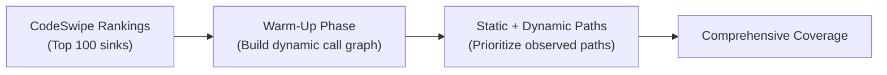

**Delta Mode:**


**SARIF Mode:**
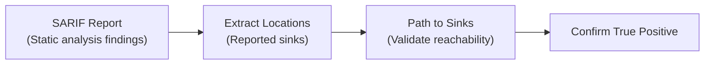

**Mode Comparison:**

| Aspect | Full Mode | Delta Mode | SARIF Mode |
|--------|-----------|------------|------------|
| **Input** | Entire codebase | Code changes (diff) | SARIF report |
| **Warm-Up** | Yes (comprehensive) | No (skip for speed) | No |
| **Sink Selection** | CodeSwipe top 100 | Related to changes | SARIF locations |
| **Path Prioritization** | Dynamic + Static | Change-focused | Report-focused |
| **Goal** | Find all vulnerabilities | Find new vulnerabilities | Validate static analysis |

**Pipeline Configuration:**
- Full Mode: [`quick_seed`](https://github.com/sslab-gatech/shellphish-afc-crs/blob/main/components/quickseed/pipeline.yaml#L43) (4 CPU, 12Gi RAM)
- Delta Mode: [`quick_seed_delta`](https://github.com/sslab-gatech/shellphish-afc-crs/blob/main/components/quickseed/pipeline.yaml#L238) (4 CPU, 12Gi RAM)
- SARIF Mode: [`quick_seed_sarif`](https://github.com/sslab-gatech/shellphish-afc-crs/blob/main/components/quickseed/pipeline.yaml#L435) (4 CPU, 8Gi RAM)

## End-to-End Workflow

### High-Level Flow

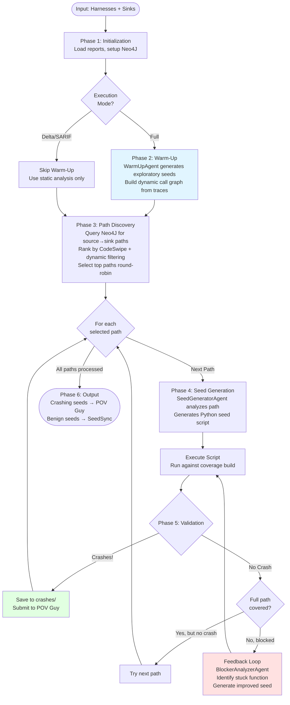

### Workflow Phases Summary

**Phase 1: Initialization** ([`__main__.py:gen_seed()`](https://github.com/sslab-gatech/shellphish-afc-crs/blob/main/components/quickseed/QuickSeed/__main__.py#L62))
- Load harness metadata and set up output directories
- Parse CodeQL reports (sinks, edges) and CodeSwipe rankings
- Initialize Neo4J backend and identify source functions

**Phase 2: Warm-Up** (Full Mode only) ([`manager/preprocess.py`](https://github.com/sslab-gatech/shellphish-afc-crs/blob/main/components/quickseed/QuickSeed/manager/preprocess.py))
- Submit WarmUpTask for each harness
- Generate exploratory seeds to probe harness behavior
- Trace execution to build dynamic call graph
- Addresses static analysis false negatives (reflection, dynamic loading)

**Phase 3: Path Discovery** ([`manager/intializer.py`](https://github.com/sslab-gatech/shellphish-afc-crs/blob/main/components/quickseed/QuickSeed/manager/intializer.py))
- Query Neo4J for paths from sources (harnesses) to sinks
- Filter paths using dynamic call graph (prioritize observed paths)
- Rank paths using round-robin across sinks (batch_size=10)
- Expand paths with actual function code from function resolver

**Phase 4: Seed Generation** ([`agents/seed_generator.py`](https://github.com/sslab-gatech/shellphish-afc-crs/blob/main/components/quickseed/QuickSeed/llm/agents/seed_generator.py))
- SeedGeneratorAgent analyzes call path
- Determines if sink is reachable from harness
- Generates Python script to create seed input
- Validates script execution

**Phase 5: Feedback Loop** ([`manager/postprocessor.py`](https://github.com/sslab-gatech/shellphish-afc-crs/blob/main/components/quickseed/QuickSeed/manager/postprocessor.py))
- Execute seed against coverage and debug builds
- If crashes: save and submit to POV Guy
- If blocked: invoke BlockerAnalyzerAgent
- Identify stuck function and generate improved seed
- Iterate until crash or budget exhausted

**Phase 6: Output**
- Crashing seeds → POV Guy for verification and deduplication
- Benign seeds → SeedSync for distribution to Jazzmine fuzzer
- Logs and telemetry data saved

## Detailed Workflow: Full Mode Example

Let's trace a complete example to understand how QuickSeed discovers a vulnerability.

### Scenario Setup

**Target Application**: Jenkins plugin with command execution functionality
**Harness**: `FuzzCommandExecution` with `fuzzerTestOneInput(byte[] data)`
**Known Sink**: `ProcessBuilder.start()` at `CommandExecutor.java:245`
**CodeSwipe Ranking**: High priority (rank #5 out of 500 functions)

### Step-by-Step Execution

#### Step 1: Initialization

```
Entry Point: gen_seed()
├─ Load harness info → FuzzCommandExecution at /project/FuzzCommandExecution.java
├─ Parse CodeQL report → Found 15 sinks including ProcessBuilder.start()
├─ Parse CodeSwipe → CommandExecutor.execute() ranked #5
└─ Initialize Neo4J → Connected to call graph database
```

**Code**: [`__main__.py:261-287`](https://github.com/sslab-gatech/shellphish-afc-crs/blob/main/components/quickseed/QuickSeed/__main__.py#L261-L287)

#### Step 2: Warm-Up Phase

```
PreProcessor submits WarmUpTask
├─ WarmUpAgent receives harness code
├─ Generates exploratory seed script:
│   def generate():
│       return b'{"command": "ls", "args": []}'
├─ Script executed → Seed traces through:
│   FuzzCommandExecution → parseJSON → validateInput
└─ Dynamic call graph updated with observed path
```

**Agent**: [`agents/warm_up.py`](https://github.com/sslab-gatech/shellphish-afc-crs/blob/main/components/quickseed/QuickSeed/llm/agents/warm_up.py)
**Model**: GPT-4.1 (fast, cost-effective)

#### Step 3: Path Discovery

```
Initializer queries Neo4J:
├─ Find paths: FuzzCommandExecution → ProcessBuilder.start()
├─ Static analysis returns 3 paths:
│   Path 1: Harness → parseJSON → validateInput → execute → start() [5 hops]
│   Path 2: Harness → parseXML → transformCmd → execute → start() [5 hops]
│   Path 3: Harness → deserialize → processCmd → execute → start() [5 hops]
├─ Dynamic filtering: Path 1 was observed in warm-up traces
├─ Ranking: Path 1 prioritized (observed + high CodeSwipe rank)
└─ Expand with function code → Full implementations retrieved
```

**Query**: [`parser/neo4j_backend.py:get_paths_for_sink()`](https://github.com/sslab-gatech/shellphish-afc-crs/blob/main/components/quickseed/QuickSeed/parser/neo4j_backend.py)
**Ranking**: [`parser/path_filter.py:path_rank()`](https://github.com/sslab-gatech/shellphish-afc-crs/blob/main/components/quickseed/QuickSeed/parser/path_filter.py)

#### Step 4: Seed Generation (First Attempt)

```
Scheduler submits SeedGeneratorTask for Path 1
├─ Agent analyzes path functions:
│   1. parseJSON: expects {"command": str, "args": list}
│   2. validateInput: checks command against whitelist
│   3. execute: constructs ProcessBuilder with command
│   4. ProcessBuilder.start(): SINK - triggers sanitizer
│
├─ Agent reasoning:
│   "parseJSON needs valid JSON structure"
│   "validateInput checks if command in ['ls', 'cat', 'grep']"
│   "Need to reach execute() which calls start()"
│
└─ Generates Python script:
    import json
    def generate():
        payload = {"command": "ls", "args": ["-la"]}
        return json.dumps(payload).encode()
```

**Agent**: [`agents/seed_generator.py:SeedGeneratorAgent`](https://github.com/sslab-gatech/shellphish-afc-crs/blob/main/components/quickseed/QuickSeed/llm/agents/seed_generator.py)
**Plan**: [`seed_generator_plans.yaml`](https://github.com/sslab-gatech/shellphish-afc-crs/blob/main/components/quickseed/QuickSeed/llm/agents/plans/seed_generator_plans.yaml)

#### Step 5: Execution & Coverage Analysis

```
PostProcessor executes seed:
├─ Run against coverage build
├─ Coverage results:
│   ✓ parseJSON() - COVERED
│   ✓ validateInput() - COVERED
│   ✓ execute() - COVERED
│   ✓ ProcessBuilder.start() - COVERED
│
├─ Run against debug build
└─ Result: NO CRASH (command "ls" is benign)
```

**Code**: [`manager/postprocessor.py`](https://github.com/sslab-gatech/shellphish-afc-crs/blob/main/components/quickseed/QuickSeed/manager/postprocessor.py)

#### Step 6: Analysis - Not a True Vulnerability?

At this point, QuickSeed has successfully generated a seed that reaches the sink, but it doesn't crash. This could mean:
1. The sink is not actually vulnerable with these inputs
2. The sink requires specific conditions to crash

QuickSeed moves to the next path. However, let's imagine we found a different path with a validation bypass...

#### Alternative Step 4: Different Path with Vulnerability

```
Path 2 analysis finds vulnerability:
├─ Path: Harness → parseJSON → unsafeExecute → start()
├─ Key difference: unsafeExecute() SKIPS validation
│
└─ Agent generates exploit seed:
    import json
    def generate():
        # Command injection via unsafeExecute path
        payload = {"command": "sh", "args": ["-c", "malicious"]}
        return json.dumps(payload).encode()
```

#### Step 7: Success - Crash Detected!

```
PostProcessor executes exploit seed:
├─ Coverage: All functions on path covered
├─ Debug build execution:
│   → Sanitizer triggered: OS Command Injection detected!
│   → Stack trace: ProcessBuilder.start() at CommandExecutor.java:245
│
├─ Save seed to crashes/quickseed-crash-uuid.bin
└─ Submit to POV Guy with metadata
```

### Agent Interaction Sequence

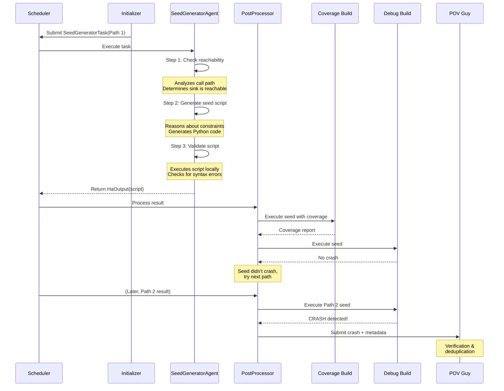

## LLM Agent System

### Agent Architecture

QuickSeed employs multiple specialized LLM agents, each designed for specific reasoning tasks in the seed generation pipeline.

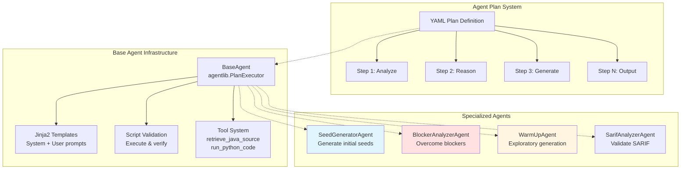

### Core Agent: SeedGeneratorAgent

**Purpose**: Generate initial seed based on call path analysis

**Input**: [`SeedGeneratorTask`](https://github.com/sslab-gatech/shellphish-afc-crs/blob/main/components/quickseed/QuickSeed/llm/agents/task.py)
- Call path (sequence of `CallGraphNode`)
- Harness source code
- Jazzer sanitizer descriptions
- Sink function information
- CodeSwipe reasoning (why this sink is interesting)

**Agent Workflow**:

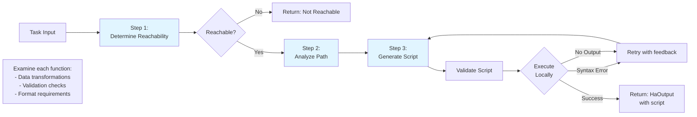

**Implementation**: [`agents/seed_generator.py`](https://github.com/sslab-gatech/shellphish-afc-crs/blob/main/components/quickseed/QuickSeed/llm/agents/seed_generator.py)

**Plan Steps** ([`seed_generator_plans.yaml`](https://github.com/sslab-gatech/shellphish-afc-crs/blob/main/components/quickseed/QuickSeed/llm/agents/plans/seed_generator_plans.yaml)):
1. **determine_reachibility**: Analyze if sink is reachable from harness
   - Output: `DetermineReachibilityOutput(reachable: Yes/No, reason: str)`
   - If "No", skip remaining steps
2. **analyze_path**: Examine each function on the path
3. **generate_script**: Create Python script that produces seed
4. **validate**: Execute script and verify output

**Output**: `HaOutput`
```python
class HaOutput(SaveLoadObject):
    reachable: str  # "Yes" or "No"
    generate_seed_python_script: str  # Python code
```

**Example Generated Script**:
```python
import json
import base64

def generate():
    # Generate seed for command injection sink
    payload = {
        "command": "ls",
        "args": ["-la", "/tmp"],
        "options": {
            "shell": True
        }
    }
    return json.dumps(payload).encode('utf-8')

# Script must create output.bin or output/ directory
with open('output.bin', 'wb') as f:
    f.write(generate())
```

**Models**: Claude-4-Sonnet, O4-Mini (configurable via `QUICKSEED_LLM_MODEL`)

### Core Agent: BlockerAnalyzerAgent

**Purpose**: Analyze why a seed failed to reach the sink and generate an improved seed

**Input**: [`BlockerAnalyzerTask`](https://github.com/sslab-gatech/shellphish-afc-crs/blob/main/components/quickseed/QuickSeed/llm/agents/task.py)
- Stuck function (last function covered)
- Next function (target that wasn't reached)
- Coverage information
- Original seed script
- Harness code

**Why This Matters**: Initial seeds often fail because:
- Input format validation (magic bytes, checksums, structure)
- Authentication/authorization checks
- State dependencies (e.g., session tokens)
- Complex parsing requirements (nested formats, encoding)

**Agent Workflow**:

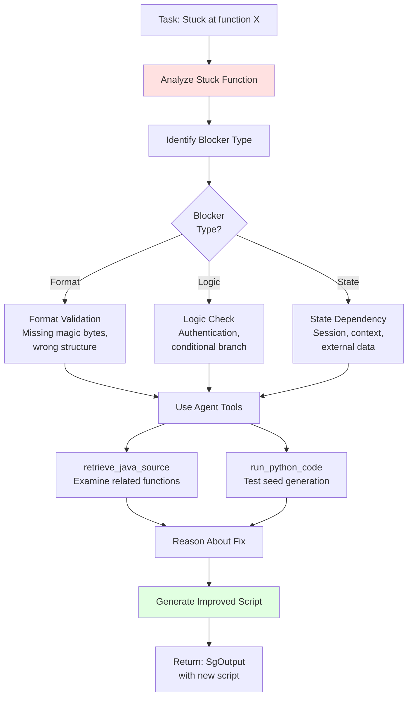

**Implementation**: [`agents/blocker_analyzer.py`](https://github.com/sslab-gatech/shellphish-afc-crs/blob/main/components/quickseed/QuickSeed/llm/agents/blocker_analyzer.py)

**Available Tools** ([`agents/tools.py`](https://github.com/sslab-gatech/shellphish-afc-crs/blob/main/components/quickseed/QuickSeed/llm/agents/tools.py)):
- `retrieve_java_source(function_name)`: Fetch additional source code not on original path
- `run_python_code(code)`: Test seed generation logic before returning

**Example Blocker Scenario**:

```
Stuck Function: validateInput()
Coverage: Reached line 42, stopped at line 45

Source Code Analysis:
42:  if (!isValidJSON(input)) return false;  // ✓ Passed
43:  JSONObject obj = JSON.parse(input);      // ✓ Passed
44:  String cmd = obj.getString("command");   // ✓ Passed
45:  if (!cmd.startsWith("approved_")) {      // ✗ BLOCKED HERE
46:      return false;
47:  }

Agent Reasoning:
- Original seed: {"command": "ls"}
- Blocker: Command must start with "approved_"
- Solution: Modify seed to include prefix

Improved Seed:
{"command": "approved_ls; malicious_cmd"}
```

**Output**: `SgOutput`
```python
class SgOutput(SaveLoadObject):
    generate_input_script: str  # Improved Python script
```

**Priority**: BlockerAnalyzerTask has highest priority (0) in scheduler ([`scheduler.py:100-102`](https://github.com/sslab-gatech/shellphish-afc-crs/blob/main/components/quickseed/QuickSeed/manager/scheduler.py#L100-L102))

### Core Agent: WarmUpAgent

**Purpose**: Generate exploratory seeds to build dynamic call graph

**Input**: [`WarmUpTask`](https://github.com/sslab-gatech/shellphish-afc-crs/blob/main/components/quickseed/QuickSeed/llm/agents/task.py)
- Harness code only (no specific target)

**Strategy**:
- No specific sink target, just explore harness behavior
- Generate diverse inputs to maximize code coverage
- Focus on discovering execution paths, not crashes

**Implementation**: [`agents/warm_up.py`](https://github.com/sslab-gatech/shellphish-afc-crs/blob/main/components/quickseed/QuickSeed/llm/agents/warm_up.py)

**Model**: GPT-4.1 (faster and cheaper for exploratory tasks)

**Output**: `WuOutput`
```python
class WuOutput(SaveLoadObject):
    generated_seed_script: str  # Exploratory seed script
```

**Why Warm-Up Matters**:
Static analysis cannot resolve:
- Reflection calls: `Method.invoke()`, `Class.forName()`
- Dynamic class loading: `ClassLoader.loadClass()`
- Interface implementations with multiple concrete classes
- Polymorphic calls with multiple targets

Dynamic call graph from warm-up traces solves this by recording actual execution paths.

### Other Agents

**SarifAnalyzerAgent** ([`agents/sarif_analyzer.py`](https://github.com/sslab-gatech/shellphish-afc-crs/blob/main/components/quickseed/QuickSeed/llm/agents/sarif_analyzer.py))
- Validates SARIF reports by generating exploit seeds
- Plan: [`sarif_report_explore_plans.yaml`](https://github.com/sslab-gatech/shellphish-afc-crs/blob/main/components/quickseed/QuickSeed/llm/agents/plans/sarif_report_explore_plans.yaml)
- Used in SARIF mode

**ReflectionAnalyzerAgent** ([`agents/reflection_analyzer.py`](https://github.com/sslab-gatech/shellphish-afc-crs/blob/main/components/quickseed/QuickSeed/llm/agents/reflection_analyzer.py))
- Resolves reflection calls that static analysis cannot handle
- Plan: [`reflection_analyzer_plans.yaml`](https://github.com/sslab-gatech/shellphish-afc-crs/blob/main/components/quickseed/QuickSeed/llm/agents/plans/reflection_analyzer_plans.yaml)
- Note: Partially deprecated, warm-up approach preferred

**SinkIdentifierAgent** ([`agents/sink_identifier.py`](https://github.com/sslab-gatech/shellphish-afc-crs/blob/main/components/quickseed/QuickSeed/llm/agents/sink_identifier.py))
- Identifies additional sinks beyond Jazzer sanitizers
- Uses CVE pattern matching
- Plan: [`sink_identifier_plans.yaml`](https://github.com/sslab-gatech/shellphish-afc-crs/blob/main/components/quickseed/QuickSeed/llm/agents/plans/sink_identifier_plans.yaml)

**DiffAnalyzerAgent** ([`agents/diff_analyzer.py`](https://github.com/sslab-gatech/shellphish-afc-crs/blob/main/components/quickseed/QuickSeed/llm/agents/diff_analyzer.py))
- Analyzes code diffs in delta mode
- Plan: [`diff_analyzer_plans.yaml`](https://github.com/sslab-gatech/shellphish-afc-crs/blob/main/components/quickseed/QuickSeed/llm/agents/plans/diff_analyzer_plans.yaml)

**CSeedGeneratorAgent** ([`agents/c_seed_generator.py`](https://github.com/sslab-gatech/shellphish-afc-crs/blob/main/components/quickseed/QuickSeed/llm/agents/c_seed_generator.py))
- Generate seeds for C/C++ targets
- Less commonly used in QuickSeed (Java-focused)

## Key Subsystems

### Path Discovery System

**Goal**: Find all feasible ways to reach sinks from harness entry points

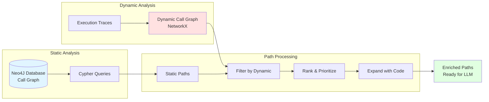

#### Neo4J Backend

**Purpose**: Interface to graph database for call graph queries

**Implementation**: [`parser/neo4j_backend.py`](https://github.com/sslab-gatech/shellphish-afc-crs/blob/main/components/quickseed/QuickSeed/parser/neo4j_backend.py)

**Data Source**: CodeQL analysis results uploaded to Neo4J by analyzer component

**Key Operations**:
1. **Path Queries**: Find paths from sources (harnesses) to sinks
   - `get_shortest_path_query()`: Single shortest path
   - `get_all_paths_query()`: All paths within depth limit
   - `get_paths_for_sink()`: All paths to specific sink
2. **Neighborhood Queries**: Explore local call relationships
   - `get_callers()`: Find functions calling a target
   - `get_callees()`: Find functions called by a source
3. **Path Enhancement**:
   - `expand_paths_with_codeql_query()`: Add function implementations
   - `filter_paths_by_dynamic_call_paths()`: Prioritize observed paths
   - `paths_with_common_nodes()`: Find paths sharing intermediate nodes

**Cypher Query Templates** ([`parser/assets/cypher_templates.py`](https://github.com/sslab-gatech/shellphish-afc-crs/blob/main/components/quickseed/QuickSeed/parser/assets/cypher_templates.py)):

```cypher
// Example: Find all shortest paths
MATCH (source:Function {identifier: $source_identifier})
MATCH (target:Function {identifier: $target_identifier})
MATCH path = allShortestPaths(
  (source)-[:CALLS*..10]->(target)
)
RETURN path
LIMIT $limit
```

#### Dynamic Call Graph Parser

**Purpose**: Build and query call graph from execution traces

**Implementation**: [`parser/call_graph_parser.py`](https://github.com/sslab-gatech/shellphish-afc-crs/blob/main/components/quickseed/QuickSeed/parser/call_graph_parser.py)

**Data Structure**:
```python
graphs: dict[str, networkx.DiGraph]
# One DiGraph per source function
# Nodes: function identifiers
# Edges: observed calls during tracing
```

**Key Operations**:
- `add_trace(source, trace)`: Add execution trace to graph
- `get_dynamic_paths_from_sources_to_sinks()`: Extract paths to sinks
- `has_path(source, target)`: Check if path exists
- `clear_graphs()`: Free memory (called after path extraction)

**Why This Matters**:
- Resolves reflection calls that static analysis misses
- Confirms path feasibility (path was actually executed)
- Reduces false positives in path selection

#### Path Ranking & Filtering

**Purpose**: Prioritize paths most likely to yield vulnerabilities

**Implementation**: [`parser/path_filter.py`](https://github.com/sslab-gatech/shellphish-afc-crs/blob/main/components/quickseed/QuickSeed/parser/path_filter.py)

**Ranking Strategy**:
1. **CodeSwipe Scoring**: Use pre-computed vulnerability likelihood
2. **Dynamic Observation**: Prioritize paths seen in warm-up traces
3. **Path Diversity**: Round-robin selection across different sinks
4. **Common Node Analysis**: If >5 paths to a sink, cluster by shared nodes

**Algorithm** (`path_rank`):
```python
def path_rank(paths_by_sink, batch_size=10, round_robin_size=3):
    """
    Args:
        paths_by_sink: List[List[Path]] - paths grouped by sink
        batch_size: Number of paths to select per iteration
        round_robin_size: Paths to take from each sink per round

    Returns:
        Ranked list of paths with diverse sink coverage
    """
    # Round-robin across sinks to ensure diversity
    # Within each sink, prioritize by CodeSwipe + dynamic
```

**Example**:
```
Input: 10 sinks, each with 3-5 paths
Output: [
  sink1_path1,  # Round 1: Take top path from each sink
  sink2_path1,
  sink3_path1,
  ...
  sink10_path1,
  sink1_path2,  # Round 2: Take second path from each
  sink2_path2,
  ...
]
```

### Orchestration System

**Goal**: Manage concurrent task execution with priority and feedback

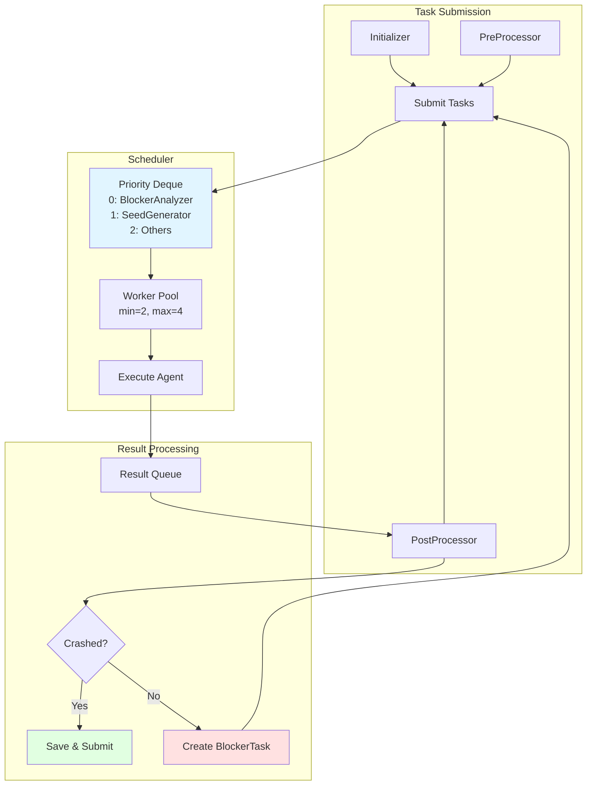

#### Scheduler

**Purpose**: Thread-based task scheduler with priority and dynamic scaling

**Implementation**: [`manager/scheduler.py`](https://github.com/sslab-gatech/shellphish-afc-crs/blob/main/components/quickseed/QuickSeed/manager/scheduler.py)

**Architecture**:
- Task queue: `deque` with condition variable (for priority insertion)
- Worker pool: 2-4 threads (dynamic scaling)
- Result queue: Standard `Queue` for thread-safe result delivery

**Task Priorities** ([`scheduler.py:100-102`](https://github.com/sslab-gatech/shellphish-afc-crs/blob/main/components/quickseed/QuickSeed/manager/scheduler.py#L100-L102)):
```python
if isinstance(task, BlockerAnalyzerTask):
    priority = 0  # Highest - feedback is critical
elif isinstance(task, SeedGeneratorTask):
    priority = 1  # Normal - initial generation
else:
    priority = 2  # Lowest
```

**Worker Lifecycle**:
1. Workers created when tasks available and `active_workers < max_workers`
2. Workers process tasks from deque (priority order)
3. Workers terminate after 1s timeout with no tasks
4. New workers spawned when queue grows

**Key Methods**:
- `submit_task(task, *args, **kwargs)`: Add to end of queue (normal priority)
- `submit_priority_task(task, *args, **kwargs)`: Add to front of queue
- `_worker_loop(worker_id)`: Main worker execution with timeout
- `wait_finish()`: Block until all pending tasks complete

#### Initializer

**Purpose**: Discover paths and submit initial seed generation tasks

**Implementation**: [`manager/intializer.py`](https://github.com/sslab-gatech/shellphish-afc-crs/blob/main/components/quickseed/QuickSeed/manager/intializer.py)

**Workflow** ([`intializer.py:68-125`](https://github.com/sslab-gatech/shellphish-afc-crs/blob/main/components/quickseed/QuickSeed/manager/intializer.py#L68-L125)):
1. For each sink, query Neo4J for paths
2. Filter paths by dynamic call graph
3. Rank paths (round-robin + CodeSwipe + dynamic)
4. Expand paths with function code
5. Submit `SeedGeneratorTask` for each path

**Mode-Specific Behavior**:
- **Full Mode**: Use all paths, prioritize by dynamic + CodeSwipe
- **Delta Mode**: Filter paths involving changed functions
- **SARIF Mode**: Only paths to SARIF-reported sinks

#### PostProcessor

**Purpose**: Process seed generation results and manage feedback loop

**Implementation**: [`manager/postprocessor.py`](https://github.com/sslab-gatech/shellphish-afc-crs/blob/main/components/quickseed/QuickSeed/manager/postprocessor.py)

**Main Loop** (`process_result_queue()`):
```python
while not scheduler.shutdown:
    priority, success, result = result_queue.get()

    if isinstance(result, HaOutput):  # SeedGenerator result
        seed = execute_script(result.script)
        coverage = run_coverage_build(seed)
        crash = run_debug_build(seed)

        if crash:
            save_crash(seed)
            submit_to_pov_guy(seed, crash_info)
        else:
            stuck_func = identify_stuck_function(coverage, path)
            if stuck_func:
                blocker_task = create_blocker_task(stuck_func)
                scheduler.submit_priority_task(blocker_task)

    elif isinstance(result, SgOutput):  # BlockerAnalyzer result
        # Retry with improved seed
        retry_execution(result.script)
```

**Feedback Loop Logic**:
1. Execute seed against coverage build → collect covered functions
2. Compare with expected path → identify "stuck function"
3. Create `BlockerAnalyzerTask` with:
   - Stuck function name and code
   - Next function on path
   - Coverage information
   - Original seed script
4. Submit with highest priority

### Coverage & Feedback System

**Goal**: Identify why seeds fail and iteratively improve them

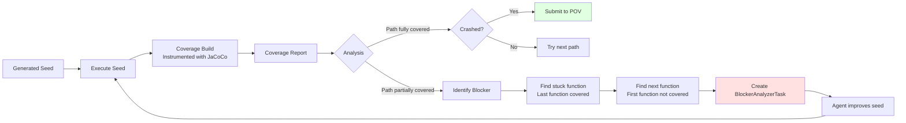

#### Coverage Parser

**Purpose**: Parse coverage information from instrumented builds

**Implementation**: [`parser/coverage_parser.py`](https://github.com/sslab-gatech/shellphish-afc-crs/blob/main/components/quickseed/QuickSeed/parser/coverage_parser.py)

**Workflow**:
1. Execute seed against coverage build (JaCoCo instrumentation)
2. Parse coverage output (XML or binary format)
3. Map covered lines to function identifiers
4. Return set of covered function IDs

**Integration**: Used by PostProcessor to determine seed effectiveness

#### Blocker Identification

**Algorithm**:
```python
def identify_blocker(coverage: Set[str], path: List[str]) -> Optional[Tuple[str, str]]:
    """
    Find where seed got stuck on path

    Args:
        coverage: Set of covered function IDs
        path: Expected function sequence

    Returns:
        (stuck_function, next_function) or None
    """
    for i, func in enumerate(path):
        if func not in coverage:
            # Found first uncovered function
            stuck_func = path[i-1] if i > 0 else path[0]
            next_func = func
            return (stuck_func, next_func)

    # All functions covered but no crash
    return None
```

**Example**:
```
Expected path: [A, B, C, D, E]
Coverage: {A, B, C}
Result: stuck_function=C, next_function=D
```

#### Dynamic Call Graph Updates

After each seed execution, the observed trace is added to the dynamic call graph:

```python
# In PostProcessor
trace = extract_execution_trace(seed)
dynamic_call_graph.add_trace(source=harness, trace=trace)
```

This continuously improves the dynamic call graph throughout execution, helping prioritize paths for subsequent seed generation tasks.

## Implementation Details

### CodeQL Integration

QuickSeed relies on custom CodeQL queries to identify sinks and build the initial call graph.

**Query Location**: [`components/codeql/quickseed_query/`](https://github.com/sslab-gatech/shellphish-afc-crs/blob/main/components/codeql/quickseed_query/)

**Queries**:

1. **Sanitizer.ql.j2** - Find all Jazzer sanitizer hook locations
   - Identifies calls to monitored APIs (ProcessBuilder.start, etc.)
   - Maps to specific vulnerability types (command injection, etc.)

2. **Sinks.ql.j2** - Identify additional sinks based on CVE patterns
   - Analyzes historical vulnerability patterns
   - Finds similar dangerous API usage

3. **LastHopEdges.ql.j2** - Track calls from project code to library functions
   - Captures transitions from application to framework/library
   - Important for understanding sanitizer activation points

**Execution** ([`quickseed_query/run_quickseed_query.py`](https://github.com/sslab-gatech/shellphish-afc-crs/blob/main/components/codeql/quickseed_query/run_quickseed_query.py)):
```python
# Run queries against CodeQL database
run_query("Sanitizer.ql.j2", db_path)
run_query("Sinks.ql.j2", db_path)
run_query("LastHopEdges.ql.j2", db_path)

# Output to YAML
save_results("quickseed_codeql_report.yaml")
```

**Query Result Format**:
```yaml
sinks:
  - identifier: "com.example.CommandExecutor.execute"
    location: "CommandExecutor.java:245"
    type: "OS_COMMAND_INJECTION"
    sanitizer: "ProcessBuilder.start"

last_hop_edges:
  - from: "com.example.Controller.handleRequest"
    to: "java.lang.ProcessBuilder.start"
    location: "Controller.java:123"
```

**Upload to Analysis Graph**: Results uploaded to Neo4J graph database for path queries.

### Configuration and Resource Management

#### LLM Budget Management

**Budget Allocation** ([`llm/agent_invoker.py:34`](https://github.com/sslab-gatech/shellphish-afc-crs/blob/main/components/quickseed/QuickSeed/llm/agent_invoker.py#L34)):
```python
QUICKSEED_LLM_BUDGET = 80  # USD
```

**Configuration** ([`__main__.py:354-357`](https://github.com/sslab-gatech/shellphish-afc-crs/blob/main/components/quickseed/QuickSeed/__main__.py#L354-L357)):
```python
set_global_budget_limit(
    price_in_dollars=QUICKSEED_LLM_BUDGET,
    exit_on_over_budget=False,  # Graceful degradation
)
```

**Behavior**:
- Agents raise `LLMApiBudgetExceededError` when budget exhausted
- System does not exit, allows completion of in-progress tasks
- Budget tracked across all agent invocations

#### Model Selection

**Default Models** ([`__main__.py:378`](https://github.com/sslab-gatech/shellphish-afc-crs/blob/main/components/quickseed/QuickSeed/__main__.py#L378)):
```python
available_models = ["claude-4-sonnet", "o4-mini"]
```

**Model Assignment**:
- **Primary Generation**: Claude-4-Sonnet, O4-Mini
- **Warm-Up**: GPT-4.1 (faster, cheaper)
- **Configurable**: Set `QUICKSEED_LLM_MODEL` environment variable

**Override Example**:
```bash
export QUICKSEED_LLM_MODEL="claude-4-sonnet,gpt-4.1"
```

#### Resource Quotas

**Pipeline Configuration** ([`pipeline.yaml`](https://github.com/sslab-gatech/shellphish-afc-crs/blob/main/components/quickseed/pipeline.yaml)):

| Mode | CPU | Memory | Priority |
|------|-----|--------|----------|
| Full | 4 cores | 12Gi | 100 |
| Delta | 4 cores | 12Gi | 100 |
| SARIF | 4 cores | 8Gi | 100 |

**Container Requirements**:
- Privileged container (for Docker-in-Docker)
- Mount `/var/run/docker.sock` (Docker socket)
- Mount `/shared/` (shared fuzzer sync directory)

#### Telemetry and Logging

**OpenTelemetry** ([`__main__.py:31-33`](https://github.com/sslab-gatech/shellphish-afc-crs/blob/main/components/quickseed/QuickSeed/__main__.py#L31-L33)):
```python
init_otel("quickseed", "input_generation", "llm_java_input_generation")
init_llm_otel()
```

**Event Dumping** ([`__main__.py:353`](https://github.com/sslab-gatech/shellphish-afc-crs/blob/main/components/quickseed/QuickSeed/__main__.py#L353)):
```python
enable_event_dumping('./events')
```
- Captures full LLM interactions
- Includes tool calls and responses
- Records validation results

**Logs**:
- Output directory: `quickseed_log` repository
- Filename format: `quickseed_{random}.log`
- Contains: Execution traces, agent decisions, error messages

## Design Challenges and Solutions

### Challenge 1: Static Analysis False Negatives

**Problem**:
Static call graph analysis cannot resolve:
- Reflection calls: `Method.invoke()`, `Class.forName()`
- Dynamic class loading: `ClassLoader.loadClass()`
- Interface implementations with runtime polymorphism
- Library boundaries with complex dispatch

This causes many paths to appear unreachable when they are actually feasible at runtime.

**Impact**:
- Missed vulnerability paths
- Wasted effort on truly unreachable paths
- Incorrect prioritization

**Solution**: Two-Phase Approach

**Phase 1: Warm-Up** ([`manager/preprocess.py`](https://github.com/sslab-gatech/shellphish-afc-crs/blob/main/components/quickseed/QuickSeed/manager/preprocess.py))
```python
# Generate exploratory seeds
for harness in harnesses:
    warm_up_task = WarmUpTask(harness_code)
    scheduler.submit(warm_up_task)

# Execute seeds and trace
for seed in warm_up_seeds:
    trace = execute_with_tracing(seed)
    dynamic_call_graph.add_trace(trace)
```

**Phase 2: Dynamic Filtering** ([`intializer.py:110`](https://github.com/sslab-gatech/shellphish-afc-crs/blob/main/components/quickseed/QuickSeed/manager/intializer.py#L110))
```python
# Prioritize paths observed during warm-up
static_paths = neo4j.get_paths_for_sink(sink)
dynamic_paths = dynamic_call_graph.get_paths_to_sink(sink)
filtered_paths = filter_by_dynamic(static_paths, dynamic_paths)
```

**Results**:
- Confirms path feasibility through actual execution
- Resolves reflection and dynamic loading
- Improves path prioritization accuracy

**Code References**:
- Warm-up: [`manager/preprocess.py`](https://github.com/sslab-gatech/shellphish-afc-crs/blob/main/components/quickseed/QuickSeed/manager/preprocess.py)
- Dynamic graph: [`parser/call_graph_parser.py`](https://github.com/sslab-gatech/shellphish-afc-crs/blob/main/components/quickseed/QuickSeed/parser/call_graph_parser.py)
- Filtering: [`intializer.py:110`](https://github.com/sslab-gatech/shellphish-afc-crs/blob/main/components/quickseed/QuickSeed/manager/intializer.py#L110)

### Challenge 2: Path Explosion

**Problem**:
Large codebases can have thousands of paths to sinks:
- 500+ potential sinks in a typical application
- 10-50 paths per sink on average
- Total: 5,000-25,000 potential paths
- LLM budget limits: ~200-400 agent invocations at $80 budget

**Impact**:
Cannot afford to explore all paths within time and budget constraints.

**Solution**: Multi-Level Prioritization

**Level 1: Sink Selection** ([`__main__.py:139-141`](https://github.com/sslab-gatech/shellphish-afc-crs/blob/main/components/quickseed/QuickSeed/__main__.py#L139-L141))
```python
# Limit to top N sinks by CodeSwipe ranking
if len(codeswipe_funcs) > sink_limit:
    codeswipe_funcs = codeswipe_funcs[:sink_limit]  # Default: 100
```

**Level 2: Path Limiting per Sink**
```python
# Query limited number of paths per sink
paths = neo4j.get_paths_for_sink(sink, limit=3)
```

**Level 3: Common Node Clustering** ([`intializer.py:117`](https://github.com/sslab-gatech/shellphish-afc-crs/blob/main/components/quickseed/QuickSeed/manager/intializer.py#L117))
```python
# If too many paths, find representative paths
if len(paths_to_sink) > 5:
    paths = paths_with_common_nodes(paths_to_sink, threshold=5)
```

**Level 4: Round-Robin Selection** ([`parser/path_filter.py`](https://github.com/sslab-gatech/shellphish-afc-crs/blob/main/components/quickseed/QuickSeed/parser/path_filter.py))
```python
# Ensure diversity across sinks
ranked_paths = path_rank(
    paths_by_sink,
    batch_size=10,
    round_robin_size=3
)
```

**Results**:
- Covers diverse vulnerability types
- Prioritizes high-value targets (CodeSwipe)
- Stays within LLM budget
- Typical execution: 50-150 paths explored

**Code References**:
- Sink limiting: [`__main__.py:139-141`](https://github.com/sslab-gatech/shellphish-afc-crs/blob/main/components/quickseed/QuickSeed/__main__.py#L139-L141)
- Path ranking: [`parser/path_filter.py`](https://github.com/sslab-gatech/shellphish-afc-crs/blob/main/components/quickseed/QuickSeed/parser/path_filter.py)
- Common nodes: [`intializer.py:117`](https://github.com/sslab-gatech/shellphish-afc-crs/blob/main/components/quickseed/QuickSeed/manager/intializer.py#L117)

### Challenge 3: Complex Input Formats

**Problem**:
Many sinks require specific input formats that random generation cannot satisfy:
- **Structured formats**: JSON, XML, Protocol Buffers
- **Binary formats**: Custom headers, checksums, length fields
- **Encoded data**: Base64, URL encoding, compression
- **Nested formats**: JSON containing Base64-encoded binary data
- **Validation chains**: Multiple sequential checks (authentication → authorization → format → business logic)

**Example Scenario**:
```java
// Sink requires specific format
public void processCommand(byte[] input) {
    // Layer 1: Must be valid JSON
    JSONObject obj = JSON.parse(input);

    // Layer 2: Must have specific fields
    String type = obj.getString("type");
    String data = obj.getString("data");

    // Layer 3: Data must be Base64
    byte[] decoded = Base64.decode(data);

    // Layer 4: Decoded data must start with magic bytes
    if (!startsWith(decoded, MAGIC_BYTES)) return;

    // Layer 5: Business logic validation
    if (!isAuthorized(type)) return;

    // Finally reach sink
    execute(decoded);  // SINK
}
```

**Impact**:
Initial seeds often fail early in validation chain, never reaching the sink.

**Solution**: Iterative Feedback Loop with LLM Reasoning

**Stage 1: Initial Generation**
```python
# SeedGeneratorAgent analyzes path
agent.analyze_path(functions_on_path)
# Generates seed satisfying known constraints
seed = agent.generate_seed()
```

**Stage 2: Execution & Coverage**
```python
coverage = execute_with_coverage(seed)
# Determines: reached Layer 3, blocked at Layer 4
```

**Stage 3: Blocker Analysis**
```python
# BlockerAnalyzerAgent examines stuck function
blocker_agent.set_context(
    stuck_function="processCommand at line 42",
    coverage_info="Lines 1-42 covered, line 43+ not covered",
    source_code=get_source("processCommand")
)

# Agent identifies: missing magic bytes
improved_seed = blocker_agent.generate_improved_seed()
```

**Stage 4: Tool-Assisted Exploration**
```python
# Agent can explore related code
related_source = agent.call_tool(
    "retrieve_java_source",
    "MAGIC_BYTES constant definition"
)

# Agent can test seed generation
test_result = agent.call_tool(
    "run_python_code",
    "import base64; ..."
)
```

**Stage 5: Iteration**
```
Attempt 1: Valid JSON → Blocked at Layer 2 (missing fields)
Attempt 2: JSON with fields → Blocked at Layer 3 (invalid Base64)
Attempt 3: JSON with Base64 → Blocked at Layer 4 (wrong magic bytes)
Attempt 4: Complete format → SUCCESS (reaches sink)
```

**Results**:
- Handles complex format requirements
- Learns through feedback (not pre-programmed)
- Adapts to application-specific validation
- Successfully generates seeds for multi-layer formats

**Code References**:
- Seed generation: [`agents/seed_generator.py`](https://github.com/sslab-gatech/shellphish-afc-crs/blob/main/components/quickseed/QuickSeed/llm/agents/seed_generator.py)
- Blocker analysis: [`agents/blocker_analyzer.py`](https://github.com/sslab-gatech/shellphish-afc-crs/blob/main/components/quickseed/QuickSeed/llm/agents/blocker_analyzer.py)
- Feedback loop: [`manager/postprocessor.py`](https://github.com/sslab-gatech/shellphish-afc-crs/blob/main/components/quickseed/QuickSeed/manager/postprocessor.py)
- Tools: [`agents/tools.py`](https://github.com/sslab-gatech/shellphish-afc-crs/blob/main/components/quickseed/QuickSeed/llm/agents/tools.py)

## Integration with CRS Pipeline

### Pipeline Context

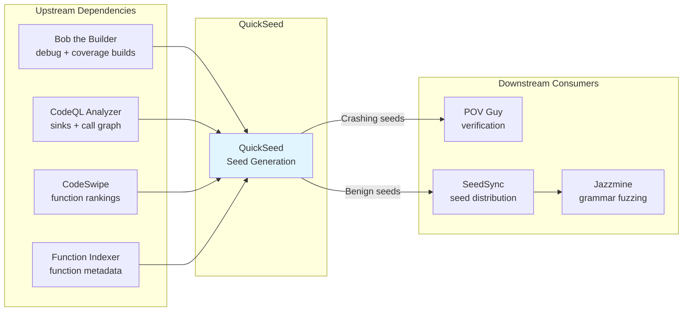

### Input Dependencies

QuickSeed requires several upstream components to complete before it can run:

**Build Artifacts**:
- `debug_build_artifacts`: Debug build with Jazzer instrumentation and sanitizers
- `coverage_build_artifacts`: Build with coverage instrumentation (JaCoCo)

**Static Analysis Results**:
- `quickseed_codeql_reports`: CodeQL query results
  - Sanitizer sink locations
  - Last-hop edges (project → library transitions)
  - Additional CVE-based sinks
- `codeql_db_ready`: Signal that CodeQL database is uploaded to Neo4J
- `codeswipe_rankings`: Function vulnerability likelihood scores

**Metadata**:
- `full_functions_jsons_dirs`: Function implementation JSONs for code retrieval
- `full_functions_indices`: Function index for fast lookups
- `target_split_metadatas`: Harness information (entry points)
- `commit_functions_jsons_dirs`: Modified functions (Delta mode only)

**SARIF Mode Only**:
- `sarif_reports`: Static analysis findings to validate
- `sarif_metadatas`: SARIF report metadata (task ID, report ID)

### Output Artifacts

**Primary Outputs**:
- `crashing_harness_inputs`: Binary seed files that trigger crashes
  - Location: Streaming output per seed
  - Format: Raw binary (*.bin files)

- `crashing_harness_inputs_metadatas`: Metadata for each crash
  - `project_id`: Project identifier
  - `project_name`: Project name
  - `harness_info_id`: Specific harness instance
  - `cp_harness_name`: Harness source file name
  - `fuzzer`: "quickseed"
  - `generated_by_sarif`: SARIF ID (if SARIF mode)

- `quickseed_log`: Execution logs
  - Format: Text logs
  - Contains: Agent decisions, errors, timing

**Optional Outputs** (CI/backup only):
- `quickseed_path_backup`: Backup of discovered paths
- `quickseed_crashing_seed_backup`: Compressed backup of all crashes
- `sarif_retry_metadatas`: Retry information for SARIF validation failures

### Downstream Consumers

**POV Guy** ([`components/pov_guy/`](https://github.com/sslab-gatech/shellphish-afc-crs/blob/main/components/pov_guy/)):
- Receives crashing seeds from QuickSeed
- Verifies crashes are reproducible
- Performs deduplication
- Submits to competition scoring system

**SeedSync**:
- Distributes seeds across fuzzing infrastructure
- Manages `/shared/fuzzer_sync/{harness}/sync-quickseed/` directories
- Synchronizes benign seeds for corpus building

**Jazzmine** ([`components/jazzmine/`](https://github.com/sslab-gatech/shellphish-afc-crs/blob/main/components/jazzmine/)):
- Receives benign seeds from SeedSync
- Uses seeds as initial corpus for grammar-based fuzzing
- Mutates seeds with Revolver Mutator (Nautilus-based)

### Shared Infrastructure

**Analysis Graph** (Neo4J):
- Populated by CodeQL analyzer
- Queried by QuickSeed for call paths
- Shared across multiple components (LLuMinar, Discovery Guy)

**Function Resolver**:
- Remote or local function code retrieval
- Used by all LLM agents needing source code
- Provides indexed access to function implementations

**Fuzzer Sync Directory** (`/shared/fuzzer_sync/`):
- Shared filesystem for seed distribution
- Structure: `{PROJECT}-{HARNESS}-{ID}/sync-quickseed/queue/` (benign) and `crashes/` (crashing)
- Monitored by SeedSync for distribution

## Comparison with Other Components

### QuickSeed vs. LLuMinar

**LLuMinar** ([notes/vulnerability-identification/lluminar.md](https://github.com/sslab-gatech/shellphish-afc-crs/blob/main/notes/src/vulnerability-identification/lluminar.md)):

| Aspect | QuickSeed | LLuMinar |
|--------|-----------|----------|
| **Approach** | Start with known sinks, work backwards | Scan all functions, identify vulnerabilities |
| **Target** | Java only (Jazzer sinks) | Language-agnostic (C/C++/Java) |
| **Model** | Large frontier models (Claude-4, O4) | Custom fine-tuned Qwen2.5-7B |
| **Input** | Jazzer sanitizer sinks + CodeQL | All reachable functions |
| **Output** | Crashing seeds (PoV) | Vulnerability predictions (CWE type) |
| **Method** | Path analysis + seed generation | Function-level reasoning + context retrieval |
| **Integration** | Direct crash generation | Passes to Discovery Guy for PoC |
| **Scope** | Focused (100 sinks) | Comprehensive (all functions) |

**Complementary Nature**:
- LLuMinar: Broad vulnerability discovery across entire codebase
- QuickSeed: Systematic exploitation of known vulnerability patterns (Jazzer sinks)
- Together: LLuMinar finds novel vulnerabilities, QuickSeed ensures comprehensive coverage of known patterns

### QuickSeed vs. Discovery Guy

**Discovery Guy** ([notes/vulnerability-identification/discovery-guy.md](https://github.com/sslab-gatech/shellphish-afc-crs/blob/main/notes/src/vulnerability-identification/discovery-guy.md)):

| Aspect | QuickSeed | Discovery Guy |
|--------|-----------|---------------|
| **Input** | All Jazzer sinks (systematic) | Specific sink (from LLuMinar/CodeSwipe/SARIF) |
| **Language** | Java only | C/C++/Java |
| **Agents** | SeedGenerator + BlockerAnalyzer + WarmUp | JimmyPwn + SeedGeneration |
| **Warm-Up** | Yes (build dynamic call graph) | No |
| **Call Graph** | Neo4J + Dynamic augmentation | Analysis Graph only |
| **Use Cases** | Java fuzzing seed generation | General PoC, SARIF validation, patch bypass |
| **Coverage Feedback** | Detailed (identify stuck function) | Less granular |
| **Iteration** | Multiple feedback loops per path | Limited iterations |

**Similarities**:
- Both use feedback-driven LLM agents
- Both generate Python scripts for seed creation
- Both analyze call paths to sinks

**Key Difference**:
- QuickSeed: **Systematic exploration** of all Jazzer sinks with warm-up optimization
- Discovery Guy: **Targeted analysis** of specific sinks identified by other tools

**When to Use**:
- QuickSeed: Java targets, comprehensive coverage, fuzzing-oriented
- Discovery Guy: Specific vulnerability investigation, patch bypass, multi-language

### QuickSeed vs. Grammar Guy

**Grammar Guy** ([notes/bug-finding/grammar-guy.md](https://github.com/sslab-gatech/shellphish-afc-crs/blob/main/notes/src/bug-finding/grammar-guy.md)):

| Aspect | QuickSeed | Grammar Guy |
|--------|-----------|-------------|
| **Output** | Binary seeds | Nautilus grammars |
| **Approach** | Path-specific seeds | Format-general grammars |
| **Target** | Specific sinks | Harness input formats |
| **Reusability** | Single-use seeds | Reusable grammars for fuzzing |
| **LLM Usage** | Per-path generation | Per-harness grammar creation |
| **Integration** | Direct crash finding | Feed to Jazzmine/AFL++ |

**Complementary Relationship**:
- QuickSeed generates specific seeds for known sinks
- Grammar Guy generates grammars for format fuzzing
- Seeds from QuickSeed can inform Grammar Guy about format requirements
- Grammars from Grammar Guy can be used by Jazzmine to explore more broadly

## Summary

QuickSeed is a sophisticated seed generation system that addresses the Java vulnerability discovery problem through a unique combination of techniques:

**Core Innovation**:
Transforms vulnerability discovery into a reachability problem by targeting Jazzer sanitizer hooks, then uses LLM reasoning with execution feedback to systematically generate seeds that traverse paths to these sinks.

**Key Technical Contributions**:

1. **Hybrid Call Graph Analysis**:
   - Static analysis (Neo4J/CodeQL) for initial path discovery
   - Dynamic analysis (warm-up phase) to resolve reflection and confirm feasibility
   - Combination eliminates false negatives while maintaining broad coverage

2. **Multi-Agent Feedback System**:
   - SeedGeneratorAgent: Initial reasoning about path constraints
   - BlockerAnalyzerAgent: Iterative improvement through coverage feedback
   - WarmUpAgent: Exploratory generation for dynamic graph building
   - Coordination through priority-based scheduler

3. **Intelligent Path Prioritization**:
   - CodeSwipe vulnerability likelihood scores
   - Dynamic execution observations from warm-up
   - Round-robin selection across sinks for diversity
   - Common node clustering to reduce redundancy

4. **Adaptive Format Learning**:
   - No pre-programmed format knowledge
   - Learns format requirements through execution feedback
   - Handles multi-layer validation chains iteratively
   - Tool-assisted code exploration for complex constraints

**Operational Characteristics**:
- **LLM Budget**: $80 for ~50-150 path explorations
- **Execution Modes**: Full (comprehensive), Delta (change-focused), SARIF (validation)
- **Success Rate**: Achieves crashes through iterative feedback when paths are feasible
- **Integration**: Tightly coupled with Jazzer infrastructure and CRS pipeline

**Strengths**:
- Systematic coverage of known vulnerability patterns
- Effective handling of complex input formats
- Resolves static analysis limitations through dynamic validation
- Proven approach for Java fuzzing in competition setting

**Limitations**:
- Java-specific (relies on Jazzer sanitizers)
- Requires warm-up time in Full mode
- Limited to pre-defined sink patterns (though extensible via CVE analysis)
- Path explosion requires careful prioritization

QuickSeed represents a successful application of LLM reasoning to a well-defined problem space (Java fuzzing), achieving systematic vulnerability discovery through the combination of traditional program analysis and adaptive LLM-based seed generation.
