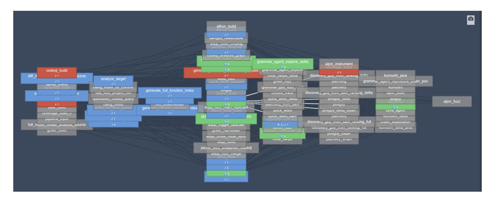

# An AI-powered Cyber Reasoning System for Automatic Vulnerability Identification and Patching

Shellphish

# Abstract

Artiphishell is the Cyber Reasoning System (CRS) engineered by the Shellphish team for DARPA's AIxCC competition. It represents a paradigm shift in automated software security by fusing traditional program analysis techniques with advanced AI to create a hybrid system that transcends the limitations of both approaches. At its core, Artiphishell employs a novel multi-agent architecture capable of autonomously discovering and repairing vulnerabilities in large, complex, real-world software—without any human intervention. This paper unveils the design and implementation of Artiphishell and demonstrates how it pushes the boundaries of fully automated vulnerability detection and remediation, setting a new standard for AI-driven cyber reasoning.

# 1 Introduction

In today's hyperconnected society, software forms the backbone of the critical infrastructure—from financial systems to public utilities. While this code supports advanced functionality, it also expands the attack surface for malicious activity. Attacks against the critical infrastructure can have disastrous results, including loss of life. It is therefore of paramount importance that this critical software is analyzed for security flaws and such flaws are mitigated before deployment.

Unfortunately, the process of identifying potential vulnerabilities, verifying them, and providing effective fixes (i.e., code patches) requires human involvement and substantial expertise. Given the scarcity of well-trained security engineers, the process of finding and fixing vulnerabilities cannot be performed at the scale, complexity, and speed necessary to guarantee the security of the critical infrastructure.

Recent advances in artificial intelligence (AI) in general, and Large Language Models (LLMs) in particular, have driven the development of automated tools that might be able to address some of the challenges faced by today's approaches.

A particularly promising design approach is the agentic paradigm, in which multiple autonomous agents, powered by LLM-based reasoning, collaborate to achieve complex tasks.

Inspired by these new advances in AI, the Shellphish team has designed and built Artiphishell, a multi-agent Cyber Reasoning System (CRS) that is able to autonomously analyze software, identify potential flaws, verify their presence, and produce patches that mitigate the vulnerabilities.

Artiphishell has been assessed on real-world, complex software, showing that it can detect and patch vulnerabilities in the components that are routinely used in critical infrastructures.

The design and implementation of Artiphishell is novel in many respects, from its architecture to its use and composition of grammars, to its unique combination of static and dynamic analyses, as well as its root-cause analysis and patch generation. In the following, we provide an overall overview of the system, while we will focus on specific innovative techniques in separate publications.

# 2 Background

## 2.1 The AI Cyber Challenge

The Artificial Intelligence Cyber Challenge (AIxCC) [\[7\]](#page-18-0) seeks to counteract the threat posed by the exploitation of security flaws in critical software by harnessing the power of artificial intelligence. The competition is organized by DARPA in collaboration with ARPA-H and leading AI firms, and it is a two-year, \$29.5 million competition designed to advance automated cybersecurity technologies capable of protecting critical open-source software systems.

AIxCC brings together the cybersecurity and AI communities to design autonomous CRSs that can identify and patch software vulnerabilities. The competition unfolds over a series of structured rounds, including three unscored exhibitions and one scored final round, culminating at DEF CON 33 in August 2025. Prizes have been distributed to encourage broad participation, including awards to small businesses during the initial phase.

CRSs compete by solving real-world software challenges, which simulate critical infrastructure use cases. Each challenge is a codebase that may contain known (injected) or unknown (zero-day) vulnerabilities. These challenges fall

into two categories: full-scan (analyzing the entire codebase) and delta-scan (analyzing code changes).

To succeed, CRSs must:

- Discover vulnerabilities and demonstrate them through Proofs of Vulnerability (PoVs).
- Automatically generate patches that fix vulnerabilities while preserving functionality.
- Assess SARIF (Static Analysis Results Interchange Format) reports [\[19\]](#page-18-1) for correctness.
- Bundle findings to show relationships between vulnerabilities, patches, and SARIF reports.

Submissions are evaluated by completeness, automated verification, and post-round audits. Scoring is multifaceted, assessing vulnerability discovery, patch effectiveness, SARIF assessment accuracy, and the precision of bundle submissions. An Accuracy Multiplier penalizes spammy or incorrect outputs, encouraging precision.

Strict rules prohibit unethical tactics such as submitting misleading patches (called "Superman defenses"), exploiting the competition infrastructure, or misusing collaborator resources. CRS models must be open, reproducible, and submitted via designated GitHub repositories. Teams are allotted specific budgets for Azure resources and LLM usage, and their systems must operate within a controlled, partially offline, fully-autonomous environment.

By combining AI innovation with rigorous security testing, AIxCC aims to accelerate the development of trustworthy tools that can autonomously secure the software ecosystem, particularly in sectors where reliability is vital to public health and safety.

## 2.2 The Cyber Grand Challenge

The AIxCC is the follow-up competition to the Cyber Grand Challenge (CGC). The CGC, launched by DARPA in 2014 and culminating at DEF CON 24 in 2016, was a cybersecurity competition that introduced the concept of autonomous cyber reasoning systems. Unlike traditional capture-the-flag (CTF) competitions, where human experts identify and patch software vulnerabilities, the CGC challenged teams to build fully autonomous systems capable of performing these tasks without human intervention. These systems had to analyze binary software, identify security flaws, generate working exploits, and apply effective patches—all within a constrained environment and under real-time pressure.

The competition featured a specially constructed testbed and operating system known as DECREE (DARPA Experimental Cyber Research Evaluation Environment), which ensured fairness and consistency across challenges. CGC finalists were selected through a rigorous qualification phase, and seven teams ultimately competed in the final event. The system of each team operated entirely independently, engaging in a head-to-head competition that tested each system's

ability to defend its own software while exploiting vulnerabilities in the software of other teams. The event marked the first time machines competed in a full-scale hacking competition, with no human in the loop.

The CGC significantly advanced research in automated vulnerability discovery and program repair. It laid the foundation for future cybersecurity automation initiatives, including AIxCC, by demonstrating that autonomous systems could meaningfully participate in offensive and defensive cyber operations. Although limited to binaries and constrained in scope, the CGC proved that real-time, machine-scale vulnerability management was not only possible but potentially transformative.

## 2.3 OSS-Fuzz

OSS-Fuzz [\[10\]](#page-18-2) is a security-focused initiative launched by Google with the aim of improving the robustness of opensource software through automated fuzz testing. Fuzzing, or fuzz testing, is a technique that involves feeding randomized, potentially malformed, inputs to a program in order to discover security vulnerabilities, crashes, or unexpected behavior. OSS-Fuzz automates this process at scale for open-source projects, providing a continuous fuzzing infrastructure that can detect a wide range of memory safety issues such as buffer overflows, use-after-free bugs, integer overflows, and more. By leveraging fuzzing engines like lib-Fuzzer [\[13\]](#page-18-3), AFL++ [\[9\]](#page-18-4), Honggfuzz [\[20\]](#page-18-5), and Jazzer [\[12\]](#page-18-6) in conjunction with sanitizers such as AddressSanitizer, UndefinedBehaviorSanitizer, and MemorySanitizer, OSS-Fuzz has been instrumental in identifying and helping fix thousands of vulnerabilities across a broad spectrum of widely used open-source software.

The primary goal of OSS-Fuzz is to enhance the longterm security and stability of open-source infrastructure by offering free fuzzing services to critical projects. The types of software targeted by OSS-Fuzz include, but are not limited to, libraries and tools that are used widely across the industry. This includes components of operating systems, network protocols, image and video parsers, cryptographic libraries, and parsers for common formats like XML and JSON. These projects are often written in memory-unsafe languages like C or C++, where fuzzing is particularly effective. The analysis performed by OSS-Fuzz is continuous; the projects are built and fuzzed automatically on an ongoing basis, ensuring new code or dependencies are regularly evaluated.

Projects submitted to OSS-Fuzz must conform to a certain structure to be successfully integrated into the fuzzing pipeline. Each submitted project includes a Dockerfile that specifies the build environment, which must include all necessary dependencies and configuration needed to compile the target software and its associated fuzzers. The fuzzing targets themselves, known as fuzzing harnesses, are small programs that call into the software being tested and expose entry points that can accept arbitrary inputs. These

harnesses need to link against libFuzzer (or other supported fuzzing engines) and must define an entry point with a signature like:

extern "C" int LLVMFuzzerTestOneInput(const uint8\_t \*data, size\_t size)

This function is called repeatedly with randomly generated inputs to exercise as much of the target's codebase as possible. These harnesses should aim to exercise core parsing, decoding, or processing functionality where untrusted input is handled.

If a crash or bug is discovered, OSS-Fuzz notifies the maintainers with detailed reports, stack traces, and reproducible test cases.

The effectiveness of OSS-Fuzz lies in its scalability and automation. Continuously fuzzing important open-source projects and integrating tightly with sanitizers and modern fuzzers helps maintainers detect and fix vulnerabilities proactively before they are exploited in the wild.

# 3 Artiphishell's Architecture

Artiphishell has an agent-based architecture, in which various components (agents) with specific tasks collaborate in order to carry out the overall task of finding and patching vulnerabilities. The overall architecture of Artiphishell is shown in Figure [3.](#page-2-0)

## 3.1 ARTIPHISHELL Pipeline Architecture & Data Model

ARTIPHISHELL is implemented as a dataflow pipeline in which components are launched on-demand as soon as the data they depend on is available (if sufficient resources are available). E.g. fuzzing tasks would depend on build artifacts that are created by build tasks that in turn depend on the target source code and the project metadata. The build task will launch first, while the fuzzing task will remain blocked until the build task has completed and uploaded the build artifact.

This pipeline is backed by our orchestration framework pydatatask which consists of two main services: the agent and the runner. The agent handles data storage on various backends (e.g. S3 buckets, local file system, cached layers, etc.) as well as dynamic delivery and retrieval of pipeline data to components over HTTP. The runner periodically queries the agent to retrieve the current state of the pipeline and handles tasking, scheduling, preemption and auto-scaling of pipeline tasks.

Throughout the competition, ARTIPHISHELL in its pipeline handles various types of data which can be stratified in two ways. Firstly, they can be grouped by the type of the data stored: folders of files shipped as tar archives, single files in the form of binary blobs and parseable metadata in

YAML or JSON format. In pydatatask, their repositories are referred to as FilesystemRepository, BlobRepository and MetadataRepository, respectively. For example, build artifacts are folder structures which are stored in a FilesystemRepository, whereas crashing seeds are stored in a BlobRepository with an associated MetadataRepository which describes the origin of the crashing seed.

Secondly, the data in the pipeline can generally be clustered into the following semantic groups:

- Source Code Repositories
- Build artifacts
- Static Analysis Results + Rankings
- Code Indexing Results (Split functions, identifiers, globals, etc.)
- Fuzzing grammars (Nautilus) + Serialized Grammar Derivation Trees (referred to as RONs) + Dictionaries
- Harness inputs (Seeds + crashes)
- Crash Reports + Triage Reports
- Generated patches
- SARIF reports (both generated by ARTIPHISHELL as well as provided by the organizers in tasking)
- Submission tasking + artifacts

Data in repositories can be accompanied by additional metadata. This metadata is used to allow components to track the origin of said data (e.g. which component produced a given crash), as well as to associate additional data from different stages, e.g., linking a crashing seed with both the harness it was discovered for as well as the sanitizer that the crash occurs with.

While most of this data is transferred and maintained by the agent of our orchestration framework, pydatatask, more ephemeral pieces of data, e.g. fuzzing seeds, grammars and fuzzing dictionaries are purely managed by SeedSync and maintained and processed solely on fuzzing nodes. Nonetheless, we also upload a "canonical representation" of these findings in the pydatatask agent itself, e.g. by marking a single fuzzing instance as the "representative" instance. This allows components at all stages of the pipeline to use this information, while avoiding the upload of redundant data.

## 3.2 Inputs

The system takes as input the source code of an application in The Open Application Security Testing (TOAST) format [\[8\]](#page-18-7), which is identical to the format used by OSS-Fuzz. The target application can be provided in either full mode or delta mode.

In full mode, the application is provided in its entirety, and the task of the CRS is to identify vulnerabilities and provide patches for them. This scenario mimics the use case where an existing code base is analyzed for possible vulnerabilities.

In delta mode, the application is provided as a base version together with a series of changes that have been applied to the code. In this case, the CRS must find vulnerabilities that have been introduced through these specific changes: that is,

Figure 1. The Artiphishell architecture.

each identified vulnerability must be paired with the specific change that introduced it. This mode models the use-case scenario in which developers have introduced changes to an existing code base, and it is desirable to review the added code to avoid the introduction of new bugs.

## 3.3 Preprocessing

Artiphishell applies to the target application a preprocessing step that includes building several versions of the application and extracting meta-information about the source code base, such as the Control Flow Graph (CFG), the Code Property Graph (CPG), the location of each function in the code base, as well as the strings contained in the application. These artifacts and the corresponding meta-information are stored in several shared repositories that are accessed by the agents responsible for vulnerability analysis and patching.

Note that while the results of this initial preprocessing step are used by several subsequent analyses, there are agents that will start their job with limited information (i.e., before some of the preprocessing is terminated), in an attempt to optimize time and resources. This is required by the structure of the AIxCC competition, which includes time-limited runs, and would be handled differently if timing were not a limiting issue.

# 3.4 Points of Interest

An important step in the analysis is to determine which locations of the target application code base are the most likely to contain bugs. Past research has demonstrated that sometimes locations of "problematic code" can be identified by code smells [\[18\]](#page-18-8), complexity analysis [\[17\]](#page-18-9), and even past repository history [\[16\]](#page-18-10). Artiphishell uses a combination of static analysis, heuristics, and LLM-based techniques to identify which functions are more likely to contain vulnerabilities. In addition, for targets in delta mode, the points of interest are directly associated with the location of the changes, and this phase integrates this information with the other analyses to provide an overall "heat map" of the code base.

# 3.5 Vulnerability Analysis

Vulnerability analysis includes the steps of vulnerability identification, vulnerability verification, and crash deduplication. Vulnerability identification is performed by a set of agents that use both static and dynamic analysis techniques to find inputs that cause security violations.

Security violations are detected by sanitizers, which monitor code execution and identify abnormal conditions. For example, a sanitizer might detect faulty memory accesses and generate an alert whenever a program pointer references an address that has not been allocated to the process, as, for example, in a null pointer dereference. In this case, the process is terminated and a report is generated. The reports created by sanitizers contain important meta-information that supports the root cause analysis and patching of the bug.

These reports include the input that caused the violation, the harness that processed the input, and one or more stack

traces that represent the status of the program at key points during the execution. For example, a use-after-free violation might include a stack trace for the point at which the memory was allocated, a stack trace for the location where the memory was freed, and a stack trace for when the pointer to the free memory was used. Once a crashing input is identified, the following step is to verify that the input reliably triggers the sanitizer, to avoid imprecision due to nondeterminism.

Once the input passes this test, the crash information is passed to a deduplication component, whose task is to determine if this particular crash is similar to crashes that have been previously found. In general, this is a step performed by most vulnerability analysis processes based on fuzzing, as crashes caused by the same root cause can be triggered by multiple inputs. However, in the context of the AIxCC competition, this step is especially important, as submitting multiple inputs that are judged to trigger the same bug has a negative impact on the final score.

The final output of this phase is a "proof of vulnerability" (PoV) that demonstrates reliably how an input to one of the harnesses of the application can cause the triggering of a sanitizer.

## 3.6 Root Cause Analysis

Once a unique crashing input has been identified, the next step is to generate a patch that prevents the crash.

The patch should prevent the exploitation of the vulnerability without changing the overall functionality of the application; that is, for all non-crashing inputs, the behavior of the application should be the same for both the original and patched applications.

However, the generation of effective patches is an open problem that does not have a general solution, because of a number of challenges. First of all, it can be challenging to determine the actual root cause of a vulnerability because abnormal behavior experienced at a certain point in the execution of the program might actually be caused by events that happened in a different location. Consider, for example, an integer overflow that causes an array index to be out of bounds. The conversion of the integer that caused a small negative integer value to be interpreted as a very large value will not cause a crash until the index is used as an offset from the array base pointer at a specific location. A patch that checks the array index when it is used in this location might not be effective if there are other locations where the index might be used. In this case, an effective patch would be one that prevents the erroneous conversion of the index, since this is the actual root cause of the bug.

Artiphishell uses a composition of traditional analysis techniques and LLM-based agents to identify the root cause of vulnerabilities. For example, dedicated root-cause-analysis components look at the stack trace contained in a crash report and try to identify the functions that are most likely to contain the bug. In addition, agents equipped with debugging tools use interactive analysis to recover the actual location where a bug is introduced. In both cases, the output of this phase is the generation of a list of functions that are likely to contain the root cause of the crash.

## 3.7 Patching

Artiphishell uses LLM-based reasoning in order to identify possible patches for the functions that have been identified as likely to contain the root cause of a crash. Once a patch is identified, a verification process is started in an attempt to bypass the patch to increase confidence in the patch's ability to cover all possible cases. Once a patch is generated, it is submitted to evaluator components together with the proof-of-vulnerability.

## 3.8 SARIF Report Analysis

The CRSs in the AIxCC competition are required to process vulnerability reports generated by static analysis tools in the SARIF format [\[19\]](#page-18-1).

Specifically, CRSs must determine whether each organizerprovided report describes a true positive or a false positive. If the vulnerability is confirmed, they must also produce a patch to fix it.

Artiphishell adopts a two-step strategy to evaluate SARIF reports. First, it leverages an LLM agent (conveniently named as SarifGuy) to open the relevant files and verify the presence of vulnerable code at the reported location. If the agent confirms the vulnerability, it marks the report as a true positive; otherwise, it classifies it as a false positive. In the second step, a secondary agent attempts to generate a crashing input at the location specified in the report. If the agent succeeds in producing such a seed, the assessment is either updated to true positive (if previously marked false positive) or retained as true positive.

Notably, in Artiphishell, the assessment process is unidirectional: a report's status may transition from false positive to true positive, but once it is classified as a true positive, this verdict is never reverted. In other words, failing to generate a crashing seed after an initial true positive assessment does not provide sufficient evidence to invalidate the original classification.

## 3.9 Orchestration

The steps outlined above are carried out by a group of autonomous agents that are coordinated by the Metagent component. The Metagent uses a purpose-built framework, called PyDataTask, which allows one to specify the data dependencies between the various agents and the ordering constraints on their execution.

The Metagent is also in charge of distributing the task to achieve the best possible use of the available computing resources, as well as control over the strategy to optimize the outcomes within the constraints and scoring rules of the AIxCC competition. Figure [2](#page-6-0) shows a snapshot of the

Metagent's monitoring interface, which shows the various agents and their interconnections.

In the following sections, we provide additional details on the components that carry out the phases of the vulnerability discovery and patching process.

# 4 Preprocessing

The analysis process starts when Artiphishell is given a "task" from the competition organizers. The task contains some metadata that uniquely identifies the task and states the acceptable time frame for analysis, as well as several archives, such as the OSS-Fuzz bundle for the target application, a baseline repository, and, in the case of a delta-mode task, the diff containing the new code that has been introduced)

## 4.1 Bob the Builder

The first step after receiving the task is performed by the Bob the Builder agent. Bob the Builder creates various artifacts, depending on the language of the target application.

Canonical build: the compiled application in its standard format.

Debug build: a version of the application with debug symbols.

AFLuzzer build: a version of the application with the instrumentation required by AFL++.

Jazzmine build: a version of the application with the instrumentation required by Jazzer.

Coverage build: a version of the application with coverage specific information that is used to produce detailed coverage reports when a specific seed is sent to a harness.

## 4.2 Analyzer

After Bob the Builder creates the artifacts previously described, the Analyzer agent extracts metadata about the target and stores it in the Analysis Graph database.

The following are some of the type of data that are extracted:

WLLVMbear: contains all the compiler commands executed during the building of the various artifacts.

CodeQL: contains the CodeQL database for the target, and the results of running a set of queries to extract the control-flow graph (CFG), the data-flow graph (DFG), and the code-property graph (CPG).

Seed Corpus: an initial pre-determined corpus of input seeds based on popular formats and protocols.

The Analyzer agent is also responsible for the identification of the endpoints that represent harnesses and will be used in the vulnerability analysis process.

# 4.3 Indexer

After the Analyzer has completed its tasks, the Indexer agent creates a separate repository of function-related metadata. This repository is critical for the efficient and consistent access to function-related information across all agents. This is achieved using CLANG's and ANTLR's indexing capabilities to produce a list of functions with a unique identifier and a clear association between functions and their locations in the code base. This information is exposed using a dedicated API with caching to improve the speed and scalability of access.

# 5 Points of Interests

After preprocessing and initialization, an important task is to analyze the code of the target application to identify which functions are the most likely to contain vulnerabilities so that vulnerability analysis effort (e.g., fuzzing) can be first directed towards the location that are most likely to contain flaws.

A first step is to use static analysis tools in order to analyze the source code. Artiphishell uses off-the-shelf tools such as semgrep [\[4\]](#page-18-11) and CodeQL [\[11\]](#page-18-12) to identify locations that are likely vulnerable.

In addition, there is an agent called LLuMinar, which uses our fine-tuned LLM to retrieve context and identify potentially vulnerable functions.

The result of this phase is a list of functions ordered by their likelihood to contain a vulnerability.

# 6 Vulnerability Identification

The task of identifying inputs that trigger sanitizers is carried out mostly using dynamic analysis techniques. This is largely dictated by the structure of the competition, since the targets are provided in OSS-Fuzz format with specific harnesses to access the application functionality.

At a high level, there are a number of fuzzers that operate in different ways: The AFLuzzer agent uses a custom version of the AFL++ tool [\[9\]](#page-18-4) to fuzz a C/C++ application; The Jazzmine agent uses a custom version of the Jazzer tool [\[12\]](#page-18-6) to fuzz a Java application.

In addition, there is a grammar-focused agent, called Grammar Guy, whose task is to develop grammars that can be used to generate input seeds that conform to specific formats.

Finally, there is an agent, calledQuickSeed, who uses LLMbased reasoning to produce interesting inputs for a harness.

Every agent that can produce interesting seeds (i.e., both the fuzzers and the input generators) contributes their findings to a seed repository called SeedSync, which takes care of distributing the seed across all the fuzzing agents.

However, not all vulnerability finding is performed using fuzzing. There is an agent, called LLuMinar, that looks at every function using a custom LLM, and determines if the function is vulnerable. If that's the case, then the LLM reasons about how to provide an input that can reach the vulnerable function using LLM-based reasoning.

Figure 2. The Metagent's monitoring interface.

## 6.1 Grammar-based Fuzzing

6.1.1 NAUTILUS integration and extensions. A large tenet of ARTIPHISHELL's bug-discovery pipeline is centered around grammar-based fuzzing. For the grammars in AR-TIPHISHELL we opted to build our tooling on the Nautilusfuzzer. Nautilus supports two different grammar formats: a python representation and a JSON-based one. While the JSON-based format is more widely supported, e.g., being supported by Grammarinator, AFL++, atnwalk and others, we opted to build our tooling around the python representation of the grammar. The python format is advantageous in terms of the expressiveness of the grammars as well as the increased familiarity of Large Language Models with python.

An example of both the JSON and a python grammar can be compared in Figure ??. (TO BE DONE: insert the figure) First, the python representation supports the definition of arbitray "producer"-functions in python. This allows the LLMs to both leverage their familiarity of writing python code as well as to bring to bear the full expressive power of the python standard library. This allows us to easily represent complex encodings, e.g., compression, base64, tar-archives and many more such common representations natively. These encoder functions allow the LLMs to understand and represent multi-layered file format encodings and build them into the grammars they write, while focusing the generative power of the grammar on the inner fields the application is finally parsing.

We show an example grammar for a bug in the AIxCC organizer's jenkins exemplar that makes use of this functionality to produce valid HTML pages with fully valid embedded and base64-encoded PNG images. (TO BE DONE: the example is missing)

The version of Nautilus in ARTIPHISHELL was heavily customized and extended with the following additions:

ANYRULE. rules allow the fuzzer to attempt to insert derivations from any rule in the grammar in place of the "correct" derivations according to the grammar structure. This extension breaks NAUTILUS' strict adherence to the grammar derivation tree in order to maximally use the coverageguidance. Real-world file formats oftentimes reuse encodings, inner file structures and data sequences in multiple contexts. If the fuzzer finds that such a case leads to higher coverage, e.g., in an incomplete grammar written by an LLM, then ANYRULE-rules allow the fuzzer to further explore this embedded functionality everywhere in the target format.

IMPORT. rules allow us to easily represent recursively nested file formats as they are commonly found in real-world file formats. Examples of this are, e.g. Microsoft Powerpoint documents which are zip-files containing multiple embedded XML documents and HTML documents that can directly embed various image file formats (PNG, JPEG, WEBP, etc.) and scripting language snippets.

Binary encodings of common integer types. Binary file formats often contain packed integer fields. We have added native support for these encodings and added mutations that specifically operate on these fields to exploit this knowledge, e.g. increment, decrement, etc.

Support for byte-mutations. Nautilus supports variable fields mainly via their support for regular-expression rules that describe the structure of the value being synthesized. These fields are not mutated, but instead generally regenerated from scratch each time, which prevents the fuzzer from incrementally discover internal structures. Our version of nautilus additionally supports arbitrary BYTES fields of

given lengths and during mutation it uses traditional fuzzing mutations on the previous value instead of regenerating the value from scratch. This allows our NAUTILUS to discover internal file formats through repeated coverage-guided mutations.

6.1.2 Grammar-fuzzing in ARTIPHISHELL. The main components that perform and facilitate grammar-fuzzing in ARTIPHISHELL are:

Grammar[Guy/Agent/Roomba]. LLM agents that automatically write and augment grammars to cover as much code in the target application as possible.

Grammar-composer. Detects known file formats and encodings that are represented in a given full grammars as well as its internal sub-rules. If known file formats are discovered as likely matches, it will produce new grammars by splicing grammars from our curated corpus of pre-written grammars into these grammars. This allows us to detect what format an LLM was attempting to represent in its rules and immediately expand the potential coverage reached by that grammar to include the full file format. Furthermore, it will also attempt to splice in custom "corpus-grammars" that allow our grammar-fuzzers to make use of our pre-loaded fuzzing corpora inside nested grammar structures.

Revolver Mutator. Custom mutator library used by our fuzzers to automatically synthesize and mutate seeds from multiple grammars at once.

Fuzzing: AFL and Jazzer. We have added configurations to our AFL and Jazzer configuration selections that incorporate grammar fuzzing. Any new fuzzing instance will have a certain probability of being selected as a grammar-fuzzing instance during launch (33%).

SeedSync. Our seed syncing agent maintains both traditional fuzzing corpora as well as the synchronization of our grammar-fuzzing instances. This includes both the serialized derivation trees (RONs) as well as any newly discovered grammars.

6.1.3 Grammar Composer. While single-grammar fuzzing effectively explores individual format spaces, real-world vulnerabilities often hide at format boundaries where parsers handle nested data structures. Traditional fuzzers miss these bugs because they cannot adapt when encountering embedded formats – such as Base64-encoded images within HTML or EXIF metadata within JPEGs. Our grammar composition system addresses this limitation through runtime detection and composition of grammar rules based on observed data patterns.

The grammar composer operates by monitoring the fuzzer's output queue and identifying when grammar rules generate data resembling other known formats. It maintains a fingerprint database that tracks patterns in the data each grammar rule produces, using 64-bit bloom filters to efficiently detect recurring byte sequences. When a rule consistently generates data matching a known format (e.g., JPEG magic

bytes appearing in Base64 output), the composer records this as a composition opportunity.

Upon detecting such opportunities, the composer creates enhanced test cases by splicing the appropriate format grammar into the derivation tree. For instance, when HTML grammar rules produce Base64-encoded image data, the composer: (1) identifies the composition opportunity, (2) replaces the rule output with the full derivation tree (Base64-encoded) for the image, (3) updates the grammar rules accordingly, and (4) return the spliced test case to the fuzzer queue for further mutation. This process preserves the fuzzer's evolved test structure while exposing previously unreachable code paths.

The system achieves this through four operations:

- Fingerprint collection: Extracts 4-byte prefixes from rule outputs and updates bloom filters.
- Pattern detection: Identifies format types via MIME detection (libmagic) or fingerprint matching against the reference fingerprint database.
- Tree splicing: Replaces rule outputs with full derivation trees from the detected grammar, handling encoding transformations.
- Coverage filtering: Executes both original and spliced variants, keeping only those that discover new code paths.

This pattern-recognition approach requires no semantic understanding or manual annotation, enabling fully automatic discovery of format nesting relationships during live fuzzing campaigns.

6.1.4 Grammar-guy. The goal of Grammar Guy is to analyze the harnesses and generate a Nautilus-compatible Python grammar [\[1\]](#page-17-0), which can be used to generate inputs.

This is done by using an LLM-based agent, who is asked to carefully analyze the target source code to understand its structure and behavior, and then to determine the input formats and data structures required by the program under test. The agent is also instructed to gain a deep understanding of how the target application behaves and processes inputs, and recognize potential vulnerabilities and areas of interest by using its existing knowledge about fuzzing.

Finally the agent is asked to generate Python grammars that are compatible with the Nautilus fuzzer and that are modular and reusable, allowing for easy modifications and extensions.

After a first grammar is generated, Grammar Guy goes through a fix/refinement step. The agent passes the grammar to the generator module of Nautilus, and it collects a positive or negative format check. We extended the reporting capabilities of Nautilus to provide extra information so that the error description can be used to fix the grammar. Grammar Guy tries to fix the round a few times (e.g., 8 times), and if it is not able to fix the grammar, it will generate a new grammar from scratch.

Once the grammar is fixed, Grammar Guy generates a predetermined number of seeds (e.g., 200), For each seed, the agent runs the Coverage build of the target and collects the coverage information. The agent then stores the association between the grammar and the code of the functions that were reached from seeds generated by the grammar.

Once a grammar has been successfully derived, the next step is to improve the grammar. Grammar Guy uses three different strategies:

- 1. randomly selects a function that either (i) has not been reached or (ii) has been covered partially and tries to modify the grammar to reach that function.
- 2. looks for functions that are already reached by the grammar and tries to call functions that are invoked from there. More precisely, Grammar Guy creates a list of pairs (caller, callee) and randomly selects one. The conditions for reaching the new functions are determined by invoking a specialized agent that looks at the (caller, callee) pair and provides the conditions to reach the callee.
- 3. takes a grammar and uses the LLM to identify key features already encoded in the grammar as well as missing features that are currently not represented in the grammar based on all of the agent's knowledge about the target format.

The new grammar goes through the fixing process described previously, and it is then used to generate more seeds and the corresponding coverage.

If a grammar produces new covered functions (not just new parts of a function), this information is put in the Analysis Graph so that other components can use it. In addition, the corresponding seeds are passed to the SeedSync agent.

6.1.5 Grammar-agent. Grammar-guy's randomized algorithm to expand coverage towards expanding coverage based on static reachability allows it to incrementally progress through the coverage space of the target application.

However, LLMs are often able to bridge large gaps in coverage space based on the semantic meaning of a given function. For example, if given a harness that parses HTTP requests, LLMs can often directly one-shot write grammars that are able to reach most parts of the header and body parsing logic due to their pretrained knowledge of the file format and valid fields. Furthermore, they are also often able to identify interesting functions that are likely reachable via the given harness based on the calling contexts and the names of these functions. As such, grammar-agent represents a fully LLM-guided exploration of the target application space.

At a high-level the grammar-agent maintains the following state throughout its execution:

1. A set of "goal"-functions that the agent is attempting to reach. These can be added both by the agent itself

as well as dynamically based on pipeline inputs. For example, in delta-mode tasks we automatically initialize the goal functions list to contain all functions that were modified in the given diff. Lastly, if the agent appears to not be making progress for extended periods of time, we will inject goal functions into the goals as well to attempt to divert the agent to discover other code.

- 2. The full map of all files and functions covered by the agent so far, including the grammars that reached them. Any newly discovered files and functions are provided as notifications to the agent to alert it that new coverage has been reached. Furthermore, this allows the agent to fully identify the functions that were reached. For example, if a function is defined in a C header file and included multiple times, the agent will receive the unique identifier for the exact function that was reached.
- 3. All grammars that discovered previously unreached code. When a grammar reaching new functions is discovered and added to this corpus, it is first uploaded to the analysis graph and linked to the nodes representing all the functions it reached. Secondly, these grammars are also automatically distributed across the nodes in our CRS by the SeedSync agent for use by grammarcomposer and the grammar-fuzzing instances via the revolver-mutater library.
- 4. A limited set of llm-written "memories" that the LLM can use to remember information permanently.

The system prompt to the agent includes general instructions describing the task to write nautilus grammars to maximize the number of functions reached in the target application, as well as formatting instructions and best practices for good grammar writing. The user prompt includes the harnesses available to the agent, the current state of the "goal report", as well as the current set of "memories" the LLM stored.

Grammar-agent generally operates by exploring the code with source-reading tool-calls, maintaining its goal list by adding and giving up on goals, and testing its grammars by retrieving their coverage reports.

- add\_goal\_function: Adds a function by fuzzy-matching the LLM-provided identifier against the available indexed functions. If a unique matching identifier is found, this function is added to the goal functions and immutably added to the "Goal Report".
- give\_up\_on\_goal: Allows the agent to give up on a given function by providing a reasoning message describing why it believes the function to be unreachable. Generally this happens in case the agent repeatedly fails to reach a function.
- goal\_report: Retrieves an updated state of the goal report.

- find\_function: Retrieves the code of a given function via an LLM-provided identifier.
- check\_grammar\_coverage: The LLM provided nautilus grammar is used to produce N inputs (currently 20), whose coverage is then evaluated. The LLM also provides a list of "functions\_of\_interest" whose coverage reports are included in the response to the LLM. Lastly, if any new functions or files are reached, the corresponding notifications are returned as well.
- remember: A given memory is added to the list of memories maintained in the user-prompt.
- grep\_sources: Allows the LLM to provide an expression which is used to grep across the source code. The matching lines and file names are returned.
- get\_file\_content: Given a file path and a [start,end)-linerange, the corresponding lines of the file are returned.
- get\_functions\_in\_file: Return all indexed function identifiers in an LLM-provided file.
- get\_function\_calls: Given a function identifier, return all functions
- get\_files\_in\_directory: Given a directory path, return all files in the target source directory.

6.1.6 Revolver Mutator. Revolver Mutatoris a NAUTILUSbased mutator library exposed to AFL++ and Jazzer. Grammars are synced to fuzzers from other components, e.g., Grammar Guy, and ingested by Revolver Mutator to allow the fuzzers to mutate according to those grammars. Inputs to Revolver Mutator are serialized in the Rust Objection Notation (RON) format, which contain a grammar string, grammar hash, and a serialized representation of a Nautilus tree representing the structure of the rules in the tree and their values. A syncing component called Watchtower is used to watch for new grammars and produce RONs from the python grammar files, as well as to produce byte representation of new inputs and crashes found by a fuzzer.

## 6.2 Jazzmine

Jazzmine is the agent responsible for fuzzing Java targets using a modified version of the Jazzer tool [\[12\]](#page-18-6).

As the first step, Jazzmine uses CodeQL to extract all of the interesting strings from the target, in order to build a dictionary, which will be used during the fuzzing process.

Then, Jazzmine retrieves from the Bob the Builder a version of the target with all the sanitizers provided natively by Jazzer and, in addition, extended custom-built sanitizers. These sanitizers are "loosened" version of the original sanitizers that allow for less strict match between the values in the inputs and the values used in monitored instructions of the application. Which sanitizers are used in a specific execution can be selected through an environment variable (choice of the original set, the extended one, or both).

Unlike sanitizers developed for compiled languages, Java sanitizers are highly bug class-specific and employ a fundamentally different approach. These sanitizers operate by hooking sink functions and performing validation checks on data as it reaches these critical points as function arguments. However, their implementation relies on hardcoded strings known as sentinels for data control validation. A prime example is the working of OS command injection sanitizer, which hooks the start function of the java.lang.ProcessImpl class in the JDK and subsequently verifies whether this function can be invoked with "jazze" as the command argument. While this approach proves effective in scenarios with straightforward Input-to-State Correspondence, it becomes significantly more challenging when compression, encoding, or other obfuscation techniques are introduced. Under these conditions, the fuzzer struggles to accurately determine and generate the precise input required to trigger the sanitizer checks, since it relies solely on fuzzer mutation and execution to build the Input-to-State Correspondence.

To address this limitation, we introduce an LLM agent that figures out the Input-to-State Correspondence and generates the required input to reach the state with the correct sentinel. We modify the sanitizer to trigger when the hooked function is called with fuzzer artifacts, which are strings or characters that have a high probability of being generated by the fuzzer's mutator, thereby expanding or "loosening" the conditions under which the sanitizer crashes.

Then, Jazzmine calls Grammar Guy and determines if a grammar has been produced for the relevant harness.

This grammar generates test inputs that are validated against the original sanitizer; this is the step which is used to filter out all the false positive crashes that might have been introduced due to the loosening of the sanitizer. We use the original sanitizer's crash as the ground truth for the LLM agent, if it is able to crash, then we mark the seed as the crashing input and send it to POV guy. If the agent fails to produce the crashing input within the allocated budget or iterations, we preserve the grammar and send it to Revolver Mutator for fuzzing.

There are three possible campaign modes:

- 1. original mode;
- 2. with extended sanitizers;
- 3. with grammar-based mutators (if a grammar was generated for the harness).

The seeds for each harness are synchronized across campaigns. In addition, Jazzmine minimizes the seed corpus for all the fuzzers running on a shared Kubernetes node.

Jazzmine also sync seeds across nodes, and receives seeds from Grammar Guy, QuickSeed, and Discovery Guy.

When a crash is found, the harness and seed is sent to POV Guy.

## 6.3 AFluzzer

TO BE DONE

## 6.4 Discovery Guy

The Discovery Guy agent takes as input a sink function, which has been identified as potentially containing a bug, tries to identify the actual vulnerability, and, if successful, creates a Python script that generates the corresponding crashing seed.

Discovery Guy is composed of several sub-agents that cooperate to achieve its overall goal. Note that Discovery Guy is invoked repeatedly on each function that has been identified as interesting by CodeSwipe.

Discovery Guy is also invoked whenever a SARIF report is received. In this case, in addition to the sink function(s), Discovery Guy receives as input the type of vulnerability identified by the static analysis tools. At the end of the process, if a crashing seed is found, the SARIF report is considered valid.

Finally, when a patch is generated, the patched function is passed to Discovery Guy together with the original code, and the agent is asked to try to bypass the patch and still exploit the vulnerability. If Discovery Guy can find a crashing seed, the patch is invalidated.

These three use cases follow a similar workflow, which is described hereinafter.

As the first step, Discovery Guy analyzes the call graph contained in the Analysis Graph to identify the harnesses that could be used to reach the sink function. This analysis includes a graph reduction step that simplifies the structure of the call graph to make its size consumable by the LLM (i.e., sets of nodes with the same pre- and post-dominator nodes are merged). If no harnesses are found, possibly because of the incompleteness of the information extracted from the target's code, Discovery Guy asks the LLM to produce an educated guess of which harnesses among those available are most likely to reach the sink function.

Then, the information about the suitable harnesses is passed to Discovery Guy's JimmyPwn agent, which is based on Claude-4.0. JimmyPwn is tasked with identifying the vulnerability and producing a program that generates a crashing seed. JimmyPwn has access to a grepping tool that can find specific patterns in the overall code base.

If successful, JimmyPwn generates a report that contains the following information: (i) the harness that is used to reach the sink function and the associated call trace, (ii) the relevant path conditions that are necessary to drive the harness input to the location of the vulnerability, and (iii) a script that, when executed, generates the crashing seed.

This report is passed to the Seed Generation agent (based on o4-mini), which refines the original seed generation script to verify that it actually crashes the function. This is necessary because sometimes, even if the vulnerability is successfully identified, the script that generates the crashing seed is not effective. For example, the JimmyPwn agent might have identified an overflow that affects a 256-character buffer, but because of the LLM imprecision, the seed-generation script creates an input that is only 128-byte long. Therefore, Seed Generation iterates a few times on the seed generation script to improve its effectiveness.

If this process does not converge to a working script, then the information about the failed script (why and where it fails) is sent back to the JimmyPwn agent requesting the generation of a new report for this vulnerability. This feedback loop is repeated a few times until an effective seed generation program is created (and in case of failure, the whole process is aborted). Note that in the case of a SARIF report analysis, this process is repeated for additional rounds, as there is a higher confidence that the sink function contains a vulnerability.

## 6.5 LLuMinar

The LLuMinar agent scans all functions and methods reachable from any harness entry point, using our customized reasoning model to autonomously retrieve relevant context and determine whether a function is vulnerable. If a function is predicted to be vulnerable, the model outputs the predicted CWE type along with a natural language explanation. If the function is determined to be benign, the model outputs reasoning that explains why it poses no security risk.

6.5.1 Agent scaffold. LLuMinar is designed as a lightweight vulnerability scanning agent that rapidly identifies suspicious functions for downstream heavy-weight components (such as DiscoveryGuy) to target for PoC generation. Given the time constraints of the AIxCC competition, we developed a light-weight agent scaffold that incorporates one function retrieval tool with a maximum of five tool invocations to enable fast scanning.

We define target functions as all functions or methods reachable from any harness entry point, meaning functions for which there exists a call graph path from the harness entry point defined in section [2.3](#page-1-0) in the Analysis Graph database.

For each target function and its corresponding reachable harnesses, we extract contextual information by sampling three random paths in the call graph from each harness entry point to the target function and providing the implementation of each intermediate function along these paths as initial context. The model is equipped with a tool that can retrieve the implementation of any function given its name, enabling the model to fetch any missing context autonomously. Once the model determines that sufficient information has been collected, it outputs its vulnerability prediction along with reasoning.

6.5.2 Model Fine-tuning. For fine-tuning, we use Qwen2.5- 7B-Instruct [\[21\]](#page-18-13) as our base model and apply standard supervised fine-tuning on training data constructed from the ARVO [\[15\]](#page-18-14) dataset through four carefully designed data sources:

(1) Vulnerable and patched function pairs: For each instance in ARVO, we extract both the pre-patch (vulnerable) and post-patch (benign) versions of the same function with their corresponding stack traces as context, collecting reasoning from o3. This paired data enables our model to learn the subtle differences between vulnerable and secure implementations of the same functionality, developing finegrained reasoning capabilities for vulnerability detection.

(2) Benign functions: We randomly select benign target functions and their call graph paths as context, with reasoning also distilled from o3. Since the paired vulnerable/patched data primarily focuses on functions that have experienced security issues, we supplement our training with inherently safe functions to help the model learn the typical properties of non-vulnerable code.

(3) Proof-of-concept generation data: For each vulnerability, we provide prompts including the stack trace, ground truth PoC, and patch, with reasoning distilled from Claude-4. We believe that training the model on proof-of-concept (PoC) generation tasks enhances its vulnerability detection performance. The rationale is that PoC generation inherently requires the model to reason concretely about how inputs propagate along execution paths and precisely identify the conditions triggering vulnerabilities. By including PoC generation data in training, we encourage our model to adopt this concrete, simulation-based reasoning style rather than relying merely on superficial indicators of code vulnerability, such as code smells or simplistic patterns.

(4) Agent-based interaction data: We collect trajectories using the agent described in section [6.5.1](#page-10-0) with o3. This data source specifically enhances our model's ability to effectively utilize our retrieval tool and make informed decisions about when and what additional context to gather.

For all data sources, we applied rejection sampling to retain only samples with correct results. To further increase the proportion of high-quality training data, we adopted a best-of-N strategy: for each data point, we sampled multiple model responses to improve the likelihood of obtaining correct answers. When multiple correct responses were available, we selected the one with the most concise reasoning to promote efficiency in the training data.

## 6.6 QuickSeed

QuickSeed is an LLM fuzzing seed generation tool for Java projects. The key insight for discovering vulnerabilities in the Java projects is that Jazzer's sanitizers hook up specific Java API calls to detect the crash. For example, to detect OS command injection, Jazzer monitors the invocation of java.lang.ProcessBuilder.start. This means that if we find all the API calls used by the sanitizers in the project, we have all the possible crash locations. We can use these code locations as sinks and analyze how they can be reached from the harnesses. In other words, we can construct the call graph, find all paths that lead to these sinks. Besides the APIs used by the sanitizers, we also analyze Java CVEs and find more promising sinks.

After getting all paths to all sinks, QuickSeed takes one sink and one path that can reach the sink as the input and asks LLM to generate a seed that can crash the sink. This is the seed generation agent. At this stage, we only give LLM all the function code on the call path, the harness code, and the sink code. After LLM generates a seed, we run the generated seed against the target and see whether it crashes. If it crashes, we go on to the next path. Otherwise, we collect the execution trace of the run and see how many functions on the path the seed has covered. We then invoke a feedback LLM agent with the coverage information and let the LLM figure out a way to bypass the potential blocker that might exist in the stuck function. We give the source code retrieval ability to the feedback agent so that the agent can explore the code base. The reason we do this is that, in many cases, the blocker is not on the call path. By giving the LLM agent the freedom to explore the code base, we can avoid the complicated data flow analysis and rely on the LLM's ability to analyze the code and find the points of interest critical to reach the sink function.

The biggest challenge is the false negative of the call analysis. For example, the static analysis cannot resolve a reflection call. Our solution to resolve this is to run a warm-up LLM agent and generate some seeds for every harness. Then we trace these seeds and construct a dynamic call graph. And also for every seed that is traced, we use the tracing result to complete the call graph. Another challenge is that we can have too many paths. To mitigate this issue, we utilize the ranking of CodeSwipe to prioritize the high-value sinks. And also, if for one sink there are many paths that can reach it, we will query the dynamic call graph we have and prioritize the path in the dynamic call graph over the static call graph.

## 6.7 AIJON

AIJON is a fuzzer that implements IJON[\[2\]](#page-17-1) annotations on top of AFL++. It contains an LLM agent which inserts these annotations into the target's source.

AIJON takes as input a list of functions that are identified by CodeSwipe to possibly contain a vulnerability. It then uses the LLM agent to analyze the source code of this single function, so as to reduce the LLM context, and inserts IJON style annotations into its source code.

The LLM is instructed to strategically select annotations that can guide the fuzzer towards the vulnerability specified in the CodeSwipe report. These annotations provide valuable feedback to AFL++ that can guide it very quickly to the target locations and find a crashing input if any for the specified vulnerability.

However, using such annotations can lead to collisions within the bitmap of AFL++. In order to address this problem, we optimize the instrumentation step of AFL++ by limiting the instrumentation to a select list of functions. AIJON uses the callgraph contained in the Analysis Graph to identify the functions on the path from the harness' entry point to the target function. It then instructs AFL++ to only instrument the functions that are present in these paths. This allows AFL++ to focus on the vulnerability in the target function without exploring other sections of the target program and reduces the possibility of collisions in the bitmap.

AIJON also uses the Analysis Graph to generate a starting seed corpus for fuzzing. Other fuzzers, such as AFLuzzer, could have accidentally generated inputs that reach some of the functions in the call path to the target function. These inputs are optimal candidates for being used as seeds, since they have triggered a function close to the target function in the callgraph. AIJON collects such inputs from Analysis Graph and uses them as the starting seed corpus.

Any interesting inputs or crashes found by AIJON are synced with AFLuzzer. This allows AFLuzzer to replicate the crashes on the target without annotations and acts as a verification step for the crashes detected by AIJON.

## 6.8 POV Guy

POV Guy is responsible for taking a crashing seed and a harness and run the seed in a setup that is as close as the canonical target as possible.

First, POV Guy pulls the build with the relevant santizer from Bob the Builder and runs the input five time to ensure that the input trggers the sanitizer reliably (this is necessary to avoiding that the evaluators fail to reproduce the attack and give a negative score).

The POV Guy parses the crashes and determines all the aspects for crash, such as the fact that it was caused by a read or by a write operation. It also parses all the stack traces for a crash and extracts the various crash-related information (note that a sanitizer can generate multiple stack traces).

Then, POV Guy extracts the information necessary for the deduplication of the crash. POV Guy has four different types of deduplication approaches:

- 1. Dedup OSS-Fuzz: it is the deduplication token used by libfuzzer, which uses the names of the last three functions in stack;
- 2. Dedup token full: concatenates everything in a stack traces;
- 3. Dedup token Shellphish: similar to the OSS-Fuzz one, but it only uses the functions that are indexed in the source code; this avoids adding to the token library functions such as memcopy, reducing the noise; - Dedup token organizers: it uses only the stack of the crashing

state associated with the triggering of the sanitizer and generate a token. In the case of Jave, this is an "instrumentation key," which is the sorted list of all classes where at least a function was executed.

POV Guy uploads this information to the Analysis Graph.

Then, POV Guy reads all the historical dedup tokens from the Analysis Graph and determines if the current dedup token is a duplicate of an existing one. If there is a similarity, a dupliocation edge is added between the tokens.

In delta mode, POV Guy makes sure that the input crashes in the application with the delta and not in the base application, ensuring that the triggered vulnerability is in the added code.

If the crash is not a duplicate it goes to the submitter agent which submitted to the scoring system'

# 7 Root Cause Analysis

The goal of root cause analysis is to identify which functions need to be patched in order to mitigate the bug that caused a crash. Artiphishell uses a combination of traditional program analysis techniques and LLM-based agents to create a list of candidate locations for patches.

## 7.1 Kumushi

The Kumushi component combines several approaches to identify functions or groups of functions that are candidates for patching.

- Stack Trace: Kumushi extracts a configurable (yet small) number of functions from the stack trace associated with the crashing seed. This is a simple analysis that is motivated by the observation that in previous testing and qualification rounds, 60% of the crushing functions were within five functions from the crashing site in the stack trace.
- Git Diff: This approach is used in delta mode only and simply extracts all the functions that are affected by modifications. This is motivated by the fact that a bug must be associated with newly introduced code.
- Full Trace: Kumushi creates a full execution trace for the crashing seed and collects all the functions that are invoked (up to 4,000).
- Data Dependency Analysis: This approach uses CodeQL to identify the variables mentioned in the line where the crash happened. Then, it performs additional data analysis queries to find all the functions that might have affected the values of these variables.
- Fuzzing Invariants: This approach is inspired by the crash analysis in Aurora [\[5\]](#page-18-15), and compares the stack traces for crashing seed with the stack traces of benign inputs to identify relevant functions.
- Data From Diff Guy: When delta mode is selected, Kumushi retrieves the functions selected by the Diff Guy agent, which are both new and likely to contain bugs

(these functions are a subset of the functions returned by the Git Diff approach).

Data from DyVA: Kumushi retrieves from DyVA the list of interesting functions associated with the crashing seed.

Once the relevant functions are collected using the abovementioned techniques, Kumushi creates a ranking of the functions based on the number of times they appear in the various lists produced by each approach and the weight associated with specific analysis techniques, which is determined manually based on experience and previous analysis rounds (both qualitative and quantitative information.)

Finally, an LLM-based component is used to select from the top 20 functions which group of two or more functions should be considered together in the patching process. This is necessary because some bugs, such as use-after-free vulnerabilities might involve multiple locations.

The output of Kumushi is a list of function tuples that should be considered for patching.

## 7.2 DyVA

Dyva is an LLM agent designed to identify the root cause of software vulnerabilities. For Dyva, we define the root cause as the precise location in source code and the specific program state conditions that leads to the vulnerable behavior.

To begin analysis, Dyva takes three primary inputs. 1 A stack trace from the program crash or sanitizer report. 2 The vulnerability type. 3 A crashing seed, which is the specific input that triggers the vulnerability. Dyva uses an agentic approach, leveraging a set of tools to systematically investigate the bug. This approach allows it to dynamically formulate and execute an analysis plan based on the information it gathers. The tools available to Dyva include:

- Static Code Analysis: Dyva has access to the program's indexed source code, enabling it to: 1 Retrieve specific lines of code for inspection. 2 Fetch the complete definition of any function.
- Dynamic Code Analysis: Dyva can interact with a debugger to observe the program's runtime behavior. It supports GDB for C/C++ and JDB for Java. The debugging capabilities are twofold: 1 State Inspection: Setting breakpoints at specific lines of code to examine the program state, including local variables, memory layout, and register values at that exact moment. 2 State Differentiation: Calculating the "delta" or change in program state between two execution points (e.g., between two lines of code). This allows Dyva to track how variables and registers are modified, isolating the operations that lead to the vulnerable state.

This combination of static and dynamic analysis tools enables Dyva to correlate runtime errors with specific source code constructs, performing a comprehensive analysis to pinpoint the vulnerability's origin.

The output of Dyva is a root cause report, containing a structured explanation of the vulnerability. This report includes a natural language description of the bug, the relevant code locations, dataflow leading to the crash, bug class, and candidate patches.

# 8 Patching

POI Guy. POI Guy looks at the stack trace and determines which functions are interesting for the patching.

Then POI Guy goes to the Analysis Graph and extracts the reports produced by POV Guy. It takes all the crash traces and symbolizes them with the function unique identifiers. This symbolization is already done by POV Guy if the indexing of functions has been finished.

POI Guy identifies in the stack traces all the functions that can be meaningfully patched (for example, it exclude function from external libraries, such as libc). This is not a trivial task: for example sometimes portions of the code get copied to different destinations and the patch has to be put in the original location otherwise it would be correctly propagated during the build process.

For example, in the case of the SQLite target, the building process concatenates all the C files into one file, which is then compiled. The function where the bug is identified is then an offset in this single file but, instead, the patch needs to be applied to the file before concatenation.

Also there are templating where ".in" files are compiled into C files and the patch needs to be applied to the ".in" file

## 8.1 Patchers

Artiphishell adopts a "dyarchy-like" patching design, featuring two fundamentally different patchers, PatcherY and PatcherQ, that simultaneously attempt automatic program repair (APR) on a discovered vulnerability. Both patchers receive the same input: a comprehensive vulnerability report (augmented with additional information from POI Guy, such as an annotated stack trace) and the crashing input that triggered the vulnerability. After the patchers generate (in parallel) their patch attempt, both of them submit their patch to a common patch validator. The patch validator consists of the following steps: CompilerPass, BuildCheckPass, CrashPass, TestsPass, CriticPass (only for PatcherQ),RegressionPass, and FuzzPass. More in detail:

- 1. CompilerPass: this simply checks if the target project builds correctly after applying the proposed patch.
- 2. BuildCheckPass: this pass ensures that the project's harnesses have not been modified in a way that causes the patched program to produce zero new coverage when executing inputs.
- 3. CrashPass: verifies that the program no longer crashes when executed with the original crashing input.

- 4. TestsPass: verifies that the program's functionality tests pass, ensuring no benign behavior has been broken (this test is optional, depending on whether public tests are provided or not from DARPA).
- 5. CriticPass: (only PatcherQ) This step performs an LLM-based review of the patch to identify and avoid naive or superficial modifications.
- 6. RegressionPass: Since we are testing against a single crashing input, this step verifies whether similar crashing inputs (that deduplicate to the same vulnerability) still cause the challenge to crash. If they do, it indicates that the patch is incomplete.
- 7. FuzzPass: Finally, we conduct a short fuzzing session on the patched project, using the original crashing input as the initial corpus seed. This serves as an additional check to invalidate naïve patches that merely address the symptoms of a vulnerability rather than its root cause. Moreover, it provides an opportunity to uncover hidden bugs that may exist beyond the original crashing point.

Whenever a patch successfully passes all validation steps, it is stored in our database and considered for submission.

In the following paragraphs, we provide more details regarding PatcherY and PatcherQ.

PatcherY. The Patchery framework is designed around the principle of constraining Large Language Models (LLMs) to a well-defined, procedural role. This approach mitigates the risk of model hallucination by preventing the LLM from performing root cause analysis directly. Instead, Patchery relies on a dedicated root cause analysis engine, Kumushi, for this task. The LLM's sole responsibility is to generate code patches based on specific, pre-processed inputs.

The process begins with function clusters that Kumushi has identified as relevant to a specific vulnerability. Patchery constructs a detailed prompt containing the source code of the functions in a cluster each time and the corresponding vulnerability report (e.g., an ASAN report). This prompt is used to query the LLM for a potential patch. Upon receiving a response, a patch is generated, applied to the source code, and subjected to a series of validation passes to verify its correctness.

If the candidate patch successfully passes all validation passes mentioned above, it is accepted as the final output. If validation fails, the unsuccessful patch and corresponding error messages are appended to the original prompt. This augmented prompt is then resubmitted to the LLM for another attempt. This iterative refinement process is repeated for up to a maximum of ten times per function cluster to find a viable patch.

PatcherQ. This represents our attempt to design a system that is orthogonal to PatcherY, and therefore, can complement our patching strategy if/when PatcherY cannot produce a patch. The key difference lies in their fundamental approaches to APR: while PatcherY performs patching through a one-shot request with limited LLM-freedom, PatcherQ takes the opposite stance by granting the LLM maximum freedom. This allows PatcherQ to reason about the vulnerability, its root cause, and the corresponding patch, without adhering to predefined schemes such as "patch one function at a time." In a nutshell, PatcherQ is composed by 2 main agents: the root-cause agent and the programmer agent. Both agents operate with a predefined set of tools for exploring the target repository. The root-cause agent is tasked with producing a root-cause report that describes, in natural language, the primary issue in the code, identifies the relevant files, and outlines how the code should be modified to address the vulnerability. On the other hand, the programmer agent uses this root-cause report to generate a patch for the program. Our current workflow involves multiple chains of thought: we first attempt to generate a root-cause report with one model and then use the programmer agent to produce a patch. If the patching attempt fails, we restart the process—re-performing root-cause analysis with a different model. Notably, if a DyVA report is available, it is always used as the initial root-cause report in the first attempt.

To verify if a patch remediates the initial vulnerability, PatcherQ employs a similar verification strategy as used by PatcherY: CompilerPass, BuildCheckPass, CrashPass, TestsPass, CriticPass,RegressionPass, and FuzzPass. Notably, the only difference from PatcherY in this workflow is the inclusion of a one-time LLM-based verification step, the CriticPass. This additional step was included based on the observation that in a few cases, the generated patches were easily circumvented (or too aggressive) despite careful prompt engineering of the agent. The CriticPass is executed by an LLM different from the one used to generate the patch (for our purposes, we employed GPT-o3), which does not have tool-calling capabilities. Its sole purpose is to analyze the proposed patch and, using the provided context, identify conditions under which the patch might be bypassed or inadvertently break benign functionality (e.g., an early return). If the agent determines such issues exist, the patch is sent back (once) for refinement, after which the CriticPass is deactivated. The rationale for deactivating it is to mitigate the risks associated with LLM-based verification: we aim to avoid scenarios where hallucinations (or overly conservative judgments) by the LLM prevent valid patches from being produced by flagging them as naive or bypassable.

# 8.2 Patch Management & Deduplication

PatcherG. The CRS is allowed to submit only one patch per bug and. therefore, it is necessary to check if a patch is a duplicate.

At this point, the patch should be submitted. If the system is confident that it found a bug that is not duplicated and it did the right patch without duplicates, the system can submit a "bundle" for extra points.

## 9 Submission

The submission process is critical, as it must take into account the rules of the competition to maximize the CRS score.

The PatcherG agent is responsible for keeping track of which POVs, patches, and SARIF analysis reports have been submitted as well as their "bundling." Bundling is the process of associating a crashing seed (i.e., a PoV) with a specific patch (and possibly a SARIF report). Bundles that correctly associate PoVs and patches receive a higher score. However, incorrect association of crashing seeds and patches can lead to the loss of points.

The overall score for the competition is the sum of all the challenge rounds performed by the Cyber Reasoning System (CRS). Each round has a fixed duration *CT* (which is usually between 6 hours and 12 hours), and each event is marked with the time remaining in the duration of the challenge, *RT*.

The score for a challenge round (CS) is determined by various factors:

$$CS = AM * (VDS + PRS + SAS + BDL), \tag{1}$$

where *AM* is the Accuracy Multiplier, *VDS* is the Vulnerability Discovery Score, *PRS* is the Program Repair Score, *SAS* is the SARIF Assessment Score, and *BDL* is the Bundle Score.

The Accuracy Multiplier represents and incentivizes the accuracy of the CRS. The Accuracy Multiplier is computed as follows:

$$AM = 1 - (1 - r)^4, (2)$$

where r is the ratio of accurate submissions to all submissions:

$$r = (accurate)/(accurate + inaccurate).$$
 (3)

The *VDS* represents the CRS' ability to find vulnerabilities and produce inputs that trigger them (PoVs), and it is calculated as the sum of all distinct PoV values:

$$VDS = \sum value_{PoV}, \forall PoV \in ScoringPoVs.$$
 (4)

The set of *ScoringPoVs* is the set of unique vulnerabilities identified. If a PoV does not trigger a vulnerability, its value is 0. If a submitted PoV is considered a duplicate of a previously submitted PoV, then the previous PoV is ignored, and the new PoV is considered as the entry for the associated vulnerability. This is important as the submission time affects the overall score.

$$value_{PoV} = 2 * (0.5 + RT/(2 * CT)).$$
 (5)

Note that if a PoV is overwritten by a subsequent PoV, this does not affect the accuracy multiplier.

The *PRS* represents the ability of the CRS to generate effective patches. The score is calculated as the sum of all the scored patches:

$$PRS = \sum value_{patch}, \forall patch \in ScoringPatches.$$
 (6)

A patch that does not remediate any challenge vulnerability, fails to build, or does not pass the functionality tests has a value of 0. Usually, the evaluation of a patch by the organizers takes around 15 minutes. The functionality tests for a patch are sometimes included with the challenge, but not always. If a patch can be applied, remediates one or more challenge vulnerabilities, and passes the functionality tests, its value is the following.

$$value_{patch} = 6 * (0.5 + RT/(2 * CT)).$$
 (7)

That is, similar to the case of PoVs, the value of a patch diminishes when it is submitted later in the round.

For a patch to be evaluated in the scoring process, it has to solve all variant collected PoVs created during the challenge round. This means that a patch submitted by system A could be invalidated because it does not block the PoV submitted by system B for the same vulnerability. Note that if a patch is invalidated, it will contribute (negatively) to the Accuracy Multiplier.

The SARIF Assessment Score (*SAS*) measures the ability of the CRS to validate a SARIF report.

$$SAS = \sum value_{assessment}, \forall assessment \in ScoringAssessments.$$
(8)

If a SARIF assessment is incorrect, then the corresponding value is 0. The time penalty for the assessment is determined with respect to the remaining challenge time when the SARIF report was made public, which is *SRT*. If a SARIF assessment is correct, its value is the following:

$$value_{assessment} = 1 * (0.5 + RT/(2 * SRT)).$$
 (9)

If multiple assessments are submitted for the same report, only the lastl be scored, and the previous ones will negatively affect the accuracy.

The Bundle Score (*BDL*) represents the ability of the CRS to associate PoVs, patches, and SARIF reports.

$$BDL = \sum value_{bundle}, \forall bundle \in ScoringBundles,$$
 (10)

where *ScoringBundles* are bundles that contain two or more PoVs, patches, or SARIF reports.

The value of the bundle is computed as follows:

$$value_{bundle} = 0.5 * (value_{PoV} + value_{patch}) + b,$$
 (11)

if both the PoV and patch are supplied; otherwise:

$$value_{bundle} = b, (12)$$

where b takes the following values:

**0:** if no SARIF ID is included in the bundle, or the bundle contains incorrect pairings;

- 1: if the bundle has the correct pairing for the SARIF ID and the PoV but there is no patch included;
- 2: if the bundle has the correct pairing for the SARIF ID and the patch but has no PoV;
- 3: if the bundle contains correct pairings for SARIF ID, PoV, and patch.

The definition of a correct pairing is as follows:

- For a PoV and patch pairing the patch must remediate the PoV;
- For a PoV and SARIF ID pairing, the PoV must crash the vulnerability defined in the SARIF report;
- For a patch and SARIF ID pairing, the patch must fix the vulnerability described in the SARIF report;
- For a PoV, patch, and SARIF ID pairing all of the above conditions must hold.

At the end of the challenge round, there can be only one bundle submitted per SARIF ID or challenge vulnerability.

Most importantly, if a bundle has an incorrect pairing, its value is detracted from the overall score, highlighting the fact that bundles represent high-risk/high-reward components of the score.

# 10 Competition

The Artiphishell CRS was submitted to DARPA on June 26, 2025. DARPA ran all the submitted systems on N targets.

The results were presented during DEF CON on August 10, 2025.

# 11 Discussion

We had a blast doing this.

# 12 Related Work

## 12.1 AFL++

AFL++ is a significant evolution of the original American Fuzzy Lop (AFL) [\[22\]](#page-18-16), aimed at addressing the limitations of AFL while integrating a broad array of modern fuzzing advancements. Built as a reengineered fork, AFL++ preserves AFL's core strengths (coverage-guided greybox fuzzing using instrumentation and efficient test case triaging) but introduces a modular and extensible architecture that facilitates integration with state-of-the-art fuzzing research. It is developed and maintained by a community of researchers and practitioners, with the explicit goal of making fuzzing more accessible, reproducible, and effective across diverse software targets.

One of AFL++'s foundational enhancements over AFL is its Custom Mutator API, which enables users to implement custom fuzzing logic, including novel mutation strategies, feedback mechanisms, or scheduling algorithms, without forking or modifying AFL++ itself. This modularity encourages rapid experimentation and integration of new research ideas. AFL++ also absorbs and generalizes many features from academic and industry forks of AFL, such as AFLFast's power schedules for emphasizing low-frequency paths [\[6\]](#page-18-17), MOpt's mutation operator optimization via swarm intelligence [\[14\]](#page-18-18), and RedQueen's input-to-state feedback model—into a unified framework [\[3\]](#page-17-2). Each of these techniques is accessible via plugin-style configuration, allowing users to compose fuzzing setups that are tailored to specific targets or research questions.

Beyond mutational logic, AFL++ expands AFL's instrumentation and execution models. It supports multiple backends, including LLVM, GCC, QEMU, Unicorn, and QBDI, making it suitable for both source-based and binary-only fuzzing. AFL++ also introduces advanced features like contextsensitive coverage, N-gram tracing, and LAF-Intel-style comparison splitting to navigate deep or guarded code paths. Its QEMU mode supports persistent fuzzing and comparison logging, while innovations like the Snapshot LKM provide fast, forkless state restoration, boosting scalability in parallel setups. Platform-wise, AFL++ is highly portable, supporting a wide range of operating systems and environments. These enhancements collectively position AFL++ not just as a successor to AFL, but as a comprehensive platform for both high-throughput bug discovery and cutting-edge fuzzing research.

## 12.2 Nautilus

Nautilus [\[1\]](#page-17-0) is a grammar-based fuzzing system that enhances the traditional input generation methods by incorporating coverage-guided feedback. At its core, NAUTILUS operates by parsing a user-supplied context-free grammar to produce derivation trees, which represent the syntactic structure of inputs. These trees are then used to generate test inputs in a structured and semantically meaningful way.

To begin the fuzzing process, NAUTILUS compiles the target program with instrumentation to capture code coverage data. It initially generates a small set of inputs directly from the grammar, tests them against the instrumented binary, and evaluates whether any new code paths are triggered. If so, these inputs are minimized structurally (first by simplifying individual subtrees and then by reducing recursive constructs) before being stored in a mutation queue for further exploration.

The fuzzing loop in NAUTILUS revolves around this mutation queue. Inputs that demonstrate interesting behavior are selected for transformation using a suite of grammar-aware mutation strategies. These include replacing subtrees with alternate derivations, recursively expanding expressions to

increase complexity, and splicing subtrees from one input into another to combine distinct features. Additionally, AFLstyle byte-level mutations are applied selectively to introduce small-scale syntactic deviations that may expose parser vulnerabilities. Crucially, NAUTILUS uses feedback from coverage analysis to determine whether these transformations yield new execution paths. This feedback loop ensures that the fuzzer focuses its efforts on inputs that penetrate deeper into the application's logic, beyond initial syntactic validation.

A unique strength of NAUTILUS is its ability to generate not just syntactically valid inputs, but also inputs that are semantically rich and contextually appropriate, thanks to the use of scripted grammar extensions. These scripts allow for the generation of non-context-free structures, such as matched XML tags or offset-aligned binary fields. This capability makes NAUTILUS particularly effective for fuzzing interpreters and compilers, where deep program logic often lies behind multiple layers of input validation. Its design allows it to operate without an initial corpus, relying solely on the grammar and source code instrumentation. This makes it especially suitable for testing new or poorly documented input formats. Overall, NAUTILUS bridges the gap between generational and feedback-driven fuzzing, yielding higher code coverage and uncovering bugs in areas previously inaccessible to conventional fuzzers.

## 12.3 Jazzer

Jazzer is a coverage-guided fuzzing tool designed specifically for applications running on the Java Virtual Machine (JVM). Developed by Code Intelligence in collaboration with the OSS-Fuzz initiative, Jazzer adapts the feedback-driven fuzzing model popularized by tools such as AFL and libFuzzer to the Java ecosystem.

Its primary goal is to enable efficient vulnerability discovery in Java applications by providing a mechanism for high-throughput fuzzing that integrates tightly with existing native fuzzing infrastructure. Unlike traditional JVM testing tools, Jazzer is capable of uncovering memory safety issues, logic errors, and unexpected exceptions by executing target code under the control of a mutation-based feedback loop.

At its core, Jazzer wraps libFuzzer and executes the fuzzing loop through native calls to the Java Virtual Machine. Developers define fuzzing targets by writing special Java classes that expose a single static method, typically called fuzzerTestOneInput, which accepts a FuzzedDataProvider. This provider converts raw byte input into common Java types such as strings, integers, booleans, or byte arrays, giving developers control over how input is structured and interpreted. The method is invoked repeatedly with mutated inputs generated by libFuzzer, and Jazzer monitors code coverage to guide further input generation. Instrumentation is applied at the bytecode level, allowing Jazzer to collect line, branch, and edge coverage directly from the JVM. Jazzer can use a variety

of instrumentation backends, including JVMCI and Jacoco, to extract feedback about the execution path taken by each input.

Jazzer supports fuzzing a wide range of JVM-based applications, including those written in Java, Kotlin, or Scala. It can also fuzz hybrid applications that include both Java and native code through the Java Native Interface (JNI). One of the unique features of Jazzer is its ability to fuzz across this language boundary, making it suitable for modern applications that include native libraries or performance-critical code written in C or C++. In addition, Jazzer can detect issues such as unhandled exceptions, assertion failures, memory errors in JNI libraries (via AddressSanitizer or other sanitizers), and logic bugs triggered by malformed or unexpected input. Crash reports are automatically generated and include stack traces and minimal reproducing inputs.

Despite its capabilities, Jazzer has some limitations. The performance of fuzzing is inherently bounded by the startup time and execution overhead of the JVM, which is typically greater than that of native binaries. Moreover, the quality of fuzzing results depends heavily on how well developers write fuzz targets and interpret input from the FuzzedDataProvider. Unlike grammar-based fuzzers or symbolic execution tools, Jazzer relies entirely on mutation and code coverage as feedback. This can limit its ability to reach deeply nested code paths or trigger complex state transitions, especially in protocols or APIs that require specific sequences of inputs.

# 13 Conclusions

This paper presents Artiphishell, a Cyber Reasoning System developed by Shellphish that participated in the AIxCC competition. Artiphishell uses a novel agent-based architecture to identify vulnerabilities and provide patches in large, complex code bases, without requiring human assistance. By being completely autonomous, Artiphishell can operate at scale and continuously to increase the security of the software that supports the nation's critical infrastructure.

# Acknowledgments

This research was supported by DARPA grants XXX and YYY. The work of some of the participants was also supported by grants MMM, NNN, OOO, and PPP.

# References

- [1] Cornelius Aschermann, Tommaso Frassetto, Thorsten Holz, Patrick Jauernig, Ahmad-Reza Sadeghi, and Daniel Teuchert. 2019. NAUTILUS: Fishing for Deep Bugs with Grammars. In Proceedings of the Network and Distributed System Security Symposium (NDSS).
- [2] Cornelius Aschermann, Sergej Schumilo, Ali Abbasi, and Thorsten Holz. 2020. Ijon: Exploring deep state spaces via fuzzing. In 2020 IEEE Symposium on Security and Privacy (SP). IEEE, 1597–1612.
- [3] Cornelius Aschermann, Sergej Schumilo, Tim Blazytko, Robert Gawlik, and Thorsten Holz. 2019. REDQUEEN: Fuzzing with Input-to-State Correspondence. In Proceedings of the Network and Distributed System Security Symposium (NDSS).

- [4] Gareth Bennett, Tracy Hall, Emily Winter, and Steve Counsell. 2024. Semgrep\*: Improving the Limited Performance of Static Application Security Testing (SAST) Tools. In Proceedings of the International Conference on Evaluation and Assessment in Software Engineering (EASE).
- [5] Tim Blazytko, Moritz Schlögel, Cornelius Aschermann, Ali Abbasi, Joel Frank, Simon Wörner, and Thorsten Holz. 2020. AURORA: Statistical Crash Analysis for Automated Root Cause Explanation. In Proceedings of the USENIX Security Symposium.
- [6] Marcel Böhme, Van-Thuan Pham, and Abhik Roychoudhury. 2016. Coverage-based Greybox Fuzzing as Markov Chain. In Proceedings of the ACM SIGSAC Conference on Computer and Communications Security (CCS).
- [7] DARPA. 2025. AIxCC: AI Cyber Challenge. [https://aicyberchallenge.](https://aicyberchallenge.com/) [com/](https://aicyberchallenge.com/).
- [8] DARPA. 2025. The Open Application Security Testing (TOAST). [https:](https://github.com/aixcc-finals/toast) [//github.com/aixcc-finals/toast](https://github.com/aixcc-finals/toast).
- [9] Andrea Fioraldi, Dominik Maier, Heiko Eissfeldt, and Marc Heuse. 2020. AFL++: Combining Incremental Steps of Fuzzing Research. In Proceedings of the USENIX Conference on Offensive Technologies (WOOT).
- [10] Google. 2016. OSS-Fuzz. <https://google.github.io/oss-fuzz/>.
- [11] Code Intelligence. 2025. CodeQL. <https://codeql.github.com/>.
- [12] Code Intelligence. 2025. Jazzer: Coverage-Guided, In-Process Fuzzer for the JVM. <https://github.com/CodeIntelligenceTesting/jazzer>. Accessed: 2025-05-28.
- [13] LLVM. 2025. libFuzzer – a library for coverage-guided fuzz testing. <https://llvm.org/docs/LibFuzzer.html>.
- [14] Chenyang Lyu, Shouling Ji, Chao Zhang, Yuwei Li, Wei-Han Lee, Yu Song, and Raheem Beyah. 2019. MOPT: Optimized Mutation Scheduling for Fuzzers. In Proceedings of the USENIX Security Symposium.

- [15] Xiang Mei, Pulkit Singh Singaria, Jordi Del Castillo, Haoran Xi, Tiffany Bao, Ruoyu Wang, Yan Shoshitaishvili, Adam Doupé, Hammond Pearce, Brendan Dolan-Gavitt, et al. 2024. Arvo: Atlas of reproducible vulnerabilities for open source software. arXiv preprint arXiv:2408.02153 (2024).
- [16] Dongyu Meng, Michele Guerriero, Aravind Machiry, Hojjat Aghakhani, Priyanka Bose, Andrea Continella, Christopher Kruegel, and Giovanni Vigna. 2021. Bran: Reduce Vulnerability Search Space in Large Open-Source Repositories by Learning Bug Symptoms. In Proceedings of the ACM Asia Conference on Computer and Communications Security (AsiaCCS). Hong Kong, China.
- [17] Sara Moshtari, Ashkan Sami, and Mahdi Azimi. 2013. Using complexity metrics to improve software security. Computer Fraud & Security 2013, 5 (2013), 8–17.
- [18] Stephan Neuhaus, Thomas Zimmermann, Christian Holler, and Andreas Zeller. 2007. Predicting Vulnerable Software Components. In Proceedings of the ACM Conference on Computer and Communications Security (CCS).
- [19] OASIS. 2023. Static Analysis Results Interchange Format (SARIF) Version 2.1.0. [https://docs.oasis-open.org/sarif/sarif/v2.1.0/sarif-v2.1.0.](https://docs.oasis-open.org/sarif/sarif/v2.1.0/sarif-v2.1.0.html) [html](https://docs.oasis-open.org/sarif/sarif/v2.1.0/sarif-v2.1.0.html).
- [20] Robert Swiecki. 2019. Honggfuzz: Security Oriented Fuzzer with Feedback-Driven Mutations. <https://github.com/google/honggfuzz>.
- [21] An Yang, Baosong Yang, Binyuan Hui, Bo Zheng, Bowen Yu, Chang Zhou, Chengpeng Li, Chengyuan Li, Dayiheng Liu, Fei Huang, et al. 2024. Qwen2 technical report. arXiv preprint arXiv:2407.10671 (2024).
- [22] Michał Zalewski. 2015. American Fuzzy Lop (AFL). [https://lcamtuf.](https://lcamtuf.coredump.cx/afl/) [coredump.cx/afl/](https://lcamtuf.coredump.cx/afl/).